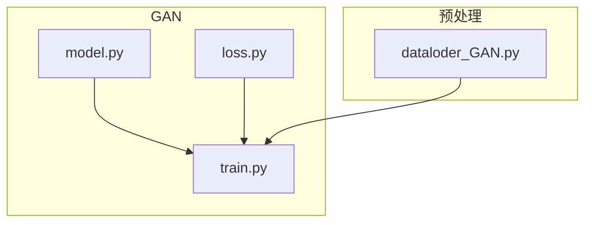
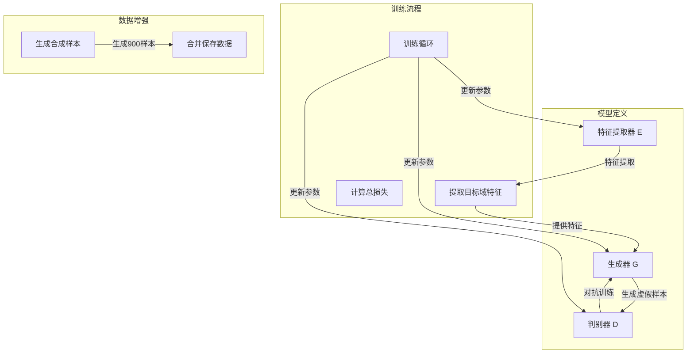
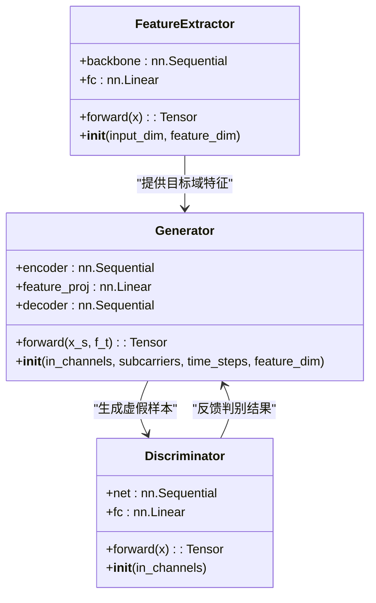
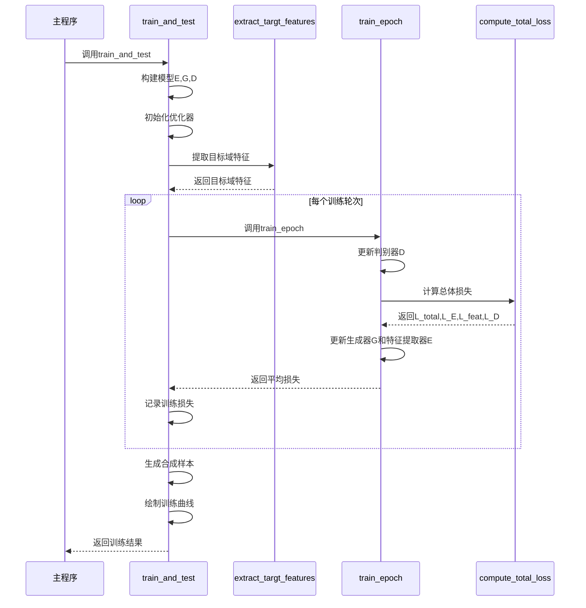
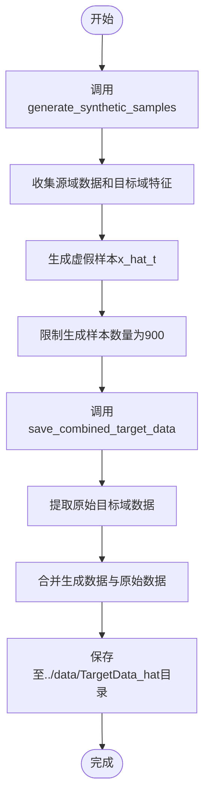
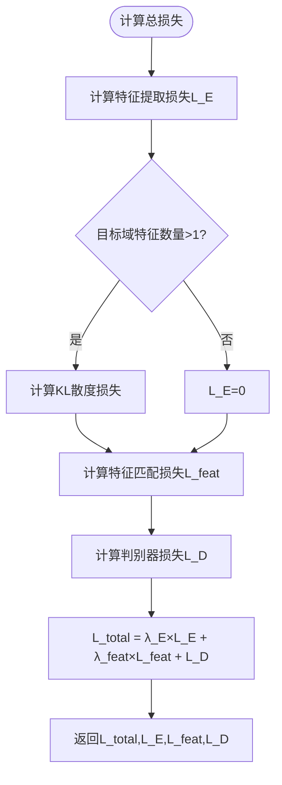
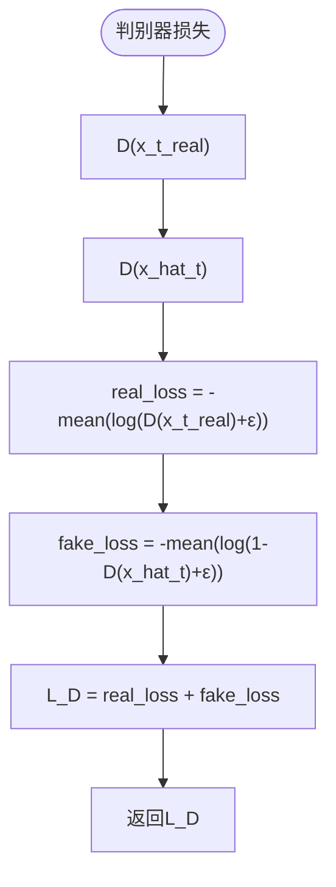
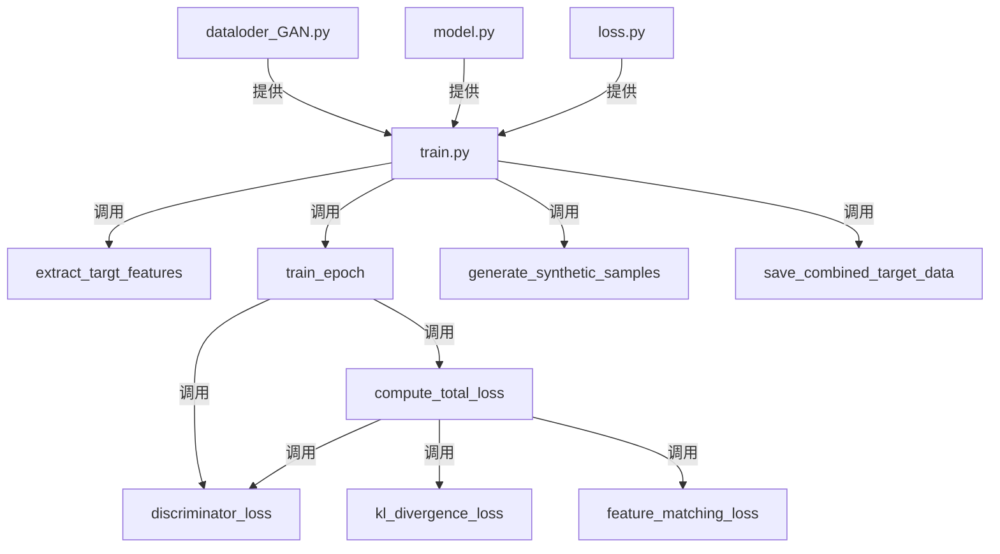
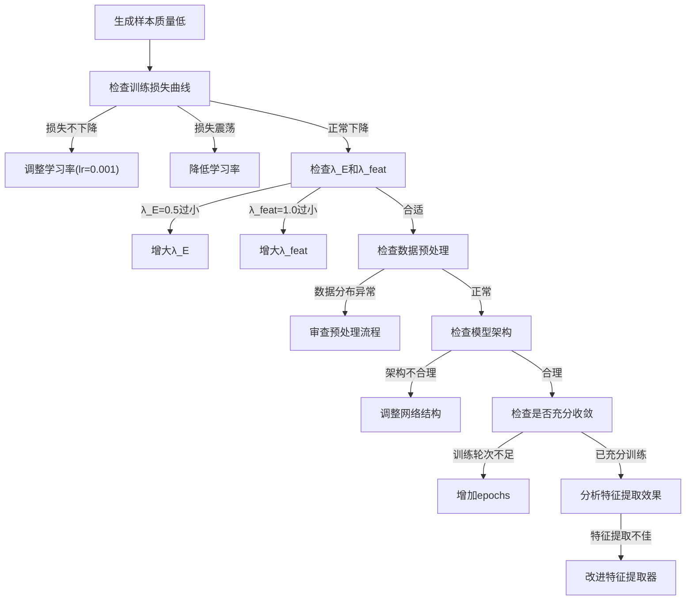

# GAN模型训练与数据增强

<cite>
**Referenced Files in This Document**   
- [train.py](file://GAN/train.py)
- [model.py](file://GAN/model.py)
- [loss.py](file://GAN/loss.py)
- [dataloder_GAN.py](file://pre_process/dataloder_GAN.py)
</cite>

## 目录
1. [引言](#引言)
2. [项目结构](#项目结构)
3. [核心组件](#核心组件)
4. [架构概述](#架构概述)
5. [详细组件分析](#详细组件分析)
6. [依赖分析](#依赖分析)
7. [性能考虑](#性能考虑)
8. [故障排除指南](#故障排除指南)
9. [结论](#结论)

## 引言

本文档详细说明了生成对抗网络（GAN）模型的训练过程及其在数据增强中的应用。重点解析了`train.py`中`train_and_test`函数的执行逻辑，包括特征提取器E、生成器G和判别器D的构建与训练流程。文档涵盖了从模型初始化、优化器配置到训练轮数设置和结果可视化的完整代码示例，并强调了关键超参数对损失平衡的影响。

## 项目结构

项目采用模块化设计，主要分为三个目录：`Attention`、`GAN`和`pre_process`。其中`GAN`目录包含核心的GAN模型实现，`pre_process`目录负责数据加载和预处理。

**Diagram sources**
- [model.py](file://GAN/model.py)
- [train.py](file://GAN/train.py)
- [loss.py](file://GAN/loss.py)
- [dataloder_GAN.py](file://pre_process/dataloder_GAN.py)

**Section sources**
- [train.py](file://GAN/train.py)
- [model.py](file://GAN/model.py)

## 核心组件

本系统的核心组件包括特征提取器（Feature Extractor）、生成器（Generator）、判别器（Discriminator）以及相关的损失函数和训练逻辑。这些组件协同工作，实现了跨域数据生成和增强的功能。

**Section sources**
- [model.py](file://GAN/model.py#L5-L165)
- [train.py](file://GAN/train.py#L12-L295)

## 架构概述

系统采用经典的生成对抗网络架构，结合特征提取和匹配机制，实现从源域到目标域的数据转换和增强。整体架构分为模型定义、训练流程和数据增强三个主要部分。

**Diagram sources**
- [model.py](file://GAN/model.py#L5-L165)
- [train.py](file://GAN/train.py#L12-L295)
- [loss.py](file://GAN/loss.py#L48-L78)

## 详细组件分析

### 特征提取器、生成器与判别器分析

#### 模型架构
系统包含三个核心神经网络组件：特征提取器E、生成器G和判别器D，它们共同构成了完整的GAN框架。

**Diagram sources**
- [model.py](file://GAN/model.py#L5-L165)

#### 训练流程
`train_and_test`函数是整个训练过程的入口点，它协调了模型构建、训练循环和数据增强的全过程。

**Diagram sources**
- [train.py](file://GAN/train.py#L202-L282)
- [train.py](file://GAN/train.py#L40-L108)
- [loss.py](file://GAN/loss.py#L48-L78)

#### 数据生成与增强流程
该流程描述了如何利用训练好的模型生成新的数据样本，并将其与原始数据合并以实现数据增强。

**Diagram sources**
- [train.py](file://GAN/train.py#L111-L159)
- [train.py](file://GAN/train.py#L162-L199)

### 损失函数分析

#### 总体损失计算
`compute_total_loss`函数计算了模型的总体损失，由三个部分组成：特征提取损失L_E、特征匹配损失L_feat和判别器损失L_D。

**Diagram sources**
- [loss.py](file://GAN/loss.py#L48-L78)

#### 判别器损失计算
判别器损失函数旨在最大化对真实样本和虚假样本的区分能力。

**Diagram sources**
- [loss.py](file://GAN/loss.py#L37-L45)

## 依赖分析

系统各组件之间存在明确的依赖关系，形成了一个完整的训练和数据增强流水线。

**Diagram sources**
- [train.py](file://GAN/train.py)
- [model.py](file://GAN/model.py)
- [loss.py](file://GAN/loss.py)
- [dataloder_GAN.py](file://pre_process/dataloder_GAN.py)

**Section sources**
- [train.py](file://GAN/train.py#L1-L295)
- [loss.py](file://GAN/loss.py#L1-L80)

## 性能考虑

在实际应用中，需要考虑以下性能因素：
- **内存使用**：特征提取和生成过程中需要处理大量张量，建议使用GPU加速
- **训练时间**：每个epoch需要完整遍历源域数据集，训练时间与数据集大小成正比
- **模型复杂度**：生成器和判别器的网络结构较为复杂，可能影响训练速度
- **数据加载**：预提取目标域特征可以减少重复计算，提高训练效率

## 故障排除指南

### 常见问题及调试方法

当遇到生成样本质量低的问题时，可以按照以下步骤进行调试：

**Section sources**
- [train.py](file://GAN/train.py#L202-L282)
- [loss.py](file://GAN/loss.py#L48-L78)

### 超参数调优建议

| 超参数 | 推荐值 | 影响 | 调整建议 |
|--------|--------|------|----------|
| 学习率(lr) | 0.001 | 收敛速度和稳定性 | 若损失不下降可适当增大，若震荡则减小 |
| λ_E | 0.5 | 特征提取损失权重 | 控制目标域特征一致性，过小会导致特征不匹配 |
| λ_feat | 1.0 | 特征匹配损失权重 | 控制生成样本与目标域的相似度 |
| epochs | 20-100 | 训练充分性 | 根据损失曲线确定，确保收敛 |
| num_samples | 900 | 增强数据量 | 根据目标任务需求调整 |

**Section sources**
- [train.py](file://GAN/train.py#L202-L282)
- [loss.py](file://GAN/loss.py#L48-L78)

## 结论

本文档详细解析了GAN模型在数据增强中的应用，重点介绍了`train_and_test`函数的执行逻辑。系统通过构建特征提取器E、生成器G和判别器D，实现了从源域到目标域的数据转换。训练过程中采用交替更新策略，先更新判别器D，再更新生成器G和特征提取器E。通过设置合适的超参数λ_E=0.5和λ_feat=1.0，可以有效平衡不同损失项。最终生成的900个增强样本与原始目标域数据合并保存，为后续任务提供了更丰富的数据资源。