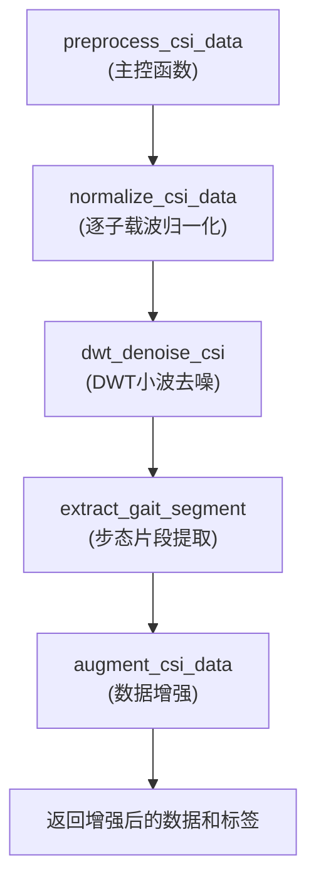

# 数据预处理工作流

<cite>
**Referenced Files in This Document**  
- [preprocess.py](file://pre_process/preprocess.py)
- [SourceData.py](file://pre_process/SourceData.py)
- [TargetData.py](file://pre_process/TargetData.py)
</cite>

## 目录
1. [流程概述](#流程概述)
2. [预处理函数调用顺序](#预处理函数调用顺序)
3. [各步骤物理意义](#各步骤物理意义)
4. [数据加载与调用示例](#数据加载与调用示例)
5. [维度要求与标签对应关系](#维度要求与标签对应关系)
6. [常见问题与解决方案](#常见问题与解决方案)

## 流程概述

基于CSI（信道状态信息）数据的预处理完整流程旨在将原始采集的无线信号数据转换为适合深度学习模型训练的标准化格式。该流程通过一系列信号处理技术消除噪声、对齐步态周期并增强数据多样性，从而提升后续步态识别模型的鲁棒性和泛化能力。

**Section sources**
- [preprocess.py](file://pre_process/preprocess.py#L200-L230)

## 预处理函数调用顺序

完整的预处理流程由`preprocess_csi_data`函数协调执行，其内部按照严格的顺序调用四个核心处理函数，形成一个端到端的处理管道。



**Diagram sources**
- [preprocess.py](file://pre_process/preprocess.py#L200-L230)

### 1. 逐子载波归一化 (normalize_csi_data)

此步骤是预处理的起点，其核心目标是消除不同子载波之间以及不同收发天线对（TX-RX）之间的幅度差异。由于硬件增益、路径损耗等因素，原始CSI数据中各子载波的幅度值可能处于不同的数量级。归一化操作对每个子载波在时间维度上独立进行，将其转换为均值为0、标准差为1的标准正态分布。

**物理意义**：该操作确保了所有子载波的数据具有可比性，防止某些幅度较大的子载波在后续模型训练中占据主导地位，从而保证了模型能够公平地学习来自所有频率分量的步态特征。

**Section sources**
- [preprocess.py](file://pre_process/preprocess.py#L5-L30)

### 2. 离散小波去噪 (dwt_denoise_csi)

在归一化之后，系统调用`dwt_denoise_csi`函数，使用`db4`小波基对数据进行4层离散小波变换（DWT）去噪。

**物理意义**：环境中的噪声（如其他无线设备的干扰、电子设备的热噪声）通常表现为高频、随机的信号波动。DWT能够将信号分解到不同的频率子带。通过设置一个基于噪声水平的软阈值，可以将代表噪声的、幅值较小的小波系数置零，而保留代表真实步态动态的、幅值较大的系数。重构后的信号即为去噪后的CSI数据，它更清晰地反映了人体移动引起的信道变化。

**Section sources**
- [preprocess.py](file://pre_process/preprocess.py#L32-L67)

### 3. 步态片段提取 (extract_gait_segment)

去噪后的数据被送入`extract_gait_segment`函数，该函数负责将所有样本的时间维度统一为6000个采样点。

**物理意义**：在实际采集过程中，每个人的行走周期长度不一，导致CSI数据的时间序列长度各异。为了满足深度学习模型对固定输入尺寸的要求，必须进行对齐。该函数采用“中间截取”或“边缘填充”的策略：对于长于6000点的序列，截取中间最稳定的部分；对于短于6000点的序列，则在首尾进行复制填充。这确保了所有样本都聚焦于行走的核心阶段，同时保持了时间序列的连续性。

**Section sources**
- [preprocess.py](file://pre_process/preprocess.py#L69-L95)

### 4. 数据增强 (augment_csi_data)

最后一步是数据增强，`augment_csi_data`函数生成四种不同类型的样本，将数据量扩大四倍。

**物理意义**：
- **原始数据**：保留最真实的信号特征。
- **高斯噪声样本**：模拟真实环境中不可避免的随机噪声，提高模型的抗噪能力。
- **多径衰落样本**：通过卷积模拟信号经由不同路径反射后叠加的效应，增强模型对复杂室内环境的适应性。
- **频率选择性衰落样本**：模拟某些频率分量因环境物体吸收或反射而衰减的现象，提升模型的鲁棒性。

**Section sources**
- [preprocess.py](file://pre_process/preprocess.py#L163-L198)

## 数据加载与调用示例

虽然原始数据以`.mat`格式存储，但代码库中提供了`SourceData.py`和`TargetData.py`等辅助脚本，用于加载和预处理这些文件。以下是一个典型的调用流程：

1.  **加载原始数据**：使用`SourceData.py`中的`load_combined_env_data`函数读取`env0`和`env1`目录下的`.npy`或`.npz`文件，这些文件是由`.mat`文件转换而来。
2.  **组织数据**：加载函数会自动将数据重塑为`(num_samples, num_tx_rx, num_time, num_subcarriers)`的四维张量，并生成对应的标签。
3.  **调用预处理**：将加载并合并后的数据作为输入，调用`preprocess_csi_data`函数。

```python
# 示例代码（概念性，非直接复制）
from PreProcess.SourceData import load_combined_env_data
from PreProcess.preprocess import preprocess_csi_data

# 加载源域数据
source_data, source_labels = load_combined_env_data("../RawData/env0", "../RawData/env1")

# 假设 source_data 的形状为 (N, 56, 3, 6000)
# 需要将其扩展为五维以符合 preprocess_csi_data 的输入要求
# 例如，如果只有一个受试者组，可以添加一个维度
csi_amplitude = source_data.unsqueeze(0)  # 形状变为 (1, N, 56, 3, 6000)

# 执行完整的预处理流程
processed_data, processed_labels = preprocess_csi_data(csi_amplitude)
```

**Section sources**
- [SourceData.py](file://pre_process/SourceData.py#L40-L110)
- [TargetData.py](file://pre_process/TargetData.py#L10-L90)
- [preprocess.py](file://pre_process/preprocess.py#L200-L230)

## 维度要求与标签对应关系

`preprocess_csi_data`函数对输入张量有严格的五维形状要求：
- **输入形状**：`(num_persons, num_samples, num_tx_rx, num_time, num_subcarriers)`
  - `num_persons`: 受试者（人物）的数量。
  - `num_samples`: 每个受试者的原始样本数量。
  - `num_tx_rx`: 收发天线对的数量（在本项目中为3）。
  - `num_time`: 时间维度的采样点数（预处理后统一为6000）。
  - `num_subcarriers`: 子载波的数量（在本项目中为56）。

**输出与标签关系**：
- **输出数据形状**：`(num_persons, num_samples * 4, num_tx_rx, num_time, num_subcarriers)`
- **输出标签形状**：`(num_persons, num_samples * 4)`

数据增强过程将每个原始样本复制并变换为4个样本（原始、高斯噪声、多径衰落、频率选择性衰落）。`augment_csi_data`函数会相应地将标签复制四次，确保每个增强后的数据样本都有一个正确的类别标签。例如，如果原始数据中第`i`个样本属于人物`j`，那么增强后的第`i`、`i+num_samples`、`i+2*num_samples`、`i+3*num_samples`个样本的标签也均为`j`。

**Section sources**
- [preprocess.py](file://pre_process/preprocess.py#L163-L198)

## 常见问题与解决方案

### 问题：维度不匹配错误

**现象**：在调用`preprocess_csi_data`时，出现类似`IndexError`或`Shape mismatch`的错误。

**原因与解决方案**：
1.  **缺少`num_persons`维度**：最常见的错误是直接将`(num_samples, num_tx_rx, num_time, num_subcarriers)`的四维数据传入。**解决方案**：使用`unsqueeze(0)`或`reshape`方法添加一个`num_persons`维度。例如，`data.unsqueeze(0)`。
2.  **维度顺序错误**：确保输入张量的维度顺序与函数要求完全一致。**解决方案**：使用`permute`方法调整维度顺序。例如，如果数据是`(num_samples, num_subcarriers, num_time, num_tx_rx)`，则应使用`data.permute(0, 3, 2, 1)`来调整。
3.  **数据文件格式问题**：`search_file`未能找到`.mat`文件，表明原始数据可能已被转换。**解决方案**：遵循项目约定，使用`SourceData.py`或`TargetData.py`脚本加载`.npy`或`.npz`格式的中间数据。

**Section sources**
- [preprocess.py](file://pre_process/preprocess.py#L5-L230)
- [SourceData.py](file://pre_process/SourceData.py#L40-L110)