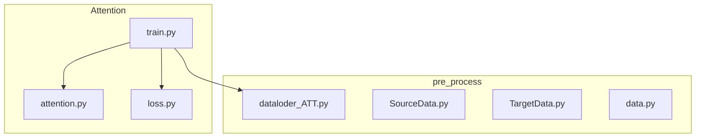
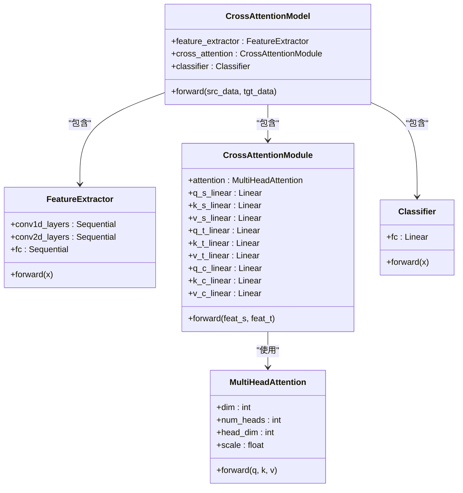
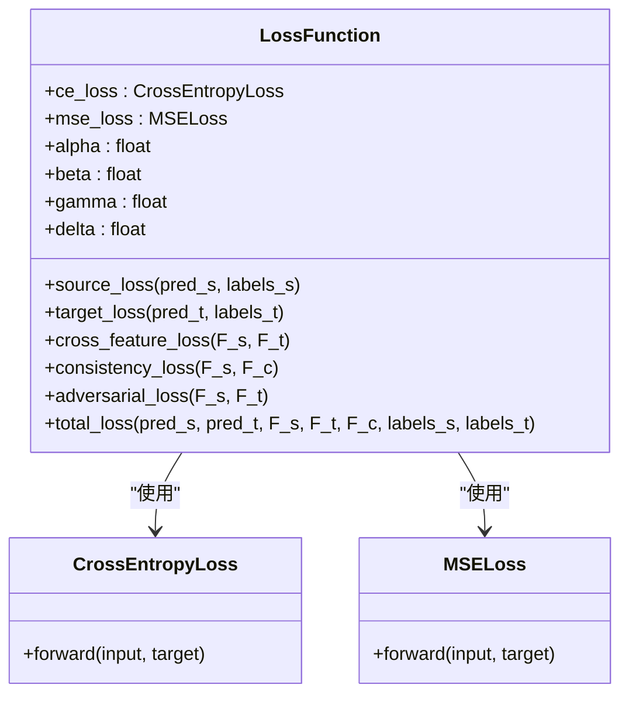
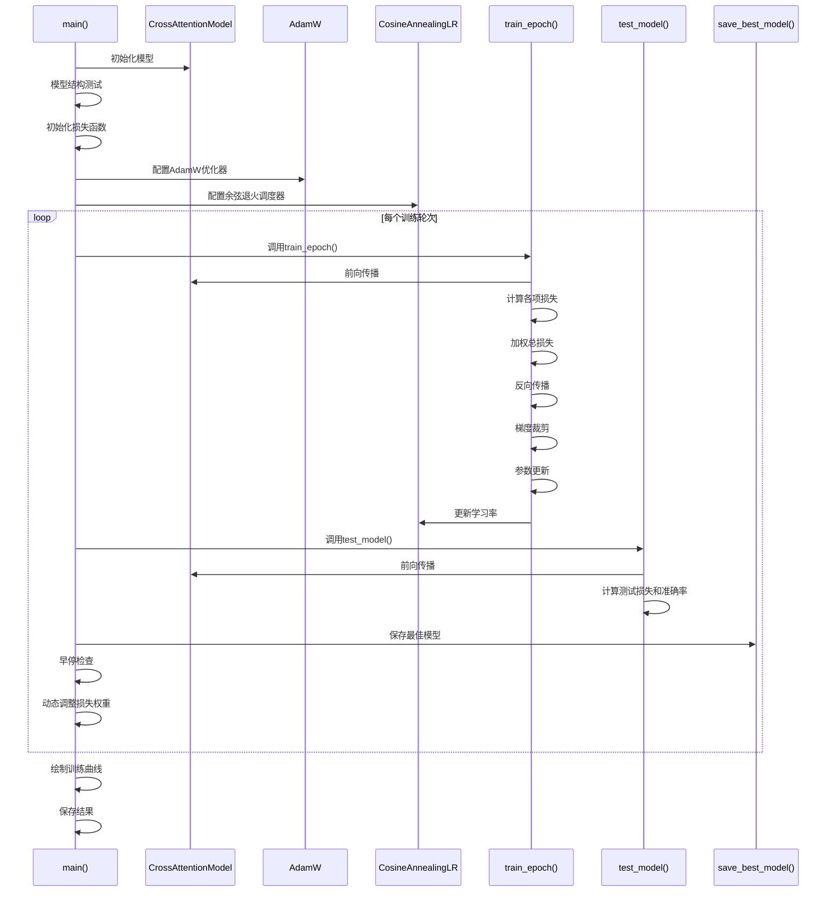
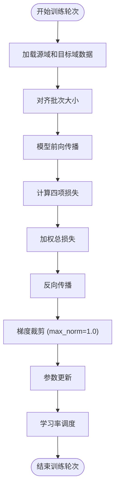
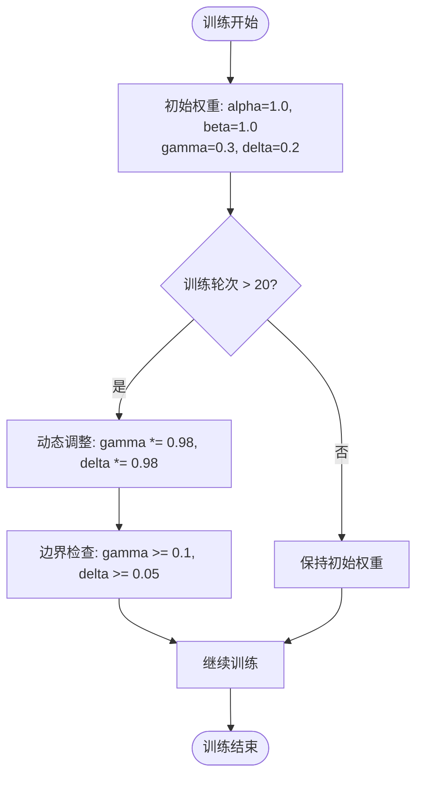
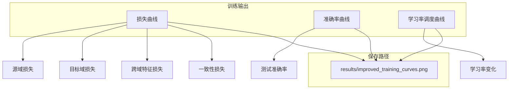
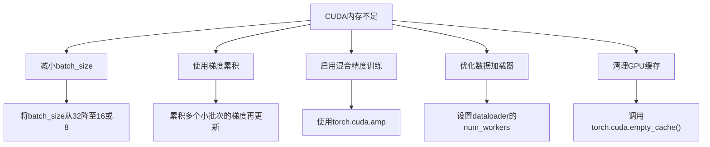

<cite>
**Referenced Files in This Document**  
- [train.py](file://Attention/train.py)
- [attention.py](file://Attention/attention.py)
- [loss.py](file://Attention/loss.py)
- [dataloder_ATT.py](file://pre_process/dataloder_ATT.py)
</cite>

## 目录
1. [注意力机制模型训练](#注意力机制模型训练)
2. [项目结构](#项目结构)
3. [核心组件](#核心组件)
4. [训练流程详解](#训练流程详解)
5. [损失函数与权重策略](#损失函数与权重策略)
6. [训练监控与结果可视化](#训练监控与结果可视化)
7. [关键参数配置](#关键参数配置)
8. [常见问题与解决方案](#常见问题与解决方案)

## 项目结构

**Diagram sources**  
- [train.py](file://Attention/train.py)
- [attention.py](file://Attention/attention.py)
- [loss.py](file://Attention/loss.py)
- [dataloder_ATT.py](file://pre_process/dataloder_ATT.py)

**Section sources**  
- [train.py](file://Attention/train.py)
- [pre_process/dataloder_ATT.py](file://pre_process/dataloder_ATT.py)

## 核心组件

### 交叉注意力模型结构

**Diagram sources**  
- [attention.py](file://Attention/attention.py#L203-L224)

**Section sources**  
- [attention.py](file://Attention/attention.py#L203-L224)

### 损失函数组件

**Diagram sources**  
- [loss.py](file://Attention/loss.py#L4-L77)

**Section sources**  
- [loss.py](file://Attention/loss.py#L4-L77)

## 训练流程详解

### 主训练流程

**Diagram sources**  
- [train.py](file://Attention/train.py#L149-L285)

**Section sources**  
- [train.py](file://Attention/train.py#L149-L285)

### 训练轮次执行流程

**Diagram sources**  
- [train.py](file://Attention/train.py#L17-L102)

**Section sources**  
- [train.py](file://Attention/train.py#L17-L102)

## 损失函数与权重策略

### 损失函数类型

| 损失类型 | 计算方法 | 作用 |
|---------|--------|------|
| **源域分类损失** | 交叉熵损失 | 确保源域分类准确性 |
| **目标域分类损失** | 交叉熵损失 | 确保目标域分类准确性 |
| **跨域特征损失** | 余弦相似性损失 | 促进源域和目标域特征对齐 |
| **一致性损失** | L1损失 | 确保源域特征与交叉注意力特征一致性 |

**Section sources**  
- [loss.py](file://Attention/loss.py#L4-L77)

### 动态权重调整策略

**Section sources**  
- [train.py](file://Attention/train.py#L250-L253)

## 训练监控与结果可视化

### 训练输出监控

**Section sources**  
- [train.py](file://Attention/train.py#L255-L285)

## 关键参数配置

### 核心训练参数

| 参数 | 值 | 设置依据 |
|------|----|---------|
| **batch_size** | 32 | 平衡内存使用和训练稳定性 |
| **学习率** | 3e-4 | AdamW优化器的推荐初始学习率 |
| **训练轮数** | 100 | 确保模型充分收敛 |
| **早停耐心值** | 15 | 防止过拟合的合理阈值 |
| **梯度裁剪** | max_norm=1.0 | 防止梯度爆炸 |

**Section sources**  
- [train.py](file://Attention/train.py#L149-L285)
- [dataloder_ATT.py](file://pre_process/dataloder_ATT.py#L34-L35)

### 模型超参数

| 组件 | 参数 | 值 |
|------|------|----|
| **特征提取器** | feature_dim | 512 |
| **多头注意力** | dim | 512 |
| **多头注意力** | num_heads | 8 |
| **分类器** | num_classes | 10 |
| **余弦退火** | T_max | 50 |
| **余弦退火** | eta_min | 1e-6 |

**Section sources**  
- [attention.py](file://Attention/attention.py#L203-L224)
- [train.py](file://Attention/train.py#L149-L285)

## 常见问题与解决方案

### CUDA内存不足解决方案

**Section sources**  
- [train.py](file://Attention/train.py)
- [dataloder_ATT.py](file://pre_process/dataloder_ATT.py)