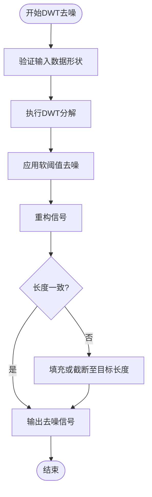
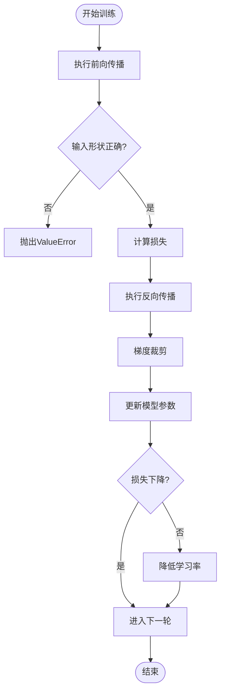
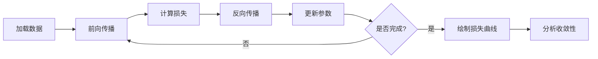

# 常见问题与解决方案

<cite>
**Referenced Files in This Document**   
- [preprocess.py](file://pre_process/preprocess.py)
- [attention.py](file://Attention/attention.py)
- [model.py](file://GAN/model.py)
- [train.py](file://Attention/train.py)
- [train.py](file://GAN/train.py)
- [dataloder_ATT.py](file://pre_process/dataloder_ATT.py)
- [dataloder_GAN.py](file://pre_process/dataloder_GAN.py)
- [loss.py](file://Attention/loss.py)
- [loss.py](file://GAN/loss.py)
</cite>

## 目录
1. [数据预处理阶段问题](#数据预处理阶段问题)
2. [模型训练阶段问题](#模型训练阶段问题)
3. [性能优化建议](#性能优化建议)
4. [代码异常处理解释](#代码异常处理解释)
5. [调试工具与方法](#调试工具与方法)

## 数据预处理阶段问题

### DWT去噪后信号失真

**根本原因分析**  
在`preprocess.py`文件中，`dwt_denoise_csi`函数使用离散小波变换（DWT）对CSI数据进行去噪。信号失真可能源于小波基函数选择不当或阈值设置不合理。当前代码使用`db4`小波和基于标准差的软阈值，若信号特性与假设不符，可能导致过度平滑或保留噪声。

**可操作的解决步骤**  
1. 尝试不同的小波基函数（如`haar`、`sym5`）以匹配信号特征。
2. 调整`level`参数控制分解深度，避免过度分解导致信息丢失。
3. 修改阈值计算方式，例如使用`visushrink`或`sure`阈值方法。
4. 在去噪后添加信号完整性检查，比较去噪前后信号的频谱特性。



**Diagram sources**
- [preprocess.py](file://pre_process/preprocess.py#L45-L80)

**Section sources**
- [preprocess.py](file://pre_process/preprocess.py#L45-L80)

### 步态分割长度不匹配

**根本原因分析**  
`extract_gait_segment`函数负责将CSI信号统一到`target_length=6000`的时间维度。当原始信号长度与目标长度不一致时，函数通过截取中间部分或边缘填充来调整。若信号关键特征位于边缘，截取操作可能导致信息丢失；填充操作可能引入边界伪影。

**可操作的解决步骤**  
1. 在截取前进行信号能量分析，优先保留高能量区域。
2. 使用更复杂的填充策略（如反射填充或周期性填充）替代边缘填充。
3. 动态调整`target_length`以适应不同数据集的统计特性。
4. 添加预处理步骤，检测并标准化输入信号的时间维度。

**Section sources**
- [preprocess.py](file://pre_process/preprocess.py#L82-L105)

## 模型训练阶段问题

### 注意力模型收敛困难

**根本原因分析**  
注意力模型在`attention.py`中实现，其收敛困难可能由以下因素导致：
- 初始学习率过高，导致优化过程震荡。
- 特征维度不匹配引发的数值不稳定。
- 多头注意力机制中缩放因子计算错误。

**可操作的解决步骤**  
1. 采用学习率预热（learning rate warm-up）策略，逐步增加学习率。
2. 检查`MultiHeadAttention`类中的`scale`计算，确保`head_dim`正确。
3. 在`train.py`中启用梯度裁剪（`clip_grad_norm_`）防止梯度爆炸。
4. 使用AdamW优化器替代Adam，结合权重衰减改善泛化能力。



**Diagram sources**
- [attention.py](file://Attention/attention.py#L100-L150)
- [train.py](file://Attention/train.py#L50-L100)

**Section sources**
- [attention.py](file://Attention/attention.py#L100-L150)
- [train.py](file://Attention/train.py#L50-L100)

### GAN训练不稳定（模式崩溃、梯度消失）

**根本原因分析**  
GAN模型在`model.py`中定义，其训练不稳定主要源于：
- 判别器过强导致生成器梯度消失。
- 特征提取器与生成器之间的损失权重失衡。
- 目标域特征采样策略不当，导致模式崩溃。

**可操作的解决步骤**  
1. 调整`lambda_E`和`lambda_feat`权重，平衡特征提取损失与特征匹配损失。
2. 在`discriminator_loss`中使用标签平滑（label smoothing）防止判别器过度自信。
3. 修改`select_samples_by_label`策略，增加样本多样性。
4. 引入梯度惩罚（gradient penalty）替代原始损失函数。

**Section sources**
- [model.py](file://GAN/model.py#L100-L150)
- [loss.py](file://GAN/loss.py#L50-L70)
- [dataloder_GAN.py](file://pre_process/dataloder_GAN.py#L10-L40)

## 性能优化建议

### 调整学习率

**建议策略**  
在`train.py`中，使用余弦退火调度器（`CosineAnnealingLR`）动态调整学习率。初始学习率设为`3e-4`，最小值为`1e-6`。可通过以下方式进一步优化：
- 增加预热阶段，前10个epoch线性增加学习率。
- 根据验证损失动态调整周期长度`T_max`。

**Section sources**
- [train.py](file://Attention/train.py#L180-L190)

### 修改网络深度

**建议策略**  
当前特征提取器使用固定深度的卷积层。为适应不同复杂度的数据，可：
- 在`FeatureExtractor`中添加可配置的层数参数。
- 使用残差连接缓解深层网络的梯度消失问题。
- 实现自适应池化层，确保输出维度一致性。

**Section sources**
- [attention.py](file://Attention/attention.py#L20-L40)
- [model.py](file://GAN/model.py#L20-L40)

### 增加数据增强强度

**建议策略**  
`preprocess.py`中的`augment_csi_data`函数提供基础增强方法。为提高模型鲁棒性：
- 增加噪声水平（`noise_level`）至`0.05`。
- 扩展多径衰落的最大延迟（`max_delay`）。
- 添加时域变换（如时间扭曲）作为新增强方法。

**Section sources**
- [preprocess.py](file://pre_process/preprocess.py#L180-L220)

## 代码异常处理解释

### attention.py中的维度检查

**异常类型**  
`attention.py`中的`FeatureExtractor.forward`方法包含显式维度检查：
```python
if x.dim() != 4:
    raise ValueError(f"Expected 4D input, got {x.dim()}D input with shape {x.shape}")
```

**根本原因**  
该检查确保输入张量为四维（批量大小、子载波数、天线数、时间步），防止因数据形状错误导致的后续计算失败。

**处理建议**  
1. 在数据加载阶段验证输入形状。
2. 若使用不同格式的数据，需在输入模型前进行预处理转换。
3. 异常信息已包含具体形状，便于快速定位问题。

**Section sources**
- [attention.py](file://Attention/attention.py#L60-L65)

## 调试工具与方法

### 梯度检查

**实施方法**  
在`train.py`中，使用`torch.nn.utils.clip_grad_norm_`监控梯度范数。若梯度接近零，表明存在梯度消失；若梯度异常大，表明存在梯度爆炸。

**操作步骤**  
1. 在训练循环中打印梯度范数。
2. 使用TensorBoard可视化梯度分布。
3. 设置合理的`max_norm`阈值（如1.0）进行裁剪。

**Section sources**
- [train.py](file://Attention/train.py#L75-L80)

### 特征可视化

**实施方法**  
提取`FeatureExtractor`输出的特征向量，使用t-SNE或PCA降维后可视化。

**操作步骤**  
1. 在前向传播中保存`F_s`和`F_t`特征。
2. 使用`matplotlib`绘制特征分布散点图。
3. 比较源域与目标域特征的对齐程度。

**Section sources**
- [attention.py](file://Attention/attention.py#L200-L210)

### 损失曲线分析

**实施方法**  
`train.py`自动绘制训练损失、测试损失和准确率曲线。

**操作步骤**  
1. 检查损失曲线是否平稳下降，避免震荡。
2. 对比源域与目标域损失，判断领域适应效果。
3. 观察学习率曲线，确保调度器正常工作。



**Diagram sources**
- [train.py](file://Attention/train.py#L250-L280)

**Section sources**
- [train.py](file://Attention/train.py#L250-L280)