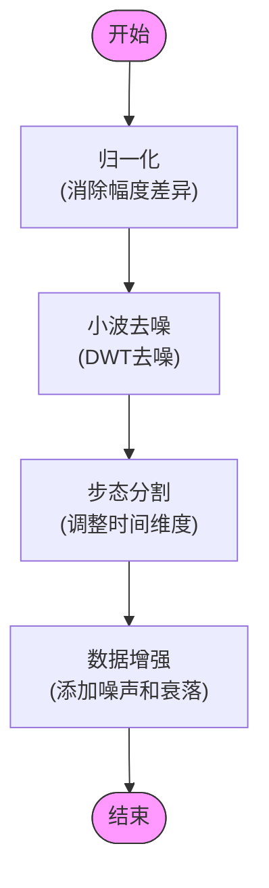
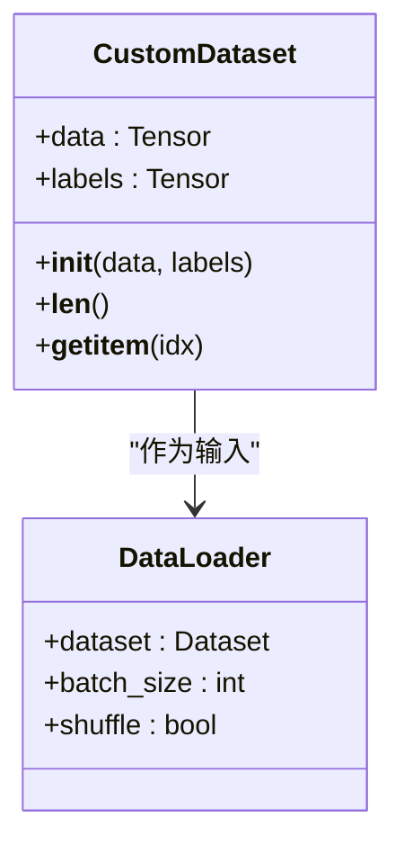
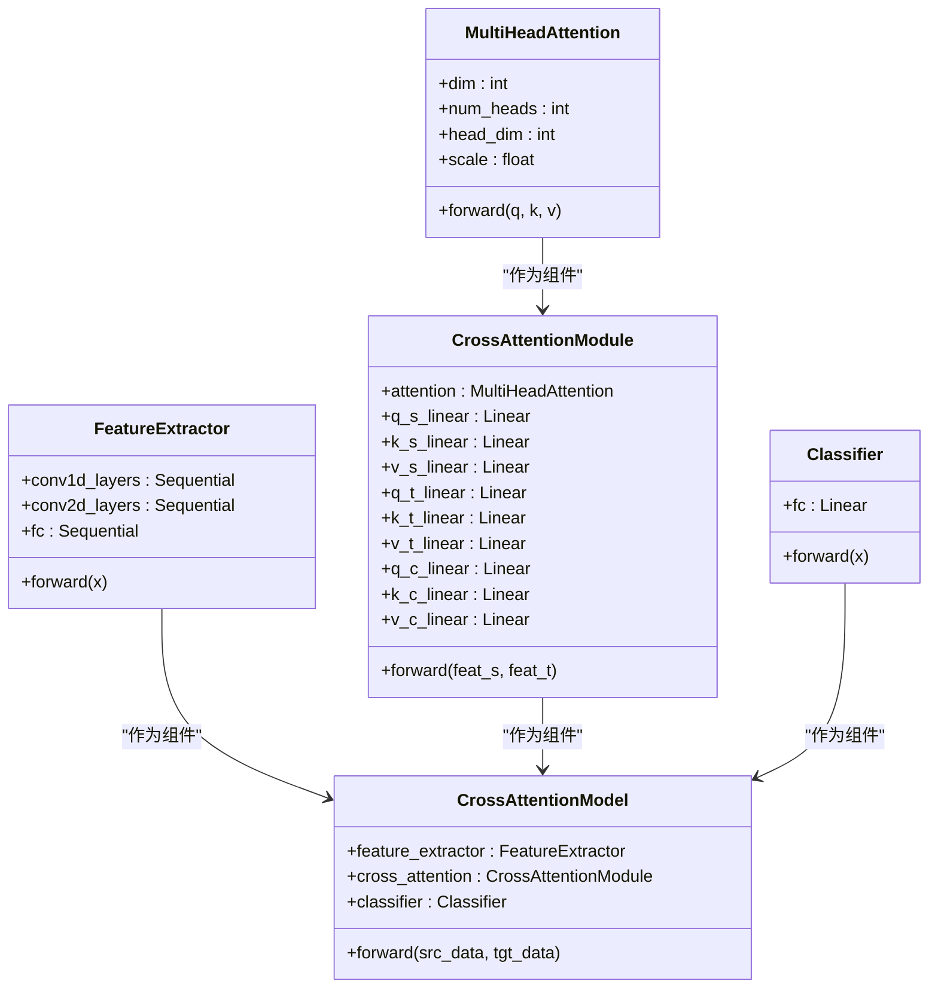
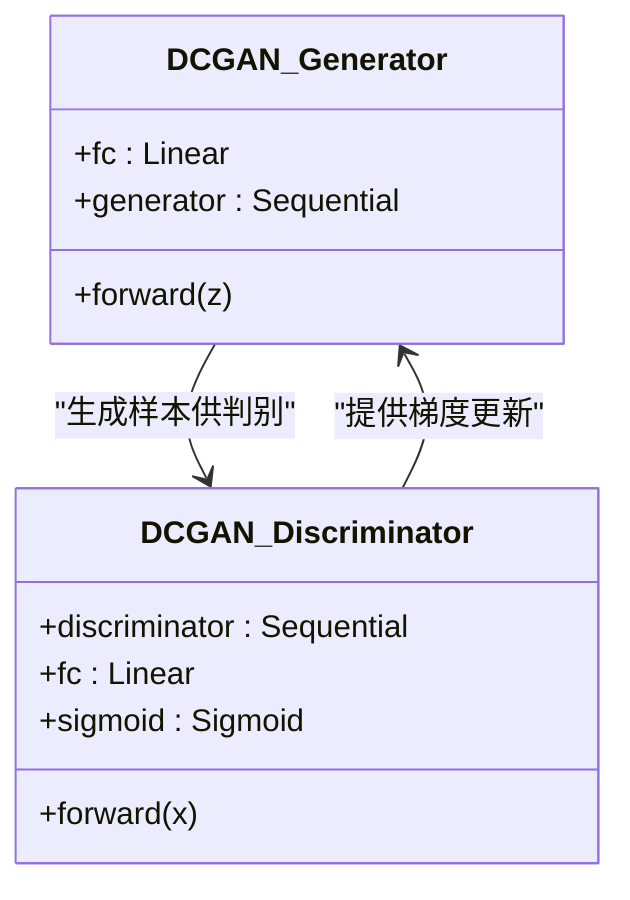
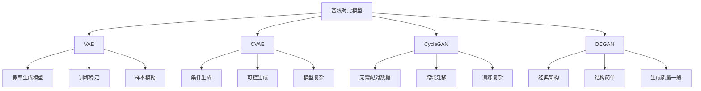
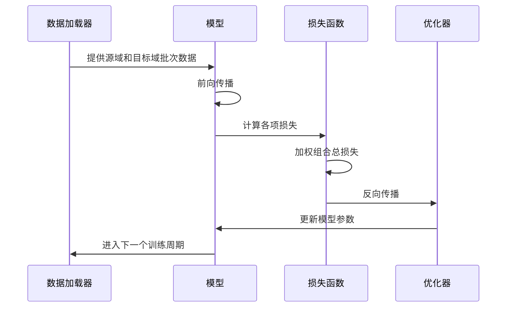
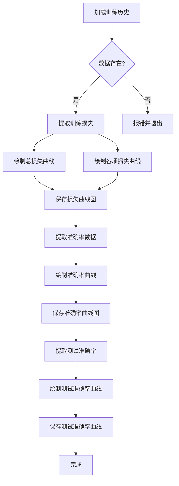

# CSI数据增强

<cite>
**本文档引用的文件**   
- [model_ATT.py](file://Research1/model_ATT.py)
- [train_ATT.py](file://Research1/train_ATT.py)
- [loss_ATT.py](file://Research1/loss_ATT.py)
- [plot_ATT.py](file://Research1/plot_ATT.py)
- [preprocess.py](file://pre_process/preprocess.py)
- [SourceData.py](file://pre_process/SourceData.py)
- [TargetData.py](file://pre_process/TargetData.py)
- [data.py](file://pre_process/data.py)
- [dataloder_ATT.py](file://Research1/Process/dataloder_ATT.py)
- [model_GAN.py](file://Research1/model_GAN.py)
- [train_GAN.py](file://Research1/train_GAN.py)
- [loss_GAN.py](file://Research1/loss_GAN.py)
- [model_VAE.py](file://Research1/Baseline/VAE/model_VAE.py)
- [train_VAE.py](file://Research1/Baseline/VAE/train_VAE.py)
- [model_CVAE.py](file://Research1/Baseline/CVAE/model_CVAE.py)
- [train_CVAE.py](file://Research1/Baseline/CVAE/train_CVAE.py)
- [model_CycleGAN.py](file://Research1/Baseline/CycleGAN/model_CycleGAN.py)
- [train_CycleGAN.py](file://Research1/Baseline/CycleGAN/train_CycleGAN.py)
- [model_DCGAN.py](file://Research1/Baseline/DCGAN/model_DCGAN.py)
- [train_DCGAN.py](file://Research1/Baseline/DCGAN/train_DCGAN.py)
- [compare_models.py](file://Research1/Baseline/compare_models.py)
- [run_experiment.py](file://Research1/Baseline/run_experiment.py)
- [visualize_comparison.py](file://Research1/Baseline/visualize_comparison.py)
- [FILE_SUMMARY.md](file://Research1/Baseline/FILE_SUMMARY.md)
- [README.md](file://Research1/Baseline/README.md)
</cite>

## 目录
1. [项目概述](#项目概述)
2. [项目结构](#项目结构)
3. [预处理流程](#预处理流程)
4. [数据加载与处理](#数据加载与处理)
5. [注意力机制模型](#注意力机制模型)
6. [生成对抗网络模型](#生成对抗网络模型)
7. [基线对比模型](#基线对比模型)
8. [训练与评估流程](#训练与评估流程)
9. [可视化与结果分析](#可视化与结果分析)
10. [结论](#结论)

## 项目概述

本项目旨在通过深度学习技术实现CSI（信道状态信息）数据增强，以解决无线感知领域中目标域数据稀缺的问题。项目采用多种先进的生成模型，包括基于注意力机制的跨域适应模型、生成对抗网络（GAN）以及多种基线生成模型（VAE、CVAE、CycleGAN、DCGAN），对CSI数据进行增强，从而提升目标域上的识别性能。

项目核心包含两个主要研究方向：Research1专注于基于注意力机制和GAN的CSI数据增强方法，而Research2则关注于异常检测和身份识别任务。整个系统通过精心设计的预处理流程、特征提取、模型训练和评估体系，构建了一个完整的CSI数据增强解决方案。

**Section sources**
- [model_ATT.py](file://Research1/model_ATT.py#L1-L227)
- [train_ATT.py](file://Research1/train_ATT.py#L1-L327)
- [loss_ATT.py](file://Research1/loss_ATT.py#L1-L79)
- [preprocess.py](file://pre_process/preprocess.py#L1-L232)

## 项目结构

本项目的目录结构清晰地划分了不同的功能模块，便于管理和维护。主要包含以下几个部分：

- **Research1**: 主要研究基于注意力机制和GAN的CSI数据增强方法，包含模型定义、训练脚本、损失函数和可视化工具。
- **Research2**: 专注于异常检测和身份识别任务，包含消融实验和相关模型。
- **picture**: 存放项目生成的图表和图像文件。
- **pre_process**: 包含CSI数据预处理、数据加载和数据增强的相关脚本。
- **.gitignore**: Git版本控制忽略文件配置。

```mermaid
graph TD
A[CSI数据增强项目] --> B[Research1]
A --> C[Research2]
A --> D[picture]
A --> E[pre_process]
A --> F[.gitignore]
B --> G[Attention]
B --> H[Baseline]
B --> I[GAN]
B --> J[Process]
G --> K[training_history.json]
H --> L[VAE]
H --> M[CVAE]
H --> N[CycleGAN]
H --> O[DCGAN]
H --> P[FILE_SUMMARY.md]
H --> Q[README.md]
H --> R[compare_models.py]
H --> S[run_experiment.py]
H --> T[visualize_comparison.py]
L --> U[model_VAE.py]
L --> V[loss_VAE.py]
L --> W[train_VAE.py]
M --> X[model_CVAE.py]
M --> Y[train_CVAE.py]
N --> Z[model_CycleGAN.py]
N --> AA[loss_CycleGAN.py]
N --> AB[train_CycleGAN.py]
O --> AC[model_DCGAN.py]
O --> AD[train_DCGAN.py]
I --> AE[gan_evaluation_results.json]
J --> AF[data_Source.py]
J --> AG[data_Target.py]
J --> AH[dataloder_ATT.py]
J --> AI[dataloder_GAN.py]
B --> AJ[loss_ATT.py]
B --> AK[model_ATT.py]
B --> AL[plot_ATT.py]
B --> AM[train_ATT.py]
B --> AN[train_GAN.py]
B --> AO[model_GAN.py]
B --> AP[loss_GAN.py]
E --> AQ[CSIProcess1.py]
E --> AR[CSIProcess2.py]
E --> AS[SourceData.py]
E --> AT[TargetData.py]
E --> AU[data.py]
E --> AV[dataloder_Intruder.py]
E --> AW[preprocess.py]
C --> AX[ablation study]
C --> AY[identify]
C --> AZ[intruder]
C --> BA[dataloader_identify.py]
C --> BB[dataloader_intruder.py]
C --> BC[loss_identify.py]
C --> BD[model_identify.py]
C --> BE[model_intruder.py]
C --> BF[plot_identity.py]
C --> BG[plot_intruder.py]
C --> BH[train_identify.py]
C --> BI[train_intruder.py]
```

**Diagram sources**
- [Research1/model_ATT.py](file://Research1/model_ATT.py#L1-L227)
- [Research1/Baseline/FILE_SUMMARY.md](file://Research1/Baseline/FILE_SUMMARY.md#L1-L234)
- [pre_process/preprocess.py](file://pre_process/preprocess.py#L1-L232)

**Section sources**
- [Research1/Baseline/FILE_SUMMARY.md](file://Research1/Baseline/FILE_SUMMARY.md#L1-L234)
- [Research1/Baseline/README.md](file://Research1/Baseline/README.md#L1-L178)

## 预处理流程

CSI数据预处理是整个数据增强流程的基础，旨在提高数据质量并为后续的模型训练做好准备。预处理流程主要包含四个关键步骤：归一化、小波去噪、步态分割和数据增强。

### 归一化

归一化处理旨在消除不同样本之间的幅度差异，使数据分布更加一致。该过程对每个样本的每个子载波进行独立的归一化，计算其均值和标准差，并使用Z-score标准化方法进行转换。

### 小波去噪

离散小波变换（DWT）被用于去除CSI数据中的噪声。该方法通过将信号分解为不同频率的子带，对高频子带应用软阈值去噪，然后重构信号，从而有效保留信号的主要特征同时去除噪声。

### 步态分割

为了确保所有样本具有相同的时间维度，步态分割模块负责将CSI数据调整到固定长度（6000个时间点）。如果原始数据长度大于目标长度，则截取中间部分；如果小于目标长度，则在前后进行填充。

### 数据增强

数据增强模块通过模拟真实世界中的信道变化来扩充数据集。具体方法包括：
- **高斯白噪声**: 添加随机噪声以模拟环境噪声。
- **多径衰落**: 模拟信号在传播过程中因反射、折射等产生的多径效应。
- **频率选择性衰落**: 模拟不同频率分量受到不同程度衰减的现象。

**Diagram sources**
- [pre_process/preprocess.py](file://pre_process/preprocess.py#L1-L232)

**Section sources**
- [pre_process/preprocess.py](file://pre_process/preprocess.py#L1-L232)

## 数据加载与处理

数据加载与处理模块负责从磁盘读取原始数据文件，并将其转换为模型训练所需的格式。该模块包含两个主要组件：`SourceData.py`和`TargetData.py`，分别用于加载源域和目标域的数据。

### 源域数据加载

源域数据来自两个不同的环境（env0和env1），通过`load_combined_env_data`函数合并。该函数遍历指定目录下的所有`.npy`或`.npz`文件，从文件名中提取用户ID，加载数据并验证其形状，最后将所有数据和标签合并成一个完整的数据集。

### 目标域数据加载

目标域数据来自另一个环境（env2），通过`load_env_data`函数加载。该函数执行与源域数据加载类似的操作，但只处理单个环境的数据。

### 数据集类

`CustomDataset`类实现了PyTorch的`Dataset`接口，为数据加载器提供了一个标准的数据访问方式。该类接收数据张量和标签张量作为输入，并实现了`__len__`和`__getitem__`方法，以便在训练过程中按批次访问数据。

**Diagram sources**
- [pre_process/SourceData.py](file://pre_process/SourceData.py#L1-L113)
- [pre_process/TargetData.py](file://pre_process/TargetData.py#L1-L96)
- [Research1/Process/dataloder_ATT.py](file://Research1/Process/dataloder_ATT.py#L1-L14)

**Section sources**
- [pre_process/SourceData.py](file://pre_process/SourceData.py#L1-L113)
- [pre_process/TargetData.py](file://pre_process/TargetData.py#L1-L96)
- [Research1/Process/dataloder_ATT.py](file://Research1/Process/dataloder_ATT.py#L1-L14)

## 注意力机制模型

注意力机制模型是本项目的核心创新之一，旨在通过跨域注意力机制实现源域和目标域之间的知识迁移。该模型由特征提取器、交叉注意力模块和分类器三部分组成。

### 特征提取器

特征提取器是一个专为CSI数据设计的深度神经网络，采用分阶段处理策略。第一阶段使用1D卷积处理每个子载波的时间序列，第二阶段使用2D卷积处理子载波维度，最后通过全连接层将特征映射到512维的潜在空间。

### 交叉注意力模块

交叉注意力模块包含三个关键组件：
- **源域自注意力**: 增强源域特征的内部一致性。
- **目标域自注意力**: 增强目标域特征的内部一致性。
- **跨域交叉注意力**: 以源域特征为Query，目标域特征为Key和Value，实现跨域知识迁移。

### 分类器

分类器是一个简单的线性层，将512维的特征向量映射到指定数量的类别上。由于使用了交叉熵损失函数，分类器内部不包含Softmax激活函数。

**Diagram sources**
- [Research1/model_ATT.py](file://Research1/model_ATT.py#L1-L227)

**Section sources**
- [Research1/model_ATT.py](file://Research1/model_ATT.py#L1-L227)

## 生成对抗网络模型

生成对抗网络（GAN）模型是本项目中用于数据增强的另一种重要方法。该模型通过对抗训练的方式，从随机噪声中生成逼真的CSI数据样本，从而扩充目标域的数据集。

### 模型架构

GAN模型由生成器（Generator）和判别器（Discriminator）两部分组成：
- **生成器**: 接收一个随机噪声向量作为输入，通过一系列转置卷积层逐步上采样，最终生成与真实CSI数据形状相同的样本。
- **判别器**: 接收一个CSI数据样本作为输入，通过一系列卷积层逐步下采样，最终输出一个标量，表示该样本是真实数据的概率。

### 损失函数

GAN模型使用标准的对抗损失函数，即最小化生成器的损失同时最大化判别器的损失。具体而言，生成器试图生成能够欺骗判别器的样本，而判别器则试图正确区分真实样本和生成样本。

**Diagram sources**
- [Research1/model_GAN.py](file://Research1/model_GAN.py)
- [Research1/loss_GAN.py](file://Research1/loss_GAN.py)

**Section sources**
- [Research1/model_GAN.py](file://Research1/model_GAN.py)
- [Research1/loss_GAN.py](file://Research1/loss_GAN.py)

## 基线对比模型

为了验证所提出方法的有效性，项目实现了四种先进的基线生成模型：变分自编码器（VAE）、条件变分自编码器（CVAE）、循环一致性GAN（CycleGAN）和深度卷积GAN（DCGAN）。这些模型为对比实验提供了公平的基准。

### VAE (变分自编码器)

VAE是一种概率生成模型，通过学习潜在空间的分布来生成样本。其优势在于训练稳定且生成样本多样性好，但生成的样本可能较为模糊。

### CVAE (条件变分自编码器)

CVAE是VAE的条件版本，可以根据标签生成特定类别的样本。其优势在于可控生成，适合需要标签信息的场景，但模型更复杂。

### CycleGAN (循环一致性GAN)

CycleGAN是一种无需配对数据的域迁移模型，通过循环一致性损失保证转换质量。其优势在于不需要严格的数据配对，适合跨域迁移，但训练复杂。

### DCGAN (深度卷积GAN)

DCGAN是一种经典的深度卷积GAN架构，结构简单且训练相对稳定。其优势在于实现简单，但生成质量可能不如更先进的模型。

**Diagram sources**
- [Research1/Baseline/README.md](file://Research1/Baseline/README.md#L1-L178)
- [Research1/Baseline/FILE_SUMMARY.md](file://Research1/Baseline/FILE_SUMMARY.md#L1-L234)

**Section sources**
- [Research1/Baseline/README.md](file://Research1/Baseline/README.md#L1-L178)
- [Research1/Baseline/FILE_SUMMARY.md](file://Research1/Baseline/FILE_SUMMARY.md#L1-L234)

## 训练与评估流程

项目的训练与评估流程设计得非常系统化，确保了实验的可重复性和结果的可靠性。整个流程包括数据加载、模型训练、验证和测试等环节。

### 训练流程

训练流程采用联合训练策略，同时利用源域和目标域的数据。在每个训练周期中，模型会从两个数据加载器中获取批次数据，并进行前向传播、损失计算、反向传播和参数更新。为了防止梯度爆炸，还应用了梯度裁剪技术。

### 损失函数

损失函数由四个部分组成：
- **源域分类损失**: 确保模型在源域上的分类性能。
- **目标域分类损失**: 确保模型在目标域上的分类性能。
- **跨域特征一致性损失**: 使用余弦相似性度量源域和目标域特征的一致性。
- **一致性损失**: 使用L1损失度量源域特征和交叉注意力特征的一致性。

### 验证与测试

验证过程在目标域数据上进行，以评估模型的泛化能力。测试过程则在每个训练周期后执行，分别在源域和目标域上评估模型的性能，并记录测试准确率。

**Diagram sources**
- [Research1/train_ATT.py](file://Research1/train_ATT.py#L1-L327)
- [Research1/loss_ATT.py](file://Research1/loss_ATT.py#L1-L79)

**Section sources**
- [Research1/train_ATT.py](file://Research1/train_ATT.py#L1-L327)
- [Research1/loss_ATT.py](file://Research1/loss_ATT.py#L1-L79)

## 可视化与结果分析

可视化与结果分析模块负责生成训练过程中的各种图表，以便直观地观察模型的性能变化。该模块包含多个绘图函数，可以生成训练损失曲线、准确率曲线和测试准确率曲线。

### 训练损失曲线

训练损失曲线展示了总损失以及各项损失（源域损失、目标域损失、跨域特征损失、一致性损失）随训练轮数的变化情况。通过观察这些曲线，可以判断模型是否收敛以及各项损失的相对重要性。

### 准确率曲线

准确率曲线展示了训练准确率和验证准确率随训练轮数的变化情况。理想情况下，两条曲线应该同步上升并趋于稳定。

### 测试准确率曲线

测试准确率曲线分别展示了源域和目标域测试准确率的变化情况。这有助于评估模型在不同域上的泛化能力。

**Diagram sources**
- [Research1/plot_ATT.py](file://Research1/plot_ATT.py#L1-L238)

**Section sources**
- [Research1/plot_ATT.py](file://Research1/plot_ATT.py#L1-L238)

## 结论

本项目成功构建了一个完整的CSI数据增强系统，通过多种先进的深度学习模型实现了对CSI数据的有效增强。系统涵盖了从数据预处理、模型训练到结果可视化的完整流程，为无线感知领域的研究提供了有力的支持。

注意力机制模型通过跨域注意力机制实现了源域和目标域之间的知识迁移，有效解决了目标域数据稀缺的问题。生成对抗网络模型则通过对抗训练的方式生成逼真的CSI数据样本，进一步扩充了数据集。此外，项目还实现了多种基线对比模型，为评估所提出方法的有效性提供了可靠的基准。

未来的工作可以集中在以下几个方面：探索更复杂的注意力机制、尝试其他类型的生成模型、优化模型的训练效率以及将该系统应用于更多的实际场景。