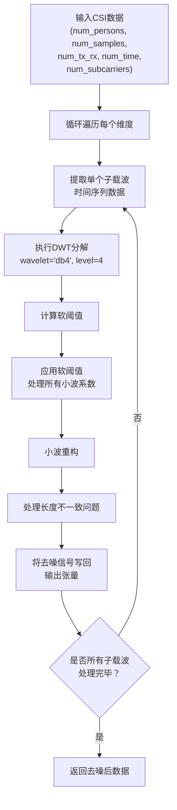
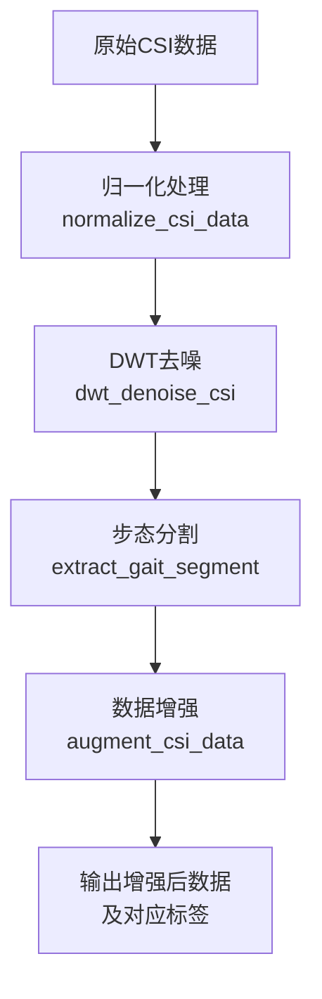

# DWT去噪

<cite>
**Referenced Files in This Document**  
- [preprocess.py](file://pre_process/preprocess.py)
</cite>

## 目录
1. [引言](#引言)
2. [DWT去噪核心算法](#dwt去噪核心算法)
3. [小波基与分解层数选择](#小波基与分解层数选择)
4. [软阈值去噪数学原理](#软阈值去噪数学原理)
5. [信号重构与长度对齐](#信号重构与长度对齐)
6. [预处理流程集成](#预处理流程集成)
7. [计算开销分析](#计算开销分析)
8. [结论](#结论)

## 引言
本文档深入解析`dwt_denoise_csi`函数如何利用离散小波变换（DWT）去除CSI数据中的噪声。该方法作为CSI数据预处理流程的关键环节，旨在保留步态特征的同时有效抑制高频噪声。文档将详细阐述技术参数选择依据、核心算法实现原理及与其他预处理步骤的集成关系。

## DWT去噪核心算法

`dwt_denoise_csi`函数实现了基于离散小波变换的CSI数据去噪流程。该函数接收多维CSI幅度数据作为输入，其形状为(num_persons, num_samples, num_tx_rx, num_time, num_subcarriers)，并对每个子载波的时间序列数据独立进行去噪处理。

去噪流程遵循经典的三步法：首先对原始信号进行小波分解，然后对分解得到的小波系数应用软阈值处理以去除噪声分量，最后通过小波重构恢复去噪后的时域信号。该过程在四重嵌套循环中对每个个体、每个样本、每个收发天线对以及每个子载波独立执行，确保了处理的全面性和一致性。

**Section sources**
- [preprocess.py](file://pre_process/preprocess.py#L32-L67)

## 小波基与分解层数选择

函数默认采用'db4'小波基进行level=4的分解。'db4'（Daubechies 4）小波因其良好的时频局部化特性和对非平稳信号的适应性，被广泛应用于生物信号和通信信号的处理。其紧支撑性和消失矩特性使其能够有效捕捉CSI信号中的瞬态特征，如步态引起的微小波动。

选择level=4的分解层数是基于CSI信号的时间分辨率和噪声特性之间的权衡。过低的分解层数无法充分分离噪声与信号，而过高的分解层数可能导致信号细节的过度平滑。level=4能够在保留步态特征所需的时间尺度的同时，将大部分高频噪声能量集中到细节系数中，便于后续的阈值处理。

**Diagram sources**
- [preprocess.py](file://pre_process/preprocess.py#L32-L67)

**Section sources**
- [preprocess.py](file://pre_process/preprocess.py#L32-L67)

## 软阈值去噪数学原理

去噪过程的核心是软阈值公式的应用：`threshold = std * sqrt(2*log(N))`。该公式源自Donoho和Johnstone提出的VisuShrink阈值理论，旨在实现均方误差最小化。

公式中，`std`代表最精细分解层（即第level层）小波系数的标准差，通常用`coeffs[-level]`的中位数绝对偏差（MAD）来稳健估计噪声标准差。`N`是原始信号的长度。`sqrt(2*log(N))`项是渐近最优阈值，它随着信号长度的增加而缓慢增长，确保了在不同数据规模下的去噪效果一致性。

软阈值处理函数`pywt.threshold(c, threshold, mode='soft')`对每个小波系数`c`进行如下操作：如果`|c| <= threshold`，则将其置零；如果`|c| > threshold`，则将其向零收缩`threshold`的量，即`sign(c) * (|c| - threshold)`。这种处理方式相比硬阈值能产生更平滑的重构信号，有效避免了吉布斯现象。

**Section sources**
- [preprocess.py](file://pre_process/preprocess.py#L50-L53)

## 信号重构与长度对齐

小波重构后可能出现长度不一致的问题，这是由`pywt.waverec`函数在处理边界时的特性导致的。为了确保输出数据与输入数据在时间维度上完全对齐，函数实现了长度校正机制。

该机制首先检查重构信号`denoised_signal`的长度与原始信号`data`的长度。如果重构信号更长，则通过切片操作`denoised_signal[:len(data)]`进行截断；如果重构信号更短，则使用`np.pad`函数在末尾进行零填充，使其长度与原始信号一致。这一处理保证了去噪后的数据张量结构完整，可以无缝传递给后续的预处理步骤。

**Section sources**
- [preprocess.py](file://pre_process/preprocess.py#L55-L62)

## 预处理流程集成

`dwt_denoise_csi`函数是完整CSI预处理流程中的一个关键环节。它被`preprocess_csi_data`主函数调用，位于归一化之后，步态分割和数据增强之前。这一顺序设计是合理的：首先通过归一化消除不同信号间的幅度差异，然后进行DWT去噪以提升信噪比，接着提取固定长度的步态片段，最后通过数据增强提高模型的泛化能力。

这种流水线式的处理确保了每一步都建立在前一步优化的基础上，最终输出高质量、结构统一的训练数据。

**Diagram sources**
- [preprocess.py](file://pre_process/preprocess.py#L200-L230)

**Section sources**
- [preprocess.py](file://pre_process/preprocess.py#L200-L230)

## 计算开销分析

`dwt_denoise_csi`函数的计算开销相对较高，主要源于其四重嵌套循环结构和对每个时间序列进行的小波变换。对于大规模CSI数据集，该步骤可能成为整个预处理流程的性能瓶颈。

计算复杂度主要由小波变换本身决定，`pywt.wavedec`和`pywt.waverec`的时间复杂度均为O(N)，其中N为信号长度。然而，由于需要对数据张量中的每一个子载波时间序列独立执行，总计算量与`(num_persons * num_samples * num_tx_rx * num_subcarriers)`成正比。尽管该方法在保留步态特征方面非常有效，但在实际应用中，可能需要考虑并行化处理或使用更高效的近似算法来优化整体预处理时间。

**Section sources**
- [preprocess.py](file://pre_process/preprocess.py#L32-L67)

## 结论
`dwt_denoise_csi`函数通过精心设计的离散小波变换流程，有效地去除了CSI数据中的噪声。选择'db4'小波基和level=4分解层数是基于信号特性的合理决策。采用基于VisuShrink理论的软阈值方法，能够在抑制噪声的同时较好地保留信号的突变特征。尽管存在一定的计算开销，但其在提升数据质量方面的贡献使其成为CSI步态识别系统中不可或缺的预处理步骤。