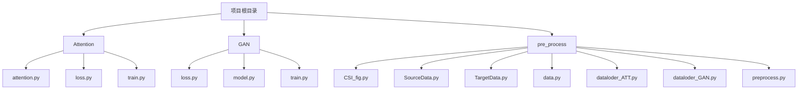
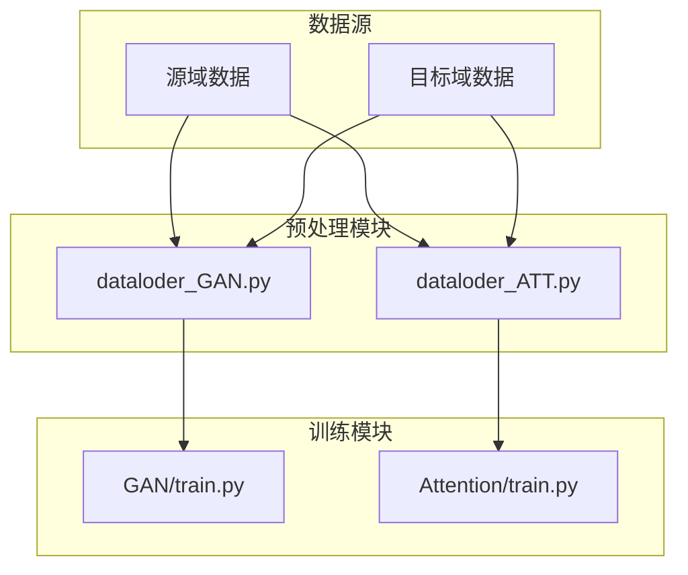
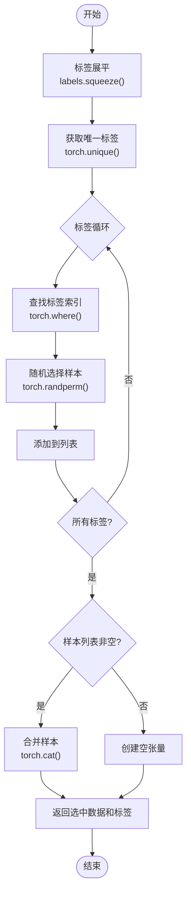
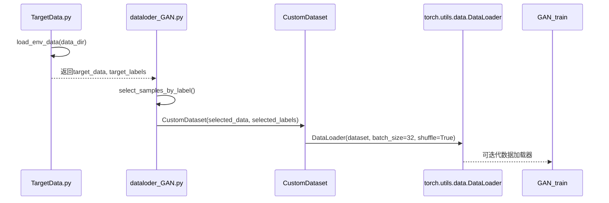
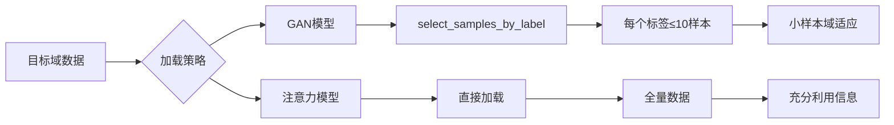
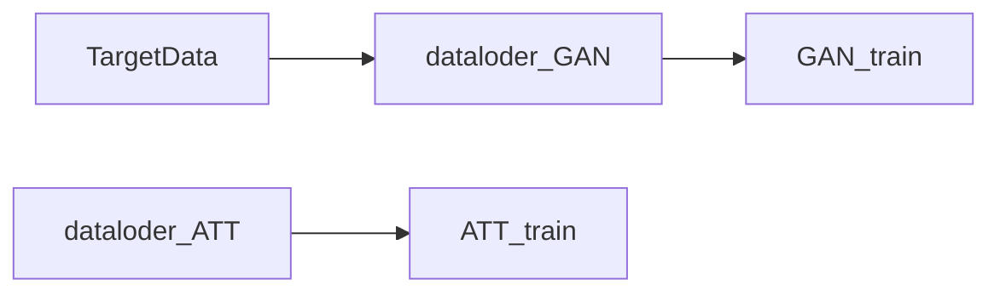

# GAN模型数据加载器

<cite>
**Referenced Files in This Document**   
- [dataloder_GAN.py](file://pre_process/dataloder_GAN.py)
- [TargetData.py](file://pre_process/TargetData.py)
- [train.py](file://GAN/train.py)
- [dataloder_ATT.py](file://pre_process/dataloder_ATT.py)
</cite>

## 目录
1. [引言](#引言)
2. [项目结构](#项目结构)
3. [核心组件](#核心组件)
4. [架构概述](#架构概述)
5. [详细组件分析](#详细组件分析)
6. [依赖分析](#依赖分析)
7. [性能考量](#性能考量)
8. [故障排除指南](#故障排除指南)
9. [结论](#结论)

## 引言
本文档深入分析了`dataloder_GAN.py`文件中特有的`select_samples_by_label`函数设计原理与实现细节。该函数在小样本域适应场景下发挥关键作用，通过从目标域完整数据中按身份标签分组并为每个标签随机选取最多10个样本，构建精简数据集以模拟低资源环境。这种策略迫使生成器学习有限样本下的特征分布，对缓解过拟合、提升域适应性能具有重要意义。

## 项目结构
项目采用模块化设计，主要分为三个功能目录：`Attention`、`GAN`和`pre_process`。其中`pre_process`目录包含数据处理相关脚本，是本分析的核心关注点。

**Diagram sources**
- [pre_process/dataloder_GAN.py](file://pre_process/dataloder_GAN.py)

**Section sources**
- [pre_process/dataloder_GAN.py](file://pre_process/dataloder_GAN.py)

## 核心组件
本项目的核心组件包括用于数据加载的`CustomDataset`类和实现小样本筛选的`select_samples_by_label`函数。这些组件共同构成了GAN训练中目标域数据准备的基础。

**Section sources**
- [dataloder_GAN.py](file://pre_process/dataloder_GAN.py#L4-L13)
- [dataloder_GAN.py](file://pre_process/dataloder_GAN.py#L16-L62)

## 架构概述
系统架构围绕域适应任务展开，通过预处理模块生成适合不同模型训练的数据格式。对于GAN模型，采用小样本筛选策略；而对于注意力模型，则使用全量数据加载策略。

**Diagram sources**
- [dataloder_GAN.py](file://pre_process/dataloder_GAN.py)
- [dataloder_ATT.py](file://pre_process/dataloder_ATT.py)
- [GAN/train.py](file://GAN/train.py)

## 详细组件分析

### select_samples_by_label函数分析
`select_samples_by_label`函数实现了小样本域适应场景下的关键数据筛选逻辑。其工作流程如下：接收目标域完整数据与标签，首先将标签展平以便处理，然后获取所有唯一标签值。对于每个标签，函数找到其对应的所有样本索引，并利用`torch.randperm`实现随机采样，确保每个标签最多选取10个样本。最终通过`torch.cat`沿维度0合并所有选中的样本，形成精简后的目标域数据集。

该函数在GAN训练中扮演着至关重要的角色——通过模拟低资源目标域环境，迫使生成器在有限样本条件下学习特征分布，从而增强模型的泛化能力和域适应性能。这种策略有效缓解了在充足样本下可能出现的过拟合问题。

**Diagram sources**
- [dataloder_GAN.py](file://pre_process/dataloder_GAN.py#L16-L62)

**Section sources**
- [dataloder_GAN.py](file://pre_process/dataloder_GAN.py#L16-L62)

### 数据加载流程分析
从原始目标域数据加载到经`select_samples_by_label`筛选后构建目标域DataLoader的完整链条如下：首先通过`TargetData.py`中的`load_env_data`函数读取环境数据目录下的所有`.npy`或`.npz`文件，提取文件名中的ID作为标签，将数据重塑为`(N, 56, 3, 6000)`形状，并合并成统一的张量。随后在`dataloder_GAN.py`的主程序部分，加载这些数据并通过`select_samples_by_label`函数进行筛选。最后使用筛选后的数据创建`CustomDataset`实例，并传入`DataLoader`生成可迭代的数据加载器供训练使用。

**Diagram sources**
- [TargetData.py](file://pre_process/TargetData.py#L4-L95)
- [dataloder_GAN.py](file://pre_process/dataloder_GAN.py#L65-L94)

**Section sources**
- [TargetData.py](file://pre_process/TargetData.py#L4-L95)
- [dataloder_GAN.py](file://pre_process/dataloder_GAN.py#L65-L94)

### 与注意力模型策略对比
`select_samples_by_label`的采样机制与注意力模型的全量加载策略存在本质差异。在`dataloder_ATT.py`中，目标域数据被完整加载（来自`target_data.pt`），没有进行任何样本筛选。这种全量策略适用于数据充足且需要充分利用所有信息的场景。而`select_samples_by_label`的小样本策略专门针对低资源环境设计，在GAN训练中通过限制样本数量来模拟真实世界中可能遇到的数据稀缺情况，促使模型学习更鲁棒的特征表示。两种策略的选择取决于具体的应用场景和研究目标。

**Diagram sources**
- [dataloder_GAN.py](file://pre_process/dataloder_GAN.py)
- [dataloder_ATT.py](file://pre_process/dataloder_ATT.py)

**Section sources**
- [dataloder_GAN.py](file://pre_process/dataloder_GAN.py)
- [dataloder_ATT.py](file://pre_process/dataloder_ATT.py)

## 依赖分析
组件间的依赖关系清晰明确。`dataloder_GAN.py`直接依赖PyTorch的`Dataset`和`DataLoader`类，同时其生成的数据加载器被`GAN/train.py`所依赖。`TargetData.py`作为数据源提供者，被`dataloder_GAN.py`间接依赖。整个依赖链条确保了数据能够从原始文件顺利流向训练过程。

**Diagram sources**
- [TargetData.py](file://pre_process/TargetData.py)
- [dataloder_GAN.py](file://pre_process/dataloder_GAN.py)
- [GAN/train.py](file://GAN/train.py)
- [dataloder_ATT.py](file://pre_process/dataloder_ATT.py)
- [Attention/train.py](file://Attention/train.py)

**Section sources**
- [TargetData.py](file://pre_process/TargetData.py)
- [dataloder_GAN.py](file://pre_process/dataloder_GAN.py)
- [GAN/train.py](file://GAN/train.py)

## 性能考量
`select_samples_by_label`函数的实现考虑了计算效率和内存使用。通过向量化操作（如`torch.where`和`torch.cat`）而非循环逐个处理样本，充分利用了PyTorch的底层优化。随机采样使用`torch.randperm`保证了均匀分布，同时`min`函数确保不会超出实际样本数量。对于大规模数据集，该函数的时间复杂度主要由`torch.unique`和循环内操作决定，整体表现良好。

## 故障排除指南
当遇到数据加载问题时，应首先检查数据文件路径是否正确，确认`../data/TargetData/`目录下存在`target_data.pt`和`target_labels.pt`文件。若`select_samples_by_label`返回空结果，需验证输入数据和标签的维度是否匹配，以及标签是否包含有效值。在训练过程中如果出现维度错误，应检查`CustomDataset`的`__getitem__`方法返回的数据形状是否符合预期。

**Section sources**
- [dataloder_GAN.py](file://pre_process/dataloder_GAN.py#L4-L13)
- [dataloder_GAN.py](file://pre_process/dataloder_GAN.py#L16-L62)

## 结论
`select_samples_by_label`函数的设计体现了针对小样本域适应场景的深思熟虑。通过精心设计的采样策略，该函数成功模拟了低资源目标域环境，为GAN模型的训练提供了重要支持。这种机制不仅有助于缓解过拟合问题，还提升了模型在跨域任务中的适应能力。与注意力模型的全量加载策略相比，展示了根据不同模型需求定制数据准备流程的重要性。