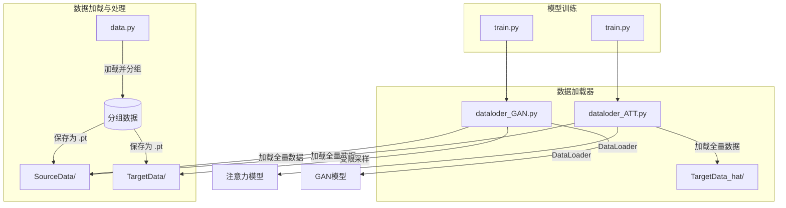
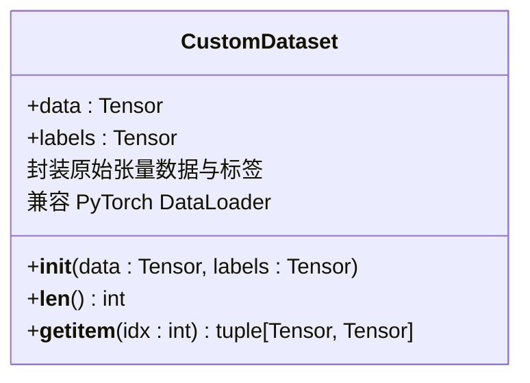
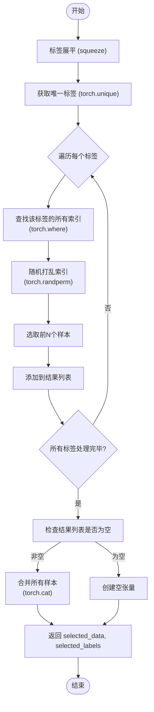
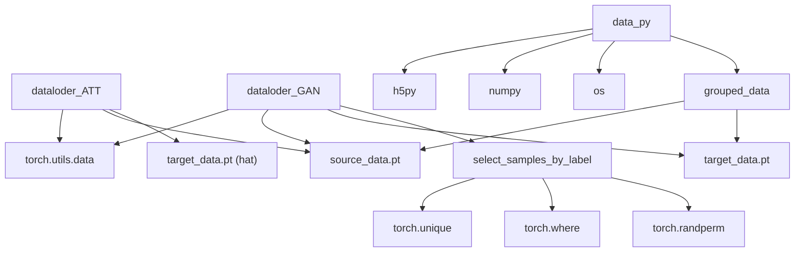

# 数据加载

<cite>
**Referenced Files in This Document**  
- [dataloder_ATT.py](file://pre_process/dataloder_ATT.py)
- [dataloder_GAN.py](file://pre_process/dataloder_GAN.py)
- [data.py](file://pre_process/data.py)
</cite>

## 目录
1. [简介](#简介)
2. [核心组件](#核心组件)
3. [架构概览](#架构概览)
4. [详细组件分析](#详细组件分析)
5. [依赖分析](#依赖分析)
6. [性能考量](#性能考量)
7. [结论](#结论)

## 简介
本文档旨在对比分析 `dataloder_ATT.py` 与 `dataloder_GAN.py` 中数据加载器的设计差异，重点解析其在注意力模型与生成对抗网络（GAN）训练场景下的适配性。文档将深入探讨 `CustomDataset` 类如何封装张量数据以兼容 PyTorch 的 `DataLoader`，并详细说明 GAN 数据加载器中特有的 `select_samples_by_label` 函数，该函数服务于小样本域适应任务。同时，文档还将讨论不同的数据加载策略对训练过程的影响，以及 `batch_size=32` 设置对 GPU 内存消耗的潜在影响。

## 核心组件
本项目的核心数据加载组件由 `pre_process` 目录下的两个 Python 脚本构成：`dataloder_ATT.py` 和 `dataloder_GAN.py`。两者共享一个基础的 `CustomDataset` 类，该类继承自 `torch.utils.data.Dataset`，用于将原始张量数据和标签封装成 PyTorch 可识别的数据集格式。`dataloder_ATT.py` 采用全量数据加载策略，适用于注意力模型的训练。而 `dataloder_GAN.py` 则引入了 `select_samples_by_label` 这一关键函数，实现了对目标域数据的受限采样，以满足 GAN 训练中对小样本、高多样性数据的需求。

**Section sources**
- [dataloder_ATT.py](file://pre_process/dataloder_ATT.py#L4-L13)
- [dataloder_GAN.py](file://pre_process/dataloder_GAN.py#L4-L13)
- [dataloder_GAN.py](file://pre_process/dataloder_GAN.py#L16-L62)

## 架构概览
整个数据预处理流程形成了一个清晰的架构。`data.py` 负责从 `.mat` 文件中加载原始数据，并按身份（ID）和环境（ENV）进行分组和保存。随后，`dataloder_ATT.py` 和 `dataloder_GAN.py` 作为两个独立的数据加载入口，分别从 `../data/SourceData/` 和 `../data/TargetData/`（或 `TargetData_hat/`）目录加载已处理的 `.pt` 张量文件。它们通过 `CustomDataset` 类将数据封装，并最终由 PyTorch 的 `DataLoader` 提供可迭代的批量数据。

**Diagram sources**
- [data.py](file://pre_process/data.py#L1-L109)
- [dataloder_ATT.py](file://pre_process/dataloder_ATT.py#L15-L36)
- [dataloder_GAN.py](file://pre_process/dataloder_GAN.py#L65-L94)

## 详细组件分析

### CustomDataset 类分析
`CustomDataset` 类是两个数据加载器共用的基础组件，其设计遵循了 PyTorch 自定义数据集的标准范式。该类通过 `__init__` 方法接收数据张量和标签张量，并将其存储为实例属性。`__len__` 方法返回数据集的样本总数，而 `__getitem__` 方法则根据索引 `idx` 返回单个样本及其对应的标签。这种封装方式使得 `DataLoader` 能够高效地进行批量采样、打乱和并行加载。

**Diagram sources**
- [dataloder_ATT.py](file://pre_process/dataloder_ATT.py#L4-L13)
- [dataloder_GAN.py](file://pre_process/dataloder_GAN.py#L4-L13)

### select_samples_by_label 函数分析
`select_samples_by_label` 函数是 `dataloder_GAN.py` 的核心创新点，专为小样本域适应场景设计。该函数接收目标域的全部数据和标签，以及每个标签所需的样本数（默认为10）。其工作流程如下：首先，它将标签展平并获取所有唯一的标签值；然后，对于每个唯一标签，它找到所有属于该标签的样本索引，并使用 `torch.randperm` 随机打乱这些索引；最后，它从中选取最多 `samples_per_label` 个样本，并将所有选中的样本和标签合并成新的张量返回。

此函数的实现确保了从目标域为每个身份标签都能获得一个小型但多样化的样本集，这对于训练 GAN 模型至关重要，因为它可以防止模型过拟合到有限的样本上，同时又能保证每个类别都有足够的代表性。

**Diagram sources**
- [dataloder_GAN.py](file://pre_process/dataloder_GAN.py#L16-L62)

## 依赖分析
通过对两个数据加载器的分析，可以看出它们都直接依赖于 PyTorch 框架的核心模块 `torch.utils.data` 来实现 `Dataset` 和 `DataLoader` 功能。此外，它们都依赖于 `data.py` 脚本所生成的预处理数据文件（`.pt` 格式）。`dataloder_ATT.py` 的依赖关系相对简单，主要依赖于全量数据。而 `dataloder_GAN.py` 则多了一个对 `select_samples_by_label` 函数的内部依赖，该函数本身依赖于 `torch.unique`、`torch.where` 和 `torch.randperm` 等张量操作来实现受限采样逻辑。

**Diagram sources**
- [dataloder_ATT.py](file://pre_process/dataloder_ATT.py#L1-L3)
- [dataloder_GAN.py](file://pre_process/dataloder_GAN.py#L1-L3)
- [data.py](file://pre_process/data.py#L1-L3)

## 性能考量
两种数据加载策略对 GPU 内存消耗的影响主要体现在 `batch_size` 的设置上。文档中两个加载器均设置 `batch_size=32`，这意味着每次迭代都会将 32 个样本加载到 GPU 内存中进行计算。对于 `dataloder_ATT.py`，由于加载的是全量数据，其数据集规模较大，但 `batch_size` 固定，因此单次迭代的内存占用是稳定的。对于 `dataloder_GAN.py`，虽然 `select_samples_by_label` 函数将目标域数据集的规模从数千个样本缩减到数百个（例如，10个类别 * 10个样本 = 100个样本），但 `batch_size` 仍为32，这可能导致在训练后期，当剩余样本不足一个完整 batch 时，需要进行特殊处理（如丢弃或填充）。总体而言，`batch_size=32` 是一个在训练稳定性和内存消耗之间取得平衡的常见选择，但具体的内存占用量还需根据数据张量的实际维度（如 `(56, 3, 6000)`）进行计算。

## 结论
`dataloder_ATT.py` 和 `dataloder_GAN.py` 展示了针对不同机器学习任务的两种有效数据加载策略。`CustomDataset` 类提供了统一的数据封装接口，确保了与 PyTorch 生态的无缝集成。`select_samples_by_label` 函数的引入，使得 `dataloder_GAN.py` 能够精准地服务于小样本域适应的 GAN 训练需求，通过为每个身份标签选取有限数量的样本来平衡数据多样性和模型泛化能力。两种加载器均采用 `batch_size=32`，这在保证训练效率的同时，对 GPU 内存提出了明确的要求。这种模块化的设计使得数据加载逻辑清晰、易于维护和扩展。