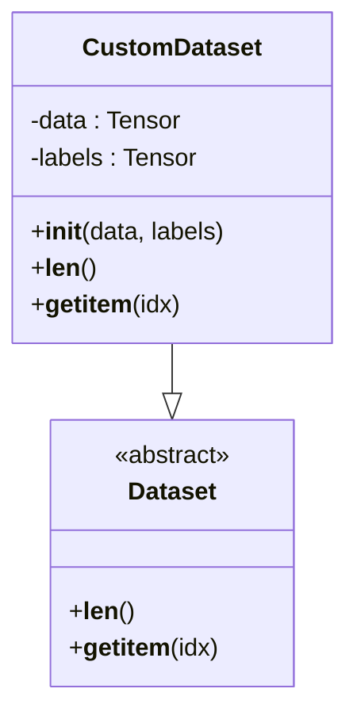
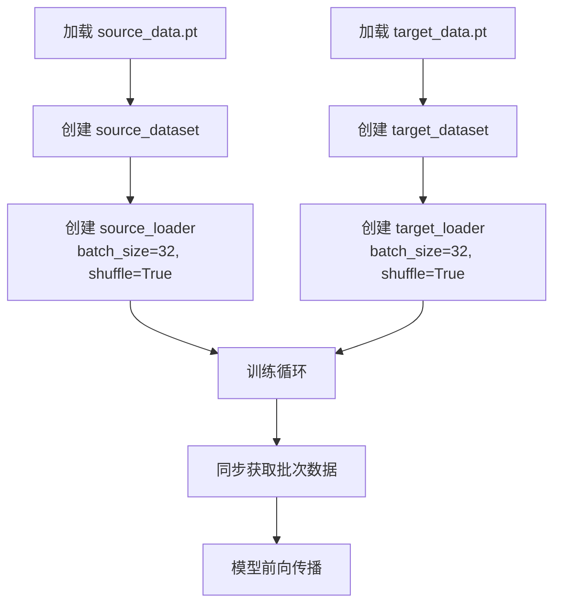

# 注意力模型数据加载器

<cite>
**Referenced Files in This Document**   
- [dataloder_ATT.py](file://pre_process/dataloder_ATT.py)
- [train.py](file://Attention/train.py)
- [attention.py](file://Attention/attention.py)
- [loss.py](file://Attention/loss.py)
</cite>

## 目录
1. [CustomDataset类实现机制](#customdataset类实现机制)
2. [数据加载流程与训练集成](#数据加载流程与训练集成)
3. [数据加载策略分析](#数据加载策略分析)
4. [批大小对训练的影响](#批大小对训练的影响)

## CustomDataset类实现机制

`CustomDataset`类继承自PyTorch的`Dataset`基类，实现了数据封装的核心功能。该类通过重写三个关键方法来支持张量数据与标签的统一管理。

在`__init__`方法中，类初始化时接收数据张量和标签张量作为参数，并将其存储为实例属性。这种设计允许将任意格式的张量数据封装为PyTorch可识别的数据集对象。

`__len__`方法返回数据集的样本数量，即数据张量的第一维长度。该方法为数据加载器提供了数据集规模信息，确保迭代过程的正确终止。

`__getitem__`方法实现了基于索引的数据访问机制。当数据加载器请求特定索引的样本时，该方法返回对应索引位置的数据和标签元组。这种实现方式保证了数据与标签的同步访问，避免了配对错误。

**Diagram sources**
- [dataloder_ATT.py](file://pre_process/dataloder_ATT.py#L4-L13)

**Section sources**
- [dataloder_ATT.py](file://pre_process/dataloder_ATT.py#L4-L13)

## 数据加载流程与训练集成

数据加载器在注意力机制模型训练中扮演着关键角色，负责将原始数据文件转换为可批量处理的迭代器。整个流程从加载`.pt`格式的数据文件开始，通过`torch.load`函数读取预处理后的源域和目标域数据。

数据加载流程首先创建`CustomDataset`实例，将加载的数据和标签传入构造函数。随后，使用`DataLoader`类包装数据集实例，配置`batch_size=32`和`shuffle=True`参数。这使得数据加载器能够以32个样本为一批次进行批量加载，并在每个训练周期开始时打乱数据顺序，从而提升模型的泛化能力。

在训练过程中，`train.py`文件通过导入`source_loader`和`target_loader`直接使用预配置的数据加载器。训练循环中，迭代器按批次提供数据，支持源域和目标域数据的同步加载。当两个数据加载器的批次大小不一致时，系统会自动截取较小批次的大小，确保张量操作的兼容性。

**Diagram sources**
- [dataloder_ATT.py](file://pre_process/dataloder_ATT.py#L15-L35)
- [train.py](file://Attention/train.py#L17-L105)

**Section sources**
- [dataloder_ATT.py](file://pre_process/dataloder_ATT.py#L15-L35)
- [train.py](file://Attention/train.py#L17-L105)

## 数据加载策略分析

当前数据加载策略针对全量数据训练场景进行了优化适配。通过`CustomDataset`类的设计，系统能够处理大规模张量数据，支持完整的源域和目标域数据集加载。这种全量加载方式确保了模型能够接触到所有可用的训练样本，有利于学习全面的特征表示。

数据加载器的`shuffle=True`参数在每个训练周期重新排列数据顺序，有效防止了模型对特定数据顺序的过拟合。这种随机化策略增强了模型的泛化能力，特别是在跨域适应任务中，有助于模型学习域不变特征。

在训练实现中，系统采用了动态批次处理机制。当源域和目标域数据加载器返回的批次大小不一致时，系统会自动调整到较小的批次大小。这种容错机制确保了即使在数据集大小不能被批次大小整除的情况下，训练过程也能稳定进行。

此外，训练脚本中实现了迭代器重置逻辑。当一个数据加载器的迭代完成而另一个仍在进行时，系统会自动重置已完成的迭代器。这种设计保证了源域和目标域数据的持续同步供应，避免了训练过程的中断。

**Section sources**
- [dataloder_ATT.py](file://pre_process/dataloder_ATT.py#L15-L35)
- [train.py](file://Attention/train.py#L45-L85)

## 批大小对训练的影响

`batch_size=32`的设置在GPU内存占用与训练效率之间实现了平衡。较小的批次大小减少了单次前向和反向传播的内存需求，使得模型能够在有限的GPU显存下运行，特别是在处理高维CSI数据（形状为[56, 3, 6000]）时尤为重要。

从训练效率角度看，32的批次大小提供了足够的统计信息用于梯度估计，避免了随机梯度下降的高方差问题。同时，这个大小允许在单个GPU上实现较高的计算利用率，充分利用了现代GPU的并行计算能力。

在注意力机制模型中，批大小的选择还影响着注意力权重的计算。较大的批次提供了更丰富的上下文信息，但也会增加注意力矩阵的计算复杂度（O(n²)）。`batch_size=32`在这个权衡中表现良好，既保证了注意力机制的有效性，又控制了计算开销。

训练脚本中还实现了梯度裁剪机制（`clip_grad_norm_`），进一步增强了对不同批次大小的适应性。这使得模型在面对批次大小变化时能够保持稳定的训练动态，防止梯度爆炸问题。

**Section sources**
- [train.py](file://Attention/train.py#L70-L75)
- [dataloder_ATT.py](file://pre_process/dataloder_ATT.py#L30-L35)