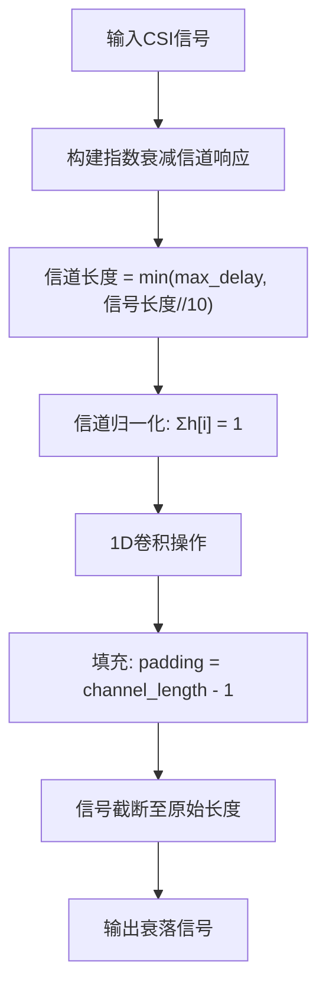
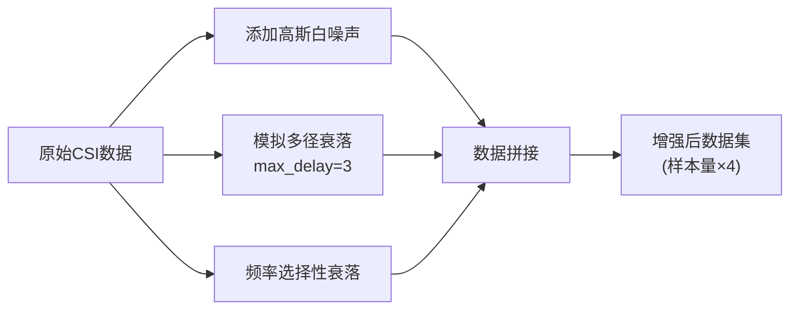
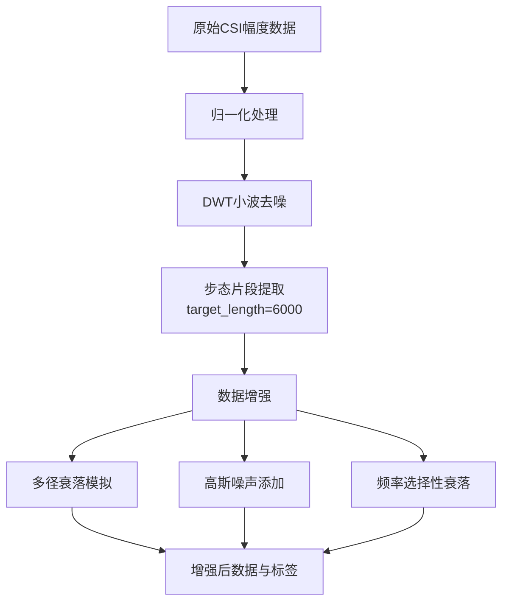

# 多径衰落模拟

<cite>
**Referenced Files in This Document**   
- [preprocess.py](file://pre_process/preprocess.py)
</cite>

## 目录
1. [引言](#引言)
2. [核心组件](#核心组件)
3. [信道建模与卷积机制](#信道建模与卷积机制)
4. [数据增强流程](#数据增强流程)
5. [预处理架构](#预处理架构)
6. [多径衰落物理意义](#多径衰落物理意义)
7. [域偏移缓解机制](#域偏移缓解机制)
8. [结论](#结论)

## 引言
本文档深入解析基于指数衰减的多径衰落模拟方法，重点阐述`simulate_multipath_fading`函数如何通过卷积操作在时域上模拟复杂室内环境下的无线信号传播特性。该技术作为数据增强策略的核心组成部分，旨在提升模型对真实信道环境的适应能力。

## 核心组件

`simulate_multipath_fading`函数实现了基于指数衰减的多径信道建模，通过控制`max_delay`参数调节反射路径延迟，进而影响卷积核长度。该函数与`add_gaussian_noise`、`add_frequency_selective_fading`等函数共同构成完整的数据增强体系，服务于`augment_csi_data`主流程。

**Section sources**
- [preprocess.py](file://pre_process/preprocess.py#L104-L136)

## 信道建模与卷积机制

### 指数衰减信道响应
函数采用指数衰减模型生成信道冲激响应，其长度由`max_delay`参数与输入信号长度共同决定。当`max_delay=3`时，系统强制将信道响应限制为最多3个延迟抽头，有效控制了卷积核的复杂度。

### 卷积操作物理意义
卷积操作在时域上精确模拟了多径信号的叠加过程：原始信号与信道响应的卷积等效于各延迟路径信号按指数衰减权重进行线性叠加，真实再现了信号在复杂室内环境中因反射、散射而产生的时延扩展现象。

### 信号处理逻辑
系统采用`padding=len(channel) - 1`的卷积填充策略，确保输出信号长度与输入一致。随后通过`faded_signal[:len(data)]`进行截断处理，保证数据维度一致性，避免因卷积扩展导致的形状不匹配问题。

**Diagram sources**
- [preprocess.py](file://pre_process/preprocess.py#L104-L136)

**Section sources**
- [preprocess.py](file://pre_process/preprocess.py#L104-L136)

## 数据增强流程

`augment_csi_data`函数协调多种增强策略，通过拼接原始数据与三种增强版本（高斯噪声、多径衰落、频率选择性衰落），实现样本数量四倍扩展。该函数明确调用`simulate_multipath_fading(csi_data, max_delay=3)`，将最大延迟固定为3，确保增强过程的可控性与一致性。

**Diagram sources**
- [preprocess.py](file://pre_process/preprocess.py#L163-L198)

**Section sources**
- [preprocess.py](file://pre_process/preprocess.py#L163-L198)

## 预处理架构

完整的预处理流程由`preprocess_csi_data`函数 orchestrates，依次执行归一化、小波去噪、步态分割和数据增强四个阶段。多径衰落模拟作为数据增强环节的关键步骤，为模型训练注入了真实的信道变化特性。

**Diagram sources**
- [preprocess.py](file://pre_process/preprocess.py#L200-L230)

**Section sources**
- [preprocess.py](file://pre_process/preprocess.py#L200-L230)

## 多径衰落物理意义

### 能量守恒保障
信道响应通过`channel = channel / torch.sum(channel)`进行归一化处理，确保所有路径的增益总和为1。这一设计严格遵循能量守恒定律，防止信号在模拟过程中出现非物理性的能量增益或衰减，保持了信号功率的稳定性。

### 室内环境适应性
该增强方式通过模拟信号在墙壁、家具等物体上的多次反射，有效再现了室内环境中典型的多径传播效应。`max_delay=3`的设置对应于短距离、低延迟扩展的室内场景，使模型能够学习到此类环境下的特征模式。

## 域偏移缓解机制

### 域偏移问题应对
多径衰落模拟通过在训练数据中引入信道变化的多样性，显著增强了模型对不同部署环境的泛化能力。当模型在新环境中遇到未知的多径特性时，由于已学习过类似的变化模式，能够更好地适应而不会性能骤降。

### 协同增强效应
与其他增强策略形成互补：高斯噪声提升抗干扰能力，频率选择性衰落模拟频域变化，而多径衰落则专注时域扩展特性。三者协同作用，全面覆盖了无线信道的主要失真类型，构建了一个鲁棒的域适应框架。

## 结论
`simulate_multipath_fading`函数通过精巧的指数衰减模型和卷积操作，成功实现了物理上合理的多径衰落模拟。`max_delay=3`的参数设置平衡了模型复杂度与环境真实性，信道归一化确保了能量守恒。作为数据增强链的关键环节，该方法有效缓解了域偏移问题，提升了模型在复杂室内环境下的鲁棒性和泛化性能。