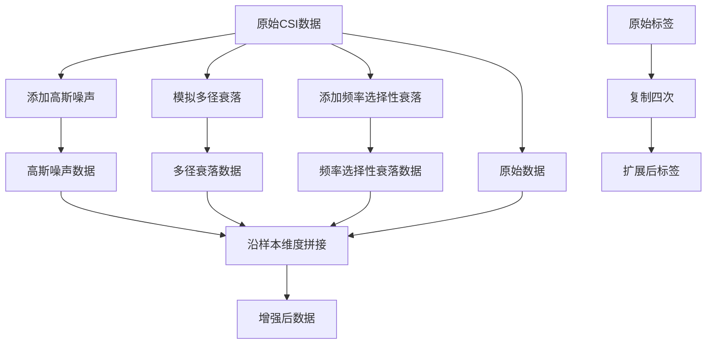

<cite>
**本文档中引用的文件**
- [preprocess.py](file://pre_process/preprocess.py#L97-L198)
</cite>

# 数据增强

## 目录
1. [数据增强策略概述](#数据增强策略概述)
2. [增强方法实现细节](#增强方法实现细节)
3. [数据拼接与标签扩展](#数据拼接与标签扩展)
4. [在预处理流程中的集成](#在预处理流程中的集成)

## 数据增强策略概述

`augment_csi_data` 函数集成了三种核心数据增强策略，旨在提升模型对真实无线环境的鲁棒性。该函数接收预处理后的CSI数据，并通过模拟真实世界中的信号退化现象来生成更具多样性的训练样本。这三种策略分别是：

1.  **高斯噪声添加**：通过注入高斯白噪声（`noise_level=0.02`）来模拟电子设备固有的热噪声和环境干扰。这种方法增强了模型对低信噪比（SNR）条件的适应能力。
2.  **多径衰落模拟**：通过卷积操作模拟多径效应（`max_delay=3`），重现了信号因反射、折射而产生的时间延迟和幅度衰减。这使模型能够学习处理由复杂室内环境引起的信号失真。
3.  **频率选择性衰落**：通过分块乘以随机衰落因子（`coherence_bandwidth_ratio=0.15`）来模拟频率选择性衰落。该方法反映了信道在不同频率上响应不一致的特性，提升了模型对频域变化的鲁棒性。

**Section sources**
- [preprocess.py](file://pre_process/preprocess.py#L163-L198)

## 增强方法实现细节

### 高斯噪声添加
`add_gaussian_noise` 函数通过生成与输入数据形状相同的随机噪声张量，并将其乘以一个固定的噪声水平（`noise_level`）来控制信噪比。噪声水平的大小直接决定了添加噪声的强度，从而间接控制了信噪比。较小的 `noise_level` 值（如0.02）会引入轻微的扰动，而较大的值则会产生更显著的噪声，用于测试模型在极端条件下的表现。

**Section sources**
- [preprocess.py](file://pre_process/preprocess.py#L97-L102)

### 多径衰落模拟
`simulate_multipath_fading` 函数采用指数衰减模型来构建多径信道的冲激响应。该模型假设多径分量的幅度随延迟时间呈指数衰减，这符合许多实际场景的统计特性。函数通过将原始信号与这个指数衰减的信道响应进行一维卷积，来模拟信号经过多径信道后的失真效果。`max_delay` 参数限制了信道响应的最大长度，从而控制了模拟的复杂度和延迟范围。

**Section sources**
- [preprocess.py](file://pre_process/preprocess.py#L104-L136)

### 频率选择性衰落
`add_frequency_selective_fading` 函数基于相干带宽的概念来实现频率选择性衰落。它首先根据 `coherence_bandwidth_ratio` 计算出相干带宽所覆盖的子载波数量。然后，将整个频带划分为多个这样的“相干块”，并为每个块独立地生成一个随机的衰落因子（在0.5到1.0之间）。通过将每个相干块内的所有子载波乘以同一个衰落因子，该方法模拟了在相干带宽内信道响应高度相关，而在不同相干带宽之间响应独立变化的特性。

**Section sources**
- [preprocess.py](file://pre_process/preprocess.py#L138-L161)

## 数据拼接与标签扩展

为了最大化利用增强后的数据，`augment_csi_data` 函数将原始数据和三种增强后的数据沿样本维度（`dim=1`）进行拼接。这使得单个输入样本被扩展为四个样本（原始+三种增强），从而将数据集的样本量扩大了四倍。

与数据拼接相对应，标签也需要进行扩展。函数首先为原始数据生成基础标签，然后通过将基础标签复制四次并沿样本维度拼接，生成与增强后数据形状相匹配的 `augmented_labels`。这种标签扩展逻辑对于缓解跨域识别中目标域样本稀缺的问题至关重要。它通过数据增强有效地“创造”了更多的训练样本，使得模型能够在有限的真实目标域数据上进行更充分的训练，从而提升其在目标域上的识别性能。

**Diagram sources**
- [preprocess.py](file://pre_process/preprocess.py#L163-L198)

**Section sources**
- [preprocess.py](file://pre_process/preprocess.py#L163-L198)

## 在预处理流程中的集成

数据增强是整个CSI数据预处理流程的最后一步。`preprocess_csi_data` 函数定义了一个完整的流水线，依次执行归一化、小波去噪、步态分割，最后调用 `augment_csi_data` 进行数据增强。这种集成方式确保了数据在进入模型训练前，不仅经过了质量提升和标准化处理，还通过增强获得了足够的多样性和鲁棒性。

**Section sources**
- [preprocess.py](file://pre_process/preprocess.py#L200-L230)