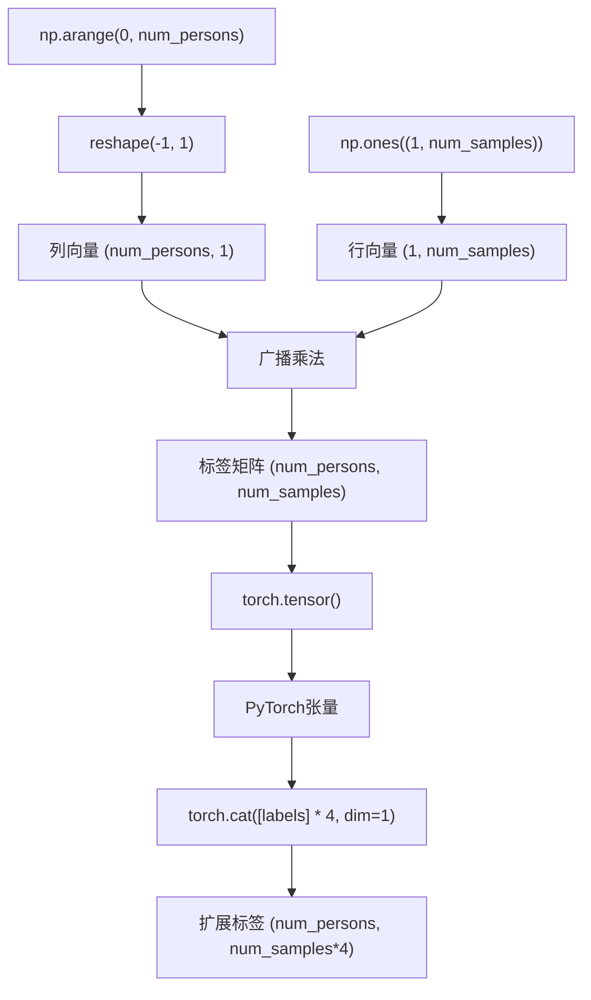

<cite>
**本文档中引用的文件**
- [preprocess.py](file://pre_process/preprocess.py#L163-L198)
- [preprocess.py](file://pre_process/preprocess.py#L97-L102)
- [preprocess.py](file://pre_process/preprocess.py#L104-L136)
- [preprocess.py](file://pre_process/preprocess.py#L138-L161)
</cite>

# 标签扩展机制

## 表格目录
1. [标签扩展机制](#标签扩展机制)
2. [原始标签矩阵构造](#原始标签矩阵构造)
3. [标签张量拼接](#标签张量拼接)
4. [样本顺序对齐](#样本顺序对齐)
5. [跨域步态识别应用](#跨域步态识别应用)
6. [标签一致性验证](#标签一致性验证)
7. [常见错误调试](#常见错误调试)

## 原始标签矩阵构造

`augment_csi_data`函数通过`np.arange`与广播机制构造原始标签矩阵。首先，`np.arange(0, num_persons)`生成从0到`num_persons-1`的整数序列，代表不同个体的类别标签。该一维数组通过`reshape(-1, 1)`转换为列向量，随后与`np.ones((1, num_original_samples))`进行广播乘法运算。

此广播机制利用NumPy的自动维度扩展功能，将形状为`(num_persons, 1)`的列向量与形状为`(1, num_samples)`的行向量相乘，生成形状为`(num_persons, num_samples)`的二维标签矩阵。矩阵的每一行对应一个个体，每一列对应一个样本，确保每个原始样本都被正确标记。

**Section sources**
- [preprocess.py](file://pre_process/preprocess.py#L163-L198)

## 标签张量拼接

在将NumPy标签矩阵转换为PyTorch张量后，系统使用`torch.cat`操作在样本维度（dim=1）上对标签进行四次拼接。`torch.tensor(labels)`将NumPy数组转换为PyTorch张量，保持其形状和数据类型。

`torch.cat([labels, labels, labels, labels], dim=1)`操作将相同的标签张量在维度1（样本维度）上连续拼接四次。由于原始数据经过四种增强方式（原始、高斯噪声、多径衰落、频率选择性衰落），每次增强产生与原始数据相同数量的样本，因此需要将标签复制四份以匹配增强后的数据量。

**Diagram sources**
- [preprocess.py](file://pre_process/preprocess.py#L163-L198)

**Section sources**
- [preprocess.py](file://pre_process/preprocess.py#L163-L198)

## 样本顺序对齐

该机制通过确定性的数据处理流程确保增强后数据与标签的样本顺序严格对齐。数据增强的四种方法（原始数据、高斯白噪声、多径衰落、频率选择性衰落）按固定顺序依次应用，并通过`torch.cat`在样本维度上按相同顺序拼接。

由于标签张量的拼接顺序与数据增强顺序完全一致，且每种增强方法产生的样本数量与原始数据相同，因此第i个个体的第j个原始样本、其高斯噪声版本、多径衰落版本和频率选择性衰落版本在增强数据张量中连续排列，对应的标签也按相同顺序复制，保证了数据-标签对的一一对应关系。

**Section sources**
- [preprocess.py](file://pre_process/preprocess.py#L163-L198)

## 跨域步态识别应用

该标签扩展机制有效解决了跨域步态识别中目标域样本稀缺的问题。在目标域数据有限的情况下，通过对有限样本应用多种物理意义明确的CSI信道增强方法，系统能够生成大量多样化的训练样本。

每种增强方法模拟了真实无线环境中的不同物理现象：高斯白噪声模拟电子噪声，多径衰落模拟信号反射，频率选择性衰落模拟信道不均匀性。这种基于物理模型的数据增强不仅增加了样本数量，更重要的是提升了数据的多样性，使模型能够学习到更鲁棒的步态特征，从而显著提升在未知环境下的泛化能力。

**Section sources**
- [preprocess.py](file://pre_process/preprocess.py#L163-L198)
- [preprocess.py](file://pre_process/preprocess.py#L97-L102)
- [preprocess.py](file://pre_process/preprocess.py#L104-L136)
- [preprocess.py](file://pre_process/preprocess.py#L138-L161)

## 标签一致性验证

为验证标签扩展的正确性，建议实施以下验证方法：首先，检查增强后数据和标签的形状是否匹配，数据张量的形状应为`(num_persons, num_samples*4, ...)`，标签张量应为`(num_persons, num_samples*4)`。其次，可通过切片检查特定个体的标签连续性，例如验证`augmented_labels[i, :4]`是否全等于`i`，确保前四个样本（原始及三种增强）都正确标记为第i个个体。

此外，可随机选取几个样本，可视化其CSI数据并核对其标签，确保数据增强与标签扩展的同步性。最后，在训练前打印几个批次的数据-标签对，进行最终的人工验证。

**Section sources**
- [preprocess.py](file://pre_process/preprocess.py#L163-L198)

## 常见错误调试

常见错误主要源于维度不匹配。若`num_persons`或`num_original_samples`获取错误，会导致标签矩阵形状与数据不一致。调试时应首先打印`csi_data.shape`以确认输入张量的维度顺序。

另一个常见问题是`torch.cat`的`dim`参数设置错误。若误设为`dim=0`，将在个体维度拼接，导致标签矩阵行数变为四倍，而非样本维度。应确保`dim=1`以在样本维度扩展。此外，若数据增强方法改变了样本数量，必须相应调整标签拼接逻辑，否则会导致数据-标签错位。

**Section sources**
- [preprocess.py](file://pre_process/preprocess.py#L163-L198)