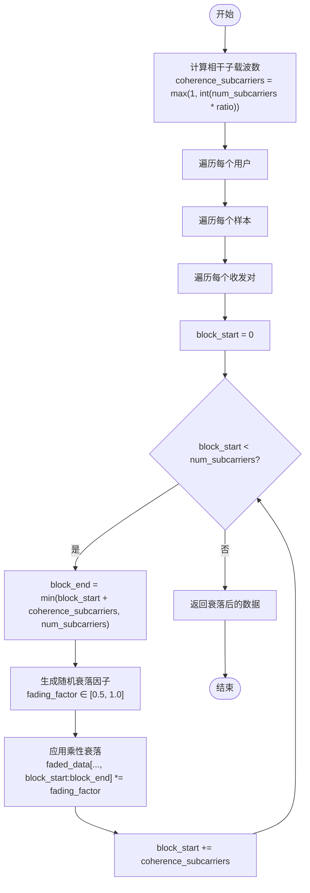

<cite>
**本文档引用的文件**
- [preprocess.py](file://pre_process/preprocess.py#L138-L161)
- [preprocess.py](file://pre_process/preprocess.py#L163-L198)
- [preprocess.py](file://pre_process/preprocess.py#L200-L230)
</cite>

# 频率选择性衰落增强

## 目录
1. [相干带宽分块机制](#相干带宽分块机制)
2. [随机衰落因子应用过程](#随机衰落因子应用过程)
3. [块边界处理与乘性衰落](#块边界处理与乘性衰落)
4. [参数调整建议](#参数调整建议)

## 相干带宽分块机制

`add_frequency_selective_fading`函数通过相干带宽比例参数`coherence_bandwidth_ratio`实现子载波分组。该参数（默认值0.15）决定了每个相干块包含的子载波数量，计算公式为`coherence_subcarriers = max(1, int(num_subcarriers * coherence_bandwidth_ratio))`。此机制将整个频带划分为多个大小相等的频段块，每个块内应用相同的衰落因子，从而模拟真实OFDM系统中频率选择性信道的特性。分块大小直接由`coherence_bandwidth_ratio`控制，较小的值产生更细粒度的衰落变化，增强了对频域不均匀衰减的建模能力。

**Section sources**
- [preprocess.py](file://pre_process/preprocess.py#L138-L161)

## 随机衰落因子应用过程

在每个相干频段块上，函数独立生成随机衰落因子，其值域为[0.5, 1.0]，计算方式为`fading_factor = 0.5 + 0.5 * torch.rand(1).item()`。这一过程确保了不同频段块经历独立的衰落强度，有效模拟了实际无线信道中因多径效应导致的频率选择性衰落现象。通过在频域上引入非均匀的乘性衰减，该方法显著增强了CSI数据增强的多样性，使模型能够学习到更鲁棒的特征表示，从而提高其在真实复杂环境下的泛化能力。

**Section sources**
- [preprocess.py](file://pre_process/preprocess.py#L138-L161)

## 块边界处理与乘性衰落

函数采用滑动窗口方式处理块边界，循环`for block_start in range(0, num_subcarriers, coherence_subcarriers)`并使用`block_end = min(block_start + coherence_subcarriers, num_subcarriers)`确保最后一个块不会越界。乘性衰落的数学形式为`faded_data[..., block_start:block_end] *= fading_factor`，即对选定子载波范围内的所有数据点统一乘以随机衰落因子。这种处理方式保证了块内衰落的一致性，同时通过块间衰落因子的随机性实现了频域选择性，有效增强了模型对频域不均匀衰减模式的鲁棒性。

**Diagram sources**
- [preprocess.py](file://pre_process/preprocess.py#L138-L161)

**Section sources**
- [preprocess.py](file://pre_process/preprocess.py#L138-L161)

## 参数调整建议

`coherence_bandwidth_ratio`参数的调整需在增强强度与语义一致性之间取得平衡。建议：
- **精细衰落（0.05-0.1）**：适用于需要高保真信道模拟的场景，但可能过度扭曲原始信号特征
- **标准设置（0.15）**：推荐的默认值，在增强多样性和保持语义信息间提供良好平衡
- **粗粒度衰落（0.2-0.3）**：适用于需要强增强效果的场景，但可能导致频域特征失真
- **验证方法**：通过可视化增强前后的CSI幅度图，确保关键步态特征未被完全破坏
- **联合调优**：与`add_gaussian_noise`和`simulate_multipath_fading`等其他增强方法协同调整，避免过度增强

**Section sources**
- [preprocess.py](file://pre_process/preprocess.py#L163-L198)