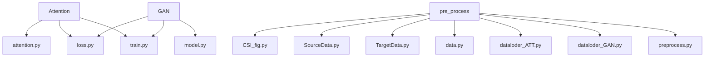
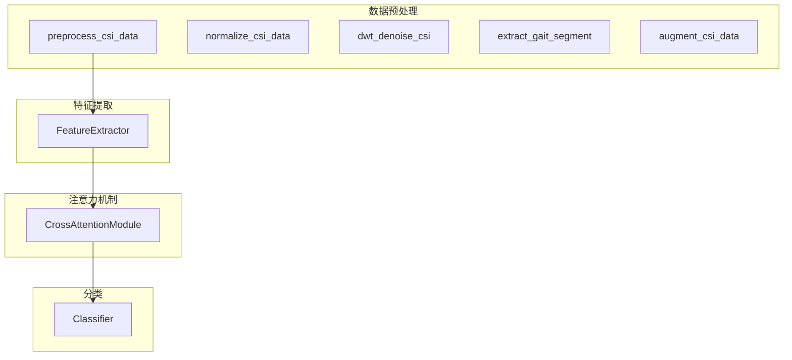
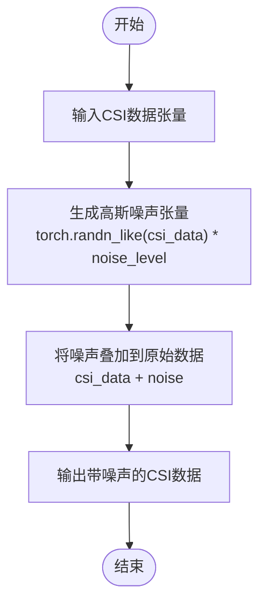
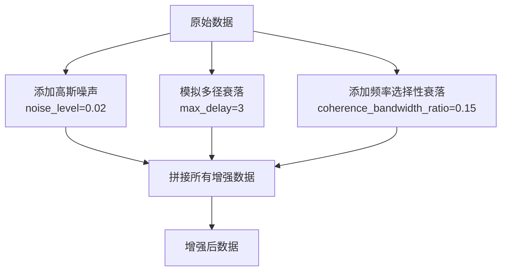
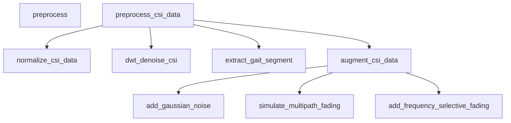

# 高斯噪声增强

<cite>
**本文档中引用的文件**   
- [preprocess.py](file://pre_process/preprocess.py)
- [data.py](file://pre_process/data.py)
- [SourceData.py](file://pre_process/SourceData.py)
- [TargetData.py](file://pre_process/TargetData.py)
- [dataloder_ATT.py](file://pre_process/dataloder_ATT.py)
- [attention.py](file://Attention/attention.py)
- [train.py](file://Attention/train.py)
</cite>

## 目录
1. [引言](#引言)
2. [项目结构](#项目结构)
3. [核心组件](#核心组件)
4. [架构概述](#架构概述)
5. [详细组件分析](#详细组件分析)
6. [依赖关系分析](#依赖关系分析)
7. [性能考虑](#性能考虑)
8. [故障排除指南](#故障排除指南)
9. [结论](#结论)

## 引言
本文档详细说明了 `add_gaussian_noise` 函数的实现机制，重点解释了 `noise_level=0.02` 参数对信噪比的控制作用及其在提升模型鲁棒性中的意义。描述了该方法如何模拟真实无线环境中的随机噪声干扰，增强模型对微小信号波动的容忍度。结合代码示例展示了输入数据张量的维度变化与噪声叠加过程，并分析其对跨域识别任务中目标域泛化能力的影响。提供了调用该函数的最佳实践建议和常见问题排查方法，如噪声水平过高导致特征失真时的应对策略。

## 项目结构
本项目主要由三个模块组成：Attention、GAN 和 pre_process。pre_process 模块负责数据预处理和增强，Attention 模块实现注意力机制模型，GAN 模块实现生成对抗网络。数据预处理流程包括归一化、小波去噪、步态分割和数据增强。

**图示来源**
- [preprocess.py](file://pre_process/preprocess.py#L0-L231)
- [data.py](file://pre_process/data.py#L0-L108)
- [SourceData.py](file://pre_process/SourceData.py#L0-L112)
- [TargetData.py](file://pre_process/TargetData.py#L0-L95)

**节来源**
- [preprocess.py](file://pre_process/preprocess.py#L0-L231)
- [data.py](file://pre_process/data.py#L0-L108)

## 核心组件
`add_gaussian_noise` 函数是数据增强的核心组件之一，通过向CSI数据添加高斯白噪声来提高模型的鲁棒性。该函数在 `preprocess.py` 文件中定义，接受 `csi_data` 和 `noise_level` 作为参数，返回添加噪声后的数据。

**节来源**
- [preprocess.py](file://pre_process/preprocess.py#L97-L102)

## 架构概述
整个系统的架构分为数据预处理、特征提取、注意力机制和分类四个主要部分。数据预处理模块负责数据的清洗和增强，特征提取模块从预处理后的数据中提取有用特征，注意力机制模块通过自注意力和交叉注意力机制增强特征表示，最后分类模块完成最终的分类任务。

**图示来源**
- [preprocess.py](file://pre_process/preprocess.py#L200-L230)
- [attention.py](file://Attention/attention.py#L0-L225)

**节来源**
- [preprocess.py](file://pre_process/preprocess.py#L200-L230)
- [attention.py](file://Attention/attention.py#L0-L225)

## 详细组件分析
### add_gaussian_noise 函数分析
`add_gaussian_noise` 函数通过向输入的CSI数据添加高斯白噪声来模拟真实无线环境中的随机噪声干扰。噪声水平由 `noise_level` 参数控制，该参数直接影响信噪比。在 `augment_csi_data` 函数中，`noise_level` 被设置为 0.02，这表示添加的噪声幅度为原始数据标准差的 2%。

**图示来源**
- [preprocess.py](file://pre_process/preprocess.py#L97-L102)

**节来源**
- [preprocess.py](file://pre_process/preprocess.py#L97-L102)

### 数据增强流程分析
数据增强流程通过多种方式增加训练数据的多样性，包括添加高斯噪声、模拟多径衰落和频率选择性衰落。这些增强方法共同作用，使模型能够更好地适应不同环境下的信号变化。

**图示来源**
- [preprocess.py](file://pre_process/preprocess.py#L150-L184)

**节来源**
- [preprocess.py](file://pre_process/preprocess.py#L150-L184)

## 依赖关系分析
`add_gaussian_noise` 函数被 `augment_csi_data` 函数调用，而 `augment_csi_data` 又被 `preprocess_csi_data` 函数调用。这种依赖关系确保了数据增强步骤在整个预处理流程中的正确执行。

**图示来源**
- [preprocess.py](file://pre_process/preprocess.py#L0-L231)

**节来源**
- [preprocess.py](file://pre_process/preprocess.py#L0-L231)

## 性能考虑
使用 `noise_level=0.02` 的高斯噪声增强可以有效提高模型的鲁棒性，但过高的噪声水平可能导致特征失真。建议在实际应用中根据具体场景调整噪声水平，并监控模型性能以找到最佳平衡点。

## 故障排除指南
当发现模型性能下降或特征失真时，应检查噪声水平是否过高。可以通过降低 `noise_level` 参数值来减少噪声强度，并观察模型性能的变化。此外，确保数据预处理流程中的其他步骤（如归一化和去噪）正确执行也很重要。

**节来源**
- [preprocess.py](file://pre_process/preprocess.py#L97-L102)
- [preprocess.py](file://pre_process/preprocess.py#L150-L184)

## 结论
`add_gaussian_noise` 函数通过添加可控的高斯噪声来增强CSI数据，提高了模型在真实无线环境中的鲁棒性。合理设置 `noise_level` 参数对于平衡噪声增强效果和特征保真度至关重要。通过综合运用多种数据增强技术，可以显著提升跨域识别任务中目标域的泛化能力。