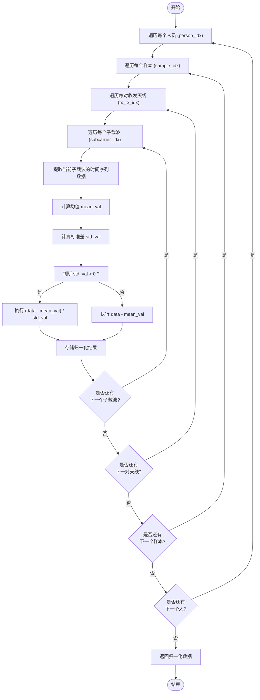
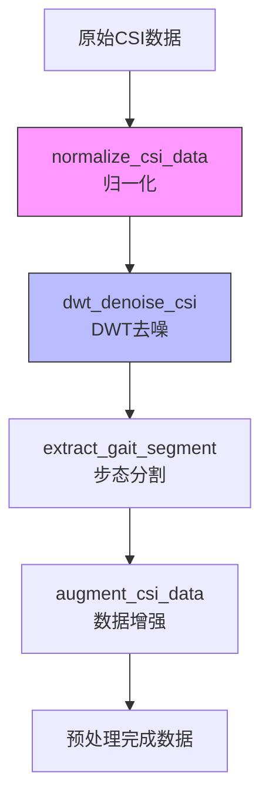

# 数据归一化

<cite>
**Referenced Files in This Document**   
- [preprocess.py](file://pre_process/preprocess.py#L5-L30)
- [preprocess.py](file://pre_process/preprocess.py#L32-L67)
- [preprocess.py](file://pre_process/preprocess.py#L200-L230)
</cite>

## 目录
1. [函数实现机制](#函数实现机制)
2. [输入张量遍历逻辑](#输入张量遍历逻辑)
3. [边界处理策略](#边界处理策略)
4. [归一化作用与优势](#归一化作用与优势)
5. [调用示例与数据分布](#调用示例与数据分布)
6. [预处理流水线中的地位](#预处理流水线中的地位)

## 函数实现机制

`normalize_csi_data` 函数实现了对CSI（信道状态信息）幅度数据的零均值单位方差归一化。该函数接收一个五维张量作为输入，其形状为 `(num_persons, num_samples, num_tx_rx, num_time, num_subcarriers)`，分别对应人员数量、样本数量、收发天线对数量、时间步长和子载波数量。函数首先创建一个与输入张量形状相同的零张量用于存储归一化后的结果。随后，通过四层嵌套循环遍历每个人员、每个样本、每对收发天线以及每个子载波，对每个子载波上的时间序列数据独立进行归一化处理。

**Section sources**
- [preprocess.py](file://pre_process/preprocess.py#L5-L30)

## 输入张量遍历逻辑

函数采用逐层嵌套的循环结构来遍历输入张量的各个维度。最外层循环遍历 `person_idx`，对应不同人员的数据；第二层循环遍历 `sample_idx`，对应同一人员的不同样本；第三层循环遍历 `tx_rx_idx`，对应不同的收发天线对；最内层循环遍历 `subcarrier_idx`，对应不同的子载波。对于每个子载波，函数提取出其在时间维度上的数据序列 `data`，该序列的形状为 `(num_time,)`。然后计算该序列的均值 `mean_val` 和标准差 `std_val`，并基于这两个统计量执行归一化操作。这种遍历方式确保了归一化是在每个子载波的独立时间序列上进行的，从而保留了不同子载波间的信号特性差异。

**Diagram sources**
- [preprocess.py](file://pre_process/preprocess.py#L5-L30)

**Section sources**
- [preprocess.py](file://pre_process/preprocess.py#L5-L30)

## 边界处理策略

在归一化过程中，函数包含了一个关键的边界情况处理逻辑。当某个子载波上的时间序列数据标准差 `std_val` 为零时，意味着该序列的所有值都相同（即为常数序列）。如果直接进行除法运算 `(data - mean_val) / std_val`，会导致除以零的错误。为避免此问题，函数通过条件判断 `if std_val > 0` 来检查标准差。当标准差大于零时，执行标准的零均值单位方差归一化；当标准差等于零时，函数仅执行中心化操作，即 `data - mean_val`，这会将整个常数序列变为零。这种处理策略既保证了数值计算的稳定性，又确保了所有数据都能被正确处理，不会因为个别异常子载波而导致整个预处理流程失败。

**Section sources**
- [preprocess.py](file://pre_process/preprocess.py#L5-L30)

## 归一化作用与优势

`normalize_csi_data` 函数的核心作用是消除不同设备或不同采集环境下CSI信号的绝对强度差异。由于不同Wi-Fi设备的发射功率、接收灵敏度以及环境噪声水平存在差异，原始CSI幅度数据的绝对值范围可能大不相同。这种差异会干扰后续的机器学习模型训练，导致模型过度关注信号强度而非其内在的模式特征。通过零均值单位方差归一化，所有子载波的时间序列数据都被转换到一个统一的尺度上（均值为0，标准差为1），这极大地提升了模型训练的稳定性和收敛速度。归一化后的数据使得模型能够更专注于学习信号的动态变化模式（如多径效应、多普勒频移等），而不是被不同设备的固有增益差异所干扰，从而提高了模型的泛化能力和识别精度。

**Section sources**
- [preprocess.py](file://pre_process/preprocess.py#L5-L30)

## 调用示例与数据分布

该函数通常作为预处理流水线的第一步被调用。一个典型的调用示例如下：`normalized_csi = normalize_csi_data(raw_csi_amplitude)`，其中 `raw_csi_amplitude` 是从设备采集的原始五维CSI幅度张量。调用前，数据分布可能因设备而异，例如设备A的信号幅度集中在[100, 500]区间，而设备B的信号幅度集中在[200, 800]区间。调用后，所有数据都被映射到以0为中心、标准差为1的分布上。对于非零方差的序列，其分布变为标准正态分布；对于零方差的常数序列，其分布变为单点分布（所有值为0）。这种转换使得来自不同设备的数据在统计特性上趋于一致，为后续的特征提取和模型训练奠定了坚实的基础。

**Section sources**
- [preprocess.py](file://pre_process/preprocess.py#L5-L30)

## 预处理流水线中的地位

`normalize_csi_data` 函数在完整的CSI数据预处理流水线中占据着至关重要的前置地位。根据 `preprocess_csi_data` 函数的定义，归一化是整个流程的第一步，后续的DWT（离散小波变换）去噪、步态分割和数据增强等操作都依赖于归一化后的数据。这一顺序设计具有深刻的合理性：首先进行归一化可以确保去噪算法在统一的尺度上工作。DWT去噪的阈值通常是基于信号的标准差来设定的（如 `dwt_denoise_csi` 函数中使用的 `threshold = np.std(coeffs[-level]) * np.sqrt(2 * np.log(len(data)))`）。如果在去噪前不进行归一化，不同设备或不同子载波的信号强度差异会导致去噪阈值不一致，从而影响去噪效果的稳定性和公平性。因此，先归一化再进行DWT去噪，能够保证去噪过程对所有数据都采用相对一致的策略，从而更有效地去除噪声，保留真实的信号特征。

**Diagram sources**
- [preprocess.py](file://pre_process/preprocess.py#L5-L30)
- [preprocess.py](file://pre_process/preprocess.py#L32-L67)
- [preprocess.py](file://pre_process/preprocess.py#L200-L230)

**Section sources**
- [preprocess.py](file://pre_process/preprocess.py#L5-L30)
- [preprocess.py](file://pre_process/preprocess.py#L32-L67)
- [preprocess.py](file://pre_process/preprocess.py#L200-L230)