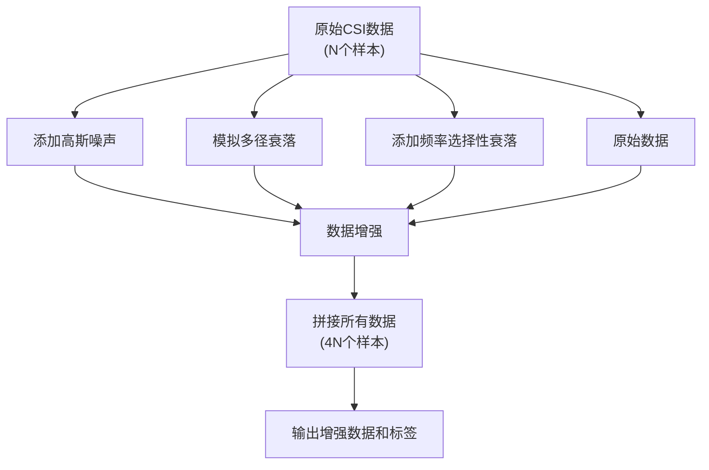
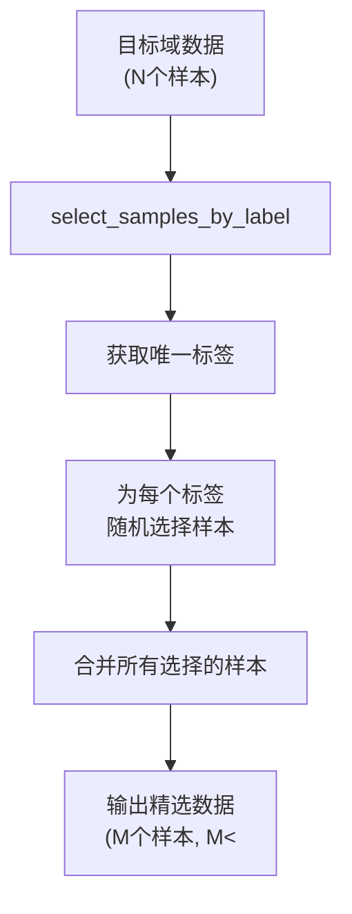

# 数据预处理

<cite>
**Referenced Files in This Document**   
- [preprocess.py](file://pre_process/preprocess.py)
- [dataloder_ATT.py](file://pre_process/dataloder_ATT.py)
- [dataloder_GAN.py](file://pre_process/dataloder_GAN.py)
- [data.py](file://pre_process/data.py)
</cite>

## 目录
1. [引言](#引言)
2. [核心预处理流程](#核心预处理流程)
3. [数据增强策略](#数据增强策略)
4. [数据加载机制](#数据加载机制)
5. [完整预处理流程与调用示例](#完整预处理流程与调用示例)

## 引言

本文档深入讲解CSI（信道状态信息）数据预处理的完整流程，涵盖归一化、离散小波变换（DWT）去噪、步态片段提取和数据增强四大核心步骤。预处理的目标是将原始CSI数据转换为适合深度学习模型训练的高质量输入，同时通过数据增强提升模型的鲁棒性。文档将详细解释每个步骤的实现原理、参数配置以及不同模型的数据加载方式。

## 核心预处理流程

### 归一化处理

归一化是预处理的第一步，旨在消除不同子载波和收发天线对之间的幅度差异，使数据分布更加一致。`normalize_csi_data`函数对每个样本的每个子载波数据进行独立的Z-score归一化。

该函数遍历输入张量的每一个维度（人员、样本、收发对、子载波），计算每个时间序列的均值和标准差，并应用归一化公式`(data - mean) / std`。如果标准差为零（即数据为常数），则只减去均值。这确保了数据的零均值和单位方差，有利于后续模型的稳定训练。

**Section sources**
- [preprocess.py](file://pre_process/preprocess.py#L5-L30)

### 离散小波变换（DWT）去噪

DWT去噪用于去除CSI数据中的高频噪声，保留反映人体步态的低频有效信号。`dwt_denoise_csi`函数采用Daubechies小波（'db4'）进行4层分解。

去噪过程包括：首先对每个子载波的时间序列进行小波分解，得到不同尺度的系数；然后计算软阈值，对细节系数进行阈值处理以抑制噪声；最后使用去噪后的系数重构信号。为了保证重构信号长度与原始信号一致，函数会进行截断或零填充。

**Section sources**
- [preprocess.py](file://pre_process/preprocess.py#L32-L67)

### 步态片段提取

由于采集的步态数据长度不一，`extract_gait_segment`函数负责将所有样本的时间维度统一为6000个采样点。该函数通过检查当前时间维度长度与目标长度（6000）的关系来决定操作：

- **长度相等**：直接返回原始数据。
- **长度过长**：从中间截取6000个连续采样点，保留步态的核心部分。
- **长度不足**：在序列前后进行对称填充，使用边缘值（`replicate`模式）填充以保持信号的连续性。

统一时间维度是确保批量训练（batch training）可行性的关键，使所有样本具有相同的输入形状。

**Section sources**
- [preprocess.py](file://pre_process/preprocess.py#L69-L95)

## 数据增强策略

数据增强是提升模型泛化能力的关键步骤，`augment_csi_data`函数通过四种方式生成更多样化的训练样本。

### 增强方法

1.  **原始数据**：保留原始样本作为基础。
2.  **添加高斯噪声**：`add_gaussian_noise`函数向数据添加均值为0、标准差为0.02的高斯白噪声，模拟环境中的随机干扰。
3.  **模拟多径衰落**：`simulate_multipath_fading`函数通过卷积一个指数衰减的信道响应来模拟信号在复杂环境中的多径传播效应。
4.  **频率选择性衰落**：`add_frequency_selective_fading`函数将子载波划分为若干相干带宽块，对每个块应用不同的随机衰落因子，模拟频率选择性信道。

### 增强实现

四种数据（原始、高斯噪声、多径衰落、频率选择性衰落）在样本维度（dim=1）上进行拼接，使样本数量扩充为原来的四倍。同时，标签也相应地复制四份，以匹配增强后的数据量。这种策略显著增加了训练数据的多样性，迫使模型学习更鲁棒的特征。



**Diagram sources**
- [preprocess.py](file://pre_process/preprocess.py#L163-L198)

**Section sources**
- [preprocess.py](file://pre_process/preprocess.py#L163-L198)

## 数据加载机制

预处理后的数据通过不同的数据加载器（dataloader）提供给Attention和GAN模型。

### Attention模型数据加载

`dataloder_ATT.py`中的`CustomDataset`类是一个标准的PyTorch数据集，它接收预处理后的数据和标签张量。数据加载器直接加载所有源域和目标域的数据，适用于需要大量数据的监督学习任务。

**Section sources**
- [dataloder_ATT.py](file://pre_process/dataloder_ATT.py#L4-L13)

### GAN模型数据加载

`dataloder_GAN.py`的数据加载策略更为精细。`select_samples_by_label`函数从目标域数据中为每个类别（标签）随机选择最多10个样本。这种策略常用于域自适应（Domain Adaptation）场景，其中目标域的标签可能有限或不完整，通过选择少量代表性样本来进行模型训练或微调。



**Diagram sources**
- [dataloder_GAN.py](file://pre_process/dataloder_GAN.py#L16-L62)

**Section sources**
- [dataloder_GAN.py](file://pre_process/dataloder_GAN.py#L16-L62)

## 完整预处理流程与调用示例

`preprocess_csi_data`函数将上述所有步骤串联成一个完整的流水线。其执行顺序为：归一化 → DWT去噪 → 步态分割 → 数据增强。

### 调用示例

```python
# 假设已加载原始CSI幅度数据
raw_csi_data = load_raw_data()  # 形状: (num_persons, num_samples, num_tx_rx, num_time, num_subcarriers)

# 执行完整预处理
processed_data, processed_labels = preprocess_csi_data(raw_csi_data)

# 输出形状
print(f"增强后数据形状: {processed_data.shape}")  # 例如: (num_persons, num_samples*4, num_tx_rx, 6000, num_subcarriers)
print(f"增强后标签形状: {processed_labels.shape}") # 例如: (num_persons, num_samples*4)
```

该函数在执行过程中会打印每一步的进度和数据形状，便于监控预处理流程。最终输出的数据和标签可直接用于后续的`CustomDataset`和`DataLoader`进行模型训练。

**Section sources**
- [preprocess.py](file://pre_process/preprocess.py#L200-L230)