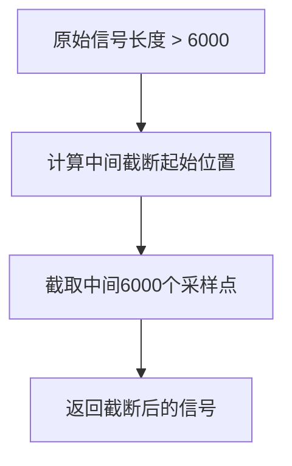
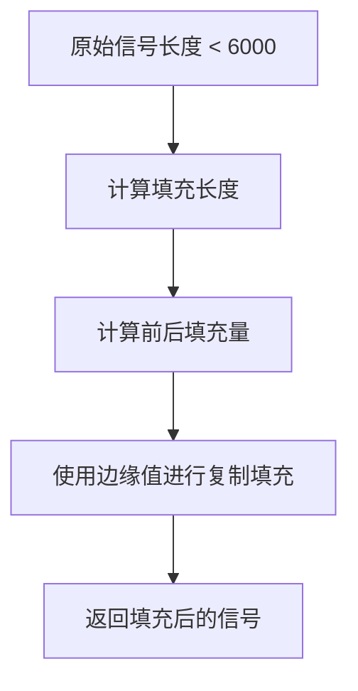
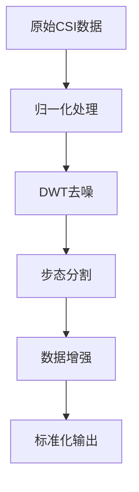
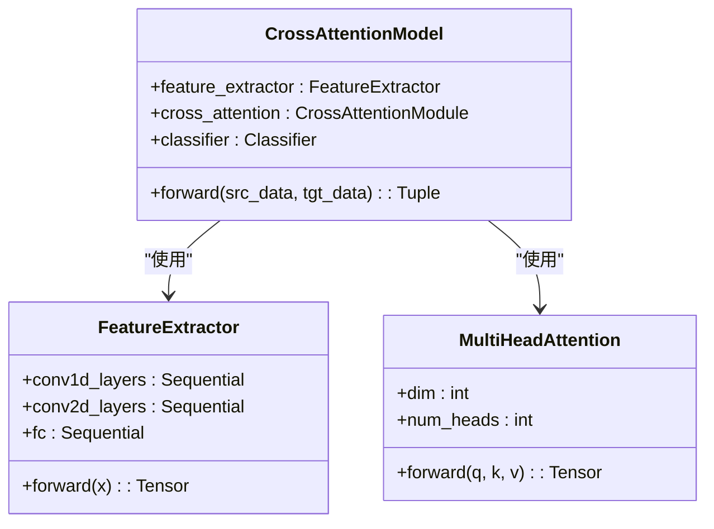
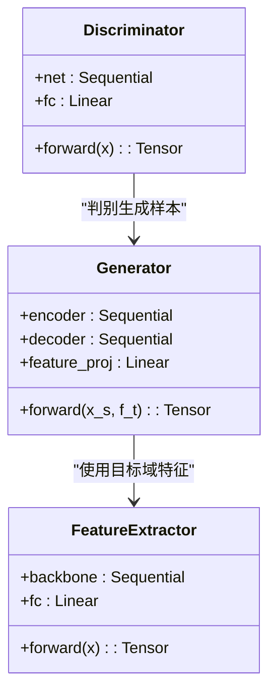

# 步态片段提取

<cite>
**本文档引用的文件**   
- [preprocess.py](file://pre_process/preprocess.py)
- [dataloder_ATT.py](file://pre_process/dataloder_ATT.py)
- [dataloder_GAN.py](file://pre_process/dataloder_GAN.py)
- [attention.py](file://Attention/attention.py)
- [model.py](file://GAN/model.py)
</cite>

## 目录
1. [引言](#引言)
2. [核心功能分析](#核心功能分析)
3. [步态片段提取策略](#步态片段提取策略)
4. [数据标准化处理流程](#数据标准化处理流程)
5. [模型输入一致性分析](#模型输入一致性分析)
6. [目标长度选择依据](#目标长度选择依据)
7. [结论](#结论)

## 引言

在无线感知系统中，信道状态信息（CSI）被广泛用于人体步态识别。由于采集设备、环境因素和个体差异，原始CSI时序数据的长度往往不一致。为确保深度学习模型能够有效处理这些数据，必须将不同长度的CSI时序信号统一至固定长度。本文档全面阐述`extract_gait_segment`函数如何实现这一标准化处理，分析其对批处理训练的重要性，并探讨固定时间维度对注意力机制和生成对抗网络（GAN）模型输入一致性的关键意义。

## 核心功能分析

`extract_gait_segment`函数是CSI数据预处理流程中的核心组件，负责将变长的时序数据转换为固定长度的标准化输入。该函数作为完整预处理流程的一部分，与归一化、去噪和数据增强等步骤协同工作，为后续的深度学习模型提供高质量的输入数据。

**Section sources**
- [preprocess.py](file://pre_process/preprocess.py#L69-L95)
- [preprocess.py](file://pre_process/preprocess.py#L200-L230)

## 步态片段提取策略

### 中间截断策略

当原始CSI信号的长度大于目标长度6000个采样点时，`extract_gait_segment`函数采用中间截断策略。该策略通过计算起始索引`start_idx = (current_time - target_length) // 2`，从信号的中间部分截取指定长度的片段。

**Diagram sources**
- [preprocess.py](file://pre_process/preprocess.py#L78-L82)

这种策略的合理性在于：
1. **保留核心步态信息**：步态周期的中间部分通常包含最稳定和最具代表性的运动特征。
2. **避免边缘噪声**：信号的起始和结束部分可能包含设备启动/关闭的瞬态噪声或不完整的步态周期。
3. **对称性保证**：从中间截取确保了前后边缘的对称性，减少了信息偏移。

### 边缘复制填充策略

当原始信号长度不足6000个采样点时，函数采用边缘复制（replicate）模式进行填充。该策略将信号的首尾边缘值复制并扩展至目标长度。

**Diagram sources**
- [preprocess.py](file://pre_process/preprocess.py#L84-L93)

边缘复制填充的优势包括：
1. **保持信号连续性**：与零填充相比，边缘复制避免了在信号边界引入突变，保持了时序信号的平滑性。
2. **保留边缘特征**：步态信号的起始和结束部分可能包含重要的运动起止信息，复制这些值有助于保留这些特征。
3. **计算效率高**：相比于插值等复杂填充方法，边缘复制具有较低的计算开销。

**Section sources**
- [preprocess.py](file://pre_process/preprocess.py#L69-L95)

## 数据标准化处理流程

`extract_gait_segment`函数是完整CSI数据预处理流程的关键环节。该流程首先对原始数据进行归一化和小波去噪，然后执行步态分割，最后进行数据增强。

**Diagram sources**
- [preprocess.py](file://pre_process/preprocess.py#L200-L230)

该标准化处理对批处理训练具有必要性：
1. **批量处理兼容性**：深度学习框架要求同一批次内的所有样本具有相同的形状，固定长度确保了批处理的可行性。
2. **内存分配优化**：固定维度允许预分配内存，提高了训练过程的内存使用效率。
3. **梯度计算一致性**：统一的输入尺寸保证了前向和反向传播过程中梯度计算的一致性。

**Section sources**
- [preprocess.py](file://pre_process/preprocess.py#L200-L230)

## 模型输入一致性分析

### 注意力机制模型

注意力机制模型（位于`Attention/attention.py`）的特征提取器专门设计为处理形状为`[batch, 56, 3, 6000]`的输入数据。固定的时间维度6000对模型的正常运行至关重要。

**Diagram sources**
- [attention.py](file://Attention/attention.py#L4-L225)

### GAN模型

生成对抗网络（位于`GAN/model.py`）同样依赖于固定长度的输入。生成器和判别器的卷积层设计基于6000个时间采样点的假设。

**Diagram sources**
- [model.py](file://GAN/model.py#L0-L174)

固定时间维度对两种模型输入一致性的意义：
1. **架构兼容性**：模型的卷积核大小、步长和池化层设计都基于固定的时间维度。
2. **特征提取稳定性**：固定的输入长度确保了特征提取过程的可重复性和稳定性。
3. **跨域一致性**：在域适应任务中，源域和目标域数据必须具有相同的形状才能进行有效的特征对齐。

**Section sources**
- [attention.py](file://Attention/attention.py#L4-L225)
- [model.py](file://GAN/model.py#L0-L174)

## 目标长度选择依据

目标长度6000的选择基于对步态周期的充分性分析：

1. **步态周期覆盖**：6000个采样点足以覆盖多个完整的步态周期，确保了运动模式的完整性。
2. **采样率考虑**：假设典型的CSI采样率为100Hz，6000个采样点对应60秒的时序数据，远超单个步态周期的持续时间。
3. **信息密度平衡**：该长度在保留足够运动信息和避免冗余数据之间取得了良好平衡。
4. **计算可行性**：6000是一个计算友好的数值，便于卷积和池化操作的整除计算。

通过分析`dataloder_ATT.py`和`dataloder_GAN.py`中的数据加载器实现，可以确认所有下游模型都期望接收形状为`(..., 6000)`的输入数据，这进一步验证了6000作为标准长度的必要性。

**Section sources**
- [dataloder_ATT.py](file://pre_process/dataloder_ATT.py#L16-L36)
- [dataloder_GAN.py](file://pre_process/dataloder_GAN.py#L65-L94)

## 结论

`extract_gait_segment`函数通过中间截断和边缘复制填充策略，有效地将变长的CSI时序数据标准化为固定长度6000个采样点。这种标准化处理不仅解决了批处理训练的兼容性问题，而且为注意力机制和GAN模型提供了必要的输入一致性保障。目标长度6000的选择充分考虑了步态周期的覆盖需求、计算效率和模型架构要求，是整个无线感知系统中一个关键且合理的设计决策。