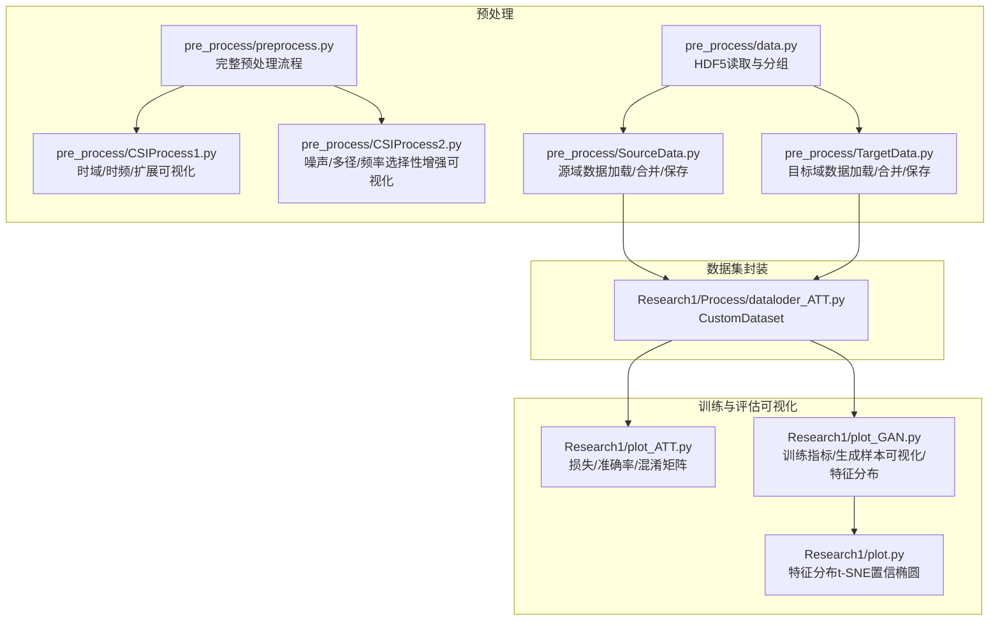
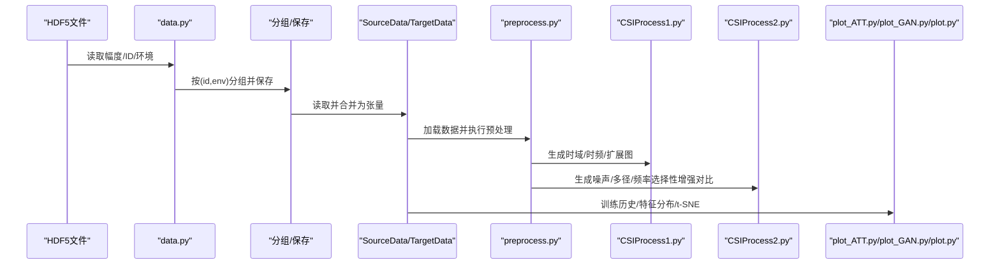
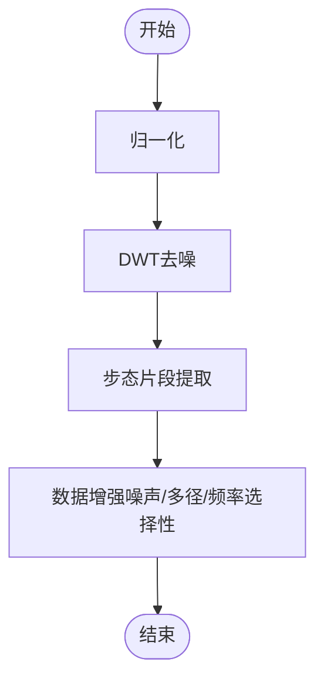
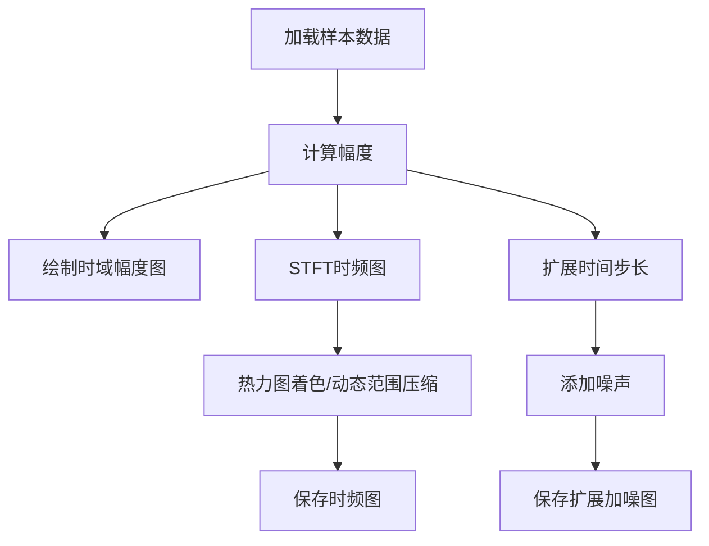
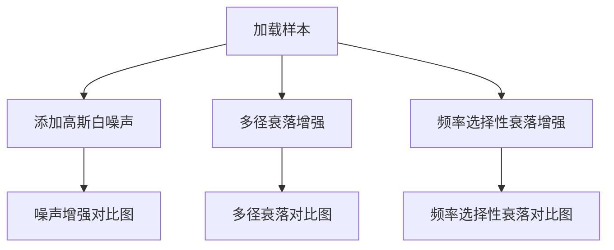
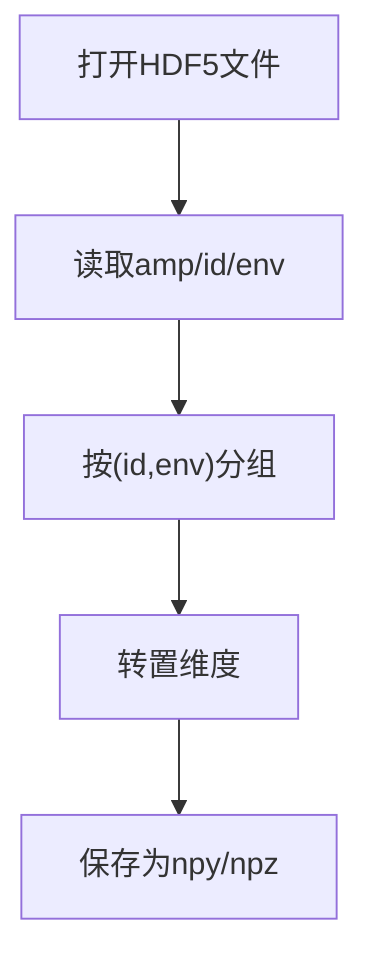
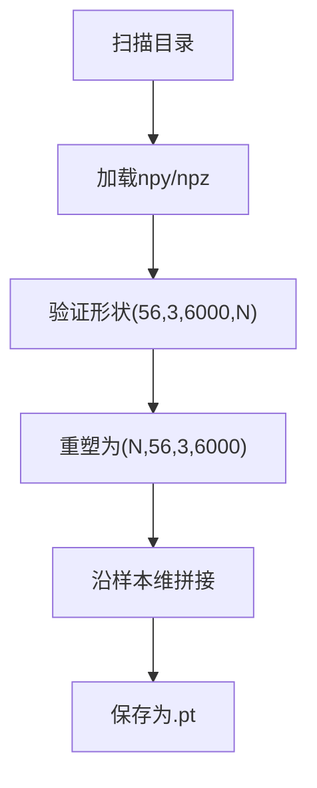
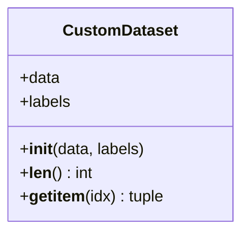
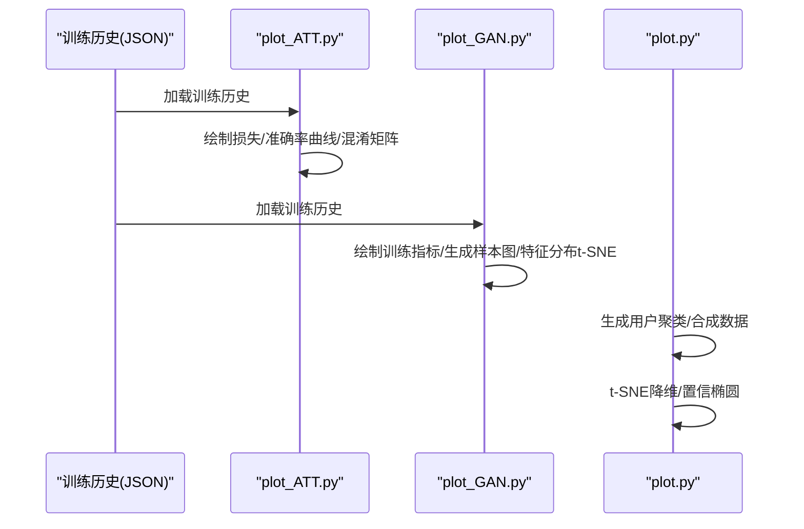
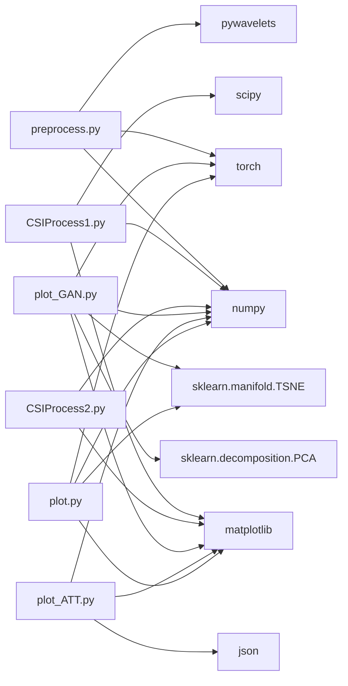

# 预处理可视化

<cite>
**本文引用的文件**
- [preprocess.py](file://pre_process/preprocess.py)
- [CSIProcess1.py](file://pre_process/CSIProcess1.py)
- [CSIProcess2.py](file://pre_process/CSIProcess2.py)
- [data.py](file://pre_process/data.py)
- [SourceData.py](file://pre_process/SourceData.py)
- [TargetData.py](file://pre_process/TargetData.py)
- [dataloder_ATT.py](file://Research1/Process/dataloder_ATT.py)
- [plot_ATT.py](file://Research1/plot_ATT.py)
- [plot_GAN.py](file://Research1/plot_GAN.py)
- [plot.py](file://Research1/plot.py)
</cite>

## 目录
1. [简介](#简介)
2. [项目结构](#项目结构)
3. [核心组件](#核心组件)
4. [架构总览](#架构总览)
5. [详细组件分析](#详细组件分析)
6. [依赖关系分析](#依赖关系分析)
7. [性能考量](#性能考量)
8. [故障排查指南](#故障排查指南)
9. [结论](#结论)
10. [附录](#附录)

## 简介
本文件围绕“预处理可视化”主题，系统梳理仓库中与CSI数据预处理、数据加载与可视化相关的模块，重点解释以下内容：
- 数据预处理流程（归一化、去噪、步态片段提取、数据增强）
- 可视化工具（时域幅度图、时频图、扩展时域图、噪声增强对比、多径/频率选择性衰落增强对比）
- 数据加载与组织（HDF5读取、按用户ID与环境标签分组、合并保存、PyTorch张量封装）
- 训练过程与评估的可视化（注意力模型与GAN的损失曲线、准确率曲线、混淆矩阵、特征分布t-SNE）

本说明面向具备一定技术背景的读者，同时尽量以循序渐进的方式呈现，便于初学者理解。

## 项目结构
预处理与可视化相关的核心目录与文件如下：
- 预处理模块：pre_process/preprocess.py（完整预处理流程）、CSIProcess1.py/CSIProcess2.py（可视化工具）、data.py（HDF5读取与分组）、SourceData.py/TargetData.py（数据加载与保存）
- 训练与评估可视化：Research1/plot_ATT.py（注意力模型）、Research1/plot_GAN.py（GAN）、Research1/plot.py（特征分布t-SNE）
- 数据集封装：Research1/Process/dataloder_ATT.py（注意力模型数据集）

**图表来源**
- [preprocess.py](file://pre_process/preprocess.py#L1-L232)
- [CSIProcess1.py](file://pre_process/CSIProcess1.py#L1-L464)
- [CSIProcess2.py](file://pre_process/CSIProcess2.py#L1-L733)
- [data.py](file://pre_process/data.py#L1-L103)
- [SourceData.py](file://pre_process/SourceData.py#L1-L113)
- [TargetData.py](file://pre_process/TargetData.py#L1-L96)
- [dataloder_ATT.py](file://Research1/Process/dataloder_ATT.py#L1-L14)
- [plot_ATT.py](file://Research1/plot_ATT.py#L1-L293)
- [plot_GAN.py](file://Research1/plot_GAN.py#L1-L724)
- [plot.py](file://Research1/plot.py#L1-L336)

**章节来源**
- [preprocess.py](file://pre_process/preprocess.py#L1-L232)
- [CSIProcess1.py](file://pre_process/CSIProcess1.py#L1-L464)
- [CSIProcess2.py](file://pre_process/CSIProcess2.py#L1-L733)
- [data.py](file://pre_process/data.py#L1-L103)
- [SourceData.py](file://pre_process/SourceData.py#L1-L113)
- [TargetData.py](file://pre_process/TargetData.py#L1-L96)
- [dataloder_ATT.py](file://Research1/Process/dataloder_ATT.py#L1-L14)
- [plot_ATT.py](file://Research1/plot_ATT.py#L1-L293)
- [plot_GAN.py](file://Research1/plot_GAN.py#L1-L724)
- [plot.py](file://Research1/plot.py#L1-L336)

## 核心组件
- 预处理流水线（归一化、DWT去噪、步态片段提取、数据增强）
- 可视化工具（时域幅度、STFT时频、扩展时域、噪声/多径/频率选择性增强对比）
- 数据加载与组织（HDF5读取、按用户ID与环境标签分组、合并保存、张量封装）
- 训练过程可视化（注意力模型与GAN的损失、准确率、混淆矩阵、特征分布）

**章节来源**
- [preprocess.py](file://pre_process/preprocess.py#L1-L232)
- [CSIProcess1.py](file://pre_process/CSIProcess1.py#L1-L464)
- [CSIProcess2.py](file://pre_process/CSIProcess2.py#L1-L733)
- [data.py](file://pre_process/data.py#L1-L103)
- [SourceData.py](file://pre_process/SourceData.py#L1-L113)
- [TargetData.py](file://pre_process/TargetData.py#L1-L96)
- [plot_ATT.py](file://Research1/plot_ATT.py#L1-L293)
- [plot_GAN.py](file://Research1/plot_GAN.py#L1-L724)
- [plot.py](file://Research1/plot.py#L1-L336)

## 架构总览
预处理与可视化的端到端流程如下：
- 数据来源：HDF5文件（包含幅度、ID、环境标签）
- 数据加载与分组：按(id, env)分组，保存为npy/npz
- 数据加载与合并：读取多个文件夹，合并为PyTorch张量，保存为.pt
- 预处理：归一化、DWT去噪、步态片段提取、数据增强
- 可视化：时域/时频/扩展时域图；噪声/多径/频率选择性增强对比；t-SNE特征分布；训练指标曲线

**图表来源**
- [data.py](file://pre_process/data.py#L1-L103)
- [SourceData.py](file://pre_process/SourceData.py#L1-L113)
- [TargetData.py](file://pre_process/TargetData.py#L1-L96)
- [preprocess.py](file://pre_process/preprocess.py#L1-L232)
- [CSIProcess1.py](file://pre_process/CSIProcess1.py#L1-L464)
- [CSIProcess2.py](file://pre_process/CSIProcess2.py#L1-L733)
- [plot_ATT.py](file://Research1/plot_ATT.py#L1-L293)
- [plot_GAN.py](file://Research1/plot_GAN.py#L1-L724)
- [plot.py](file://Research1/plot.py#L1-L336)

## 详细组件分析

### 预处理流水线（preprocess.py）
- 归一化：按样本/子载波维度计算均值与标准差，进行标准化
- DWT去噪：对每个子载波使用小波变换，软阈值去噪并重构
- 步态片段提取：将时间维度裁剪或填充到固定长度
- 数据增强：高斯噪声、多径衰落、频率选择性衰落，拼接增强后的样本并同步扩展标签

**图表来源**
- [preprocess.py](file://pre_process/preprocess.py#L1-L232)

**章节来源**
- [preprocess.py](file://pre_process/preprocess.py#L1-L232)

### 可视化工具（CSIProcess1.py）
- 时域幅度图：按天线维度绘制幅度随时间变化的曲线
- 时频图（STFT）：对每个天线维度的子载波求平均，使用STFT生成时频图，动态范围压缩并着色
- 扩展时域图：将原始6000个时间步扩展到更大区间，前后平滑过渡并添加轻微噪声
- 加噪扩展图：在扩展基础上加入高斯噪声，模拟真实环境

**图表来源**
- [CSIProcess1.py](file://pre_process/CSIProcess1.py#L1-L464)

**章节来源**
- [CSIProcess1.py](file://pre_process/CSIProcess1.py#L1-L464)

### 可视化工具（CSIProcess2.py）
- 高斯白噪声增强：按SNR控制噪声强度，绘制增强前后对比
- 多径衰落增强：基于Rayleigh/Rician混合模型，对每个天线维度施加循环延迟与幅度衰减，保持能量一致性
- 频率选择性衰落增强：在频域构造衰落函数，乘以频域响应后IFFT回时域，保持幅度一致性
- 对比可视化：绘制增强前后时域/时频图对比，展示物理意义

**图表来源**
- [CSIProcess2.py](file://pre_process/CSIProcess2.py#L1-L733)

**章节来源**
- [CSIProcess2.py](file://pre_process/CSIProcess2.py#L1-L733)

### 数据加载与分组（data.py）
- 从HDF5(.mat v7.3)读取幅度、用户ID、环境标签
- 按(id, env)组合对幅度数据进行分组，转置维度并保存为npy/npz

**图表来源**
- [data.py](file://pre_process/data.py#L1-L103)

**章节来源**
- [data.py](file://pre_process/data.py#L1-L103)

### 源域/目标域数据加载与合并（SourceData.py/TargetData.py）
- 读取单个环境目录下所有npy/npz文件，提取用户ID，验证数据形状
- 合并env0与env1（源域）或单一环境（目标域）数据，重塑为(N, 56, 3, 6000)
- 保存为PyTorch张量（.pt），供训练使用

**图表来源**
- [SourceData.py](file://pre_process/SourceData.py#L1-L113)
- [TargetData.py](file://pre_process/TargetData.py#L1-L96)

**章节来源**
- [SourceData.py](file://pre_process/SourceData.py#L1-L113)
- [TargetData.py](file://pre_process/TargetData.py#L1-L96)

### 数据集封装（dataloder_ATT.py）
- 自定义Dataset，提供__len__与__getitem__，便于PyTorch DataLoader使用
- 与源域/目标域数据配合，构建训练/验证/测试数据加载器

**图表来源**
- [dataloder_ATT.py](file://Research1/Process/dataloder_ATT.py#L1-L14)

**章节来源**
- [dataloder_ATT.py](file://Research1/Process/dataloder_ATT.py#L1-L14)

### 训练过程与评估可视化（plot_ATT.py/plot_GAN.py/plot.py）
- 注意力模型：从JSON加载训练历史，绘制总损失、源域/目标域/MMD损失曲线，训练/验证/测试准确率曲线，混淆矩阵
- GAN：绘制判别器/对抗/MMD/频域一致性损失曲线；生成样本时域/频谱图；特征分布t-SNE（Real vs Generated）；综合评估指标（FID/IS/时域MSE/频谱相关性）
- 特征分布t-SNE：支持真实与生成样本合并降维，绘制置信椭圆，标注用户群体

**图表来源**
- [plot_ATT.py](file://Research1/plot_ATT.py#L1-L293)
- [plot_GAN.py](file://Research1/plot_GAN.py#L1-L724)
- [plot.py](file://Research1/plot.py#L1-L336)

**章节来源**
- [plot_ATT.py](file://Research1/plot_ATT.py#L1-L293)
- [plot_GAN.py](file://Research1/plot_GAN.py#L1-L724)
- [plot.py](file://Research1/plot.py#L1-L336)

## 依赖关系分析
- 预处理依赖：torch、numpy、pywavelets（DWT）
- 可视化依赖：matplotlib、scipy.signal（STFT/频谱）、sklearn.decomposition/PCA、sklearn.manifold.TSNE
- 数据加载依赖：h5py（HDF5）、os、re（文件名解析）

**图表来源**
- [preprocess.py](file://pre_process/preprocess.py#L1-L232)
- [CSIProcess1.py](file://pre_process/CSIProcess1.py#L1-L464)
- [CSIProcess2.py](file://pre_process/CSIProcess2.py#L1-L733)
- [plot_GAN.py](file://Research1/plot_GAN.py#L1-L724)
- [plot_ATT.py](file://Research1/plot_ATT.py#L1-L293)
- [plot.py](file://Research1/plot.py#L1-L336)

**章节来源**
- [preprocess.py](file://pre_process/preprocess.py#L1-L232)
- [CSIProcess1.py](file://pre_process/CSIProcess1.py#L1-L464)
- [CSIProcess2.py](file://pre_process/CSIProcess2.py#L1-L733)
- [plot_GAN.py](file://Research1/plot_GAN.py#L1-L724)
- [plot_ATT.py](file://Research1/plot_ATT.py#L1-L293)
- [plot.py](file://Research1/plot.py#L1-L336)

## 性能考量
- 预处理阶段：
  - DWT去噪对每个子载波执行，建议在GPU可用时将张量迁移至CUDA，以加速计算
  - 步态片段提取与填充操作为张量切片与pad，注意内存占用与边界处理
- 可视化阶段：
  - STFT/频谱图使用较大窗口与重叠，建议在保存前进行动态范围压缩与颜色映射优化
  - t-SNE降维时，样本数较多时可考虑降低perplexity或分批降维
- 数据加载：
  - HDF5读取与分组为I/O密集型，建议批量处理与缓存中间结果

[本节为通用指导，无需具体文件来源]

## 故障排查指南
- 数据形状不匹配
  - 现象：断言失败或维度不一致
  - 排查：确认文件名中id字段解析正确，检查数据维度(56,3,6000,N)
  - 参考文件：[SourceData.py](file://pre_process/SourceData.py#L1-L113)、[TargetData.py](file://pre_process/TargetData.py#L1-L96)
- HDF5读取异常
  - 现象：无法打开或读取特定字段
  - 排查：确认文件版本与结构，检查键名（data/amp/id/env）
  - 参考文件：[data.py](file://pre_process/data.py#L1-L103)
- 可视化中文显示问题
  - 现象：中文乱码或负号显示异常
  - 排查：设置中文字体与unicode_minus参数
  - 参考文件：[CSIProcess1.py](file://pre_process/CSIProcess1.py#L1-L120)、[CSIProcess2.py](file://pre_process/CSIProcess2.py#L1-L60)、[plot_GAN.py](file://Research1/plot_GAN.py#L1-L44)
- 训练历史缺失或格式不符
  - 现象：绘图函数无法读取数据
  - 排查：确认JSON文件存在且包含所需键（如train_losses/loss_components_history）
  - 参考文件：[plot_ATT.py](file://Research1/plot_ATT.py#L1-L120)、[plot_GAN.py](file://Research1/plot_GAN.py#L1-L120)

**章节来源**
- [SourceData.py](file://pre_process/SourceData.py#L1-L113)
- [TargetData.py](file://pre_process/TargetData.py#L1-L96)
- [data.py](file://pre_process/data.py#L1-L103)
- [CSIProcess1.py](file://pre_process/CSIProcess1.py#L1-L120)
- [CSIProcess2.py](file://pre_process/CSIProcess2.py#L1-L60)
- [plot_ATT.py](file://Research1/plot_ATT.py#L1-L120)
- [plot_GAN.py](file://Research1/plot_GAN.py#L1-L120)

## 结论
本仓库围绕CSI数据的预处理与可视化形成了完整的流水线：从HDF5读取与分组，到张量封装与预处理，再到丰富的可视化与训练评估图表。预处理模块提供了稳健的归一化、去噪、片段提取与增强策略；可视化模块覆盖时域/时频/扩展时域以及多种物理层增强的对比；训练可视化模块则全面展示了注意力模型与GAN的训练过程与质量评估。这些组件相互配合，既满足研究需求，也为后续模型训练与分析提供了可靠的数据与可视化支撑。

[本节为总结，无需具体文件来源]

## 附录
- 使用建议
  - 预处理：优先在GPU上执行DWT与张量运算，注意内存峰值
  - 可视化：根据数据规模调整STFT参数与颜色映射，确保图像清晰
  - 训练可视化：定期保存训练历史JSON，便于后续绘图与分析
- 相关文件路径
  - 预处理：[preprocess.py](file://pre_process/preprocess.py#L1-L232)
  - 可视化：[CSIProcess1.py](file://pre_process/CSIProcess1.py#L1-L464)、[CSIProcess2.py](file://pre_process/CSIProcess2.py#L1-L733)
  - 数据加载：[data.py](file://pre_process/data.py#L1-L103)、[SourceData.py](file://pre_process/SourceData.py#L1-L113)、[TargetData.py](file://pre_process/TargetData.py#L1-L96)
  - 训练可视化：[plot_ATT.py](file://Research1/plot_ATT.py#L1-L293)、[plot_GAN.py](file://Research1/plot_GAN.py#L1-L724)、[plot.py](file://Research1/plot.py#L1-L336)

[本节为补充信息，无需具体文件来源]