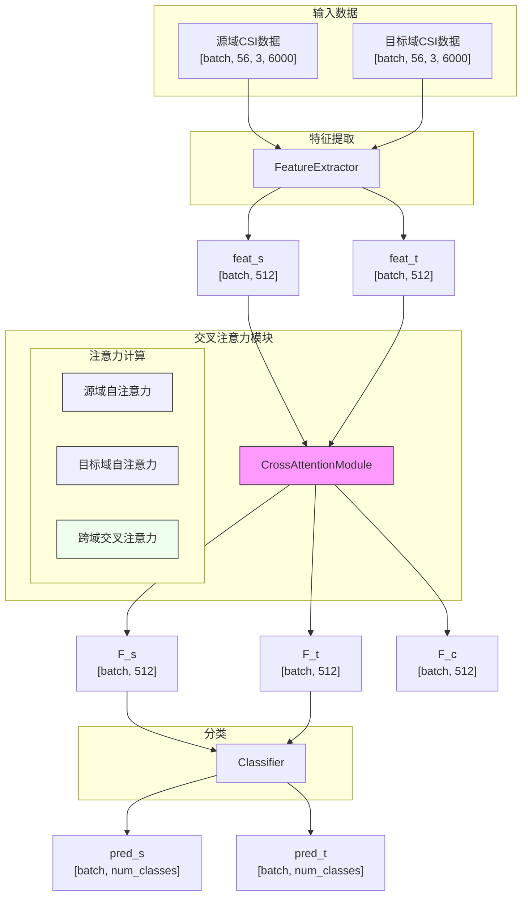
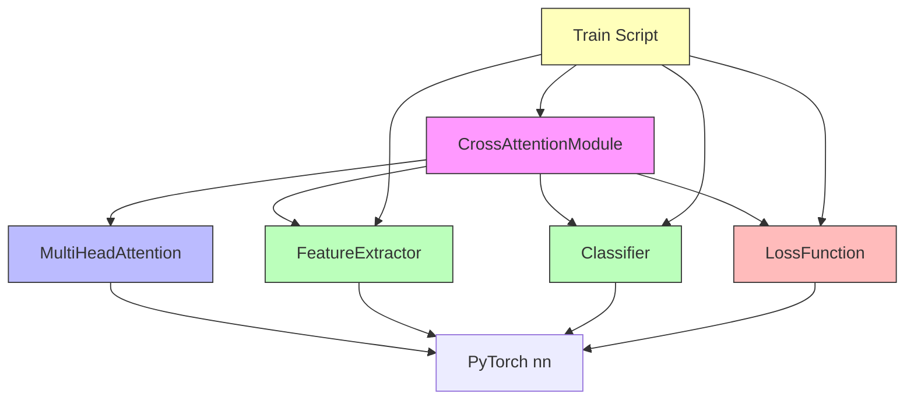

# 交叉注意力模块

<cite>
**Referenced Files in This Document**   
- [attention.py](file://Attention/attention.py)
- [train.py](file://Attention/train.py)
- [loss.py](file://Attention/loss.py)
</cite>

## 目录
1. [引言](#引言)
2. [核心组件](#核心组件)
3. [架构概述](#架构概述)
4. [详细组件分析](#详细组件分析)
5. [依赖分析](#依赖分析)
6. [性能考虑](#性能考虑)
7. [故障排除指南](#故障排除指南)
8. [结论](#结论)

## 引言
交叉注意力模块是实现跨域特征对齐的核心组件，专为CSI（信道状态信息）数据的跨域步态识别任务设计。该模块通过融合源域和目标域的特征信息，有效减少不同域之间的分布差异，从而提升模型在目标域上的识别准确率。其设计结合了自注意力机制与跨域交叉注意力机制，在保持各自域内特征一致性的同时，促进域间特征的对齐与共享。

## 核心组件

`CrossAttentionModule` 类是整个模块的核心实现，负责执行源域自注意力、目标域自注意力以及跨域交叉注意力的计算。它与 `MultiHeadAttention` 类协同工作，完成多头注意力机制的具体运算。此外，`FeatureExtractor` 负责从原始CSI数据中提取高层特征，而 `Classifier` 则基于对齐后的特征进行分类预测。

**Section sources**
- [attention.py](file://Attention/attention.py#L146-L189)
- [attention.py](file://Attention/attention.py#L91-L143)

## 架构概述

该模块作为 `CrossAttentionModel` 的一部分，构成了一个完整的特征提取-对齐-分类流程。整体架构分为三个主要阶段：首先，`FeatureExtractor` 分别处理源域和目标域的原始CSI数据，输出高维特征向量；其次，`CrossAttentionModule` 接收这些特征并执行三种注意力计算；最后，`Classifier` 对处理后的特征进行分类。



**Diagram sources**
- [attention.py](file://Attention/attention.py#L203-L224)
- [attention.py](file://Attention/attention.py#L4-L89)

## 详细组件分析

### CrossAttentionModule 分析

`CrossAttentionModule` 类实现了三种注意力机制，其设计旨在最大化域内特征的表达能力并最小化域间差异。

#### 类结构与初始化
该类在初始化时定义了三组独立的线性投影层：
- **源域自注意力**：`q_s_linear`, `k_s_linear`, `v_s_linear`
- **目标域自注意力**：`q_t_linear`, `k_t_linear`, `v_t_linear`
- **跨域交叉注意力**：`q_c_linear`, `k_c_linear`, `v_c_linear`

这些线性层的参数默认由PyTorch的`nn.Linear`进行Xavier初始化，确保训练初期梯度稳定。所有投影层均将输入特征维度（默认512）映射到相同维度，以适应多头注意力机制的要求。

#### 前向传播流程
前向传播过程严格遵循以下步骤：

1. **源域自注意力计算**：输入特征 `feat_s` 经过 `q_s_linear`, `k_s_linear`, `v_s_linear` 投影后，送入 `MultiHeadAttention` 计算得到域内增强特征 `F_s`。
2. **目标域自注意力计算**：同理，`feat_t` 经过目标域专用投影层处理，输出 `F_t`。
3. **跨域交叉注意力计算**：以源域特征 `F_s` 为查询（Query），目标域特征 `F_t` 为键（Key）和值（Value），通过交叉投影层生成 `Q_c`, `K_c`, `V_c`，最终计算出跨域对齐特征 `F_c`。

这种设计使得 `F_c` 能够捕捉源域特征在目标域上下文中的表示，从而实现知识迁移。

```mermaid
sequenceDiagram
participant CAM as CrossAttentionModule
participant MA as MultiHeadAttention
participant FS as feat_s
participant FT as feat_t
FS->>CAM : feat_s
FT->>CAM : feat_t
CAM->>CAM : q_s = q_s_linear(feat_s)
CAM->>CAM : k_s = k_s_linear(feat_s)
CAM->>CAM : v_s = v_s_linear(feat_s)
CAM->>MA : attention(q_s, k_s, v_s)
MA-->>CAM : F_s
CAM->>CAM : q_t = q_t_linear(feat_t)
CAM->>CAM : k_t = k_t_linear(feat_t)
CAM->>CAM : v_t = v_t_linear(feat_t)
CAM->>MA : attention(q_t, k_t, v_t)
MA-->>CAM : F_t
CAM->>CAM : q_c = q_c_linear(F_s)
CAM->>CAM : k_c = k_c_linear(F_t)
CAM->>CAM : v_c = v_c_linear(F_t)
CAM->>MA : attention(q_c, k_c, v_c)
MA-->>CAM : F_c
CAM-->> : F_s, F_t, F_c
```

**Diagram sources**
- [attention.py](file://Attention/attention.py#L146-L189)

**Section sources**
- [attention.py](file://Attention/attention.py#L146-L189)

### MultiHeadAttention 分析

`MultiHeadAttention` 类是底层注意力计算的核心，支持2D和3D输入张量，并自动处理维度转换。

#### 输入处理
该模块能够处理 `[B, C]` 或 `[B, N, C]` 形状的输入，其中 `B` 为批次大小，`C` 为特征维度，`N` 为序列长度。对于2D输入，会自动添加序列维度。

#### 多头计算
特征维度被平均分割为多个头（默认8头），每个头独立进行注意力计算。缩放因子 `scale = 1/sqrt(head_dim)` 用于防止点积结果过大导致softmax梯度消失。

#### 输出一致性
计算完成后，输出张量的形状与输入保持一致，确保了模块的接口兼容性。

**Section sources**
- [attention.py](file://Attention/attention.py#L91-L143)

## 依赖分析

`CrossAttentionModule` 与其他组件存在紧密的依赖关系，形成了一个完整的跨域学习系统。



**Diagram sources**
- [attention.py](file://Attention/attention.py#L146-L189)
- [train.py](file://Attention/train.py#L1-L290)

**Section sources**
- [attention.py](file://Attention/attention.py#L146-L189)
- [train.py](file://Attention/train.py#L1-L290)

## 性能考虑

该模块在设计上充分考虑了训练稳定性和效率：
- **梯度裁剪**：在训练脚本中使用 `torch.nn.utils.clip_grad_norm_` 防止梯度爆炸。
- **优化器选择**：采用 `AdamW` 优化器，结合权重衰减，有助于泛化。
- **学习率调度**：使用余弦退火调度器 `CosineAnnealingLR`，平滑调整学习率。
- **损失权重动态调整**：随着训练进行，逐步降低领域适应损失的权重，避免过度对齐。

## 故障排除指南

当遇到训练问题时，可参考以下常见错误及解决方案：

**Section sources**
- [train.py](file://Attention/train.py#L1-L290)
- [loss.py](file://Attention/loss.py#L1-L78)

## 结论

`CrossAttentionModule` 通过精心设计的三重注意力机制，有效解决了跨域步态识别中的特征对齐难题。其模块化设计不仅提升了模型的准确性，也为后续的改进和扩展提供了清晰的架构基础。结合