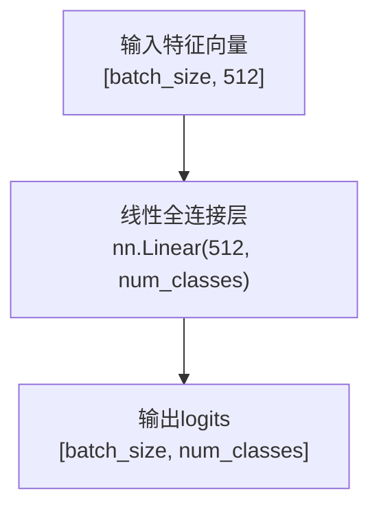
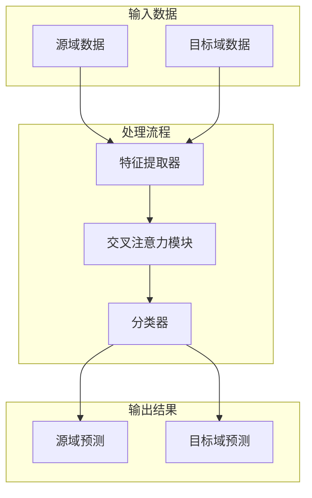

# 分类器

<cite>
**本文档引用的文件**   
- [attention.py](file://Attention/attention.py)
- [train.py](file://Attention/train.py)
- [loss.py](file://Attention/loss.py)
</cite>

## 目录
1. [分类器结构与功能](#分类器结构与功能)
2. [线性全连接层设计理念](#线性全连接层设计理念)
3. [输入与输出维度关系](#输入与输出维度关系)
4. [前向传播过程](#前向传播过程)
5. [模型集成方式](#模型集成方式)
6. [输出logits的优势](#输出logits的优势)
7. [整体模型架构](#整体模型架构)

## 分类器结构与功能

`Classifier`类负责将注意力模块输出的特征向量映射到具体的类别空间。该组件作为模型的最终决策层，接收来自交叉注意力模块处理后的特征表示，并将其转换为对应类别的预测分数。

**Section sources**
- [attention.py](file://Attention/attention.py#L192-L200)

## 线性全连接层设计理念

`Classifier`类仅包含一个线性全连接层（`nn.Linear`），这种简洁的设计理念基于以下考虑：在深度神经网络中，特征提取和注意力机制已经完成了复杂的非线性变换，分类器的主要任务是将高维特征空间线性可分地映射到类别空间。此外，该设计不包含softmax激活函数，因为与PyTorch的`CrossEntropyLoss`损失函数兼容——后者内部已经集成了softmax操作，避免了重复计算并提高了数值稳定性。

**Section sources**
- [attention.py](file://Attention/attention.py#L192-L200)

## 输入与输出维度关系

分类器的输入维度默认为512，这与特征提取器和注意力模块的输出维度保持一致。输出维度等于类别数（`num_classes`），通过参数化设计实现了对不同数量识别目标的适应性。当需要处理不同类别的分类任务时，只需调整`num_classes`参数即可，无需修改网络结构，体现了良好的可扩展性和灵活性。

**Section sources**
- [attention.py](file://Attention/attention.py#L192-L200)

## 前向传播过程

分类器的前向传播过程极为简洁，仅执行一次线性变换操作。输入特征向量经过全连接层后直接输出logits（未归一化的预测分数），维度为`[batch_size, num_classes]`。这一过程避免了额外的非线性激活，保持了输出的原始数值特性，便于后续的损失计算和梯度回传。

**Diagram sources**
- [attention.py](file://Attention/attention.py#L199-L200)

**Section sources**
- [attention.py](file://Attention/attention.py#L199-L200)

## 模型集成方式

分类器作为完整模型的一部分，被集成在`CrossAttentionModel`中。该模型首先通过特征提取器处理原始输入数据，然后利用交叉注意力模块进行特征交互，最后由分类器完成最终的分类预测。这种模块化设计使得各组件职责分明，便于独立优化和调试。

**Diagram sources**
- [attention.py](file://Attention/attention.py#L203-L224)

**Section sources**
- [attention.py](file://Attention/attention.py#L203-L224)

## 输出logits的优势

分类器输出logits而非概率分布具有显著优势。在损失计算方面，`CrossEntropyLoss`直接接受logits作为输入，避免了先计算softmax再取对数的冗余操作，提高了计算效率。在模型优化方面，logits保留了原始的数值信息，有利于梯度的稳定传播，特别是在深层网络中能有效缓解梯度消失问题。同时，这种设计也为其他需要原始分数的应用场景（如模型集成、不确定性估计）提供了便利。

**Section sources**
- [loss.py](file://Attention/loss.py#L4-L77)

## 整体模型架构

整个模型采用端到端的训练方式，各组件协同工作以实现跨域分类任务。特征提取器负责从原始CSI数据中提取有意义的特征，交叉注意力模块促进源域和目标域之间的知识迁移，而分类器则基于融合后的特征做出最终决策。这种架构设计充分考虑了实际应用场景的需求，在保证性能的同时兼顾了计算效率和实现复杂度。

**Diagram sources**
- [attention.py](file://Attention/attention.py#L203-L224)
- [train.py](file://Attention/train.py#L147-L186)