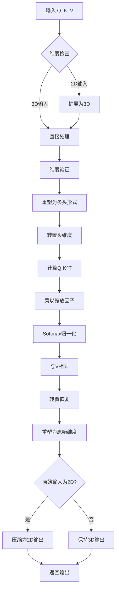
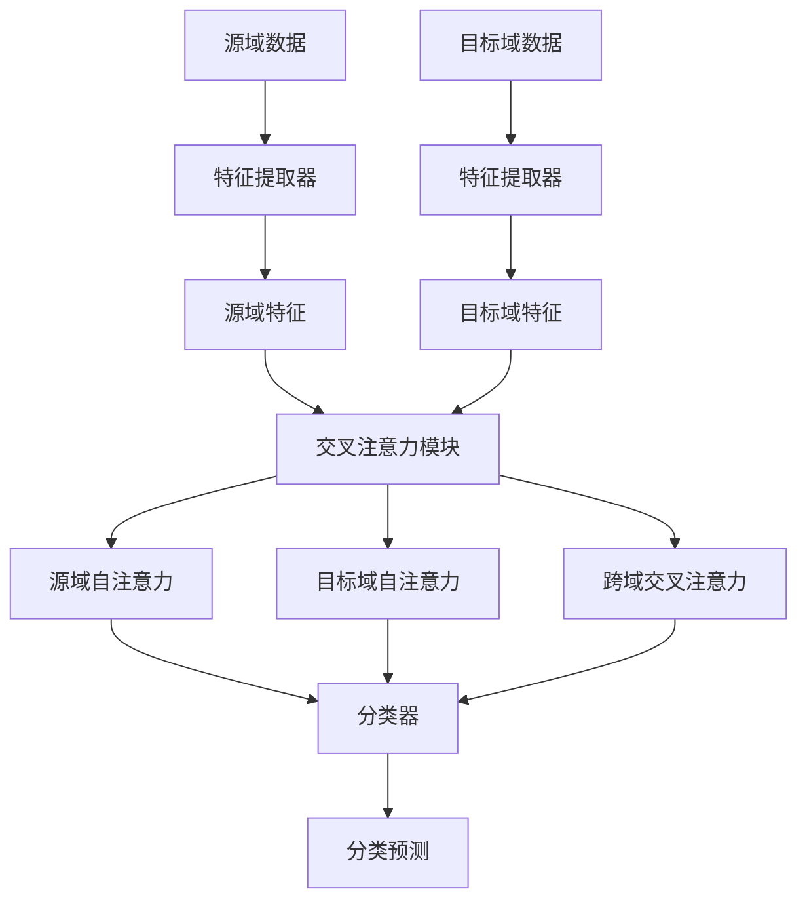

# 多头注意力机制

<cite>
**Referenced Files in This Document**   
- [attention.py](file://Attention/attention.py)
</cite>

## 目录
1. [多头注意力机制实现原理](#多头注意力机制实现原理)
2. [前向传播流程详解](#前向传播流程详解)
3. [输入维度处理逻辑](#输入维度处理逻辑)
4. [注意力权重计算与归一化](#注意力权重计算与归一化)
5. [缩放因子的作用](#缩放因子的作用)
6. [模块集成与应用](#模块集成与应用)

## 多头注意力机制实现原理

`MultiHeadAttention` 类实现了多头注意力机制的核心功能，通过将特征维度分割为多个头来并行计算注意力权重，从而捕捉不同子空间的依赖关系。该类继承自 `nn.Module`，在初始化时接收特征维度 `dim` 和头数 `num_heads` 两个参数。

每个注意力头的维度由 `head_dim = dim // num_heads` 计算得出，确保特征维度能够被头数整除。类中还定义了缩放因子 `scale`，其值为 `(head_dim) ** -0.5`，用于在计算注意力分数时进行缩放，防止点积结果过大导致梯度消失或爆炸问题。

多头注意力机制的核心思想是将输入的查询（Q）、键（K）和值（V）分别投影到多个子空间中，在每个子空间内独立计算注意力，最后将所有头的输出拼接起来。这种设计允许模型在不同表示子空间中关注输入序列的不同位置，增强了模型的表达能力。

**Section sources**
- [attention.py](file://Attention/attention.py#L91-L97)

## 前向传播流程详解

`MultiHeadAttention` 类的前向传播过程实现了完整的多头注意力计算流程。首先对输入的查询、键和值张量进行维度处理，确保它们符合预期的3D张量格式 `[B, N, C]`，其中 `B` 表示批次大小，`N` 表示序列长度，`C` 表示特征维度。

输入张量经过维度验证后，被重塑为多头形式：`q.view(B, N_q, self.num_heads, head_dim).transpose(1, 2)`。这一操作将特征维度分割为 `num_heads` 个头，每个头具有 `head_dim` 维度，并通过转置操作将头维度移动到第二维，便于后续的矩阵运算。

随后进行缩放点积注意力计算：`attn_weights = (q @ k.transpose(-2, -1)) * self.scale`。这里使用矩阵乘法计算查询和键之间的相似度，并乘以缩放因子。计算得到的注意力权重经过 `torch.softmax` 函数进行归一化处理，确保每个位置的注意力权重和为1。

最终，归一化后的注意力权重与值张量相乘，得到加权输出：`out = (attn_weights @ v)`。输出张量经过转置和重塑操作后，恢复为原始的特征维度，并根据输入的原始形状决定是否保持2D输出格式。

**Diagram sources**
- [attention.py](file://Attention/attention.py#L101-L143)

**Section sources**
- [attention.py](file://Attention/attention.py#L101-L143)

## 输入维度处理逻辑

`MultiHeadAttention` 类对输入维度的处理具有良好的灵活性，特别支持对2D输入自动扩展为3D张量的功能。当输入张量为2D格式 `[B, C]` 时，模块会自动调用 `unsqueeze(1)` 方法将其扩展为 `[B, 1, C]` 格式，从而兼容注意力机制的计算要求。

这一设计使得模块能够处理不同形状的输入数据，增强了其通用性和实用性。在处理完注意力计算后，模块还会检查原始输入的形状，如果原始输入是2D的，则将输出也压缩回2D格式，保持输入输出的一致性。

除了维度扩展功能外，模块还包含严格的输入验证机制。它会检查查询、键和值的特征维度是否一致，确保 `q.shape[-1] == k.shape[-1] == v.shape[-1]`。同时验证输入特征维度是否与初始化时指定的 `dim` 参数匹配，并检查特征维度是否能被头数整除，这些验证确保了计算的正确性和稳定性。

**Section sources**
- [attention.py](file://Attention/attention.py#L103-L115)

## 注意力权重计算与归一化

注意力权重的计算是多头注意力机制的核心环节。模块首先通过 `q @ k.transpose(-2, -1)` 计算查询和键之间的点积相似度，得到原始的注意力分数矩阵。这个矩阵的每个元素表示一个查询位置与一个键位置之间的相似度。

为了防止点积结果过大导致梯度问题，计算结果会乘以缩放因子 `scale`。缩放后的注意力分数经过 `torch.softmax(attn_weights, dim=-1)` 函数进行归一化处理。Softmax函数沿最后一个维度（即键的序列维度）进行归一化，将原始分数转换为概率分布，确保每个查询位置对所有键位置的注意力权重和为1。

这种归一化处理在特征对齐中起着关键作用。它使得模型能够以概率的方式分配注意力，重点关注与当前查询最相关的键位置，同时抑制不相关位置的影响。归一化后的注意力权重作为加权系数，与值张量相乘，实现了对输入信息的选择性聚合。

**Section sources**
- [attention.py](file://Attention/attention.py#L130-L133)

## 缩放因子的作用

缩放因子 `scale = (head_dim) ** -0.5` 在多头注意力机制中扮演着至关重要的角色。它的主要作用是防止梯度消失或梯度爆炸问题，特别是在特征维度较大时。

当查询和键的维度 `head_dim` 较大时，点积结果的方差会随着维度的增加而增大。如果没有缩放因子，点积结果可能会变得非常大，导致Softmax函数的输入值过大。在Softmax函数的尾部区域，梯度接近于零，这会导致梯度消失问题，使得模型难以训练。

通过引入缩放因子，可以将点积结果的方差控制在一个合理的范围内，避免Softmax函数进入饱和区域。这不仅有助于稳定训练过程，还能提高模型的收敛速度和最终性能。缩放因子的选择基于理论分析，确保点积结果的期望方差保持稳定，不受特征维度变化的影响。

**Section sources**
- [attention.py](file://Attention/attention.py#L96)

## 模块集成与应用

`MultiHeadAttention` 模块被集成到更高级的 `CrossAttentionModule` 中，用于实现源域和目标域特征之间的相似性计算。在 `CrossAttentionModule` 中，`MultiHeadAttention` 实例被用于三种不同的注意力计算：源域自注意力、目标域自注意力和跨域交叉注意力。

跨域交叉注意力的计算特别展示了该模块的应用价值：以源域特征为查询（Query），目标域特征为键（Key）和值（Value），计算源域特征对目标域特征的注意力。这种设计使得模型能够学习源域和目标域之间的对应关系，在域适应任务中发挥重要作用。

完整的 `CrossAttentionModel` 将特征提取、交叉注意力和分类器模块串联起来，形成了一个端到端的深度学习架构。`MultiHeadAttention` 作为其中的核心组件，为模型提供了强大的特征交互能力，使其能够捕捉复杂的跨域依赖关系。

**Diagram sources**
- [attention.py](file://Attention/attention.py#L146-L189)
- [attention.py](file://Attention/attention.py#L203-L224)