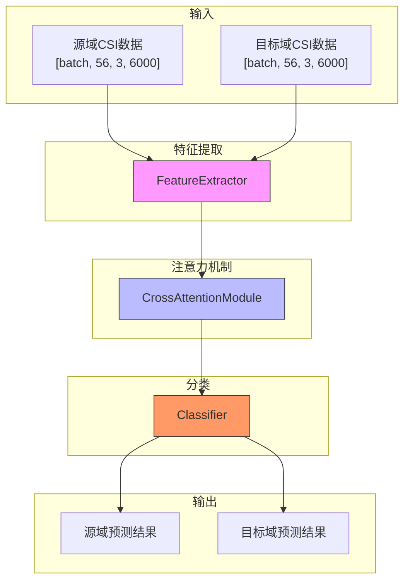
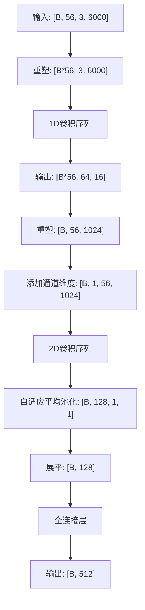
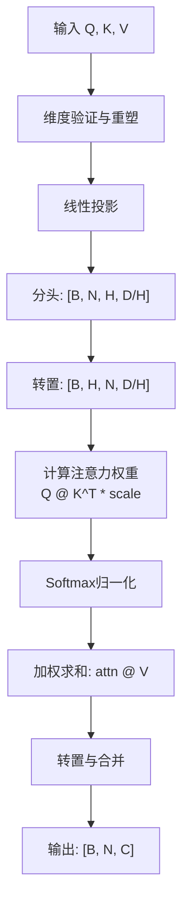
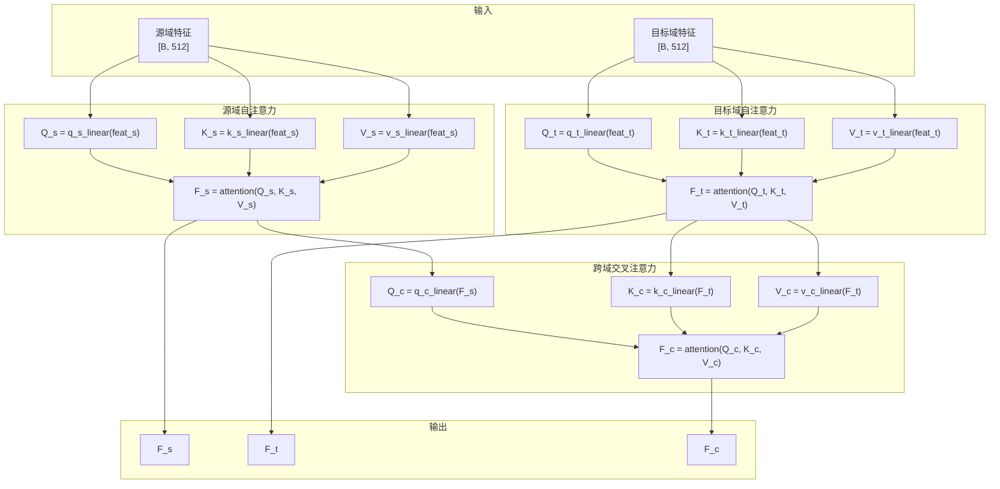
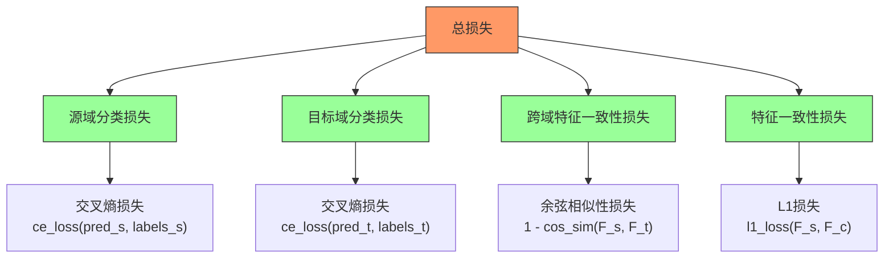
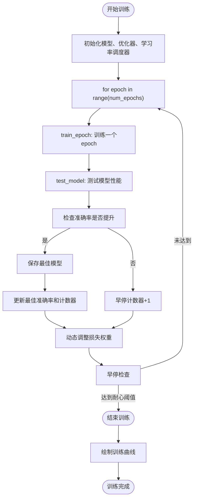
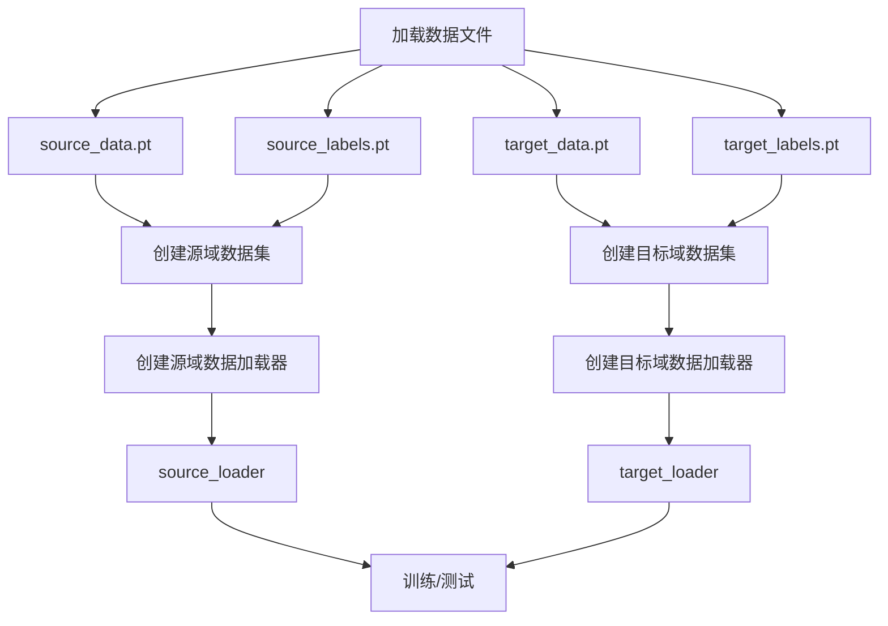

# 注意力机制模型

<cite>
**Referenced Files in This Document**   
- [attention.py](file://Attention/attention.py)
- [loss.py](file://Attention/loss.py)
- [train.py](file://Attention/train.py)
- [dataloder_ATT.py](file://pre_process/dataloder_ATT.py)
</cite>

## 目录
1. [引言](#引言)
2. [模型架构概述](#模型架构概述)
3. [核心组件分析](#核心组件分析)
4. [损失函数详解](#损失函数详解)
5. [训练流程与优化策略](#训练流程与优化策略)
6. [数据加载与预处理](#数据加载与预处理)
7. [模型输入输出示例](#模型输入输出示例)
8. [部署与应用](#部署与应用)

## 引言

本文档全面介绍基于注意力机制的跨域步态识别模型。该模型专为处理信道状态信息（CSI）数据而设计，利用1D和2D卷积提取特征，并通过多头注意力和交叉注意力机制实现源域与目标域之间的特征对齐，从而减少域间差异，提升跨域识别性能。

## 模型架构概述

该模型采用端到端的深度学习架构，主要由特征提取器、交叉注意力模块和分类器三部分组成。模型接收来自源域和目标域的CSI数据，通过特征提取和注意力机制处理，最终输出分类结果。

**Diagram sources**
- [attention.py](file://Attention/attention.py#L203-L224)

**Section sources**
- [attention.py](file://Attention/attention.py#L203-L224)

## 核心组件分析

### 特征提取器（FeatureExtractor）

特征提取器专门设计用于处理四维CSI数据（[batch, subcarriers, antennas, time]）。它采用分阶段的卷积策略，首先使用1D卷积处理时间维度，然后使用2D卷积处理子载波维度。

**Diagram sources**
- [attention.py](file://Attention/attention.py#L4-L89)

**Section sources**
- [attention.py](file://Attention/attention.py#L4-L89)

### 多头注意力机制（MultiHeadAttention）

多头注意力机制是模型的核心计算单元，它将输入特征分解为多个头，允许模型在不同表示子空间中关注不同位置的信息。

**Diagram sources**
- [attention.py](file://Attention/attention.py#L91-L143)

**Section sources**
- [attention.py](file://Attention/attention.py#L91-L143)

### 交叉注意力模块（CrossAttentionModule）

交叉注意力模块是实现跨域特征对齐的关键组件，它包含三个计算路径：源域自注意力、目标域自注意力和跨域交叉注意力。

**Diagram sources**
- [attention.py](file://Attention/attention.py#L146-L189)

**Section sources**
- [attention.py](file://Attention/attention.py#L146-L189)

## 损失函数详解

模型的训练目标由多个损失函数共同构成，旨在同时优化分类性能和域间特征对齐。

**Diagram sources**
- [loss.py](file://Attention/loss.py#L4-L77)

**Section sources**
- [loss.py](file://Attention/loss.py#L4-L77)

## 训练流程与优化策略

### 训练流程

训练过程采用改进的训练函数，包含动态损失权重调整、学习率调度和早停机制。

**Diagram sources**
- [train.py](file://Attention/train.py#L149-L285)

**Section sources**
- [train.py](file://Attention/train.py#L149-L285)

### 优化策略

模型采用多种优化策略以提升训练稳定性和性能：

- **优化器**：使用AdamW优化器，结合权重衰减正则化
- **学习率调度**：采用余弦退火调度器（CosineAnnealingLR）
- **梯度裁剪**：防止梯度爆炸，最大范数为1.0
- **早停机制**：当验证准确率连续15个epoch未提升时停止训练
- **动态损失权重**：训练后期逐渐降低领域适应损失的权重

## 数据加载与预处理

数据加载器负责从预处理的数据文件中加载源域和目标域的CSI数据和标签。

**Diagram sources**
- [dataloder_ATT.py](file://pre_process/dataloder_ATT.py#L1-L36)

**Section sources**
- [dataloder_ATT.py](file://pre_process/dataloder_ATT.py#L1-L36)

## 模型输入输出示例

### 输入数据示例

模型接收两个四维张量作为输入：
- **源域数据**：形状为 `[batch_size, 56, 3, 6000]`
- **目标域数据**：形状为 `[batch_size, 56, 3, 6000]`

其中：
- `batch_size`：批次大小
- `56`：子载波数量
- `3`：天线数量
- `6000`：时间序列长度

### 输出数据示例

模型前向传播返回五个张量：
- `pred_s`：源域分类预测结果，形状 `[batch_size, num_classes]`
- `pred_t`：目标域分类预测结果，形状 `[batch_size, num_classes]`
- `F_s`：源域自注意力特征，形状 `[batch_size, 512]`
- `F_t`：目标域自注意力特征，形状 `[batch_size, 512]`
- `F_c`：跨域交叉注意力特征，形状 `[batch_size, 512]`

## 部署与应用

在实际场景中部署该模型进行身份识别时，应遵循以下步骤：

1. **模型加载**：加载训练好的最佳模型权重
2. **数据预处理**：将实时采集的CSI数据预处理为 `[1, 56, 3, 6000]` 形状
3. **特征提取**：使用特征提取器将CSI数据转换为512维特征向量
4. **注意力处理**：通过交叉注意力模块计算跨域特征
5. **分类预测**：使用分类器输出身份识别结果
6. **结果输出**：返回预测的类别标签和置信度

模型部署时应注意保持与训练阶段相同的数据预处理流程，以确保输入数据的一致性。