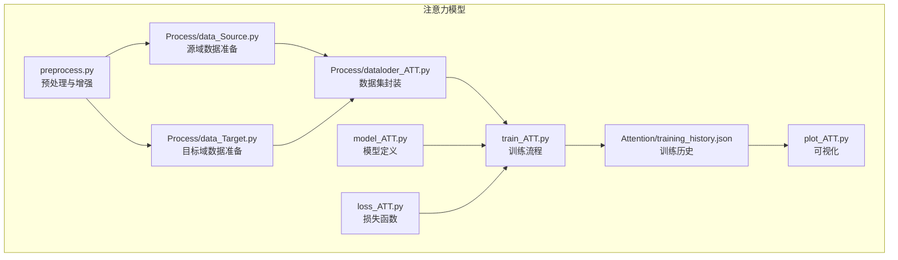
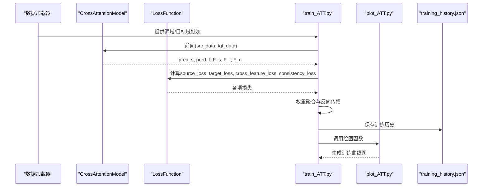
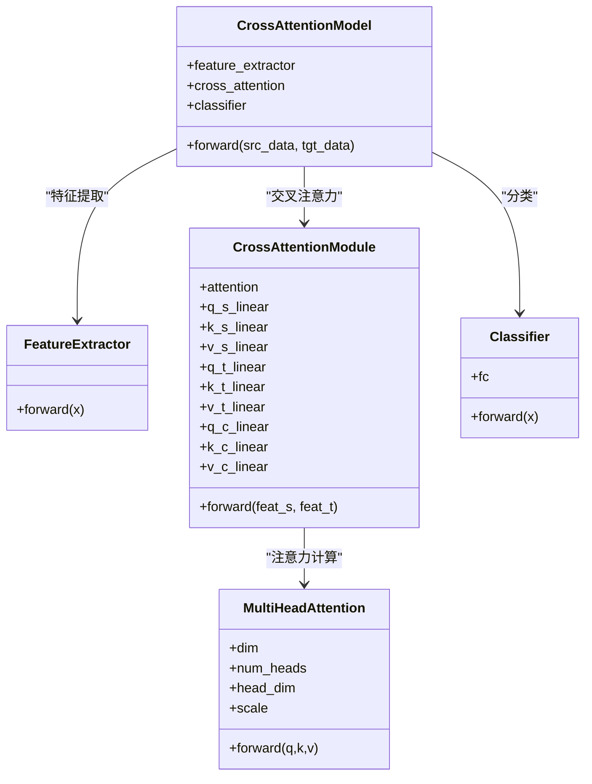
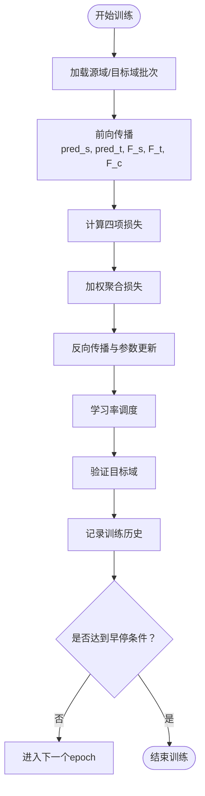
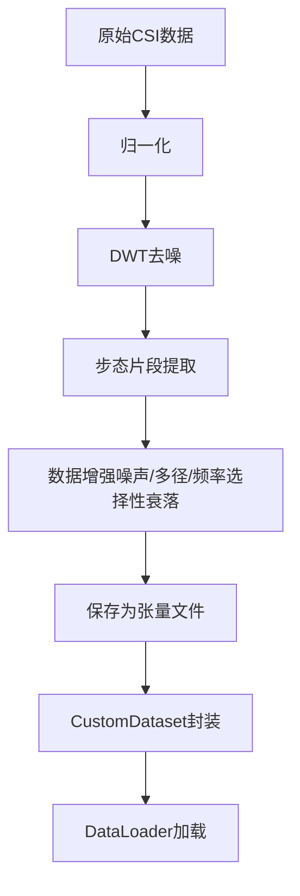
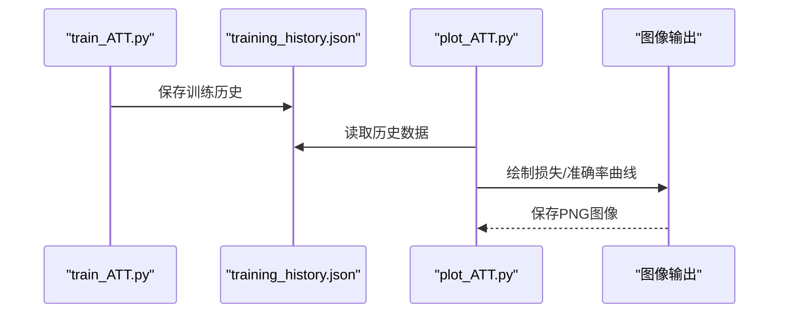
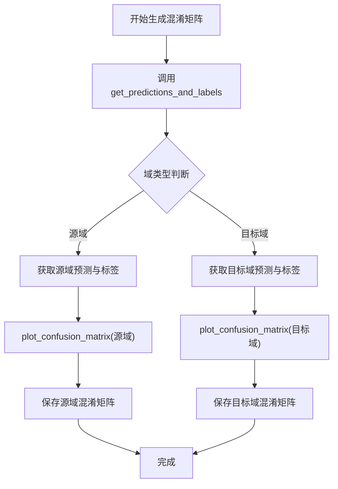
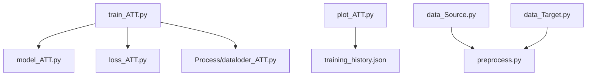

# 注意力模型可视化

<cite>
**本文引用的文件**
- [Research1/model_ATT.py](file://Research1/model_ATT.py)
- [Research1/train_ATT.py](file://Research1/train_ATT.py)
- [Research1/loss_ATT.py](file://Research1/loss_ATT.py)
- [Research1/plot_ATT.py](file://Research1/plot_ATT.py)
- [Research1/Process/dataloder_ATT.py](file://Research1/Process/dataloder_ATT.py)
- [Research1/Process/data_Source.py](file://Research1/Process/data_Source.py)
- [Research1/Process/data_Target.py](file://Research1/Process/data_Target.py)
- [Research1/Attention/training_history.json](file://Research1/Attention/training_history.json)
- [pre_process/preprocess.py](file://pre_process/preprocess.py)
</cite>

## 更新摘要
**变更内容**
- 新增对混淆矩阵生成功能的支持，通过 `get_predictions_and_labels` 函数获取预测和真实标签
- 使用 `plot_confusion_matrix` 函数为源域和目标域分别绘制混淆矩阵
- 增强模型结果的可解释性，补充了混淆矩阵生成流程的说明

## 目录
1. [简介](#简介)
2. [项目结构](#项目结构)
3. [核心组件](#核心组件)
4. [架构总览](#架构总览)
5. [详细组件分析](#详细组件分析)
6. [依赖关系分析](#依赖关系分析)
7. [性能考量](#性能考量)
8. [故障排查指南](#故障排查指南)
9. [结论](#结论)
10. [附录](#附录)

## 简介
本文件围绕“注意力模型可视化”的主题，系统梳理了研究仓库中与交叉注意力模型相关的代码与流程，包括模型结构、训练过程、损失函数、数据加载与预处理、以及训练历史的可视化呈现。文档旨在帮助读者快速理解注意力机制在CSI（信道状态信息）识别任务中的作用，并通过可视化图表与流程说明，直观展示模型如何在源域与目标域之间进行特征对齐与一致性约束，从而实现跨域泛化。本次更新新增了对混淆矩阵生成功能的支持，通过 `get_predictions_and_labels` 函数获取预测和真实标签，并使用 `plot_confusion_matrix` 函数为源域和目标域分别绘制混淆矩阵，进一步增强了结果的可解释性。

## 项目结构
该仓库采用按研究方向分层的组织方式：
- Research1：注意力模型相关实现与训练
- Research2：对比实验与消融研究（与注意力模型同构的其他方法）
- pre_process：CSI数据预处理与增强

注意力模型相关的关键文件分布如下：
- 模型定义：Research1/model_ATT.py
- 训练脚本：Research1/train_ATT.py
- 损失函数：Research1/loss_ATT.py
- 数据加载：Research1/Process/dataloder_ATT.py
- 数据准备（源域/目标域）：Research1/Process/data_Source.py、Research1/Process/data_Target.py
- 可视化：Research1/plot_ATT.py
- 训练历史：Research1/Attention/training_history.json
- 预处理：pre_process/preprocess.py

图表来源
- [Research1/model_ATT.py](file://Research1/model_ATT.py#L1-L227)
- [Research1/train_ATT.py](file://Research1/train_ATT.py#L1-L332)
- [Research1/loss_ATT.py](file://Research1/loss_ATT.py#L1-L79)
- [Research1/plot_ATT.py](file://Research1/plot_ATT.py#L1-L234)
- [Research1/Process/dataloder_ATT.py](file://Research1/Process/dataloder_ATT.py#L1-L14)
- [Research1/Process/data_Source.py](file://Research1/Process/data_Source.py#L1-L113)
- [Research1/Process/data_Target.py](file://Research1/Process/data_Target.py#L1-L97)
- [Research1/Attention/training_history.json](file://Research1/Attention/training_history.json#L1-L142)
- [pre_process/preprocess.py](file://pre_process/preprocess.py#L1-L232)

章节来源
- [Research1/model_ATT.py](file://Research1/model_ATT.py#L1-L227)
- [Research1/train_ATT.py](file://Research1/train_ATT.py#L1-L332)
- [Research1/loss_ATT.py](file://Research1/loss_ATT.py#L1-L79)
- [Research1/plot_ATT.py](file://Research1/plot_ATT.py#L1-L234)
- [Research1/Process/dataloder_ATT.py](file://Research1/Process/dataloder_ATT.py#L1-L14)
- [Research1/Process/data_Source.py](file://Research1/Process/data_Source.py#L1-L113)
- [Research1/Process/data_Target.py](file://Research1/Process/data_Target.py#L1-L97)
- [Research1/Attention/training_history.json](file://Research1/Attention/training_history.json#L1-L142)
- [pre_process/preprocess.py](file://pre_process/preprocess.py#L1-L232)

## 核心组件
- 特征提取器（FeatureExtractor）：针对CSI数据的三维时序特性，先沿时间维做1D卷积，再将子载波维作为空间维进行2D卷积，最后通过全连接层输出固定维度的特征表示。
- 多头注意力（MultiHeadAttention）：支持可变维度输入，自动处理2D/3D张量，实现Q、K、V的多头投影与注意力加权求和。
- 交叉注意力模块（CrossAttentionModule）：分别对源域与目标域进行自注意力，再以源域特征为Query、目标域特征为Key/Value进行跨域交叉注意力，得到对齐后的特征表示。
- 分类器（Classifier）：将对齐后的特征映射到类别空间，用于分类损失计算。
- 完整模型（CrossAttentionModel）：串联特征提取、交叉注意力与分类器，提供前向接口以同时处理源域与目标域输入。

章节来源
- [Research1/model_ATT.py](file://Research1/model_ATT.py#L1-L227)

## 架构总览
下图展示了注意力模型在训练与推理中的端到端流程，包括数据加载、特征提取、注意力对齐、分类与损失计算，以及训练历史的可视化输出。

图表来源
- [Research1/train_ATT.py](file://Research1/train_ATT.py#L1-L332)
- [Research1/model_ATT.py](file://Research1/model_ATT.py#L1-L227)
- [Research1/loss_ATT.py](file://Research1/loss_ATT.py#L1-L79)
- [Research1/plot_ATT.py](file://Research1/plot_ATT.py#L1-L234)
- [Research1/Attention/training_history.json](file://Research1/Attention/training_history.json#L1-L142)

## 详细组件分析

### 模型结构与注意力机制
- 特征提取器：将CSI数据重塑为适合卷积的形状，先沿时间维做1D卷积抽取时序特征，再将子载波维作为通道维进行2D卷积，最终展平并通过全连接层得到固定维度特征。
- 多头注意力：支持任意维度输入，自动检查维度一致性，将特征投影到多个头，计算注意力权重并对值进行加权求和，最后拼接并映射回原维度。
- 交叉注意力模块：对源域与目标域分别进行自注意力，然后以源域特征为Query、目标域特征为Key/Value进行跨域注意力，得到对齐后的特征；同时保留源域与目标域各自的自注意力特征。
- 分类器：将对齐后的特征映射到类别空间，配合交叉熵损失进行分类。

图表来源
- [Research1/model_ATT.py](file://Research1/model_ATT.py#L1-L227)

章节来源
- [Research1/model_ATT.py](file://Research1/model_ATT.py#L1-L227)

### 训练流程与损失函数
- 训练流程：在每个epoch中，交替从源域与目标域数据加载器取批，前向传播得到两类预测与三类特征，计算四项损失并进行反向传播；支持学习率调度与早停策略；在每个epoch结束后进行验证与测试，并记录训练历史。
- 损失函数：包含源域分类损失、目标域分类损失、跨域特征一致性损失（余弦相似性）、特征一致性损失（L1），并提供对抗性损失选项（域判别器）。

图表来源
- [Research1/train_ATT.py](file://Research1/train_ATT.py#L1-L332)
- [Research1/loss_ATT.py](file://Research1/loss_ATT.py#L1-L79)

章节来源
- [Research1/train_ATT.py](file://Research1/train_ATT.py#L1-L332)
- [Research1/loss_ATT.py](file://Research1/loss_ATT.py#L1-L79)

### 数据加载与预处理
- 数据加载：自定义Dataset封装，支持从预处理后的张量加载；训练脚本中分别构建源域与目标域的数据加载器。
- 数据准备：源域与目标域分别从各自环境目录加载数据，合并为统一形状的张量并保存为PyTorch格式。
- 预处理：提供归一化、DWT去噪、步态片段提取、数据增强等流程，确保输入数据满足模型期望的形状与统计特性。

图表来源
- [pre_process/preprocess.py](file://pre_process/preprocess.py#L1-L232)
- [Research1/Process/data_Source.py](file://Research1/Process/data_Source.py#L1-L113)
- [Research1/Process/data_Target.py](file://Research1/Process/data_Target.py#L1-L97)
- [Research1/Process/dataloder_ATT.py](file://Research1/Process/dataloder_ATT.py#L1-L14)

章节来源
- [pre_process/preprocess.py](file://pre_process/preprocess.py#L1-L232)
- [Research1/Process/data_Source.py](file://Research1/Process/data_Source.py#L1-L113)
- [Research1/Process/data_Target.py](file://Research1/Process/data_Target.py#L1-L97)
- [Research1/Process/dataloder_ATT.py](file://Research1/Process/dataloder_ATT.py#L1-L14)

### 训练历史可视化
- 可视化脚本：从训练历史JSON文件读取训练损失、验证准确率、测试准确率等指标，绘制总损失与各分项损失曲线、训练/验证准确率曲线、源域/目标域测试准确率曲线。
- 输出：将图表保存至指定目录，便于复现与对比。

图表来源
- [Research1/train_ATT.py](file://Research1/train_ATT.py#L1-L332)
- [Research1/plot_ATT.py](file://Research1/plot_ATT.py#L1-L234)
- [Research1/Attention/training_history.json](file://Research1/Attention/training_history.json#L1-L142)

章节来源
- [Research1/plot_ATT.py](file://Research1/plot_ATT.py#L1-L234)
- [Research1/Attention/training_history.json](file://Research1/Attention/training_history.json#L1-L142)

### 混淆矩阵生成
- **预测与标签获取**：通过 `get_predictions_and_labels` 函数，在模型评估模式下遍历数据加载器，获取源域和目标域上所有样本的预测标签和真实标签。
- **混淆矩阵绘制**：利用 `plot_confusion_matrix` 函数，基于真实标签和预测标签生成混淆矩阵热力图，分别展示源域和目标域的分类性能。
- **增强可解释性**：混淆矩阵直观反映了模型在不同类别上的分类准确率与误判情况，有助于分析模型的泛化能力与潜在偏差。

**图表来源**
- [Research1/train_ATT.py](file://Research1/train_ATT.py#L122-L159)
- [Research1/plot_ATT.py](file://Research1/plot_ATT.py#L206-L245)

**章节来源**
- [Research1/train_ATT.py](file://Research1/train_ATT.py#L122-L159)
- [Research1/plot_ATT.py](file://Research1/plot_ATT.py#L206-L245)

## 依赖关系分析
- 模块耦合：
  - train_ATT.py 依赖 model_ATT.py 的模型结构、loss_ATT.py 的损失函数、Process/dataloder_ATT.py 的数据集封装。
  - plot_ATT.py 依赖 training_history.json 的训练历史数据。
  - data_Source.py 与 data_Target.py 依赖预处理模块以生成标准化数据。
- 外部依赖：
  - PyTorch用于深度学习计算与张量操作。
  - Matplotlib用于训练历史可视化。
  - NumPy与PyWavelets用于数据预处理与小波变换。

图表来源
- [Research1/train_ATT.py](file://Research1/train_ATT.py#L1-L332)
- [Research1/model_ATT.py](file://Research1/model_ATT.py#L1-L227)
- [Research1/loss_ATT.py](file://Research1/loss_ATT.py#L1-L79)
- [Research1/plot_ATT.py](file://Research1/plot_ATT.py#L1-L234)
- [Research1/Process/dataloder_ATT.py](file://Research1/Process/dataloder_ATT.py#L1-L14)
- [Research1/Process/data_Source.py](file://Research1/Process/data_Source.py#L1-L113)
- [Research1/Process/data_Target.py](file://Research1/Process/data_Target.py#L1-L97)
- [pre_process/preprocess.py](file://pre_process/preprocess.py#L1-L232)

章节来源
- [Research1/train_ATT.py](file://Research1/train_ATT.py#L1-L332)
- [Research1/model_ATT.py](file://Research1/model_ATT.py#L1-L227)
- [Research1/loss_ATT.py](file://Research1/loss_ATT.py#L1-L79)
- [Research1/plot_ATT.py](file://Research1/plot_ATT.py#L1-L234)
- [Research1/Process/dataloder_ATT.py](file://Research1/Process/dataloder_ATT.py#L1-L14)
- [Research1/Process/data_Source.py](file://Research1/Process/data_Source.py#L1-L113)
- [Research1/Process/data_Target.py](file://Research1/Process/data_Target.py#L1-L97)
- [pre_process/preprocess.py](file://pre_process/preprocess.py#L1-L232)

## 性能考量
- 计算复杂度：
  - 特征提取器包含多层卷积与池化，时间复杂度与输入时长呈线性或近似线性关系；全连接层的特征映射成本与维度成正比。
  - 多头注意力的复杂度与序列长度和特征维度相关，注意在大规模序列上可能带来显著开销。
- 训练稳定性：
  - 梯度裁剪有助于缓解梯度爆炸问题。
  - 学习率余弦退火与早停策略可提升收敛稳定性与泛化性能。
- 数据增强：
  - 预处理与数据增强可提升模型鲁棒性，但会增加数据准备与加载时间，需在I/O与内存之间平衡。

## 故障排查指南
- 输入维度不匹配：
  - 特征提取器要求输入为四维张量，若维度不符会触发维度校验异常；请确认数据预处理步骤与模型输入形状一致。
- 损失计算异常：
  - 若类别数与特征维度不匹配，或多头注意力的维度不可整除，将抛出维度错误；请核对模型初始化参数与数据标签。
- 训练历史缺失：
  - 若未生成training_history.json，可视化脚本将无法读取数据；请先运行训练脚本并确保保存路径存在。
- GPU/CPU设备问题：
  - 训练脚本默认优先使用CUDA，若无GPU可用，将回退到CPU；请根据硬件情况调整设备选择。

章节来源
- [Research1/model_ATT.py](file://Research1/model_ATT.py#L1-L227)
- [Research1/train_ATT.py](file://Research1/train_ATT.py#L1-L332)
- [Research1/plot_ATT.py](file://Research1/plot_ATT.py#L1-L234)

## 结论
本项目实现了面向CSI识别任务的交叉注意力模型，通过源域与目标域之间的自注意力与跨域交叉注意力，实现特征对齐与一致性约束，结合多头注意力机制与合理的损失设计，在训练过程中能够稳定收敛并产出可解释的训练历史。配套的可视化脚本可直观呈现损失与准确率变化，便于分析模型性能与收敛趋势。本次更新新增了混淆矩阵生成功能，通过 `get_predictions_and_labels` 和 `plot_confusion_matrix` 函数分别获取预测与真实标签并绘制混淆矩阵，进一步增强了模型结果的可解释性。建议在实际部署中结合硬件资源与数据规模，合理设置批次大小、学习率与早停策略，以获得更优的训练效率与泛化能力。

## 附录
- 关键文件路径参考：
  - 模型定义：[Research1/model_ATT.py](file://Research1/model_ATT.py#L1-L227)
  - 训练脚本：[Research1/train_ATT.py](file://Research1/train_ATT.py#L1-L332)
  - 损失函数：[Research1/loss_ATT.py](file://Research1/loss_ATT.py#L1-L79)
  - 数据加载：[Research1/Process/dataloder_ATT.py](file://Research1/Process/dataloder_ATT.py#L1-L14)
  - 数据准备：[Research1/Process/data_Source.py](file://Research1/Process/data_Source.py#L1-L113)、[Research1/Process/data_Target.py](file://Research1/Process/data_Target.py#L1-L97)
  - 可视化：[Research1/plot_ATT.py](file://Research1/plot_ATT.py#L1-L234)
  - 训练历史：[Research1/Attention/training_history.json](file://Research1/Attention/training_history.json#L1-L142)
  - 预处理：[pre_process/preprocess.py](file://pre_process/preprocess.py#L1-L232)