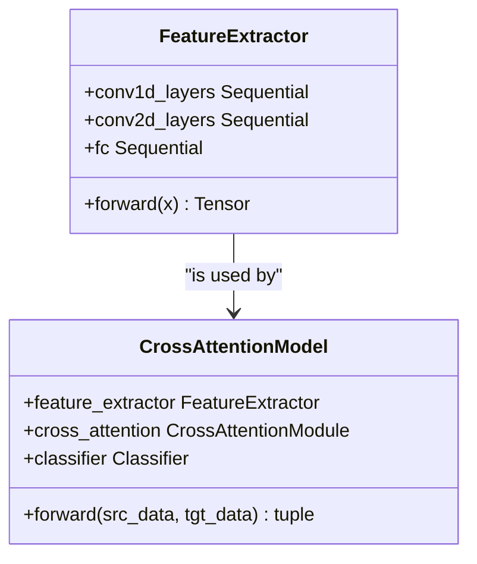

# 特征提取器

<cite>
**Referenced Files in This Document**   
- [attention.py](file://Attention/attention.py)
- [train.py](file://Attention/train.py)
</cite>

## 目录
1. [简介](#简介)
2. [核心组件](#核心组件)
3. [网络架构详解](#网络架构详解)
4. [前向传播流程](#前向传播流程)
5. [参数配置与特征提取](#参数配置与特征提取)
6. [实例化与使用方法](#实例化与使用方法)
7. [在跨域步态识别中的作用](#在跨域步态识别中的作用)

## 简介

`FeatureExtractor`类是专为处理信道状态信息（CSI）数据而设计的深度神经网络模块，其输入数据形状为`[batch, 56, 3, 6000]`。该特征提取器采用两阶段卷积策略，首先通过1D卷积沿时间轴处理每个子载波的天线信号，随后将特征重塑为2D结构并利用卷积神经网络处理子载波维度，最终输出512维的高层特征向量。该模型在跨域步态识别任务中扮演着关键角色，能够有效提取与人体运动相关的细微信号变化。

**Section sources**
- [attention.py](file://Attention/attention.py#L4-L89)

## 核心组件

`FeatureExtractor`类作为`CrossAttentionModel`的核心组成部分，负责从原始CSI数据中提取具有判别性的高层特征。该类继承自`nn.Module`，包含三个主要的子模块：`conv1d_layers`用于处理时间维度，`conv2d_layers`用于处理子载波维度，以及`fc`全连接层用于最终的特征映射。其设计充分考虑了CSI数据的四维结构（批量、子载波、天线、时间），通过精心设计的重塑和卷积操作，实现了对多维信号的有效特征提取。



**Diagram sources**
- [attention.py](file://Attention/attention.py#L4-L89)
- [attention.py](file://Attention/attention.py#L203-L224)

**Section sources**
- [attention.py](file://Attention/attention.py#L4-L89)

## 网络架构详解

`FeatureExtractor`的网络架构分为两个清晰的阶段：

**第一阶段：1D卷积处理（时间轴）**
- 输入数据`[batch, 56, 3, 6000]`首先被重塑为`[batch*56, 3, 6000]`，将子载波维度与批量维度合并，以便对每个子载波的天线-时间信号进行独立处理。
- 该阶段由三个1D卷积块组成，每个块包含卷积层、批归一化、ReLU激活和池化操作。卷积核大小、步长和填充策略被精心设计，以逐步降低时间维度的长度，同时增加通道数，从而提取时间序列中的局部模式和动态变化。

**第二阶段：2D卷积处理（子载波维度）**
- 第一阶段的输出`[batch*56, 64, 16]`被重塑回`[batch, 56, 1024]`，然后通过`unsqueeze(1)`操作添加一个通道维度，形成`[batch, 1, 56, 1024]`的2D结构。
- 该阶段由三个2D卷积块组成，专门用于捕捉不同子载波之间的相关性和空间模式。通过在子载波维度上应用卷积，模型能够学习到跨频率的特征表示，这对于区分不同的步态模式至关重要。

```mermaid
flowchart TD
A[原始输入<br/>[batch, 56, 3, 6000]] --> B[第一阶段: 1D卷积]
B --> C[重塑为<br/>[batch*56, 3, 6000]]
C --> D[Conv1d + BN + ReLU + Pool]
D --> E[Conv1d + BN + ReLU + Pool]
E --> F[Conv1d + BN + ReLU + AdaptivePool]
F --> G[输出: [batch*56, 64, 16]]
G --> H[第二阶段: 2D卷积]
H --> I[重塑为<br/>[batch, 56, 1024]]
I --> J[添加通道维度<br/>[batch, 1, 56, 1024]]
J --> K[Conv2d + BN + ReLU]
K --> L[Conv2d + BN + ReLU]
L --> M[Conv2d + BN + ReLU + AdaptivePool]
M --> N[展平: [batch, 128]]
N --> O[全连接层]
O --> P[最终输出<br/>[batch, 512]]
```

**Diagram sources**
- [attention.py](file://Attention/attention.py#L4-L89)

**Section sources**
- [attention.py](file://Attention/attention.py#L4-L89)

## 前向传播流程

前向传播过程详细描述了数据在`FeatureExtractor`中的形状变化：

1.  **输入验证**：首先检查输入张量是否为4维，确保其形状为`[batch_size, 56, 3, 6000]`。
2.  **第一阶段处理**：
    *   将输入`x`重塑为`[batch_size * 56, 3, 6000]`，以便对每个子载波的天线-时间信号进行并行处理。
    *   通过`conv1d_layers`进行1D卷积处理。经过三次卷积和池化操作后，时间维度从6000被压缩到16，通道数从3增加到64，输出形状为`[batch_size * 56, 64, 16]`。
3.  **数据重塑**：
    *   将`conv1d_layers`的输出重塑回`[batch_size, 56, 1024]`（因为64*16=1024），恢复子载波维度。
    *   使用`unsqueeze(1)`在通道维度上添加一个维度，得到`[batch_size, 1, 56, 1024]`，为2D卷积做准备。
4.  **第二阶段处理**：
    *   通过`conv2d_layers`进行2D卷积处理。卷积核在子载波（56）和特征（1024）两个维度上滑动，逐步提取跨子载波的特征。最终通过自适应平均池化层`AdaptiveAvgPool2d((1, 1))`将空间维度压缩为`[1, 1]`，输出形状为`[batch_size, 128, 1, 1]`。
5.  **特征映射**：
    *   将`conv2d_layers`的输出展平为`[batch_size, 128]`。
    *   通过`fc`全连接层（包含线性变换、ReLU激活和Dropout）将128维特征映射到指定的`feature_dim`（默认512维），最终输出`[batch_size, 512]`的特征向量。

**Section sources**
- [attention.py](file://Attention/attention.py#L61-L89)

## 参数配置与特征提取

`FeatureExtractor`的参数配置对其特征提取能力有决定性影响：

*   **卷积核大小 (kernel_size)**：
    *   第一阶段使用较大的卷积核（如15、9），能够捕捉时间序列中的长时依赖和周期性模式。
    *   第二阶段使用矩形卷积核（如(7,9)、(5,7)），其在子载波维度上的宽度较小，而在特征维度上的宽度较大，这有助于在保持子载波分辨率的同时，聚合来自第一阶段的丰富时间特征。
*   **步长 (stride)**：
    *   步长控制着特征图的下采样率。较大的步长（如4）能快速降低特征图尺寸，减少计算量，但可能丢失细节信息。较小的步长（如1或2）则能保留更多空间信息。
*   **填充 (padding)**：
    *   填充策略（如`padding=7`对应`kernel_size=15`）确保了卷积操作后特征图的尺寸不会因边界效应而急剧缩小，有助于保持信息的完整性。
*   **批归一化 (BatchNorm)** 和 **ReLU激活**：
    *   批归一化加速了训练过程并提高了模型的稳定性。
    *   ReLU激活函数引入了非线性，使网络能够学习复杂的特征表示。
*   **池化操作 (Pooling)**：
    *   最大池化（MaxPool）和自适应平均池化（AdaptiveAvgPool）用于降低特征图的空间维度，同时保留最重要的特征信息，并提供一定的平移不变性。

这些参数的协同作用使得`FeatureExtractor`能够从高维、噪声大的CSI数据中，逐步抽象出对步态识别任务具有高度判别性的低维特征。

**Section sources**
- [attention.py](file://Attention/attention.py#L4-L89)

## 实例化与使用方法

`FeatureExtractor`通常作为`CrossAttentionModel`的一部分被实例化和使用。用户无需直接创建`FeatureExtractor`的实例，而是通过创建`CrossAttentionModel`来间接使用它。

```python
# 在 train_identify.py 中的实例化方式
model = CrossAttentionModel(num_classes=10).to(device)
```

当`CrossAttentionModel`被创建时，其`__init__`方法会自动初始化一个`FeatureExtractor`实例。在前向传播过程中，`CrossAttentionModel`会调用`feature_extractor`来处理源域和目标域的输入数据。

```python
# 在 CrossAttentionModel 的 forward 方法中
feat_s = self.feature_extractor(src_data)  # 提取源域特征
feat_t = self.feature_extractor(tgt_data)  # 提取目标域特征
```

这种设计模式将特征提取、注意力机制和分类任务解耦，使得模型结构清晰且易于维护。

**Section sources**
- [attention.py](file://Attention/attention.py#L203-L224)
- [train.py](file://Attention/train.py#L145-L147)

## 在跨域步态识别中的作用

在跨域步态识别系统中，`FeatureExtractor`扮演着至关重要的角色。其主要作用是将原始的、包含大量环境噪声和设备差异的CSI数据，转换为一种**域不变的、具有判别性的特征表示**。

具体而言，该特征提取器通过以下方式支持跨域识别：
1.  **提取高层语义特征**：它能够过滤掉与步态无关的噪声（如环境变化、多径效应），专注于提取与人体运动相关的细微信号变化，如步幅、步频和行走姿态。
2.  **促进域对齐**：通过在源域和目标域上使用相同的特征提取器，模型被强制学习一种共享的特征空间。这使得源域（有标签）和目标域（无标签）的特征分布更加接近，为