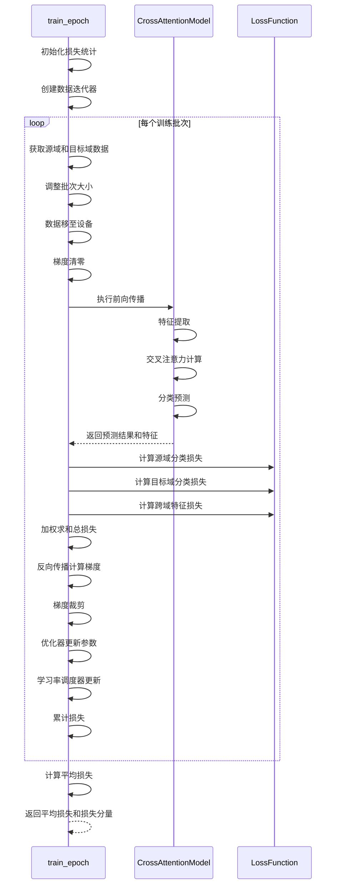

# 训练流程

<cite>
**Referenced Files in This Document**   
- [train_ATT.py](file://Research1\train_ATT.py)
- [plot_ATT.py](file://Research1\plot_ATT.py)
- [Attention\training_history.json](file://Research1\Attention\training_history.json)
- [Process\dataloder_ATT.py](file://Research1\Process\dataloder_ATT.py)
- [model_ATT.py](file://Research1\model_ATT.py)
- [loss_ATT.py](file://Research1\loss_ATT.py)
</cite>

## 更新摘要
**变更内容**   
- 将训练轮数从10个epoch增加到150个，以支持更充分的模型收敛
- 采用warmup + 余弦退火学习率调度策略，提升训练稳定性
- 延长早停机制的耐心值从15到20，避免过早终止训练
- 更新动态损失权重调整策略，在训练过程中逐步增强目标域分类损失权重并减弱域对齐损失权重
- 同步更新训练流程概述、优化策略详解和动态损失权重调整等章节内容

## 目录
1. [训练流程概述](#训练流程概述)
2. [核心训练函数分析](#核心训练函数分析)
3. [模型评估与验证方法](#模型评估与验证方法)
4. [优化策略详解](#优化策略详解)
5. [动态损失权重调整](#动态损失权重调整)
6. [训练结果可视化](#训练结果可视化)

## 训练流程概述

本项目实现了一个基于注意力机制的跨域适应训练流程，旨在通过协调源域和目标域数据的联合训练，提升模型在目标域上的识别准确率。训练流程主要由`train_ATT.py`文件中的`main()`函数驱动，该函数初始化模型、优化器、学习率调度器和数据加载器，并执行完整的训练-验证循环。

训练流程的核心是`train_epoch`函数，它负责处理每个训练周期中的前向传播、损失计算和反向传播。评估流程则由`validate_on_domain`函数实现，支持在源域和目标域数据上的性能评估。整个训练过程采用了多种优化策略，包括warmup + 余弦退火学习率调度、梯度裁剪和早停机制，以确保训练的稳定性和高效性。此外，系统还实现了详细的训练历史记录功能，包括损失、准确率和测试结果的完整记录。

**Section sources**
- [train_ATT.py](file://Research1\train_ATT.py#L245-L372)

## 核心训练函数分析

`train_epoch`函数是训练流程的核心，它协调源域和目标域数据加载器，执行完整的训练步骤。

### 数据加载与批次处理

函数首先通过`iter()`将`dataloader_source`和`dataloader_target`转换为迭代器，以便在训练循环中逐批获取数据。由于两个数据集的大小可能不同，函数采用`max(len(dataloader_source), len(dataloader_target))`作为基准批次数量，确保两个数据集都能被充分遍历。当一个数据加载器耗尽时，会通过`StopIteration`异常捕获并重新初始化迭代器，从而实现数据的循环使用。

为处理批次大小不一致的情况，函数在获取到两个批次的数据后，会计算`min_batch_size = min(src_data.size(0), tgt_data.size(0))`，然后对两个批次的数据进行切片操作，确保它们具有相同的批次大小，避免了维度不匹配的问题。

### 前向传播与反向传播

在数据准备就绪后，函数执行前向传播，将源域和目标域数据输入`CrossAttentionModel`模型。模型的前向传播过程包括特征提取、交叉注意力计算和分类预测三个阶段，最终输出源域和目标域的预测结果以及相关的特征表示。

反向传播阶段，函数首先计算三项损失：源域分类损失、目标域分类损失和跨域特征损失（MMD）。这些损失通过`LossFunction`类中的相应方法计算，并根据预设的权重系数（alpha, beta, gamma）进行加权求和，得到总损失。随后调用`loss.backward()`计算梯度，并通过`optimizer.step()`更新模型参数。



**Diagram sources**
- [train_ATT.py](file://Research1\train_ATT.py#L11-L88)
- [model_ATT.py](file://Research1\model_ATT.py#L204-L224)
- [loss_ATT.py](file://Research1\loss_ATT.py#L5-L79)

**Section sources**
- [train_ATT.py](file://Research1\train_ATT.py#L11-L88)
- [model_ATT.py](file://Research1\model_ATT.py#L204-L224)
- [loss_ATT.py](file://Research1\loss_ATT.py#L5-L79)

## 模型评估与验证方法

`validate_on_domain`函数负责在指定域的数据集上评估模型性能，支持源域和目标域的跨域验证。

### 评估流程

评估过程在`model.eval()`模式下进行，禁用Dropout等训练时的随机操作。函数遍历指定域的数据加载器中的所有批次，对每个批次的数据执行前向传播。根据`domain_type`参数，函数会选择不同的前向传播方式：当评估目标域时，将源域输入设置为与目标域数据形状相同但值为零的张量（`torch.zeros_like(data)`）；当评估源域时，则将目标域输入设置为零张量。这确保了模型能够正常运行，同时专注于评估特定域的性能。

模型输出预测结果后，函数使用`torch.max`获取预测类别。通过与真实标签比较，计算出正确预测的数量，最终得到准确率。

### 测试流程与历史记录

在每个训练周期结束后，系统会执行完整的测试流程，分别评估模型在源域和目标域测试集上的性能。测试结果包括源域测试准确率和目标域测试准确率，这些结果被记录在`test_results_history`列表中，用于后续分析。这种跨域测试机制能够全面评估模型的域适应能力和泛化性能。

```python
# 测试结果记录示例
test_results = {
    'src_test_accuracy': src_test_accuracy,
    'tgt_test_accuracy': tgt_test_accuracy
}
test_results_history.append(test_results)
```

**Section sources**
- [train_ATT.py](file://Research1\train_ATT.py#L91-L119)
- [train_ATT.py](file://Research1\train_ATT.py#L336-L345)

## 优化策略详解

训练流程采用了多种先进的优化策略，以提高训练效率和模型性能。

### 梯度裁剪

在反向传播后，函数调用`torch.nn.utils.clip_grad_norm_(model.parameters(), max_norm=1.0)`执行梯度裁剪。梯度裁剪是一种防止梯度爆炸的有效技术，它将所有参数的梯度范数限制在一个最大值（`max_norm=1.0`）之内。当梯度范数超过该阈值时，所有梯度都会被按比例缩小。这确保了即使在损失函数出现陡峭区域时，参数更新也不会过大，从而维持了训练的稳定性。

### 学习率调度器

训练使用了warmup + 余弦退火学习率调度策略。该策略首先在前10个epoch进行warmup阶段，学习率从0线性增长到初始值（1e-4）；随后进入余弦退火阶段，学习率按照余弦函数形式从初始值衰减到接近0。这种调度策略允许模型在训练初期以较小的学习率稳定初始化，然后在warmup后快速收敛，并在后期以逐渐减小的学习率进行精细调整，有助于跳出局部最优并找到更优的解，从而显著提升训练的稳定性。

### 早停机制

早停机制是防止过拟合的关键。其实现逻辑是监控验证集（目标域）上的准确率。在`main()`函数中，定义了`best_accuracy`变量来记录历史最高准确率，以及`early_stop_counter`计数器来记录连续没有提升的epoch数。每当当前epoch的准确率超过`best_accuracy`时，`best_accuracy`被更新，计数器重置为0；否则，计数器加1。当计数器达到预设的耐心值（`patience=20`）时，训练过程将提前终止，从而避免了在验证集性能不再提升的情况下继续训练。

**Section sources**
- [train_ATT.py](file://Research1\train_ATT.py#L68-L75)
- [train_ATT.py](file://Research1\train_ATT.py#L290-L304)
- [train_ATT.py](file://Research1\train_ATT.py#L347-L359)

## 动态损失权重调整

为了优化训练过程，系统实现了动态调整损失权重的策略。在`main()`函数的训练循环中，有一个条件判断`if epoch > 30 and epoch % 10 == 0`，当训练超过30个epoch后，系统会每10个epoch逐步调整损失权重。

具体实现是，每个符合条件的epoch将`criterion.beta`（目标域分类损失权重）乘以1.05（上限2.0），同时将`criterion.gamma`（跨域特征对齐损失权重）乘以0.95（下限0.2）。这种策略的逻辑是：在训练初期，模型需要同时学习源域分类和领域适应，因此领域适应损失的权重较高；随着训练的进行，模型已经具备了一定的领域不变特征提取能力，此时应更专注于提升分类性能，因此逐渐增强目标域分类损失的权重，让分类任务在总损失中占据更重要的地位。

**Section sources**
- [train_ATT.py](file://Research1\train_ATT.py#L361-L366)

## 训练结果可视化

训练流程的最后阶段是结果的可视化，这对于分析训练过程和诊断问题至关重要。

### 可视化内容

系统使用`plot_ATT.py`模块绘制了三张关键曲线图：
1.  **损失曲线**：在同一张图中绘制总损失、源域损失、目标域损失和MMD损失随epoch的变化，用于监控模型的拟合情况和是否存在过拟合。
2.  **准确率曲线**：绘制训练准确率和验证准确率随epoch的变化，直观地展示模型性能的提升过程。
3.  **测试准确率曲线**：绘制源域和目标域测试准确率随epoch的变化，用于评估模型的跨域泛化能力。

### 保存与显示

所有曲线图被组合在一个1x3的子图布局中，并通过`plt.tight_layout()`优化布局。图表被保存到`Attention`目录下的相应文件中，同时调用`plt.show()`在屏幕上显示。保存操作前会检查`Attention`目录是否存在，如果不存在则自动创建，确保了程序的鲁棒性。训练历史数据以JSON格式保存在`Attention/training_history.json`文件中，包含了完整的训练损失、验证准确率、损失组件历史和测试结果历史。

**Section sources**
- [train_ATT.py](file://Research1\train_ATT.py#L374-L392)
- [plot_ATT.py](file://Research1\plot_ATT.py#L249-L272)
- [train_ATT.py](file://Research1\train_ATT.py#L218-L242)