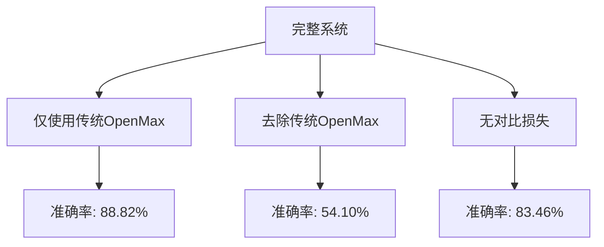
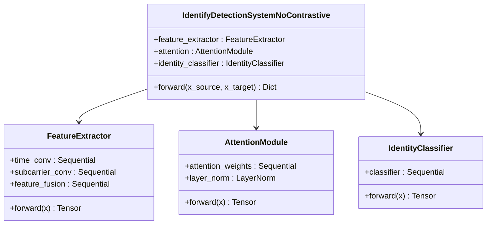
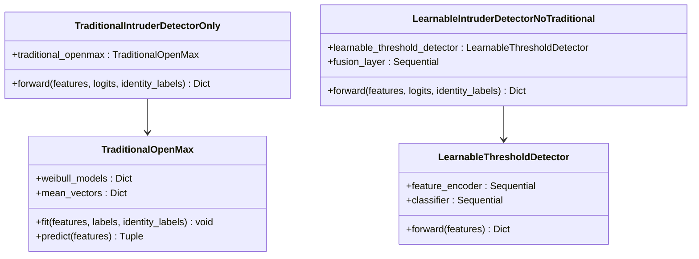
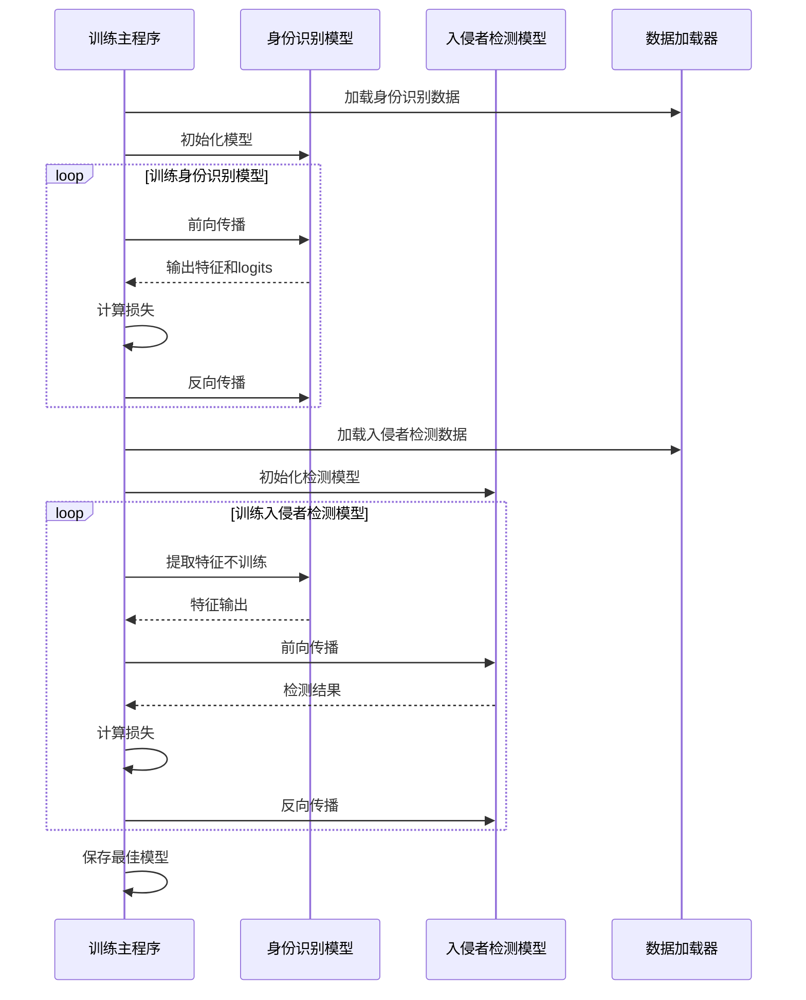
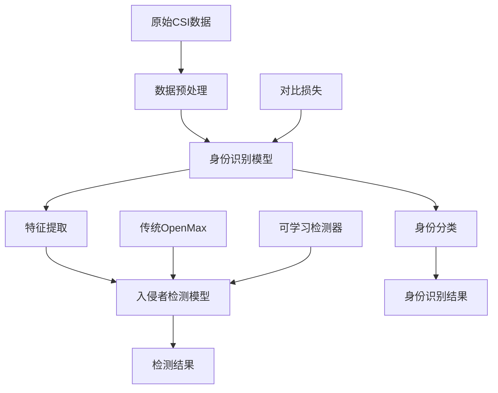

# 消融实验

<cite>
**本文档中引用的文件**  
- [dataloder_ATT.py](file://Research1/dataloder_ATT.py)
- [dataloder_GAN.py](file://Research1/dataloder_GAN.py)
- [loss_ATT.py](file://Research1/loss_ATT.py)
- [loss_GAN.py](file://Research1/loss_GAN.py)
- [model_ATT.py](file://Research1/model_ATT.py)
- [model_GAN.py](file://Research1/model_GAN.py)
- [train_ATT.py](file://Research1/train_ATT.py)
- [train_GAN.py](file://Research1/train_GAN.py)
- [ablation study/no_LearnableThresholdDetector/README.md](file://Research2/ablation study/no_LearnableThresholdDetector/README.md)
- [ablation study/no_LearnableThresholdDetector/intruder_detection_results.json](file://Research2/ablation study/no_LearnableThresholdDetector/intruder_detection_results.json)
- [ablation study/no_LearnableThresholdDetector/model_identify_no_contrastive.py](file://Research2/ablation study/no_LearnableThresholdDetector/model_identify_no_contrastive.py)
- [ablation study/no_LearnableThresholdDetector/model_intruder_traditional_only.py](file://Research2/ablation study/no_LearnableThresholdDetector/model_intruder_traditional_only.py)
- [ablation study/no_LearnableThresholdDetector/train_intruder_traditional_only.py](file://Research2/ablation study/no_LearnableThresholdDetector/train_intruder_traditional_only.py)
- [ablation study/no_TraditionalOpenMax/README.md](file://Research2/ablation study/no_TraditionalOpenMax/README.md)
- [ablation study/no_TraditionalOpenMax/intruder_detection_results.json](file://Research2/ablation study/no_TraditionalOpenMax/intruder_detection_results.json)
- [ablation study/no_TraditionalOpenMax/model_identify_no_contrastive.py](file://Research2/ablation study/no_TraditionalOpenMax/model_identify_no_contrastive.py)
- [ablation study/no_TraditionalOpenMax/model_intruder_no_traditional.py](file://Research2/ablation study/no_TraditionalOpenMax/model_intruder_no_traditional.py)
- [ablation study/no_TraditionalOpenMax/train_intruder_no_traditional.py](file://Research2/ablation study/no_TraditionalOpenMax/train_intruder_no_traditional.py)
- [ablation study/no_contrastive/intruder_detection_results.json](file://Research2/ablation study/no_contrastive/intruder_detection_results.json)
- [ablation study/no_contrastive/loss_identify_no_contrastive.py](file://Research2/ablation study/no_contrastive/loss_identify_no_contrastive.py)
- [ablation study/no_contrastive/model_identify_no_contrastive.py](file://Research2/ablation study/no_contrastive/model_identify_no_contrastive.py)
- [ablation study/no_contrastive/train_identify_no_contrastive.py](file://Research2/ablation study/no_contrastive/train_identify_no_contrastive.py)
- [ablation study/no_contrastive/train_intruder_no_contrastive.py](file://Research2/ablation study/no_contrastive/train_intruder_no_contrastive.py)
- [ablation study/no_contrastive/training_history.json](file://Research2/ablation study/no_contrastive/training_history.json)
- [identify/training_history.json](file://Research2/identify/training_history.json)
- [intruder/training_history.json](file://Research2/intruder/training_history.json)
- [dataloader_identify.py](file://Research2/dataloader_identify.py)
- [dataloader_intruder.py](file://Research2/dataloader_intruder.py)
- [loss_identify.py](file://Research2/loss_identify.py)
- [model_identify.py](file://Research2/model_identify.py)
- [model_intruder.py](file://Research2/model_intruder.py)
- [plot_identity.py](file://Research2/plot_identity.py)
- [plot_intruder.py](file://Research2/plot_intruder.py)
- [train_identify.py](file://Research2/train_identify.py)
- [train_intruder.py](file://Research2/train_intruder.py)
- [pre_process/CSI_fig.py](file://pre_process/CSI_fig.py)
- [pre_process/SourceData.py](file://pre_process/SourceData.py)
- [pre_process/TargetData.py](file://pre_process/TargetData.py)
- [pre_process/data.py](file://pre_process/data.py)
- [pre_process/dataloder_Intruder.py](file://pre_process/dataloder_Intruder.py)
- [pre_process/preprocess.py](file://pre_process/preprocess.py)
- [README.en.md](file://README.en.md)
- [README.md](file://README.md)
</cite>

## 目录
1. [引言](#引言)
2. [项目结构](#项目结构)
3. [核心组件](#核心组件)
4. [消融实验设计](#消融实验设计)
5. [实验结果分析](#实验结果分析)
6. [模型架构与实现](#模型架构与实现)
7. [训练流程](#训练流程)
8. [依赖关系分析](#依赖关系分析)
9. [性能考量](#性能考量)
10. [故障排除指南](#故障排除指南)
11. [结论](#结论)

## 引言
本项目旨在通过一系列消融实验评估不同组件在入侵者检测系统中的贡献。系统采用双阶段架构：首先进行身份识别，然后进行入侵者检测。消融实验通过移除特定组件来评估其对整体性能的影响，包括可学习阈值检测器、传统OpenMax组件以及对比损失函数。

## 项目结构
项目组织为多个研究目录，每个目录包含特定实验的代码和数据。核心结构包括：
- `Research1`: 包含ATT和GAN模型的实现
- `Research2`: 主要研究目录，包含身份识别、入侵者检测及消融实验
- `pre_process`: 数据预处理相关脚本
- 根目录包含项目说明文件

消融实验位于`Research2/ablation study`目录下，分为三个子实验：
- `no_LearnableThresholdDetector`: 移除可学习阈值检测器
- `no_TraditionalOpenMax`: 移除传统OpenMax组件
- `no_contrastive`: 移除对比损失函数

**目录来源**
- [Research1](file://Research1)
- [Research2](file://Research2)
- [pre_process](file://pre_process)

## 核心组件
系统由多个核心组件构成，包括特征提取器、注意力模块、身份分类器、可学习阈值检测器和传统OpenMax检测器。这些组件协同工作，实现从原始CSI数据到入侵者检测的完整流程。

**组件来源**
- [model_identify_no_contrastive.py](file://Research2/ablation study/no_contrastive/model_identify_no_contrastive.py)
- [model_intruder_no_traditional.py](file://Research2/ablation study/no_TraditionalOpenMax/model_intruder_no_traditional.py)
- [model_intruder_traditional_only.py](file://Research2/ablation study/no_LearnableThresholdDetector/model_intruder_traditional_only.py)

## 消融实验设计
本研究设计了三个消融实验，分别评估不同组件的重要性：

### 仅使用传统OpenMax组件
该实验移除了可学习的神经网络检测模块，仅保留传统的基于极值理论的OpenMax组件。目的是验证可学习组件对整体性能的贡献。

**实验来源**
- [ablation study/no_LearnableThresholdDetector/README.md](file://Research2/ablation study/no_LearnableThresholdDetector/README.md)

### 去除传统OpenMax组件
该实验移除了传统的基于极值理论的OpenMax模块，仅保留可学习的神经网络检测模块。目的是验证传统统计方法在入侵者检测中的价值。

**实验来源**
- [ablation study/no_TraditionalOpenMax/README.md](file://Research2/ablation study/no_TraditionalOpenMax/README.md)

### 无对比损失实验
该实验移除了对比损失函数，使用简化版本的身份识别模型。目的是评估对比学习在特征表示学习中的作用。

**实验来源**
- [ablation study/no_contrastive/model_identify_no_contrastive.py](file://Research2/ablation study/no_contrastive/model_identify_no_contrastive.py)
- [ablation study/no_contrastive/loss_identify_no_contrastive.py](file://Research2/ablation study/no_contrastive/loss_identify_no_contrastive.py)

## 实验结果分析
通过对三个消融实验的结果进行分析，可以得出各组件对系统性能的贡献：

**图表来源**
- [ablation study/no_LearnableThresholdDetector/intruder_detection_results.json](file://Research2/ablation study/no_LearnableThresholdDetector/intruder_detection_results.json)
- [ablation study/no_TraditionalOpenMax/intruder_detection_results.json](file://Research2/ablation study/no_TraditionalOpenMax/intruder_detection_results.json)
- [ablation study/no_contrastive/intruder_detection_results.json](file://Research2/ablation study/no_contrastive/intruder_detection_results.json)

### 仅使用传统OpenMax组件的结果
当仅使用传统OpenMax组件时，系统在入侵者检测任务上表现出色，准确率达到88.82%，F1分数为89.18%。这表明传统的基于极值理论的方法在检测异常行为方面具有很强的能力。

**结果来源**
- [ablation study/no_LearnableThresholdDetector/intruder_detection_results.json](file://Research2/ablation study/no_LearnableThresholdDetector/intruder_detection_results.json)

### 去除传统OpenMax组件的结果
当去除传统OpenMax组件后，系统性能显著下降，准确率仅为54.10%，F1分数为18.52%。这表明传统OpenMax组件在系统中起着至关重要的作用，可学习组件单独无法有效检测入侵者。

**结果来源**
- [ablation study/no_TraditionalOpenMax/intruder_detection_results.json](file://Research2/ablation study/no_TraditionalOpenMax/intruder_detection_results.json)

### 无对比损失实验的结果
当移除对比损失函数后，系统性能有所下降但仍然保持在较高水平，准确率为83.46%，F1分数为81.15%。这表明对比学习对特征表示有积极影响，但不是系统性能的决定性因素。

**结果来源**
- [ablation study/no_contrastive/intruder_detection_results.json](file://Research2/ablation study/no_contrastive/intruder_detection_results.json)

## 模型架构与实现
系统采用模块化设计，各组件可以独立替换和评估。

### 身份识别模型架构
身份识别模型由特征提取器、注意力模块和分类器组成，采用适度简化的结构进行消融实验。

**图表来源**
- [ablation study/no_contrastive/model_identify_no_contrastive.py](file://Research2/ablation study/no_contrastive/model_identify_no_contrastive.py)

### 入侵者检测模型架构
入侵者检测模型有两种实现：仅使用传统OpenMax和仅使用可学习检测器。

**图表来源**
- [ablation study/no_LearnableThresholdDetector/model_intruder_traditional_only.py](file://Research2/ablation study/no_LearnableThresholdDetector/model_intruder_traditional_only.py)
- [ablation study/no_TraditionalOpenMax/model_intruder_no_traditional.py](file://Research2/ablation study/no_TraditionalOpenMax/model_intruder_no_traditional.py)

## 训练流程
系统的训练分为两个阶段：身份识别模型训练和入侵者检测模型训练。

**图表来源**
- [ablation study/no_contrastive/train_identify_no_contrastive.py](file://Research2/ablation study/no_contrastive/train_identify_no_contrastive.py)
- [ablation study/no_contrastive/train_intruder_no_contrastive.py](file://Research2/ablation study/no_contrastive/train_intruder_no_contrastive.py)
- [ablation study/no_LearnableThresholdDetector/train_intruder_traditional_only.py](file://Research2/ablation study/no_LearnableThresholdDetector/train_intruder_traditional_only.py)
- [ablation study/no_TraditionalOpenMax/train_intruder_no_traditional.py](file://Research2/ablation study/no_TraditionalOpenMax/train_intruder_no_traditional.py)

## 依赖关系分析
系统各组件之间存在明确的依赖关系，确保了模块化和可扩展性。

**图表来源**
- [Research2](file://Research2)
- [Research2/ablation study](file://Research2/ablation study)

## 性能考量
系统在设计时考虑了多个性能因素，包括计算效率、内存使用和训练稳定性。消融实验的结果表明，传统OpenMax组件在性能上具有显著优势，而可学习组件需要与其他方法结合才能发挥最佳效果。

## 故障排除指南
当遇到训练问题时，可以参考以下常见问题的解决方案：

**问题来源**
- [ablation study/no_contrastive/train_identify_no_contrastive.py](file://Research2/ablation study/no_contrastive/train_identify_no_contrastive.py)
- [ablation study/no_contrastive/train_intruder_no_contrastive.py](file://Research2/ablation study/no_contrastive/train_intruder_no_contrastive.py)

### 模型加载失败
如果无法加载预训练的身份识别模型，请检查模型文件路径是否正确，确保`best_identify_model_no_contrastive.pth`文件存在于指定位置。

### 数据文件缺失
如果出现数据文件未找到的错误，请确保数据文件存在于正确的位置，或者创建模拟数据以进行测试。

### 训练性能低下
如果训练过程中性能低下，可以检查设备设置，确保使用GPU进行训练，并验证数据加载器的批处理大小是否合适。

## 结论
通过系统的消融实验，我们得出以下结论：
1. 传统OpenMax组件在入侵者检测中起着至关重要的作用，其性能显著优于纯可学习方法。
2. 可学习阈值检测器单独使用时性能较差，需要与传统方法结合才能发挥最佳效果。
3. 对比损失函数对系统性能有积极影响，但不是决定性因素。
4. 混合方法（传统统计+可学习模型）可能是最佳选择，能够结合两者的优势。

这些发现为未来的研究方向提供了重要指导，建议在保持传统有效方法的基础上，探索更先进的可学习组件集成策略。