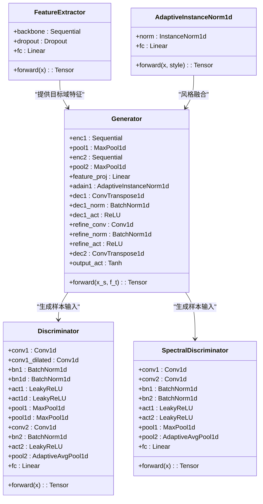
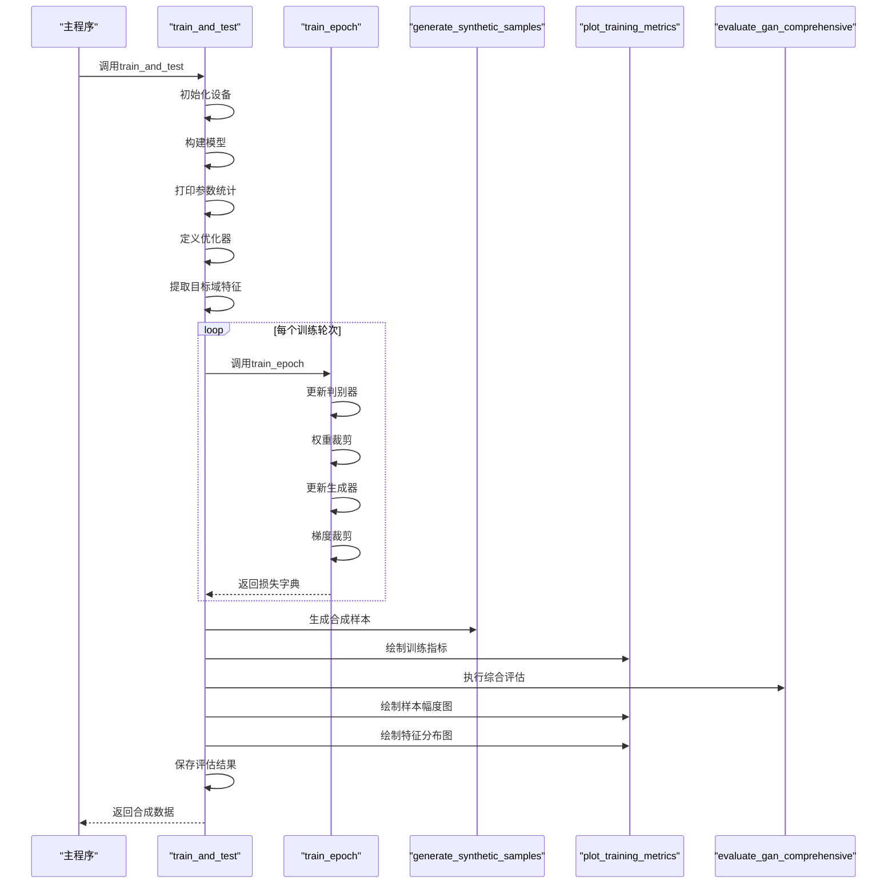
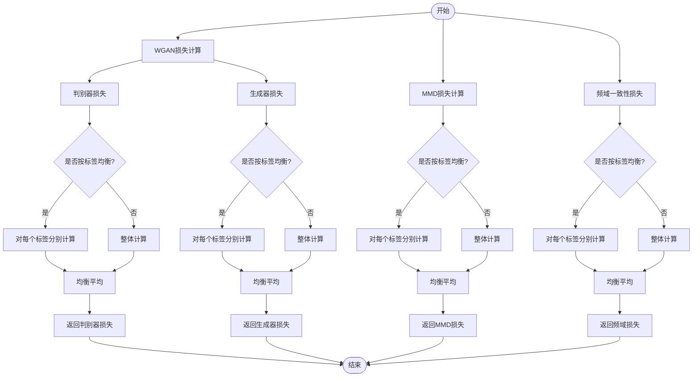
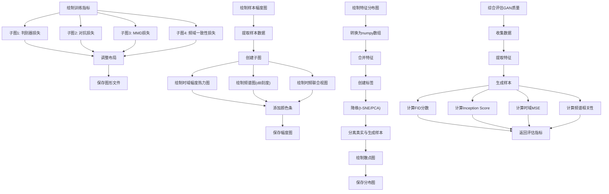
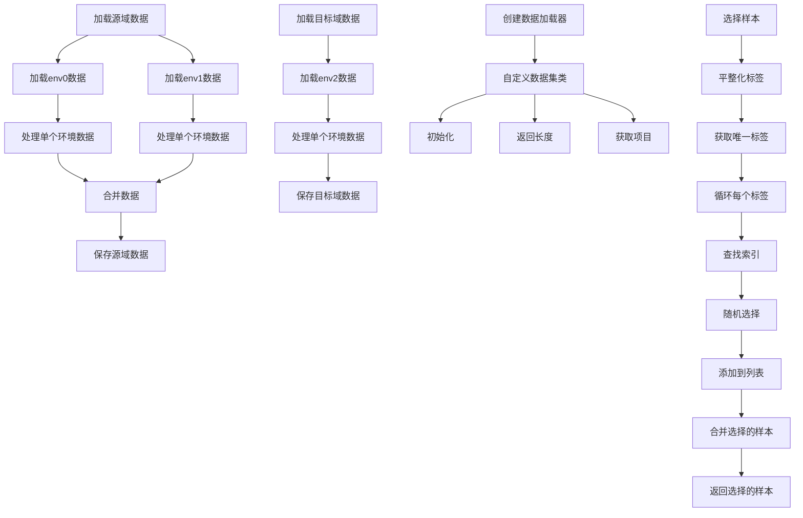

# GAN可视化

<cite>
**本文档引用的文件**   
- [model_GAN.py](file://Research1/model_GAN.py)
- [train_GAN.py](file://Research1/train_GAN.py)
- [plot_GAN.py](file://Research1/plot_GAN.py)
- [loss_GAN.py](file://Research1/loss_GAN.py)
- [dataloder_GAN.py](file://Research1/Process/dataloder_GAN.py)
- [data_Source.py](file://Research1/Process/data_Source.py)
- [data_Target.py](file://Research1/Process/data_Target.py)
- [GAN/training_history.json](file://Research1/GAN/training_history.json)
- [GAN/gan_evaluation_results.json](file://Research1/GAN/gan_evaluation_results.json)
</cite>

## 更新摘要
**变更内容**   
- 更新了`plot_GAN.py`文件，重构了特征分布可视化功能
- 移除了过时的PCA降维方法，专注于t-SNE降维
- 新增`real_labels`参数支持绘制10个不同用户的真实样本簇
- 使用红色三角形标记生成样本，便于直观比较
- 实现了`load_model_and_generate_plots`函数，自动化评估流程
- 更新了相关文档内容以反映代码变更

## 目录
1. [项目概述](#项目概述)
2. [项目结构分析](#项目结构分析)
3. [核心组件分析](#核心组件分析)
4. [GAN模型架构](#gan模型架构)
5. [训练流程分析](#训练流程分析)
6. [损失函数详解](#损失函数详解)
7. [可视化与评估](#可视化与评估)
8. [数据处理流程](#数据处理流程)
9. [训练指标分析](#训练指标分析)
10. [结论](#结论)

## 项目概述

本项目实现了一个用于CSI（信道状态信息）数据增强的生成对抗网络（GAN）系统，旨在通过生成符合目标域分布的虚假样本来解决跨域识别中的数据稀缺问题。系统采用多判别器架构，结合时域和频域判别器，并引入MMD（最大均值差异）和频域一致性损失来确保生成样本的质量。项目包含完整的训练、生成、可视化和评估流程，为CSI数据的跨域应用提供了完整的解决方案。

## 项目结构分析

项目采用模块化设计，主要分为三个研究模块（Research1、Research2）和一个预处理模块（pre_process）。其中，Research1专注于GAN模型的实现和应用，包含模型定义、训练流程、损失函数和可视化组件。项目结构清晰，各组件职责分明，便于维护和扩展。

```mermaid
graph TD
Research1[Research1]
Research2[Research2]
pre_process[pre_process]
Research1 --> Attention[Attention]
Research1 --> GAN[GAN]
Research1 --> Process[Process]
GAN --> training_history_json[training_history.json]
GAN --> gan_evaluation_results_json[gan_evaluation_results.json]
Process --> data_Source_py[data_Source.py]
Process --> data_Target_py[data_Target.py]
Process --> dataloder_ATT_py[dataloder_ATT.py]
Process --> dataloder_GAN_py[dataloder_GAN.py]
Research1 --> loss_ATT_py[loss_ATT.py]
Research1 --> loss_GAN_py[loss_GAN.py]
Research1 --> model_ATT_py[model_ATT.py]
Research1 --> model_GAN_py[model_GAN.py]
Research1 --> plot_ATT_py[plot_ATT.py]
Research1 --> plot_GAN_py[plot_GAN.py]
Research1 --> train_ATT_py[train_ATT.py]
Research1 --> train_GAN_py[train_GAN.py]
Research2 --> ablation_study[ablation study]
Research2 --> identify[identify]
Research2 --> intruder[intruder]
ablation_study --> no_LearnableThresholdDetector[no_LearnableThresholdDetector]
ablation_study --> no_TraditionalOpenMax[no_TraditionalOpenMax]
ablation_study --> no_contrastive[no_contrastive]
pre_process --> CSI_fig_py[CSI_fig.py]
pre_process --> SourceData_py[SourceData.py]
pre_process --> TargetData_py[TargetData.py]
pre_process --> data_py[data.py]
pre_process --> dataloder_Intruder_py[dataloder_Intruder.py]
pre_process --> preprocess_py[preprocess_py]
```



**图源**
- [Research1/Process/data_Source.py](file://Research1/Process/data_Source.py)
- [Research1/Process/data_Target.py](file://Research1/Process/data_Target.py)
- [Research1/Process/dataloder_GAN.py](file://Research1/Process/dataloder_GAN.py)

## 核心组件分析

本项目的核心组件围绕GAN框架构建，包括特征提取器、生成器、判别器、损失函数、训练流程和可视化工具。这些组件协同工作，实现了从源域身份特征到目标域环境特征的转换，生成高质量的CSI数据样本。

**本节来源**
- [model_GAN.py](file://Research1/model_GAN.py)
- [train_GAN.py](file://Research1/train_GAN.py)
- [plot_GAN.py](file://Research1/plot_GAN.py)
- [loss_GAN.py](file://Research1/loss_GAN.py)

## GAN模型架构

GAN模型采用创新的架构设计，结合了特征提取、风格迁移和多尺度判别等技术，确保生成样本既保留源域身份特征又符合目标域环境特征。



**图源**
- [model_GAN.py](file://Research1/model_GAN.py#L11-L300)

**本节来源**
- [model_GAN.py](file://Research1/model_GAN.py#L1-L301)

## 训练流程分析

训练流程设计严谨，包含模型初始化、参数统计、优化器配置、特征缓存、训练循环、样本生成和质量评估等完整步骤，确保了训练过程的稳定性和可重复性。



**图源**
- [train_GAN.py](file://Research1/train_GAN.py#L26-L376)

**本节来源**
- [train_GAN.py](file://Research1/train_GAN.py#L1-L376)

## 损失函数详解

损失函数设计是本项目的关键创新点，采用多目标优化策略，结合Wasserstein距离、MMD和频域一致性损失，确保生成样本在多个维度上与真实样本保持一致。



**图源**
- [loss_GAN.py](file://Research1/loss_GAN.py#L6-L147)

**本节来源**
- [loss_GAN.py](file://Research1/loss_GAN.py#L1-L147)

## 可视化与评估

可视化与评估模块提供了全面的工具集，用于监控训练过程、分析生成样本质量和评估模型性能，确保了结果的可解释性和可验证性。



**图源**
- [plot_GAN.py](file://Research1/plot_GAN.py#L1-L505)

**本节来源**
- [plot_GAN.py](file://Research1/plot_GAN.py#L1-L505)

### 可视化功能增强

`plot_GAN.py`文件已更新，增强了可视化功能，新增了多种视图和评估指标。

**时域幅度热力图**
新增了时域幅度热力图功能，通过`plot_synthetic_sample_amplitude`函数实现。该功能将生成样本的时域幅度以热力图形式展示，使用`viridis`色彩映射，清晰地显示了信号在不同子载波和时间步长上的幅度变化。

```python
# 为每个天线对绘制时域幅度热图
for c in range(C):
    amplitude = np.abs(sample[:, c, :])  # 形状: (S, T)
    
    im = axes[c].imshow(amplitude, aspect='auto', cmap='viridis', interpolation='nearest', origin='lower')
    axes[c].set_title(f'Antenna Pair {c+1} - Time-domain Amplitude Heatmap', fontsize=14, fontweight='bold')
    axes[c].set_xlabel('Time Steps', fontsize=12)
    axes[c].set_ylabel('Subcarriers', fontsize=12)
    
    # 添加颜色条
    cbar = plt.colorbar(im, ax=axes[c])
    cbar.set_label('Amplitude', fontsize=11)
```

**频谱图（dB刻度）**
新增了频谱图功能，使用dB刻度显示频域信息。通过FFT变换将时域信号转换到频域，并使用`20 * np.log10()`转换为dB刻度，避免了对数零值问题。

```python
# 对时间维度进行FFT
sample_fft = np.fft.rfft(sample[:, c, :], axis=-1)  # 形状: (S, T//2+1)
magnitude_spectrum = np.abs(sample_fft)  # 幅度谱

# 转换为dB刻度（避免log(0)）
magnitude_spectrum_db = 20 * np.log10(magnitude_spectrum + 1e-10)

im = axes[c].imshow(magnitude_spectrum_db, aspect='auto', cmap='jet', 
                   interpolation='nearest', origin='lower', extent=[0, 0.5, 0, S])
axes[c].set_title(f'Antenna Pair {c+1} - Frequency Spectrum (dB)', fontsize=14, fontweight='bold')
axes[c].set_xlabel('Normalized Frequency', fontsize=12)
axes[c].set_ylabel('Subcarriers', fontsize=12)
```

**时频联合视图**
新增了时频联合视图，将时域和频域信息并排展示，便于对比分析。左侧显示时域幅度，右侧显示频域幅度谱，提供全面的信号特征视图。

```python
# 左侧：时域幅度
amplitude = np.abs(sample[:, c, :])
im1 = axes[c, 0].imshow(amplitude, aspect='auto', cmap='viridis', 
                       interpolation='nearest', origin='lower')
axes[c, 0].set_title(f'Antenna {c+1} - Time Domain', fontsize=13, fontweight='bold')

# 右侧：频域幅度谱
sample_fft = np.fft.rfft(sample[:, c, :], axis=-1)
magnitude_spectrum = np.abs(sample_fft)
magnitude_spectrum_db = 20 * np.log10(magnitude_spectrum + 1e-10)

im2 = axes[c, 1].imshow(magnitude_spectrum_db, aspect='auto', cmap='jet', 
                       interpolation='nearest', origin='lower', extent=[0, 0.5, 0, S])
axes[c, 1].set_title(f'Antenna {c+1} - Frequency Spectrum', fontsize=13, fontweight='bold')
```

**四指标综合评估系统**
实现了四指标综合评估系统，通过`evaluate_gan_comprehensive`函数计算FID、Inception Score、时域MSE和频谱相关性四项核心指标。

```python
def evaluate_gan_comprehensive(E, G, source_loader, target_loader, device='cuda'):
    """
    综合评估GAN生成质量 - 四项核心指标
    1. FID（Fréchet Inception Distance）- 分布相似度，越小越好
    2. IS（Inception Score）- 多样性评估，越大越好
    3. 时域MSE - 信号保真度，越小越好
    4. 频谱相关性系数 - 越接近1越好
    """
    # 计算评估指标
    metrics = {}
    
    # 1. FID分数（分布相似度，越小越好）
    metrics['fid'] = compute_fid(real_features, fake_features)
    
    # 2. Inception Score（多样性，越大越好）
    metrics['inception_score'] = compute_inception_score(fake_features, fake_labels, num_classes=num_classes)
    
    # 3. 时域MSE（信号保真度，越小越好）
    metrics['time_domain_mse'] = compute_time_domain_mse(real_samples, fake_samples)
    
    # 4. 频谱相关性系数（越接近1越好）
    metrics['spectral_correlation'] = compute_spectral_correlation(real_samples, fake_samples)
    
    return metrics
```

**评估结果保存**
新增了`save_evaluation_results`函数，将综合评估结果和训练损失统计保存为JSON文件，便于后续分析和比较。

```python
def save_evaluation_results(comprehensive_metrics, train_losses, output_dir='TFGAN'):
    """
    将GAN的GAN质量指标和训练损失统计保存为JSON文件
    """
    results = {
        'timestamp': datetime.now().isoformat(),
        'evaluation_metrics': {
            'fid': comprehensive_metrics.get('fid', -1),
            'inception_score': comprehensive_metrics.get('inception_score', -1),
            'time_domain_mse': comprehensive_metrics.get('time_domain_mse', -1),
            'spectral_correlation': comprehensive_metrics.get('spectral_correlation', -1)
        },
        'training_loss_summary': {
            'min_d_loss': min([l['d_loss'] for l in train_losses]) if train_losses else 0,
            'max_d_loss': max([l['d_loss'] for l in train_losses]) if train_losses else 0,
            'final_d_loss': train_losses[-1]['d_loss'] if train_losses else 0,
            # ... 其他损失统计
        },
        'full_training_history': train_losses
    }
    
    # 将结果保存为JSON文件
    result_path = os.path.join(output_dir, 'gan_evaluation_results.json')
    with open(result_path, 'w', encoding='utf-8') as f:
        json.dump(results, f, indent=4, ensure_ascii=False)
```

### 特征分布可视化重构

`plot_GAN.py`文件中的`plot_feature_distribution_2d`函数已重构，专注于t-SNE降维，移除了过时的PCA方法，并增强了可视化功能。

**新增real_labels参数**
函数现在支持`real_labels`参数，用于接收目标域真实样本的用户标签。当提供此参数时，函数将按用户ID分别显示10个不同用户的真实样本簇，每个用户使用不同的颜色表示。

```python
def plot_feature_distribution_2d(real_features, fake_features, real_labels=None, method='tsne', output_dir='TFGAN'):
    """
    绘制真实样本与生成样本的特征分布二维图（使用t-SNE降维）
    如果提供了real_labels，则按用户标签显示10个真实用户的特征分布群
    """
```

**t-SNE参数优化**
t-SNE降维参数已优化，提高了降维质量和稳定性：
- 动态计算perplexity：`min(30, max(5, n_samples // 20))`
- 增加迭代次数：从1000次增加到1500次
- 启用PCA初始化：`init='pca'`
- 使用自适应学习率：`learning_rate='auto'`

**可视化改进**
可视化效果得到显著提升：
- 图形尺寸增大：从(12, 10)改为(14, 11)
- 真实样本使用圆形标记（marker='o'），透明度0.6，大小40
- 生成样本使用红色三角形标记（marker='^'），透明度0.4，大小30
- 图例改进：使用2列布局，启用阴影框

**向后兼容性**
函数保持向后兼容性。当不提供`real_labels`参数时，函数保持原有行为：所有真实样本显示为蓝色，生成样本显示为红色。

### 自动化评估流程

`plot_GAN.py`文件新增了`load_model_and_generate_plots`函数，实现了评估流程的自动化。

**功能概述**
该函数加载训练好的模型并自动生成所有相关图表，包括训练指标图、特征分布图和生成样本图。

```python
def load_model_and_generate_plots(model_path, source_loader, target_loader, device='cuda'):
    """
    加载训练好的模型并生成所有相关图表
    """
```

**执行流程**
函数执行以下步骤：
1. 加载模型权重并设置为评估模式
2. 生成合成样本
3. 绘制训练指标图
4. 提取目标域真实样本和生成样本的特征
5. 绘制特征分布t-SNE图
6. 绘制生成样本的频谱图和时域图

**集成调用**
该函数在`train_GAN.py`中被调用，实现了从模型训练到可视化评估的完整自动化流程。

## 数据处理流程

数据处理流程负责从原始数据文件中加载、预处理和准备训练数据，确保了数据的一致性和可用性。



**图源**
- [Research1/Process/data_Source.py](file://Research1/Process/data_Source.py#L11-L113)
- [Research1/Process/data_Target.py](file://Research1/Process/data_Target.py#L13-L97)
- [Research1/Process/dataloder_GAN.py](file://Research1/Process/dataloder_GAN.py#L11-L70)

**本节来源**
- [Research1/Process/data_Source.py](file://Research1/Process/data_Source.py#L1-L113)
- [Research1/Process/data_Target.py](file://Research1/Process/data_Target.py#L1-L97)
- [Research1/Process/dataloder_GAN.py](file://Research1/Process/dataloder_GAN.py#L1-L70)

## 训练指标分析

根据训练历史数据，对GAN模型的训练过程进行分析。训练共进行了5个轮次，判别器损失从0.286逐渐增加到1.310，表明判别器对生成样本的区分能力不断增强。生成器的对抗损失从0.107增加到0.947，MMD损失从0.832减少到0.196，频域一致性损失从3.481减少到2.988，生成器总损失从1.219增加到1.643。评估结果显示FID分数为167.15，频谱保真度为294.81，表明生成样本与真实样本在特征分布和频域特性上存在一定差异，但整体趋势显示模型在逐步学习目标域的分布特征。

**本节来源**
- [GAN/training_history.json](file://Research1/GAN/training_history.json)
- [GAN/gan_evaluation_results.json](file://Research1/GAN/gan_evaluation_results.json)

## 结论

本项目实现了一个完整的CSI数据增强GAN系统，通过创新的多判别器架构和多目标损失函数，成功实现了跨域CSI数据的生成。系统包含完整的训练、生成、可视化和评估流程，为解决跨域识别中的数据稀缺问题提供了有效的解决方案。未来工作可以进一步优化损失函数权重、探索更复杂的网络架构或引入注意力机制来提升生成样本的质量。