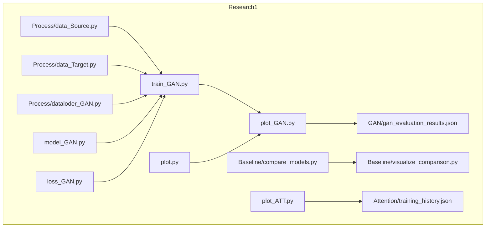
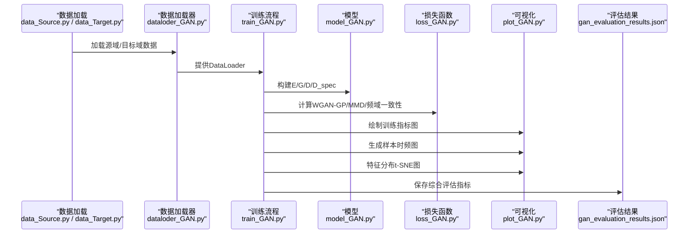
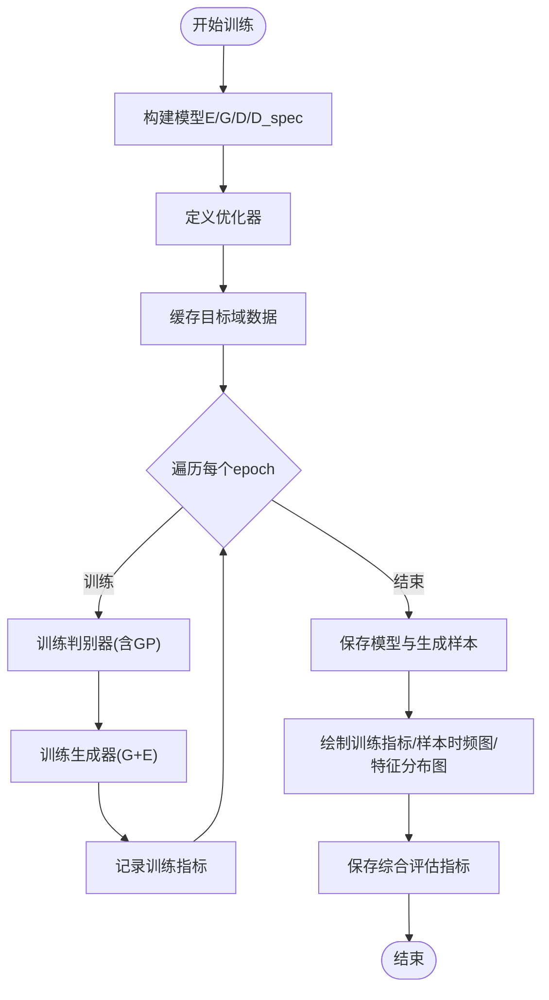
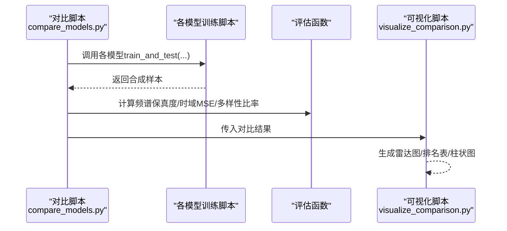
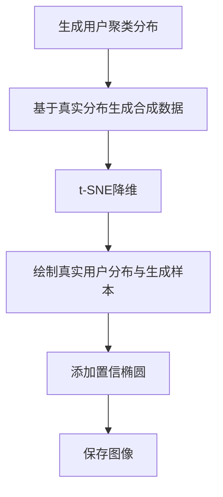
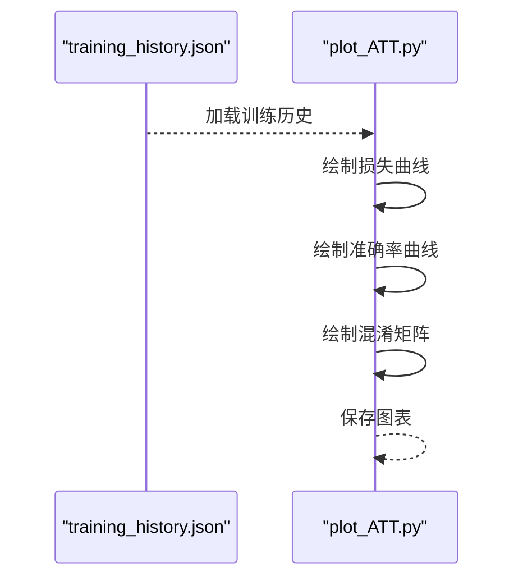
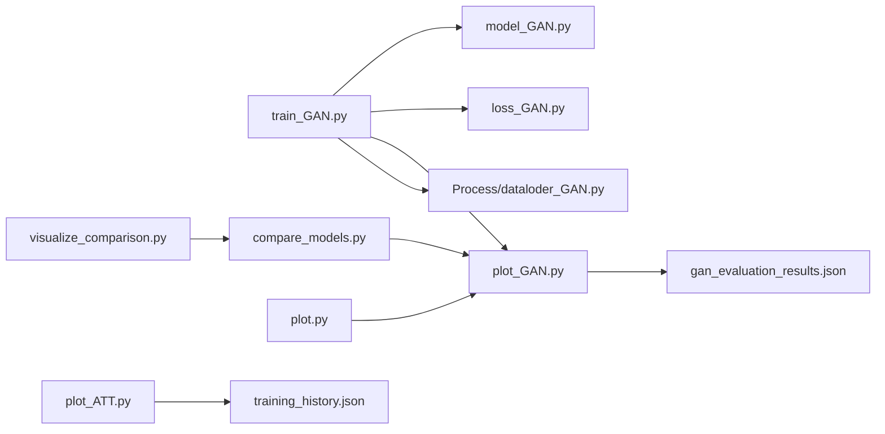

# 合成数据可视化

<cite>
**本文引用的文件**
- [Research1/train_GAN.py](file://Research1/train_GAN.py)
- [Research1/model_GAN.py](file://Research1/model_GAN.py)
- [Research1/loss_GAN.py](file://Research1/loss_GAN.py)
- [Research1/plot_GAN.py](file://Research1/plot_GAN.py)
- [Research1/Process/dataloder_GAN.py](file://Research1/Process/dataloder_GAN.py)
- [Research1/Process/data_Source.py](file://Research1/Process/data_Source.py)
- [Research1/Process/data_Target.py](file://Research1/Process/data_Target.py)
- [Research1/Baseline/compare_models.py](file://Research1/Baseline/compare_models.py)
- [Research1/Baseline/visualize_comparison.py](file://Research1/Baseline/visualize_comparison.py)
- [Research1/plot.py](file://Research1/plot.py)
- [Research1/plot_ATT.py](file://Research1/plot_ATT.py)
- [Research1/GAN/gan_evaluation_results.json](file://Research1/GAN/gan_evaluation_results.json)
- [Research1/Attention/training_history.json](file://Research1/Attention/training_history.json)
</cite>

## 目录
1. [简介](#简介)
2. [项目结构](#项目结构)
3. [核心组件](#核心组件)
4. [架构总览](#架构总览)
5. [详细组件分析](#详细组件分析)
6. [依赖关系分析](#依赖关系分析)
7. [性能考量](#性能考量)
8. [故障排查指南](#故障排查指南)
9. [结论](#结论)
10. [附录](#附录)

## 简介
本文件聚焦“合成数据可视化”，围绕研究一（Research1）中的生成模型训练与可视化流程展开，涵盖：
- GAN训练与评估全流程（含损失曲线、生成样本时频图、特征分布t-SNE图）
- 对比实验框架（VAE、CVAE、CycleGAN、DCGAN）的统一评估与可视化
- 交叉注意力模型训练历史的可视化
- 基于用户聚类与合成数据贴合的特征分布可视化

目标是帮助读者快速理解如何从训练日志、模型输出到生成图表的完整链路，并提供可复现的可视化实践建议。

## 项目结构
- Research1：生成模型与可视化相关代码与数据加载
  - train_GAN.py：完整训练流程（含WGAN-GP、MMD、频域一致性损失）
  - model_GAN.py：特征提取器、生成器、时域/频域判别器
  - loss_GAN.py：Wasserstein判别器损失、梯度惩罚、MMD、频域一致性、内容损失等
  - plot_GAN.py：训练指标图、生成样本时频图、特征分布图、综合评估指标保存
  - Process/dataloder_GAN.py：数据集封装与按标签均匀采样
  - Process/data_Source.py、data_Target.py：源域/目标域数据加载与保存
  - GAN/gan_evaluation_results.json：训练完成后保存的评估指标与历史
- Research1/Baseline：对比实验（VAE/CVAE/CycleGAN/DCGAN）的统一评估与可视化
  - compare_models.py：统一训练与评估，生成对比图表
  - visualize_comparison.py：详细对比图表（雷达图、排名表、柱状图）
- Research1/plot.py：用户聚类与合成数据贴合的特征分布t-SNE可视化
- Research1/plot_ATT.py：交叉注意力模型训练历史可视化（损失、准确率、混淆矩阵）
- Research1/Attention/training_history.json：注意力模型训练历史

图表来源
- [Research1/train_GAN.py](file://Research1/train_GAN.py#L1-L160)
- [Research1/model_GAN.py](file://Research1/model_GAN.py#L1-L235)
- [Research1/loss_GAN.py](file://Research1/loss_GAN.py#L1-L183)
- [Research1/plot_GAN.py](file://Research1/plot_GAN.py#L1-L120)
- [Research1/Process/dataloder_GAN.py](file://Research1/Process/dataloder_GAN.py#L1-L70)
- [Research1/Process/data_Source.py](file://Research1/Process/data_Source.py#L1-L113)
- [Research1/Process/data_Target.py](file://Research1/Process/data_Target.py#L1-L97)
- [Research1/GAN/gan_evaluation_results.json](file://Research1/GAN/gan_evaluation_results.json#L1-L120)
- [Research1/Baseline/compare_models.py](file://Research1/Baseline/compare_models.py#L1-L120)
- [Research1/Baseline/visualize_comparison.py](file://Research1/Baseline/visualize_comparison.py#L1-L120)
- [Research1/plot.py](file://Research1/plot.py#L1-L120)
- [Research1/plot_ATT.py](file://Research1/plot_ATT.py#L1-L120)
- [Research1/Attention/training_history.json](file://Research1/Attention/training_history.json#L1-L120)

章节来源
- [Research1/train_GAN.py](file://Research1/train_GAN.py#L1-L160)
- [Research1/plot_GAN.py](file://Research1/plot_GAN.py#L1-L120)
- [Research1/Baseline/compare_models.py](file://Research1/Baseline/compare_models.py#L1-L120)
- [Research1/plot.py](file://Research1/plot.py#L1-L120)
- [Research1/plot_ATT.py](file://Research1/plot_ATT.py#L1-L120)

## 核心组件
- 训练与评估流水线（Research1/train_GAN.py）
  - 模型构建：特征提取器E、生成器G、时域判别器D、频域判别器D_spec
  - 损失函数：WGAN-GP、MMD、频域一致性、内容损失
  - 生成样本：按目标域特征匹配生成，用于数据增强
  - 可视化：训练指标图、生成样本时频图、特征分布t-SNE图
  - 评估指标：FID、Inception Score、时域MSE、频谱相关性
- 对比实验（Research1/Baseline/compare_models.py）
  - 统一接口：train_and_test(model_path, epochs, lr, num_samples, ...)
  - 评估指标：频谱保真度、时域MSE、样本多样性比率
  - 可视化：基础对比图、详细对比图（雷达图、排名表、柱状图）
- 用户聚类与合成数据贴合（Research1/plot.py）
  - 生成用户聚类分布与合成数据贴合的t-SNE可视化
- 注意力模型训练历史可视化（Research1/plot_ATT.py）
  - 训练/验证/测试准确率曲线
  - 混淆矩阵
- 数据加载（Research1/Process/dataloder_GAN.py、data_Source.py、data_Target.py）
  - 自定义Dataset与按标签均匀采样
  - 源域/目标域数据加载与保存

章节来源
- [Research1/train_GAN.py](file://Research1/train_GAN.py#L1-L160)
- [Research1/Baseline/compare_models.py](file://Research1/Baseline/compare_models.py#L1-L120)
- [Research1/plot.py](file://Research1/plot.py#L1-L120)
- [Research1/plot_ATT.py](file://Research1/plot_ATT.py#L1-L120)
- [Research1/Process/dataloder_GAN.py](file://Research1/Process/dataloder_GAN.py#L1-L70)
- [Research1/Process/data_Source.py](file://Research1/Process/data_Source.py#L1-L113)
- [Research1/Process/data_Target.py](file://Research1/Process/data_Target.py#L1-L97)

## 架构总览
下图展示了从数据加载到训练、评估与可视化的端到端流程，以及对比实验与注意力模型的可视化路径。

图表来源
- [Research1/train_GAN.py](file://Research1/train_GAN.py#L1-L160)
- [Research1/model_GAN.py](file://Research1/model_GAN.py#L1-L235)
- [Research1/loss_GAN.py](file://Research1/loss_GAN.py#L1-L183)
- [Research1/plot_GAN.py](file://Research1/plot_GAN.py#L1-L120)
- [Research1/Process/dataloder_GAN.py](file://Research1/Process/dataloder_GAN.py#L1-L70)
- [Research1/Process/data_Source.py](file://Research1/Process/data_Source.py#L1-L113)
- [Research1/Process/data_Target.py](file://Research1/Process/data_Target.py#L1-L97)
- [Research1/GAN/gan_evaluation_results.json](file://Research1/GAN/gan_evaluation_results.json#L1-L120)

## 详细组件分析

### GAN训练与可视化（train_GAN.py + plot_GAN.py）
- 训练流程要点
  - 模型：特征提取器E、生成器G、时域判别器D、频域判别器D_spec
  - 损失：WGAN-GP（含梯度惩罚）、MMD、频域一致性、内容损失
  - 生成：按目标域特征匹配生成样本，用于数据增强
  - 可视化：训练指标图、生成样本时频图、特征分布t-SNE图
  - 评估：FID、Inception Score、时域MSE、频谱相关性
- 关键函数与路径
  - 训练入口：[train_and_test](file://Research1/train_GAN.py#L25-L158)
  - 训练循环：[train_epoch](file://Research1/train_GAN.py#L161-L289)
  - 生成样本：[generate_synthetic_samples](file://Research1/train_GAN.py#L291-L336)
  - 综合评估：[evaluate_gan_comprehensive](file://Research1/train_GAN.py#L502-L577)
  - 可视化入口：[plot_training_metrics](file://Research1/plot_GAN.py#L63-L118)、[plot_synthetic_sample_amplitude](file://Research1/plot_GAN.py#L163-L293)、[plot_feature_distribution_2d](file://Research1/plot_GAN.py#L295-L371)
  - 评估结果保存：[save_evaluation_results](file://Research1/plot_GAN.py#L121-L161)

图表来源
- [Research1/train_GAN.py](file://Research1/train_GAN.py#L1-L160)
- [Research1/plot_GAN.py](file://Research1/plot_GAN.py#L1-L120)

章节来源
- [Research1/train_GAN.py](file://Research1/train_GAN.py#L1-L160)
- [Research1/plot_GAN.py](file://Research1/plot_GAN.py#L1-L120)

### 对比实验与可视化（compare_models.py + visualize_comparison.py）
- 统一评估流程
  - 统一接口：train_and_test(model_path, epochs, lr, num_samples, ...)
  - 评估指标：频谱保真度、时域MSE、样本多样性比率
  - 可视化：基础对比图、详细对比图（雷达图、排名表、柱状图）
- 关键函数与路径
  - 统一训练与评估：[evaluate_model](file://Research1/Baseline/compare_models.py#L30-L71)
  - 主流程：[main](file://Research1/Baseline/compare_models.py#L76-L233)
  - 绘制对比图：[plot_comparison_results](file://Research1/Baseline/compare_models.py#L234-L292)
  - 详细可视化：[plot_detailed_comparison](file://Research1/Baseline/visualize_comparison.py#L25-L178)

图表来源
- [Research1/Baseline/compare_models.py](file://Research1/Baseline/compare_models.py#L1-L292)
- [Research1/Baseline/visualize_comparison.py](file://Research1/Baseline/visualize_comparison.py#L1-L178)

章节来源
- [Research1/Baseline/compare_models.py](file://Research1/Baseline/compare_models.py#L1-L292)
- [Research1/Baseline/visualize_comparison.py](file://Research1/Baseline/visualize_comparison.py#L1-L178)

### 用户聚类与合成数据贴合（plot.py）
- 功能概述
  - 生成用户聚类分布（10个用户，每用户固定样本数）
  - 基于真实用户分布生成合成数据，使其贴合真实分布
  - 使用t-SNE降维与置信椭圆展示真实与生成样本的贴合情况
- 关键函数与路径
  - 生成用户聚类：[generate_user_clusters](file://Research1/plot.py#L33-L114)
  - 生成贴合合成数据：[generate_matched_synthetic_data](file://Research1/plot.py#L117-L174)
  - t-SNE可视化（带置信椭圆）：[plot_feature_distribution_tsne_improved](file://Research1/plot.py#L177-L298)

图表来源
- [Research1/plot.py](file://Research1/plot.py#L1-L298)

章节来源
- [Research1/plot.py](file://Research1/plot.py#L1-L298)

### 注意力模型训练历史可视化（plot_ATT.py + training_history.json）
- 功能概述
  - 从JSON加载训练历史，绘制训练损失曲线（总损失、源域损失、目标域损失、MMD损失）
  - 绘制训练/验证/测试准确率曲线
  - 绘制混淆矩阵
- 关键函数与路径
  - 加载历史：[load_training_history](file://Research1/plot_ATT.py#L17-L33)
  - 绘制损失曲线：[plot_training_loss_curves](file://Research1/plot_ATT.py#L35-L98)
  - 绘制准确率曲线：[plot_accuracy_curves](file://Research1/plot_ATT.py#L100-L147)、[plot_test_accuracy_curves](file://Research1/plot_ATT.py#L149-L205)
  - 绘制混淆矩阵：[plot_confusion_matrix](file://Research1/plot_ATT.py#L207-L247)
  - 一键生成所有图表：[plot_all_training_results](file://Research1/plot_ATT.py#L249-L273)

图表来源
- [Research1/plot_ATT.py](file://Research1/plot_ATT.py#L1-L273)
- [Research1/Attention/training_history.json](file://Research1/Attention/training_history.json#L1-L120)

章节来源
- [Research1/plot_ATT.py](file://Research1/plot_ATT.py#L1-L273)
- [Research1/Attention/training_history.json](file://Research1/Attention/training_history.json#L1-L120)

## 依赖关系分析
- 模块耦合
  - train_GAN.py 依赖 model_GAN.py、loss_GAN.py、plot_GAN.py、Process/dataloder_GAN.py
  - plot_GAN.py 依赖 matplotlib、sklearn、scipy、numpy、torch
  - compare_models.py 依赖各模型训练脚本与plot_GAN.py
  - visualize_comparison.py 依赖matplotlib、numpy、json
  - plot.py 依赖matplotlib、sklearn、numpy、torch
  - plot_ATT.py 依赖matplotlib、seaborn、sklearn.metrics、json
- 外部依赖
  - PyTorch、NumPy、Matplotlib、Scikit-learn、SciPy、Seaborn

图表来源
- [Research1/train_GAN.py](file://Research1/train_GAN.py#L1-L160)
- [Research1/model_GAN.py](file://Research1/model_GAN.py#L1-L235)
- [Research1/loss_GAN.py](file://Research1/loss_GAN.py#L1-L183)
- [Research1/plot_GAN.py](file://Research1/plot_GAN.py#L1-L120)
- [Research1/Process/dataloder_GAN.py](file://Research1/Process/dataloder_GAN.py#L1-L70)
- [Research1/GAN/gan_evaluation_results.json](file://Research1/GAN/gan_evaluation_results.json#L1-L120)
- [Research1/Baseline/compare_models.py](file://Research1/Baseline/compare_models.py#L1-L120)
- [Research1/Baseline/visualize_comparison.py](file://Research1/Baseline/visualize_comparison.py#L1-L120)
- [Research1/plot.py](file://Research1/plot.py#L1-L120)
- [Research1/plot_ATT.py](file://Research1/plot_ATT.py#L1-L120)
- [Research1/Attention/training_history.json](file://Research1/Attention/training_history.json#L1-L120)

章节来源
- [Research1/train_GAN.py](file://Research1/train_GAN.py#L1-L160)
- [Research1/plot_GAN.py](file://Research1/plot_GAN.py#L1-L120)
- [Research1/Baseline/compare_models.py](file://Research1/Baseline/compare_models.py#L1-L120)
- [Research1/Baseline/visualize_comparison.py](file://Research1/Baseline/visualize_comparison.py#L1-L120)
- [Research1/plot.py](file://Research1/plot.py#L1-L120)
- [Research1/plot_ATT.py](file://Research1/plot_ATT.py#L1-L120)
- [Research1/Attention/training_history.json](file://Research1/Attention/training_history.json#L1-L120)

## 性能考量
- 训练稳定性
  - 使用谱归一化与梯度裁剪降低模式崩溃风险
  - WGAN-GP结合梯度惩罚，稳定判别器训练
- 评估指标
  - FID、Inception Score、时域MSE、频谱相关性用于多维度评估
- 可视化效率
  - t-SNE降维时根据样本规模动态设置困惑度
  - 生成样本时采用移动平均平滑与时频图绘制优化

[本节为通用指导，无需特定文件引用]

## 故障排查指南
- 训练日志缺失
  - 确认训练脚本是否正常保存训练历史与评估结果
  - 参考：[plot_training_metrics_from_json](file://Research1/plot_GAN.py#L46-L62)、[save_evaluation_results](file://Research1/plot_GAN.py#L121-L161)
- 图像未生成
  - 检查输出目录权限与路径
  - 参考：[plot_training_metrics](file://Research1/plot_GAN.py#L63-L118)、[plot_synthetic_sample_amplitude](file://Research1/plot_GAN.py#L163-L293)、[plot_feature_distribution_2d](file://Research1/plot_GAN.py#L295-L371)
- 数据加载问题
  - 确认数据文件路径与形状
  - 参考：[load_combined_env_data](file://Research1/Process/data_Source.py#L65-L92)、[load_env_data](file://Research1/Process/data_Target.py#L13-L68)
- 对比实验失败
  - 检查各模型训练脚本是否抛出异常
  - 参考：[main](file://Research1/Baseline/compare_models.py#L76-L233)

章节来源
- [Research1/plot_GAN.py](file://Research1/plot_GAN.py#L46-L161)
- [Research1/Process/data_Source.py](file://Research1/Process/data_Source.py#L65-L92)
- [Research1/Process/data_Target.py](file://Research1/Process/data_Target.py#L13-L68)
- [Research1/Baseline/compare_models.py](file://Research1/Baseline/compare_models.py#L76-L233)

## 结论
本项目围绕“合成数据可视化”构建了完整的训练-评估-可视化链路，覆盖：
- GAN训练与多指标评估（FID、IS、时域MSE、频谱相关性）
- 对比实验的统一评估与可视化（雷达图、排名表、柱状图）
- 用户聚类与合成数据贴合的t-SNE可视化
- 注意力模型训练历史的多维度可视化

这些组件共同支撑论文对比章节与数据增强实践，具备良好的可扩展性与可复现性。

[本节为总结性内容，无需特定文件引用]

## 附录
- 评估结果文件位置
  - GAN评估结果：[gan_evaluation_results.json](file://Research1/GAN/gan_evaluation_results.json#L1-L120)
  - 注意力模型训练历史：[training_history.json](file://Research1/Attention/training_history.json#L1-L120)
- 数据加载与保存
  - 源域数据加载与保存：[data_Source.py](file://Research1/Process/data_Source.py#L1-L113)
  - 目标域数据加载与保存：[data_Target.py](file://Research1/Process/data_Target.py#L1-L97)
  - 数据集封装与按标签采样：[dataloder_GAN.py](file://Research1/Process/dataloder_GAN.py#L1-L70)

章节来源
- [Research1/GAN/gan_evaluation_results.json](file://Research1/GAN/gan_evaluation_results.json#L1-L120)
- [Research1/Attention/training_history.json](file://Research1/Attention/training_history.json#L1-L120)
- [Research1/Process/data_Source.py](file://Research1/Process/data_Source.py#L1-L113)
- [Research1/Process/data_Target.py](file://Research1/Process/data_Target.py#L1-L97)
- [Research1/Process/dataloder_GAN.py](file://Research1/Process/dataloder_GAN.py#L1-L70)