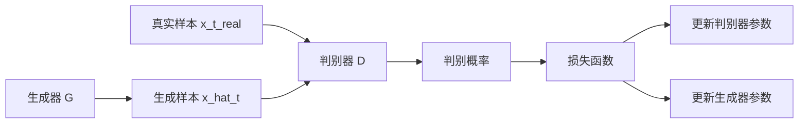

# 判别器

<cite>
**Referenced Files in This Document**   
- [model.py](file://GAN/model.py)
- [loss.py](file://GAN/loss.py)
- [train.py](file://GAN/train.py)
</cite>

## 目录
1. [引言](#引言)
2. [核心功能与定位](#核心功能与定位)
3. [网络结构剖析](#网络结构剖析)
4. [前向传播机制](#前向传播机制)
5. [对抗训练机制](#对抗训练机制)
6. [独立推理使用示例](#独立推理使用示例)
7. [训练挑战与应对策略](#训练挑战与应对策略)
8. [总结](#总结)

## 引言
判别器（Discriminator）是生成对抗网络（GAN）中的核心组件之一，其主要职责是区分输入样本是来自真实目标域还是由生成器产生的虚假样本。本文档将深入分析判别器的实现机制，包括其功能定位、网络结构、前向传播过程、与生成器的对抗关系以及在训练过程中面临的挑战和解决方案。

**Section sources**
- [model.py](file://GAN/model.py#L133-L165)

## 核心功能与定位
判别器的功能定位非常明确：接收一个形状为(B, C, S, T)的四维张量作为输入，其中B表示批次大小，C表示通道数，S表示子载波数量，T表示时间步长。经过一系列处理后，输出一个形状为(B, 1)的一维张量，该张量通过Sigmoid函数映射到[0, 1]区间，表示每个样本属于真实目标域的概率。

这种设计使得判别器能够对每个输入样本进行二分类判断，即判断其是真实样本还是生成样本。这一机制构成了GAN对抗训练的基础，通过与生成器的博弈，不断提升双方的性能。

**Section sources**
- [model.py](file://GAN/model.py#L133-L135)

## 网络结构剖析
判别器采用了一种典型的卷积神经网络结构，具体由三层1D卷积层构成，每层后接批归一化（Batch Normalization）、LeakyReLU激活函数和池化操作。这种结构设计旨在有效地提取输入数据的时空特征。

### 卷积层配置
- **第一层**：输入通道数为`3*56`（即C*S），输出通道数为64，卷积核大小为3，填充为1，后接最大池化操作，池化窗口大小为2。
- **第二层**：输入通道数为64，输出通道数为128，卷积核大小为3，填充为1，后接最大池化操作，池化窗口大小为2。
- **第三层**：输入通道数为128，输出通道数为256，卷积核大小为3，填充为1，后接自适应平均池化操作，池化窗口大小为1。

最终，通过一个全连接层将256维的特征向量映射到1维，并通过Sigmoid函数输出概率值。

```mermaid
graph TD
A[输入 (B, C, S, T)] --> B[重塑为 (B, C*S, T)]
B --> C[Conv1d + BatchNorm1d + LeakyReLU + MaxPool1d]
C --> D[Conv1d + BatchNorm1d + LeakyReLU + MaxPool1d]
D --> E[Conv1d + BatchNorm1d + LeakyReLU + AdaptiveAvgPool1d]
E --> F[全连接层]
F --> G[Sigmoid]
G --> H[输出 (B, 1)]
```

**Diagram sources**
- [model.py](file://GAN/model.py#L136-L157)

## 前向传播机制
判别器的前向传播过程可以分为以下几个步骤：

1. **输入重塑**：首先将输入张量从(B, C, S, T)重塑为(B, C*S, T)，以便于后续的1D卷积操作。
2. **卷积特征提取**：通过三层卷积网络逐层提取特征，每层都包含卷积、批归一化、激活函数和池化操作。
3. **特征压缩**：使用自适应平均池化将时间维度压缩为1，得到(B, 256, 1)的特征张量。
4. **全连接映射**：将特征张量展平为(B, 256)，并通过全连接层映射到(B, 1)。
5. **概率输出**：最后通过Sigmoid函数将输出限制在[0, 1]区间内，表示样本为真实样本的概率。

这个过程有效地将高维的时空数据压缩为单一的判别值，实现了从复杂输入到简单输出的转换。

**Section sources**
- [model.py](file://GAN/model.py#L159-L165)

## 对抗训练机制
判别器与生成器之间存在着强烈的对抗关系。这种对抗关系通过损失函数来体现，具体来说，判别器的目标是最小化其损失函数，而生成器的目标则是最大化判别器的损失函数。

### 损失函数
判别器的损失函数定义如下：
$$ L_D = -[\log(D(x_{t\_real})) + \log(1 - D(x_{hat\_t}))] $$

其中，$ x_{t\_real} $ 是真实目标域样本，$ x_{hat\_t} $ 是生成器生成的虚假样本。该损失函数鼓励判别器正确识别真实样本（使 $ D(x_{t\_real}) $ 接近1）并正确拒绝虚假样本（使 $ D(x_{hat\_t}) $ 接近0）。



**Diagram sources**
- [loss.py](file://GAN/loss.py#L37-L45)

**Section sources**
- [loss.py](file://GAN/loss.py#L37-L45)

## 独立推理使用示例
在实际应用中，判别器可以独立用于样本真实性评估。以下是一个简单的使用示例：

```python
# 假设已有训练好的判别器模型和待评估的样本
with torch.no_grad():
    # 将样本输入判别器
    pred = D(sample)
    # 输出为真实样本的概率
    print(f"Sample is real with probability: {pred.item()}")
```

这种独立使用方式可以在模型训练完成后，用于评估生成样本的质量或检测异常样本。

**Section sources**
- [train.py](file://GAN/train.py#L100-L105)

## 训练挑战与应对策略
在GAN的训练过程中，判别器可能会遇到一些挑战，如梯度消失问题和判别器过强导致生成器无法有效学习。

### 梯度消失问题
当判别器过于自信时，生成器的梯度可能会变得非常小，导致训练停滞。为了解决这个问题，可以采用标签平滑（Label Smoothing）技术，即在训练时将真实样本的标签从1稍微降低，虚假样本的标签从0稍微提高，从而避免判别器过于自信。

### 判别器过强问题
如果判别器过强，生成器可能难以产生足够逼真的样本以欺骗判别器。解决方法包括调整判别器和生成器的学习率，或者在训练过程中动态调整两者的训练频率，确保两者保持平衡。

**Section sources**
- [train.py](file://GAN/train.py#L100-L150)

## 总结
判别器作为GAN中的关键组件，通过其精心设计的卷积网络结构和对抗训练机制，有效地实现了对真实样本和生成样本的区分。通过对输入数据的时空特征提取和压缩，判别器能够输出一个表示样本真实性的概率值。同时，通过与生成器的对抗，不断推动生成器提升生成样本的质量。在实际应用中，需要注意解决梯度消失和判别器过强等问题，以确保GAN的稳定训练和良好性能。