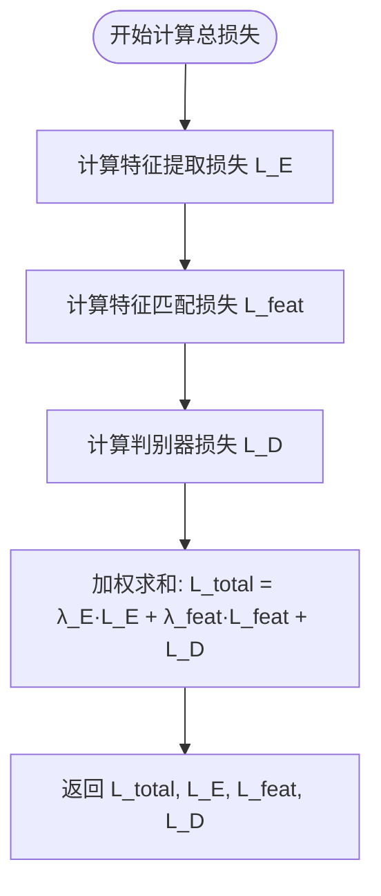
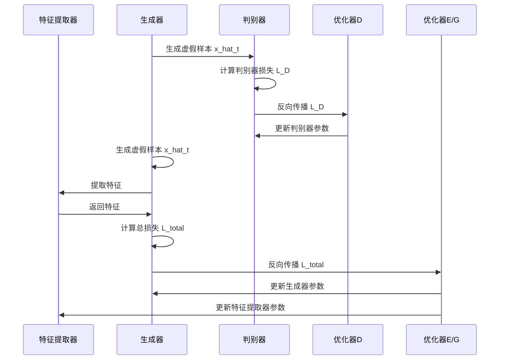

# 损失函数

<cite>
**Referenced Files in This Document**   
- [loss.py](file://GAN/loss.py)
- [train.py](file://GAN/train.py)
- [model.py](file://GAN/model.py)
</cite>

## 目录
1. [KL散度损失](#kl散度损失)
2. [特征匹配损失](#特征匹配损失)
3. [判别器损失](#判别器损失)
4. [总损失函数](#总损失函数)
5. [训练流程与反向传播](#训练流程与反向传播)
6. [损失曲线分析与调优](#损失曲线分析与调优)

## KL散度损失

`kl_divergence_loss` 函数用于衡量目标域特征分布的一致性，通过计算源域和目标域特征之间的KL散度来实现。该损失函数首先对输入特征进行softmax归一化处理，以确保特征向量的每个元素都在(0,1)区间内且总和为1，从而满足概率分布的要求。

在计算过程中，函数通过 `torch.log(features / (target_features + eps) + eps)` 计算相对熵，其中eps为极小值，用于防止除零错误和对数运算中的数值不稳定。最终返回所有样本KL散度的均值作为损失值，该值越小表示两个分布越接近。

**Section sources**
- [loss.py](file://GAN/loss.py#L3-L14)

## 特征匹配损失

`feature_matching_loss` 函数实现了生成特征与真实目标域特征的MSE（均方误差）匹配。该损失函数的核心思想是确保生成样本的语义特征与真实目标域样本的特征尽可能接近。

具体实现中，函数首先通过生成器G和特征提取器E获得生成样本的特征表示f_hat，然后从目标域特征f_t中随机采样或重复采样出与源域数据相同数量的样本作为真实特征。当目标域样本数量充足时，采用随机采样；当样本不足时，则采用重复采样策略。最后计算两个特征张量之间的MSE损失，该损失值越小表示生成特征与真实特征的匹配度越高。

**Section sources**
- [loss.py](file://GAN/loss.py#L17-L34)

## 判别器损失

`discriminator_loss` 函数采用标准对抗损失形式，旨在最大化判别器对真实样本的判别概率，同时最小化对生成样本的判别概率。这是典型的GAN框架中的判别器目标函数。

该损失由两部分组成：真实样本损失和生成样本损失。对于真实样本，计算 `-torch.mean(torch.log(real_pred + 1e-8))`，鼓励判别器输出接近1的概率值；对于生成样本，计算 `-torch.mean(torch.log(1 - fake_pred + 1e-8))`，鼓励判别器输出接近0的概率值。两个损失项相加构成总判别器损失，其中添加了极小值1e-8以确保对数运算的数值稳定性。

**Section sources**
- [loss.py](file://GAN/loss.py#L37-L45)

## 总损失函数

`compute_total_loss` 函数是整个模型的联合优化目标，通过加权组合三项损失形成最终的优化目标。该函数实现了 `min_{E,G} max_D L_total = λ_E * L_E + λ_feat * L_feat + L_D` 的优化框架。

函数首先计算特征提取损失L_E，采用优化实现方式避免O(n²)复杂度：计算每个样本特征与全局平均特征的KL散度，然后取均值。接着计算特征匹配损失L_feat和判别器损失L_D。最终通过加权求和得到总损失L_total，其中lambda_E和lambda_feat是可调节的超参数，分别控制特征提取损失和特征匹配损失的权重。

当目标域样本数量为1时，L_E被设置为0，避免单样本无法计算分布差异的问题。函数返回总损失及各项分损失，便于监控和调试。

**Diagram sources**
- [loss.py](file://GAN/loss.py#L48-L78)

**Section sources**
- [loss.py](file://GAN/loss.py#L48-L78)

## 训练流程与反向传播

训练流程在 `train_epoch` 函数中实现，采用交替优化策略：先更新判别器，再更新生成器和特征提取器。这种分步更新方式确保了对抗训练的稳定性。

在每个训练步骤中，首先固定生成器和特征提取器，仅更新判别器。计算判别器损失后进行反向传播，通过 `optimizer_D.step()` 更新判别器参数。然后固定判别器，更新生成器和特征提取器。计算总损失后进行反向传播，通过 `optimizer_G.step()` 和 `optimizer_E.step()` 同时更新两个网络的参数。

这种训练策略实现了对抗博弈的平衡：判别器努力提高区分能力，而生成器和特征提取器则努力生成更逼真的样本以欺骗判别器。lambda_E和lambda_feat超参数在训练过程中保持恒定，控制着不同损失项的相对重要性。

**Diagram sources**
- [train.py](file://GAN/train.py#L40-L108)

**Section sources**
- [train.py](file://GAN/train.py#L40-L108)

## 损失曲线分析与调优

损失曲线分析是监控模型训练过程的重要手段。理想的训练过程中，判别器损失L_D应保持在适当水平，既不过高也不过低。如果L_D过低，说明判别器过于强大，生成器难以学习；如果L_D过高，说明生成器生成的样本质量较差。

特征提取损失L_E和特征匹配损失L_feat应随训练逐步下降，表明生成样本的特征分布逐渐接近目标域。当出现损失不平衡时，可通过调整lambda_E和lambda_feat超参数进行调节。例如，若L_E下降缓慢，可适当增大lambda_E；若L_feat主导总损失，可适当减小lambda_feat。

建议在训练过程中定期保存模型检查点，并绘制各项损失的曲线图。通过观察损失曲线的收敛趋势和相对大小，可以及时发现训练问题并进行超参数调整，确保模型稳定收敛到理想状态。

**Section sources**
- [train.py](file://GAN/train.py#L110-L295)