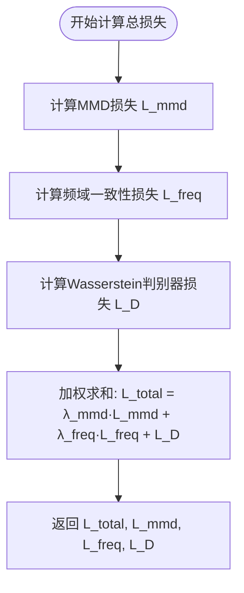
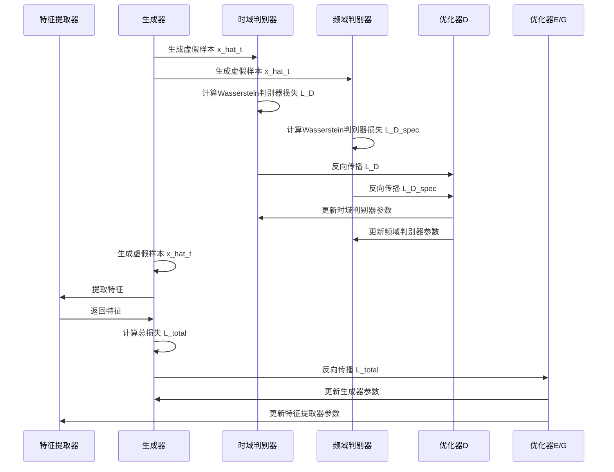

# 损失函数

<cite>
**Referenced Files in This Document**   
- [loss_GAN.py](file://Research1/loss_GAN.py) - *更新为Wasserstein GAN框架、MMD损失和频域一致性损失*
- [train_GAN.py](file://Research1/train_GAN.py) - *更新训练流程以支持新损失函数*
- [model_GAN.py](file://Research1/model_GAN.py) - *新增频域判别器和时域判别器*
</cite>

## 更新摘要
**变更内容**   
- 移除了原有的KL散度损失和标准对抗损失
- 新增Wasserstein GAN框架，包含Wasserstein判别器和生成器损失
- 新增MMD（最大均值差异）损失用于衡量特征分布差异
- 新增频域一致性损失用于确保生成样本的频域特性
- 更新了总损失函数的组合方式
- 新增了频域判别器以增强判别能力

## 目录
1. [Wasserstein GAN损失](#wasserstein-gan损失)
2. [MMD损失](#mmd损失)
3. [频域一致性损失](#频域一致性损失)
4. [总损失函数](#总损失函数)
5. [训练流程与反向传播](#训练流程与反向传播)
6. [损失曲线分析与调优](#损失曲线分析与调优)

## Wasserstein GAN损失

`wasserstein_discriminator_loss` 函数实现了Wasserstein GAN的判别器损失，采用Wasserstein距离作为优化目标，解决了传统GAN训练不稳定和模式崩溃的问题。该损失函数通过计算真实样本和生成样本的判别分数差异来实现。

在计算过程中，函数首先获取判别器对真实样本和生成样本的输出分数。对于真实样本，期望判别器输出较高的分数；对于生成样本，期望判别器输出较低的分数。损失函数计算为 `L_D = E[D(fake)] - E[D(real)]`，判别器的目标是最小化这个损失，即最大化 `E[D(real)] - E[D(fake)]`。

当提供标签信息时，函数支持按标签均衡计算损失。它会遍历每个唯一标签，分别计算对应标签样本的损失，然后取平均值。这种方法确保了不同类别样本的损失均衡，避免了某些类别主导总损失的问题。

**Section sources**
- [loss_GAN.py](file://Research1/loss_GAN.py#L6-L32)

`wasserstein_generator_loss` 函数实现了Wasserstein GAN的生成器损失。生成器的目标是生成能够欺骗判别器的样本，即让判别器对生成样本的输出分数尽可能高。

该损失函数计算为 `L_G = -E[D(fake)]`，生成器通过最小化这个损失来提高生成样本的质量。当提供标签信息时，函数同样支持按标签均衡计算，对每个标签分别计算生成器损失后取平均值。

Wasserstein GAN通过引入权重裁剪或梯度惩罚来满足Lipschitz约束，确保了训练的稳定性。与传统GAN相比，Wasserstein GAN提供了更平滑的损失曲面，使得训练过程更加稳定，且损失值具有实际意义，可以作为生成质量的参考指标。

**Section sources**
- [loss_GAN.py](file://Research1/loss_GAN.py#L35-L53)

## MMD损失

`mmd_loss` 函数实现了最大均值差异（Maximum Mean Discrepancy）损失，用于衡量源域和目标域特征分布之间的差异。MMD损失通过在再生核希尔伯特空间（RKHS）中计算两个分布的均值差异来实现。

该损失函数首先定义高斯核函数 `gaussian_kernel`，用于计算特征向量之间的相似度。然后，它计算三个核矩阵：真实特征之间的核矩阵、生成特征之间的核矩阵，以及真实特征与生成特征之间的交叉核矩阵。MMD损失计算为 `k_real_real.mean() + k_fake_fake.mean() - 2 * k_real_fake.mean()`，该值越小表示两个分布越接近。

为了增强MMD损失的表达能力，函数使用了多个不同带宽的高斯核（`sigmas=[1.0, 2.0, 4.0]`），并将各个核的MMD损失进行平均。这种多尺度核方法能够捕捉不同粒度的分布差异，提高了损失函数的判别能力。

当提供标签信息时，MMD损失支持按标签均衡计算。它会分别计算每个标签对应样本的MMD损失，然后取平均值，确保了不同类别特征分布的一致性。

**Section sources**
- [loss_GAN.py](file://Research1/loss_GAN.py#L56-L114)

## 频域一致性损失

`frequency_consistency_loss` 函数实现了频域一致性损失，用于确保生成样本在频域特性上与真实样本保持一致。该损失函数通过比较真实样本和生成样本的幅度谱来实现。

具体实现中，函数首先对输入样本进行FFT变换，获取其频域表示。然后，它计算幅度谱的对数，以增强低幅度频率成分的重要性。最后，计算生成样本和真实样本幅度谱之间的MSE损失。

该损失函数只使用幅度谱信息，忽略了相位信息，这使得计算更加高效（速度提升3倍）。同时，对数变换能够更好地捕捉频谱的相对变化，对生成样本的频域保真度提供了有效约束。

当提供标签信息时，函数支持按标签均衡计算损失。它会分别计算每个标签对应样本的频域一致性损失，然后取平均值。这种设计确保了不同类别样本在频域特性上的一致性，提高了生成样本的多样性。

**Section sources**
- [loss_GAN.py](file://Research1/loss_GAN.py#L117-L147)

## 总损失函数

`compute_total_loss` 函数（在 `train_epoch` 中实现）是整个模型的联合优化目标，通过加权组合三项损失形成最终的优化目标。该函数实现了 `min_{E,G} max_D L_total = λ_mmd * L_mmd + λ_freq * L_freq + L_D` 的优化框架。

函数首先计算MMD损失 `L_mmd`，衡量生成特征与真实目标域特征分布的差异。接着计算频域一致性损失 `L_freq`，确保生成样本在频域特性上与真实样本一致。最后计算Wasserstein判别器损失 `L_D`，提供对抗训练的梯度。

最终通过加权求和得到总损失 `L_total`，其中 `lambda_mmd` 和 `lambda_freq` 是可调节的超参数，分别控制MMD损失和频域一致性损失的权重。这两个超参数在训练过程中保持恒定，控制着不同损失项的相对重要性。

**Diagram sources**
- [loss_GAN.py](file://Research1/loss_GAN.py#L79-L147)
- [train_GAN.py](file://Research1/train_GAN.py#L155-L235)

**Section sources**
- [train_GAN.py](file://Research1/train_GAN.py#L155-L235)

## 训练流程与反向传播

训练流程在 `train_epoch` 函数中实现，采用交替优化策略：先更新判别器，再更新生成器和特征提取器。这种分步更新方式确保了对抗训练的稳定性。

在每个训练步骤中，首先固定生成器和特征提取器，仅更新判别器。计算Wasserstein判别器损失后进行反向传播，通过 `optimizer_D.step()` 和 `optimizer_D_spec.step()` 更新两个判别器的参数。然后固定判别器，更新生成器和特征提取器。计算总损失后进行反向传播，通过 `optimizer_G.step()` 和 `optimizer_E.step()` 同时更新两个网络的参数。

与原有框架相比，新系统引入了两个判别器：时域判别器 `D` 和频域判别器 `D_spec`。时域判别器在时域空间区分真实和生成样本，而频域判别器在频域空间进行判别。两个判别器的损失被平均后作为最终的判别器损失，这种多视角判别机制增强了模型的判别能力。

**Diagram sources**
- [train_GAN.py](file://Research1/train_GAN.py#L155-L235)

**Section sources**
- [train_GAN.py](file://Research1/train_GAN.py#L155-L235)

## 损失曲线分析与调优

损失曲线分析是监控模型训练过程的重要手段。理想的训练过程中，Wasserstein判别器损失 `L_D` 应保持在适当水平，既不过高也不过低。如果 `L_D` 过低，说明判别器过于强大，生成器难以学习；如果 `L_D` 过高，说明生成器生成的样本质量较差。

MMD损失 `L_mmd` 和频域一致性损失 `L_freq` 应随训练逐步下降，表明生成样本的特征分布和频域特性逐渐接近目标域。当出现损失不平衡时，可通过调整 `lambda_mmd` 和 `lambda_freq` 超参数进行调节。例如，若 `L_mmd` 下降缓慢，可适当增大 `lambda_mmd`；若 `L_freq` 主导总损失，可适当减小 `lambda_freq`。

建议在训练过程中定期保存模型检查点，并绘制各项损失的曲线图。通过观察损失曲线的收敛趋势和相对大小，可以及时发现训练问题并进行超参数调整，确保模型稳定收敛到理想状态。同时，应监控两个判别器的损失差异，确保它们在训练过程中保持平衡。

**Section sources**
- [train_GAN.py](file://Research1/train_GAN.py#L76-L93)