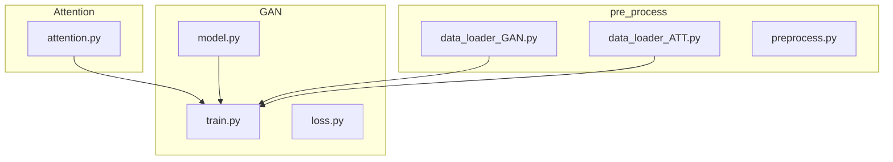
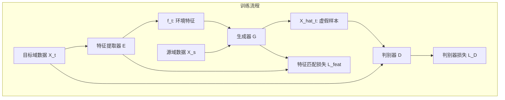
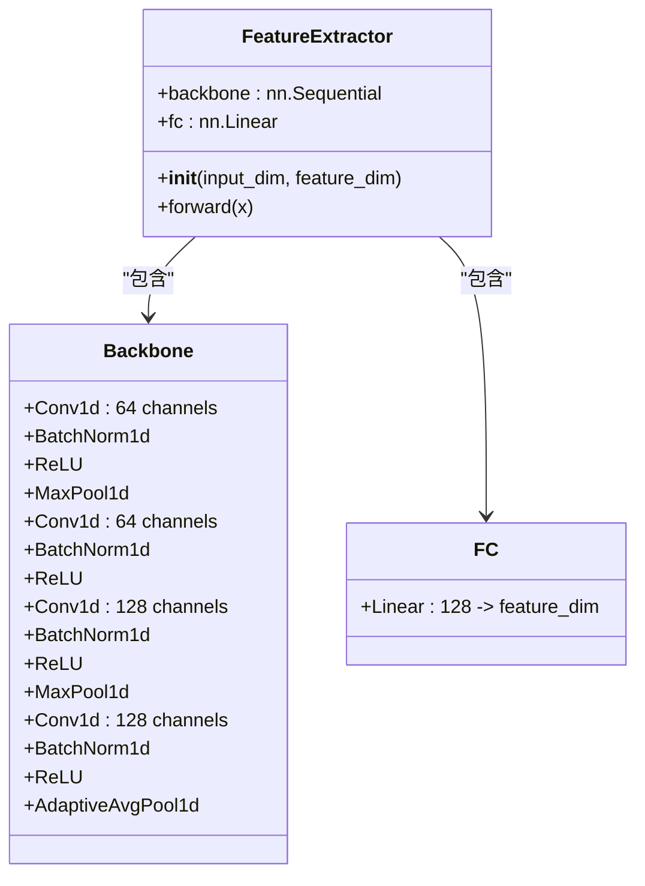
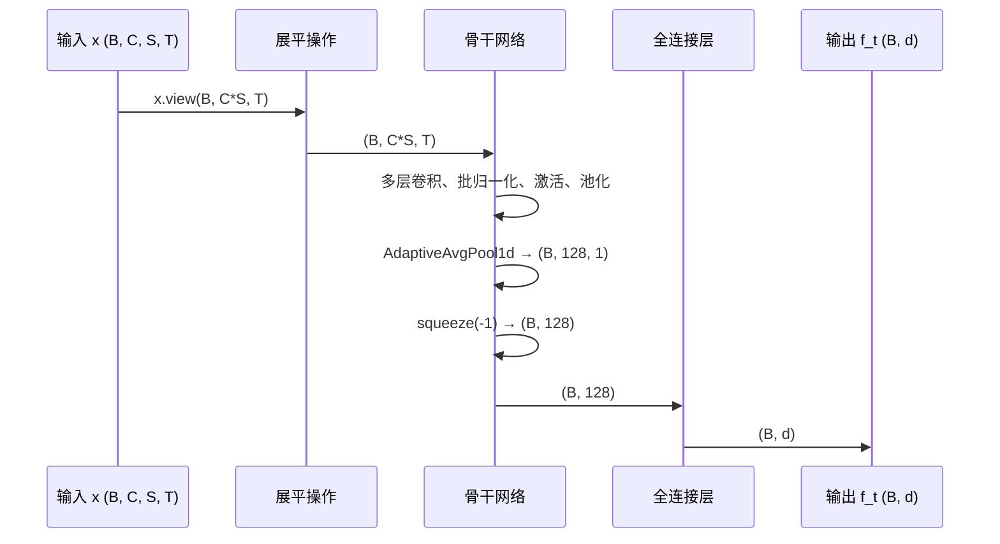
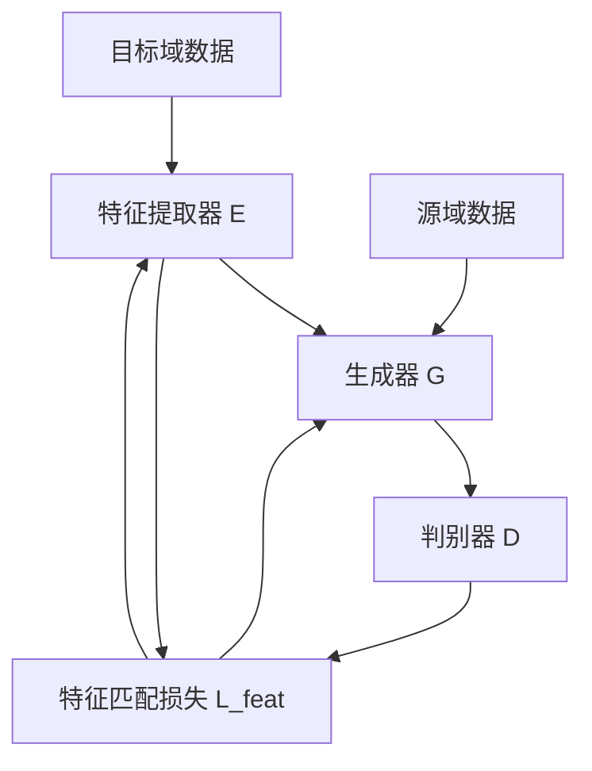

# 特征提取器

<cite>
**本文档中引用的文件**
- [model.py](file://GAN/model.py)
- [attention.py](file://Attention/attention.py)
- [train.py](file://GAN/train.py)
- [loss.py](file://GAN/loss.py)
</cite>

## 目录
1. [简介](#简介)
2. [项目结构](#项目结构)
3. [核心组件](#核心组件)
4. [架构概述](#架构概述)
5. [详细组件分析](#详细组件分析)
6. [依赖分析](#依赖分析)
7. [性能考虑](#性能考虑)
8. [故障排除指南](#故障排除指南)
9. [结论](#结论)

## 简介
本文档详细阐述了在GAN模型中`FeatureExtractor`的设计与实现。该模块作为目标域环境特征提取的核心组件，负责从输入的CSI数据中提取高层语义特征，用于后续的对抗训练和特征匹配损失计算。文档将深入解析其基于ResNet18架构的1D卷积骨干网络结构，并与注意力机制模型中的特征提取器进行对比。

## 项目结构
项目采用模块化设计，主要分为三个功能目录：`GAN`、`Attention`和`pre_process`。`GAN`目录包含生成对抗网络的核心模型定义与训练逻辑；`Attention`目录实现基于注意力机制的跨域特征对齐模型；`pre_process`目录则负责数据加载、预处理和数据集构建。



**图示来源**
- [model.py](file://GAN/model.py#L5-L48)
- [attention.py](file://Attention/attention.py#L4-L89)

**节来源**
- [model.py](file://GAN/model.py#L1-L174)
- [attention.py](file://Attention/attention.py#L1-L225)

## 核心组件
`FeatureExtractor`是GAN模型中的关键模块，其作用是从目标域的CSI数据中提取环境特征`f_t`。该特征不仅作为生成器的输入条件，还参与特征匹配损失的计算，以确保生成样本的特征分布与真实目标域样本一致。其输入为四维张量`(B, C, S, T)`，输出为`d`维特征向量`(B, d)`。

**节来源**
- [model.py](file://GAN/model.py#L5-L48)
- [train.py](file://GAN/train.py#L12-L37)

## 架构概述
GAN模型采用特征提取器-生成器-判别器的三重架构。特征提取器`E`从目标域数据中提取环境特征`f_t`；生成器`G`将源域数据`X_s`与`f_t`融合，生成符合目标域分布的虚假样本`X_hat_t`；判别器`D`则负责区分真实目标域样本与虚假样本。整个系统通过对抗训练和特征匹配损失共同优化。



**图示来源**
- [model.py](file://GAN/model.py#L5-L165)
- [loss.py](file://GAN/loss.py#L17-L34)

## 详细组件分析

### GAN特征提取器分析
`GAN.model.FeatureExtractor`基于ResNet18的简化架构，采用一维卷积骨干网络处理CSI数据。其设计将多天线、多子载波的CSI数据视为一维时间序列进行处理。

#### 网络结构


**图示来源**
- [model.py](file://GAN/model.py#L5-L48)

#### 前向传播流程


**图示来源**
- [model.py](file://GAN/model.py#L40-L48)

**节来源**
- [model.py](file://GAN/model.py#L5-L48)

### 注意力机制特征提取器分析
`Attention.attention.FeatureExtractor`采用两阶段处理策略，首先沿时间轴进行1D卷积，然后沿子载波轴进行2D卷积，更充分地挖掘CSI数据的时空特性。

#### 结构差异对比
```mermaid
flowchart TD
A[输入 (B, 56, 3, 6000)] --> B{处理策略}
B --> C["GAN: 展平为 (B, 168, 6000)"]
B --> D["Attention: 重塑为 (B*56, 3, 6000)"]
C --> E["单阶段1D卷积处理"]
D --> F["第一阶段: 1D卷积处理时间维度"]
F --> G["重塑为 (B, 56, 1024)"]
G --> H["第二阶段: 2D卷积处理子载波维度"]
E --> I["输出 (B, 128)"]
H --> J["输出 (B, 512)"]
```

**图示来源**
- [model.py](file://GAN/model.py#L5-L48)
- [attention.py](file://Attention/attention.py#L4-L89)

**节来源**
- [attention.py](file://Attention/attention.py#L4-L89)

## 依赖分析
`FeatureExtractor`模块在GAN系统中处于核心地位，与多个组件存在紧密依赖关系。它为生成器提供目标域环境特征，并与判别器协同参与对抗训练。其提取的特征还直接用于计算特征匹配损失。



**图示来源**
- [model.py](file://GAN/model.py#L5-L165)
- [loss.py](file://GAN/loss.py#L17-L34)

**节来源**
- [model.py](file://GAN/model.py#L169-L173)
- [loss.py](file://GAN/loss.py#L40-L79)

## 性能考虑
`FeatureExtractor`的性能直接影响整个GAN模型的训练效率和生成质量。其1D卷积架构计算效率高，但可能损失部分空间结构信息。相比之下，注意力模型的2D卷积架构能更好地捕捉子载波间的相关性，但计算开销更大。在实际应用中，应根据硬件资源和实时性要求进行权衡。

## 故障排除指南
使用`FeatureExtractor`时可能遇到的常见问题及解决方案：

- **输入维度错误**: 确保输入张量为四维`(B, C, S, T)`格式。若输入维度不正确，模块会抛出`ValueError`。
- **特征维度不匹配**: 检查`feature_dim`参数是否与下游模块（如生成器的`feature_proj`）的输入维度一致。
- **训练不稳定**: 可尝试调整特征匹配损失的权重`lambda_feat`，或在`fc`层后添加Dropout以提高泛化能力。

**节来源**
- [model.py](file://GAN/model.py#L40-L48)
- [attention.py](file://Attention/attention.py#L4-L89)

## 结论
`GAN.model.FeatureExtractor`是一个高效的目标域环境特征提取模块，其基于ResNet18的1D卷积架构能够有效处理高维CSI数据。它在对抗训练中扮演着双重角色：既为生成器提供环境条件，又通过特征匹配损失指导生成过程。与注意力机制模型中的特征提取器相比，它结构更简单、计算效率更高，但在捕捉复杂时空模式方面可能稍逊一筹。选择哪种设计应根据具体应用场景和性能要求决定。