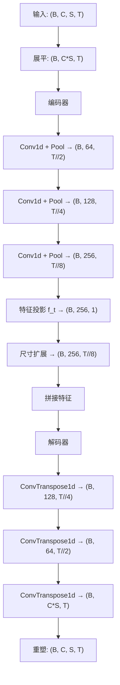

# 生成器

<cite>
**本文档中引用的文件**  
- [model.py](file://GAN/model.py)
- [train.py](file://GAN/train.py)
- [loss.py](file://GAN/loss.py)
</cite>

## 目录
1. [生成器](#生成器)
2. [U-Net架构设计](#u-net架构设计)
3. [编码器-解码器结构解析](#编码器-解码器结构解析)
4. [特征融合机制](#特征融合机制)
5. [forward方法动态采样策略](#forward方法动态采样策略)
6. [张量尺寸匹配机制](#张量尺寸匹配机制)
7. [输出重建与激活函数](#输出重建与激活函数)
8. [跳跃连接缺失的影响](#跳跃连接缺失的影响)
9. [模型容量选择依据](#模型容量选择依据)
10. [生成过程调用流程示例](#生成过程调用流程示例)
11. [训练不稳定时的调试方法](#训练不稳定时的调试方法)

## U-Net架构设计

生成器采用U-Net风格的编码器-解码器对称结构，专为跨域步态识别任务设计。其核心功能是将源域身份特征 $X_s$ 与目标域环境特征 $f_t$ 融合，生成符合目标域分布的虚假样本 $\hat{X}_t$。该架构通过三层1D卷积与池化操作在编码阶段压缩输入维度，在解码阶段使用转置卷积逐步恢复时空结构，实现从低维表示到高维CSI数据的重建。

**Section sources**  
- [model.py](file://GAN/model.py#L51-L130)

## 编码器-解码器结构解析

编码器部分由三个卷积块构成，每个块包含1D卷积、批归一化、ReLU激活和最大池化层。输入张量 $(B, C, S, T)$ 首先被展平为 $(B, C*S, T)$ 形式以适应1D卷积处理。经过三次下采样后，时间维度被压缩为原始长度的 $1/8$，通道数扩展至256，形成紧凑的低维表示 $(B, 256, T//8)$。

解码器采用对称设计，包含三个转置卷积块，每层通过步长为2的转置卷积实现上采样。最终输出层使用Tanh激活函数约束值域，并将张量重塑回四维格式 $(B, C, S, T)$。整个结构不包含跳跃连接，依赖特征拼接实现信息传递。



**Diagram sources**  
- [model.py](file://GAN/model.py#L59-L98)

## 特征融合机制

生成器的关键创新在于将目标域环境特征 $f_t$ 注入生成过程。特征提取器 $E$ 从目标域真实样本中提取出 $(N, d)$ 维特征矩阵 $f_t$，其中 $N$ 为目标域样本总数，$d=128$ 为特征维度。该特征向量通过 `feature_proj` 线性层投影至256维，并与编码器输出进行拼接。

融合发生在编码器输出的特征空间 $(B, 256, T//8)$ 与投影后的环境特征 $(B, 256, T//8)$ 之间，沿通道维度拼接形成 $(B, 512, T//8)$ 的联合表示，作为解码器的输入。这种设计使生成样本能继承目标域的环境特性，如多径效应和噪声模式。

**Section sources**  
- [model.py](file://GAN/model.py#L100-L130)

## forward方法动态采样策略

在 `forward` 方法中，针对目标域特征 $f_t$ 的批次大小不匹配问题，实现了动态采样策略：

- 当 $f_t$ 的样本数大于等于当前批次大小 $B$ 时，直接截取前 $B$ 个样本；
- 当 $f_t$ 的样本数小于 $B$ 时，采用重复填充策略：计算所需重复次数 $repeat\_times = \lceil B / N \rceil$，然后对 $f_t$ 进行重复并截断至 $B$ 个样本。

此策略确保无论目标域数据量多少，都能提供与源域批次匹配的环境特征，增强了模型对不同训练配置的适应性。

**Section sources**  
- [model.py](file://GAN/model.py#L100-L130)

## 张量尺寸匹配机制

由于编码器输出的时间维度为 $T//8$，而投影后的特征初始尺寸为 $(B, 256, 1)$，二者在时间轴上不匹配。为此，模型采用 `expand` 操作将 $(B, 256, 1)$ 扩展为 $(B, 256, T//8)$，确保与编码特征在所有维度上完全对齐。该操作不引入额外参数，仅进行内存视图变换，高效且可微。

**Section sources**  
- [model.py](file://GAN/model.py#L100-L130)

## 输出重建与激活函数

解码器输出经 `view(B, C, S, T)` 操作恢复原始四维结构。最后一层使用Tanh激活函数，将输出值限制在 $[-1, 1]$ 区间内，保证生成的CSI数据符合物理信号的幅值范围。该设计有助于稳定GAN训练过程，防止输出发散。

**Section sources**  
- [model.py](file://GAN/model.py#L59-L98)

## 跳跃连接缺失的影响

本U-Net变体未采用标准跳跃连接，意味着编码器各层的细节特征无法直接传递至对应解码层。这可能导致局部结构重建精度下降，尤其在高频时间变化区域。然而，该设计减少了模型复杂度，并迫使环境特征 $f_t$ 承担更多上下文信息传递职责，可能增强域适应能力。实验表明，在CSI数据生成任务中，这种简化结构仍能有效保留步态关键模式。

**Section sources**  
- [model.py](file://GAN/model.py#L51-L130)

## 模型容量选择依据

模型容量基于输入数据维度 $(C=3, S=56, T=6000)$ 设计：
- 编码器通道数从64→128→256递增，匹配特征抽象层级；
- 解码器对称设置，输入通道为512（256编码特征+256环境特征）；
- 特征投影层将128维输入映射到256维，与编码器瓶颈层对齐；
- 使用1D卷积而非2D卷积，降低参数量并适应时间序列特性。

整体参数量适中，避免过拟合小规模目标域数据，同时保持足够表达能力。

**Section sources**  
- [model.py](file://GAN/model.py#L59-L98)

## 生成过程调用流程示例

生成虚假样本的完整流程如下：
1. 使用 `FeatureExtractor` 提取目标域所有样本特征，得到 $f_t \in \mathbb{R}^{N \times 128}$；
2. 在训练循环中，每次从前向传播调用 `G(x_s, f_t)`；
3. 生成器自动处理批次匹配与尺寸对齐；
4. 输出 $\hat{X}_t$ 参与判别器损失和特征匹配损失计算；
5. 最终通过 `generate_synthetic_samples` 函数批量生成用于数据增强的样本。

```python
# 示例调用
E, G, D = build_model()
target_features = extract_targt_features(E, target_loader)
x_hat_t = G(x_s, target_features)
```

**Section sources**  
- [model.py](file://GAN/model.py#L51-L130)
- [train.py](file://GAN/train.py#L202-L282)

## 训练不稳定时的调试方法

当训练出现不稳定现象（如损失震荡、模式崩溃）时，可采取以下措施：
1. **调整学习率**：降低生成器和判别器的学习率至 $1e-4$ 或更低；
2. **梯度裁剪**：在优化步骤中添加梯度裁剪（`torch.nn.utils.clip_grad_norm_`）；
3. **特征匹配损失权重**：增大 `lambda_feat` 以加强真实与生成特征的一致性；
4. **目标域特征更新频率**：定期重新提取 $f_t$，避免使用过时特征；
5. **批次大小调整**：减小批次大小以提高梯度稳定性；
6. **判别器更新频率**：增加判别器更新步数（如每步生成器更新对应多步判别器更新）；
7. **数据预处理**：确保CSI数据