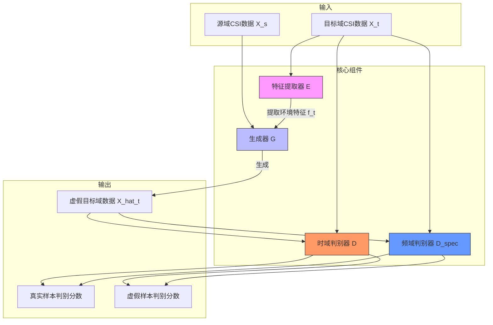
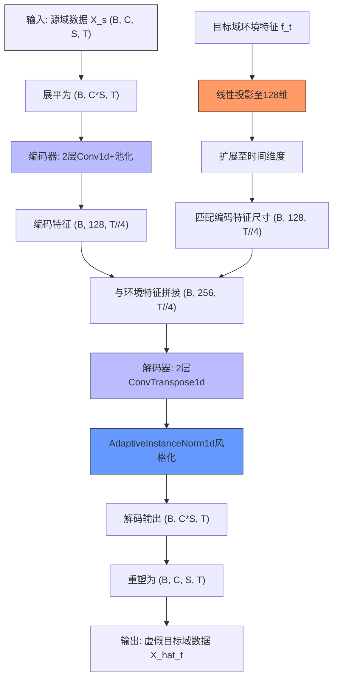
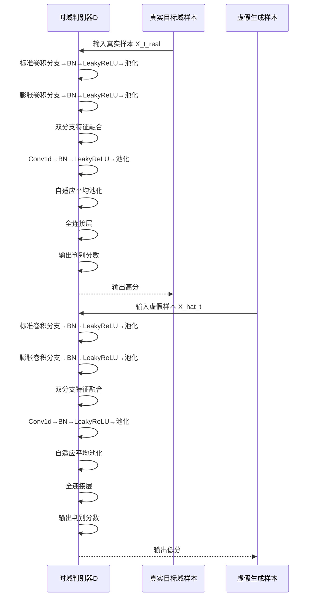
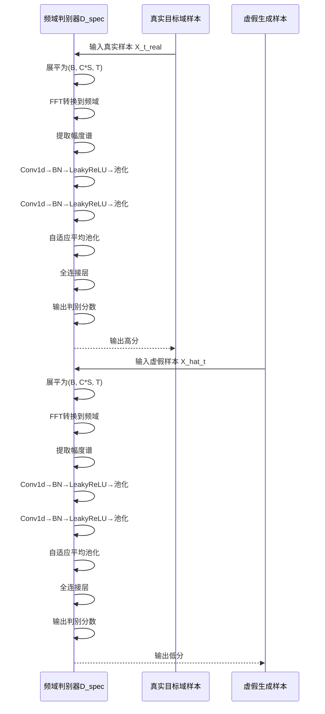
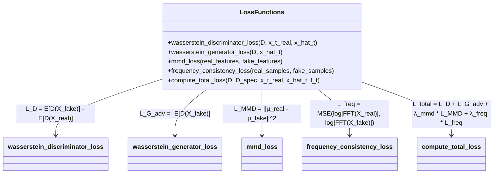

# 生成对抗网络（GAN）模型

<cite>
**Referenced Files in This Document**   
- [model_GAN.py](file://Research1/model_GAN.py) - *新增双判别器系统、AdaptiveInstanceNorm1d层和特征提取器优化*
- [loss_GAN.py](file://Research1/loss_GAN.py) - *新增频域一致性损失和Wasserstein损失*
- [train_GAN.py](file://Research1/train_GAN.py) - *更新训练流程以支持双判别器联合训练*
- [dataloder_GAN.py](file://Research1/Process/dataloder_GAN.py) - *数据加载器实现*
</cite>

## 更新摘要
**变更内容**   
- 新增双判别器系统（时域判别器和频域判别器）的架构设计与功能说明
- 新增AdaptiveInstanceNorm1d层的原理与实现细节
- 更新特征提取器的优化设计
- 更新生成器U-Net架构中特征融合机制
- 更新训练流程以支持双判别器联合训练
- 新增频域一致性损失函数说明
- 更新模型架构图示

## 目录
1. [引言](#引言)
2. [核心组件](#核心组件)
3. [架构概述](#架构概述)
4. [详细组件分析](#详细组件分析)
5. [训练流程解析](#训练流程解析)
6. [损失函数分析](#损失函数分析)
7. [模型优势与挑战](#模型优势与挑战)
8. [结论](#结论)

## 引言
本文系统阐述生成对抗网络（GAN）在跨域步态识别中的应用。该模型通过对抗训练机制，解决源域与目标域之间的分布差异问题，实现跨域身份识别。模型由特征提取器、生成器和双判别器三大核心组件构成，采用两阶段训练策略，有效提升在数据稀缺场景下的识别性能。本次更新重点介绍新增的双判别器系统、AdaptiveInstanceNorm1d层和特征提取器优化。

## 核心组件
本系统包含四个核心神经网络组件：特征提取器（FeatureExtractor）用于提取目标域环境特征；生成器（Generator）采用U-Net架构融合源域身份特征与目标域环境特征；时域判别器（Discriminator）负责在时域区分真实与生成的样本；频域判别器（SpectralDiscriminator）负责在频域区分真实与生成的样本。这些组件协同工作，实现跨域数据的分布对齐与样本生成。

**Section sources**
- [model_GAN.py](file://Research1/model_GAN.py#L5-L300)

## 架构概述
该GAN模型采用编码器-解码器结构，实现跨域CSI（信道状态信息）数据的转换。系统接收源域步态数据和目标域环境特征作为输入，生成符合目标域分布的虚假样本。整个架构通过双判别器对抗训练机制优化，使生成样本在时域和频域上均逼近真实目标域数据分布。



**Diagram sources**
- [model_GAN.py](file://Research1/model_GAN.py#L5-L300)

## 详细组件分析

### 特征提取器分析
特征提取器负责从目标域原始CSI数据中提取高层环境特征，这些特征包含目标环境特有的噪声、干扰和传播特性，但不包含身份信息。该组件采用一维卷积神经网络架构，通过多层卷积和池化操作逐步提取抽象特征。

```mermaid
classDiagram
    class FeatureExtractor {
        +backbone : nn.Sequential
        +fc : nn.Linear
        +__init__(input_dim, feature_dim)
        +forward(x) : Tensor
    }
    note right of FeatureExtractor "提取目标域环境特征<br/>输入 : (B, C, S, T)<br/>输出 : (B, d)"
```

**Diagram sources**
- [model_GAN.py](file://Research1/model_GAN.py#L34-L67)

### 生成器分析
生成器采用U-Net风格的编码器-解码器架构，实现源域到目标域的数据转换。其核心创新在于将目标域环境特征与源域身份特征进行有效融合，生成既保留身份信息又符合目标域环境特性的虚假样本。本次更新引入AdaptiveInstanceNorm1d层，实现更精细的特征风格化融合。

#### U-Net架构设计


**Diagram sources**
- [model_GAN.py](file://Research1/model_GAN.py#L74-L155)

### 判别器分析
判别器作为对抗训练中的"裁判"，其任务是区分输入样本是来自真实目标域还是由生成器创建的虚假样本。本次更新引入双判别器系统，分别在时域和频域进行判别，提高判别精度。

#### 时域判别器
时域判别器通过多尺度卷积网络学习目标域数据在时间维度上的真实分布特征。采用标准卷积和膨胀卷积双分支结构，分别捕捉局部细节和长距离依赖关系。



**Diagram sources**
- [model_GAN.py](file://Research1/model_GAN.py#L162-L224)

#### 频域判别器
频域判别器通过快速傅里叶变换（FFT）将输入样本转换到频域，然后使用卷积网络学习目标域数据在频谱维度上的真实分布特征。该判别器能有效捕捉CSI信号的频率特性。



**Diagram sources**
- [model_GAN.py](file://Research1/model_GAN.py#L231-L284)

### AdaptiveInstanceNorm1d层分析
AdaptiveInstanceNorm1d层是生成器中的关键创新，用于实现源域身份特征与目标域环境特征的自适应融合。该层使用目标域环境特征作为条件，对解码器特征进行风格化调制。

```mermaid
classDiagram
    class AdaptiveInstanceNorm1d {
        +norm : InstanceNorm1d
        +fc : Linear
        +__init__(num_features, feature_dim)
        +forward(x, style) : Tensor
    }
    note right of AdaptiveInstanceNorm1d "自适应实例归一化<br/>输入 : 特征x(B, C, T), 风格f_t(B, d)<br/>输出 : 风格化特征(B, C, T)"
```

**Diagram sources**
- [model_GAN.py](file://Research1/model_GAN.py#L11-L30)

## 训练流程解析
模型采用两阶段训练策略，先独立训练特征提取器，再联合优化生成器和双判别器。这种分阶段训练方法有助于稳定对抗训练过程，避免模式崩溃问题。更新后的训练流程同时优化时域和频域两个判别器。

```mermaid
flowchart LR
Start([开始训练]) --> ExtractFeature["提取目标域特征 f_t"]
ExtractFeature --> TrainD["更新时域判别器D"]
TrainD --> TrainDspec["更新频域判别器D_spec"]
TrainDspec --> GenFake["生成虚假样本 X_hat_t"]
GenFake --> CalcLD["计算判别器总损失 L_D"]
CalcLD --> UpdateD["反向传播更新D和D_spec参数"]
UpdateD --> TrainEG["更新生成器G和特征提取器E"]
TrainEG --> CalcTotal["计算总损失 L_total"]
CalcTotal --> UpdateEG["反向传播更新G和E参数"]
UpdateEG --> CheckEpoch{"是否完成所有轮次?"}
CheckEpoch --> |否| TrainD
CheckEpoch --> |是| GenerateSynthetic["生成虚假样本"]
GenerateSynthetic --> SaveData["保存扩充数据集"]
SaveData --> End([训练完成])
style Start fill:#cfc,stroke:#333
style End fill:#cfc,stroke:#333
style ExtractFeature fill:#f96,stroke:#333
style TrainD fill:#f96,stroke:#333
style TrainDspec fill:#f96,stroke:#333
style TrainEG fill:#f96,stroke:#333
```



**Section sources**
- [train_GAN.py](file://Research1/train_GAN.py#L75-L235)

## 损失函数分析
模型的优化目标由多个损失函数加权组成，包括对抗损失、分布对抗损失MMD和频域一致性损失，共同指导网络参数的更新方向。

### 对抗损失与重建损失


**Diagram sources**
- [loss_GAN.py](file://Research1/loss_GAN.py#L5-L147)

**Section sources**
- [loss_GAN.py](file://Research1/loss_GAN.py#L5-L147)

## 模型优势与挑战
### 优势
1. **数据稀缺场景适应性强**：通过生成虚假样本有效扩充目标域数据集，解决实际应用中目标域标注数据稀缺的问题。
2. **跨域迁移能力**：成功将源域知识迁移到目标域，实现无需目标域标注数据的跨域识别。
3. **特征解耦效果好**：能够有效分离身份特征与环境特征，提高模型的泛化能力。
4. **双判别器系统**：同时在时域和频域进行判别，提高生成样本的真实性和质量。
5. **AdaptiveInstanceNorm1d融合**：实现更精细的特征风格化融合，提升特征融合效果。

### 挑战
1. **训练稳定性**：对抗训练过程可能存在模式崩溃或训练不稳定问题，需要精心设计损失函数和训练策略。
2. **特征泄露风险**：环境特征提取器可能意外捕获部分身份信息，影响特征解耦效果。
3. **超参数敏感性**：模型性能对损失权重系数（如λ_mmd、λ_freq）较为敏感，需要仔细调优。
4. **计算复杂度**：双判别器系统增加了计算开销和训练时间。

## 结论
本文详细阐述了GAN模型在跨域步态识别中的应用。该模型通过特征提取器、生成器和双判别器的协同工作，实现了源域到目标域的有效迁移。U-Net架构的生成器成功融合了身份特征与环境特征，而AdaptiveInstanceNorm1d层实现了更精细的特征风格化融合。双判别器系统（时域和频域）确保了生成样本在时频域上的真实性。两阶段训练流程和多目标损失函数的设计，有效提升了模型在数据稀缺场景下的性能。未来工作可探索更先进的特征解耦技术和更稳定的对抗训练策略，进一步提升跨域识别的准确性和鲁棒性。