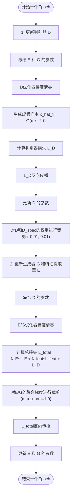
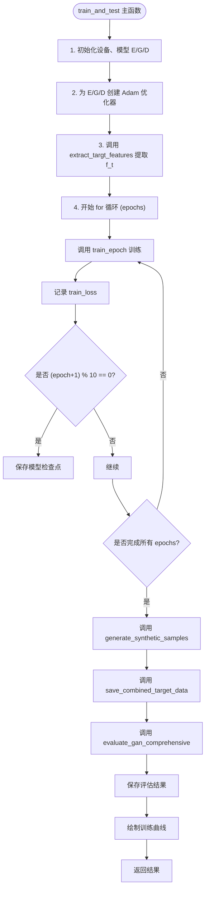

# 训练流程

<cite>
**Referenced Files in This Document**   
- [GAN/train_GAN.py](file://Research1\train_GAN.py) - *Updated in recent commit*
- [GAN/model_GAN.py](file://Research1\model_GAN.py) - *Updated in recent commit*
- [GAN/loss_GAN.py](file://Research1\loss_GAN.py) - *Updated in recent commit*
- [GAN/plot_GAN.py](file://Research1\plot_GAN.py) - *Added in recent commit*
- [pre_process/dataloder_GAN.py](file://Research1\Process\dataloder_GAN.py)
</cite>

## 目录
1. [两阶段训练流程](#两阶段训练流程)
2. [主函数执行逻辑](#主函数执行逻辑)
3. [虚假样本生成与数据增强](#虚假样本生成与数据增强)
4. [训练超参数设置](#训练超参数设置)
5. [典型训练问题与解决方案](#典型训练问题与解决方案)
6. [多卡训练扩展建议](#多卡训练扩展建议)

## 两阶段训练流程

该GAN模型采用两阶段训练策略，旨在实现源域到目标域的有效迁移。

### 第一阶段：目标域特征预提取

第一阶段通过调用 `extract_targt_features` 函数，利用特征提取器E对整个目标域数据集进行前向传播，预先提取并保存所有目标域样本的高层特征 `f_t`。此过程在训练主循环开始前执行一次，将提取的特征张量（形状为[目标域样本数, 128]）加载到GPU内存中。这一预处理步骤确保了在后续的每个训练周期中，生成器G可以高效地访问完整的目标域环境特征，避免了在每个批次中重复计算，从而显著提升了训练效率。

**Section sources**
- [train_GAN.py](file://Research1\train_GAN.py#L55-L72)

### 第二阶段：交替优化训练

第二阶段在 `train_epoch` 函数中实现，采用经典的GAN交替优化策略，分为两个子步骤：

1.  **固定生成器，更新判别器 (D)**：
    *   在此步骤中，生成器G和特征提取器E的参数被冻结。
    *   判别器D的优化器梯度清零。
    *   利用当前批次的源域数据 `x_s` 和预提取的目标域特征 `f_t`，通过生成器G生成虚假样本 `x_hat_t`。
    *   计算判别器损失 `L_D`，该损失旨在最大化D区分真实目标域样本 `x_t_real` 和虚假样本 `x_hat_t` 的能力。
    *   反向传播 `L_D` 并更新D的参数，以增强其判别能力。
    *   **新增梯度/权重裁剪**：为满足Wasserstein GAN的Lipschitz约束，对判别器D和频域判别器D_spec的权重进行裁剪，范围为[-0.01, 0.01]。

2.  **联合更新生成器与特征提取器 (E/G)**：
    *   在此步骤中，判别器D的参数被冻结。
    *   生成器G和特征提取器E的优化器梯度清零。
    *   计算总损失 `L_total`，该损失由三部分组成：
        *   **特征提取损失 `L_E`**：衡量目标域特征分布的内部一致性。
        *   **特征匹配损失 `L_feat`**：衡量生成的虚假样本特征 `E(G(x_s, f_t))` 与真实目标域样本特征 `f_t` 之间的均方误差。
        *   **判别器损失 `L_D`**：衡量生成器G欺骗判别器D的能力。
    *   总损失 `L_total` 通过加权和 `lambda_E * L_E + lambda_feat * L_feat + L_D` 计算。
    *   **新增梯度裁剪**：为稳定训练，对生成器G和特征提取器E的联合梯度进行裁剪，最大范数为1.0。
    *   反向传播 `L_total` 并联合更新E和G的参数，目标是让生成的样本在特征空间上与目标域数据匹配，同时能有效欺骗判别器。

这种交替优化机制确保了判别器和生成器在对抗中共同进化，最终达到纳什均衡。

**Diagram sources**
- [train_GAN.py](file://Research1\train_GAN.py#L154-L234)
- [loss_GAN.py](file://Research1\loss_GAN.py#L5-L146)

**Section sources**
- [train_GAN.py](file://Research1\train_GAN.py#L154-L234)
- [loss_GAN.py](file://Research1\loss_GAN.py#L5-L146)

## 主函数执行逻辑

`train_and_test` 函数是整个训练和测试流程的控制中心，其执行逻辑如下：

1.  **模型与优化器初始化**：
    *   调用 `build_model()` 函数实例化特征提取器E、生成器G和判别器D三个核心网络。
    *   为每个网络创建独立的Adam优化器，并使用相同的初始学习率 `lr`。

2.  **特征预提取**：
    *   调用 `extract_targt_features` 函数，使用初始化的特征提取器E从 `target_loader` 中提取所有目标域数据的特征 `f_t`，并将其保存以供后续训练使用。

3.  **Epoch循环与训练**：
    *   进入主训练循环，迭代 `epochs` 次。
    *   在每个epoch中，调用 `train_epoch` 函数执行一次完整的训练过程，并返回该epoch的平均训练损失。
    *   将损失值记录到 `train_losses` 列表中，用于后续绘制训练曲线。

4.  **模型保存机制**：
    *   实现了周期性模型保存策略。当 `(epoch + 1)` 能被10整除时，将当前模型的权重（包括E、G、D的状态字典）和优化器的状态字典打包，保存到指定的 `model_path` 文件中。这种检查点机制允许在训练中断后从中断点恢复，并便于选择性能最佳的模型。

5.  **训练后处理**：
    *   训练结束后，调用 `generate_synthetic_samples` 函数，利用训练好的模型生成虚假样本。
    *   最后，调用 `save_combined_target_data` 函数将生成的虚假样本与原始目标域数据合并并保存，完成数据增强。
    *   **新增评估流程**：在生成样本后，调用 `evaluate_gan_comprehensive` 函数执行全面的GAN质量评估，包括FID分数和频谱保真度计算，并将结果与训练历史一同保存。

**Diagram sources**
- [train_GAN.py](file://Research1\train_GAN.py#L25-L147)

**Section sources**
- [train_GAN.py](file://Research1\train_GAN.py#L25-L147)
- [model_GAN.py](file://Research1\model_GAN.py#L319-L328)

## 虚假样本生成与数据增强

### 虚假样本生成

`generate_synthetic_samples` 函数负责利用训练完成的模型生成虚假样本。其工作流程如下：
*   将特征提取器E和生成器G设置为评估模式（`eval()`），关闭Dropout等训练时特有的行为。
*   在无梯度计算的上下文（`torch.no_grad()`）中遍历源域数据加载器 `source_loader`。
*   对于每个批次的源域数据 `x_s`，使用预提取的目标域特征 `f_t` 作为条件，通过生成器G生成虚假的目标域样本 `x_hat_t`。
*   将生成的样本和对应的源域标签收集起来，直到达到指定的 `num_samples` 数量。
*   最终返回拼接后的虚假样本数据张量和标签张量。

**Section sources**
- [train_GAN.py](file://Research1\train_GAN.py#L240-L281)

### 数据增强

`save_combined_target_data` 函数实现了数据增强的核心步骤：
*   遍历 `target_loader`，将原始目标域的所有真实数据和标签拼接成完整的张量。
*   将生成的虚假样本 `synthetic_data` 与原始目标域数据 `target_data` 在批次维度上进行拼接，形成扩充后的数据集 `combined_data`。
*   同样地，将生成的标签与原始标签拼接。
*   将合并后的数据和标签分别保存为 `target_env2_gan_data.pt` 和 `target_env2_gan_labels.pt` 文件。这种数据增强策略有效增加了目标域的样本多样性，有助于提升下游任务（如分类）的模型泛化能力。

**Section sources**
- [train_GAN.py](file://Research1\train_GAN.py#L287-L314)

## 训练超参数设置

### 基础超参数
*   **epochs (训练轮数)**：建议初始设置为100轮。根据训练损失曲线的收敛情况调整。如果损失在后期趋于平稳，可提前终止；若仍在下降，则可适当增加轮数。
*   **lr (学习率)**：建议初始值为0.001。这是一个适用于Adam优化器的常用值。如果训练初期损失震荡剧烈，可尝试降低至0.0005；如果损失下降过慢，可尝试提高至0.002。

### 学习率衰减策略
当前代码未实现学习率衰减，但强烈建议添加。推荐使用 `torch.optim.lr_scheduler.ReduceLROnPlateau` 策略：
*   **原理**：当监测的指标（如验证损失）在连续几个epoch内不再改善时，自动将学习率乘以一个衰减因子（如0.5）。
*   **优势**：在训练初期使用较大学习率快速收敛，在后期使用较小学习率进行精细调整，有助于模型跳出局部最优，达到更好的性能。
*   **实现**：在 `train_and_test` 函数中定义一个学习率调度器，并在每个epoch后根据训练损失进行调度。

## 典型训练问题与解决方案

### 模式崩溃 (Mode Collapse)
*   **识别**：生成器G生成的虚假样本多样性极低，所有输出都趋向于同一种或少数几种模式，无法覆盖目标域的真实数据分布。
*   **缓解方法**：
    1.  **调整损失权重**：尝试增加特征匹配损失的权重 `lambda_feat`，强制生成器更关注特征空间的匹配，而非仅仅欺骗判别器。
    2.  **修改判别器损失**：考虑使用Wasserstein GAN (WGAN) 的损失函数，它提供了更平滑的梯度，有助于缓解模式崩溃。
    3.  **数据增强**：确保源域和目标域的数据质量，使用 `select_samples_by_label` 函数保证每个类别都有足够的样本。

## 多卡训练扩展建议

为了加速大规模数据集的训练，可以将模型扩展到多GPU训练：
*   **使用 `torch.nn.DataParallel`**：这是最简单的方案。将模型（如E、G、D）包装在 `DataParallel` 中，PyTorch会自动将输入数据分发到多个GPU上进行并行计算。
*   **使用 `torch.nn.parallel.DistributedDataParallel (DDP)`**：这是更高效、更推荐的方案，尤其适用于多节点训练。它通过分布式通信后端（如NCCL）实现更高效的梯度同步。
*   **注意事项**：在多卡训练时，需要相应地调整批次大小（batch size），因为总批次大小是单卡批次大小乘以GPU数量。同时，确保数据加载器的 `num_workers` 设置合理，以避免数据加载成为瓶颈。