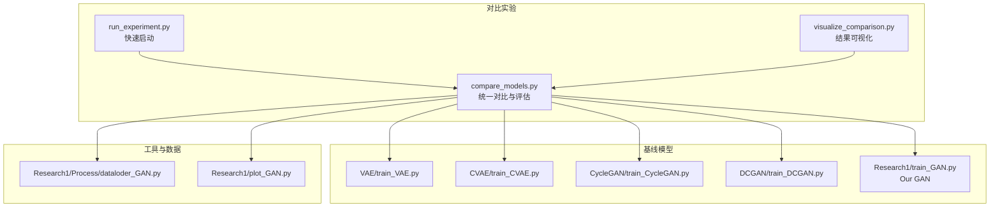
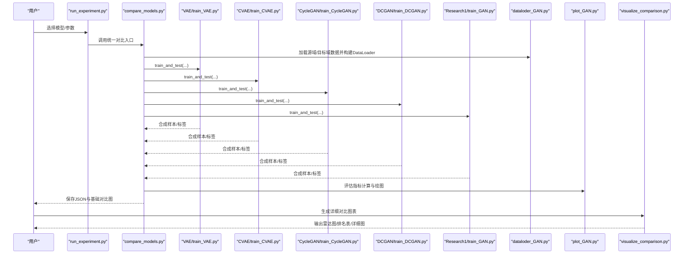
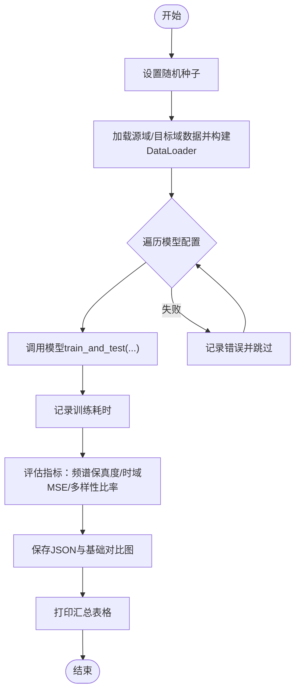
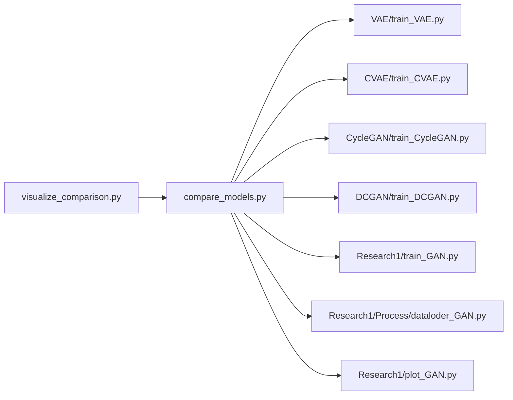

# 基线模型对比框架

<cite>
**本文引用的文件**
- [Research1/Baseline/compare_models.py](file://Research1/Baseline/compare_models.py)
- [Research1/Baseline/run_experiment.py](file://Research1/Baseline/run_experiment.py)
- [Research1/Baseline/visualize_comparison.py](file://Research1/Baseline/visualize_comparison.py)
- [Research1/Baseline/README.md](file://Research1/Baseline/README.md)
- [Research1/Baseline/FILE_SUMMARY.md](file://Research1/Baseline/FILE_SUMMARY.md)
- [Research1/train_GAN.py](file://Research1/train_GAN.py)
- [Research1/Process/dataloder_GAN.py](file://Research1/Process/dataloder_GAN.py)
- [Research1/plot_GAN.py](file://Research1/plot_GAN.py)
- [Research1/Baseline/VAE/train_VAE.py](file://Research1/Baseline/VAE/train_VAE.py)
- [Research1/Baseline/CVAE/train_CVAE.py](file://Research1/Baseline/CVAE/train_CVAE.py)
- [Research1/Baseline/CycleGAN/train_CycleGAN.py](file://Research1/Baseline/CycleGAN/train_CycleGAN.py)
- [Research1/Baseline/DCGAN/train_DCGAN.py](file://Research1/Baseline/DCGAN/train_DCGAN.py)
</cite>

## 目录
1. [简介](#简介)
2. [项目结构](#项目结构)
3. [核心组件](#核心组件)
4. [架构总览](#架构总览)
5. [详细组件分析](#详细组件分析)
6. [依赖关系分析](#依赖关系分析)
7. [性能考量](#性能考量)
8. [故障排查指南](#故障排查指南)
9. [结论](#结论)
10. [附录](#附录)

## 简介
本框架提供了一套统一的基线模型对比实验流水线，涵盖五类生成模型（VAE、CVAE、CycleGAN、DCGAN、Our GAN），在相同数据与实验条件下进行公平对比。对比指标包括：训练时间、频谱保真度（时域FFT幅度MSE）、时域MSE、样本多样性比率，并配套基础与详细可视化图表输出。用户可通过一键脚本运行完整对比，或选择单模型训练，亦可仅生成可视化图表复用已有结果。

## 项目结构
- Baseline 对比实验主目录包含：
  - 统一对比脚本：compare_models.py
  - 快速启动脚本：run_experiment.py
  - 结果可视化脚本：visualize_comparison.py
  - README 与文件清单：README.md、FILE_SUMMARY.md
- 各基线模型训练脚本位于 Baseline/{VAE,CVAE,CycleGAN,DCGAN}/train_*.py
- 数据加载与可视化工具位于 Research1/Process/* 与 Research1/plot_GAN.py
- 我们的 GAN 训练入口位于 Research1/train_GAN.py

**图表来源**
- [Research1/Baseline/compare_models.py](file://Research1/Baseline/compare_models.py#L1-L295)
- [Research1/Baseline/run_experiment.py](file://Research1/Baseline/run_experiment.py#L1-L74)
- [Research1/Baseline/visualize_comparison.py](file://Research1/Baseline/visualize_comparison.py#L1-L221)
- [Research1/Baseline/VAE/train_VAE.py](file://Research1/Baseline/VAE/train_VAE.py#L1-L200)
- [Research1/Baseline/CVAE/train_CVAE.py](file://Research1/Baseline/CVAE/train_CVAE.py#L1-L200)
- [Research1/Baseline/CycleGAN/train_CycleGAN.py](file://Research1/Baseline/CycleGAN/train_CycleGAN.py#L1-L200)
- [Research1/Baseline/DCGAN/train_DCGAN.py](file://Research1/Baseline/DCGAN/train_DCGAN.py#L1-L200)
- [Research1/train_GAN.py](file://Research1/train_GAN.py#L1-L200)
- [Research1/Process/dataloder_GAN.py](file://Research1/Process/dataloder_GAN.py#L1-L70)
- [Research1/plot_GAN.py](file://Research1/plot_GAN.py#L1-L200)

**章节来源**
- [Research1/Baseline/README.md](file://Research1/Baseline/README.md#L1-L178)
- [Research1/Baseline/FILE_SUMMARY.md](file://Research1/Baseline/FILE_SUMMARY.md#L1-L234)

## 核心组件
- 统一对比与评估（compare_models.py）
  - 加载源域/目标域数据，构建数据加载器
  - 定义五类模型的训练函数与参数配置
  - 依次训练各模型，记录训练耗时
  - 评估指标：频谱保真度（FFT幅度MSE）、时域MSE、样本多样性比率
  - 保存 JSON 结果与基础对比图；打印对比表格
- 快速启动（run_experiment.py）
  - 支持选择模型（vae/cvae/cyclegan/dcgan/our_gan/all）
  - 支持自定义训练轮数与生成样本数
- 结果可视化（visualize_comparison.py）
  - 读取对比结果 JSON
  - 生成横向柱状图、雷达图、综合排名表等
  - 输出详细对比图与摘要
- 数据加载与采样（Research1/Process/dataloder_GAN.py）
  - 自定义 Dataset 与按标签均匀采样函数
- 我们的 GAN 训练入口（Research1/train_GAN.py）
  - 统一训练流程、损失函数、评估与可视化
- 基线模型训练脚本（各模型 train_*.py）
  - 统一接口：train_and_test(model_path, epochs, lr/learning rates, num_samples, **kwargs)
  - 生成合成样本并保存评估结果

**章节来源**
- [Research1/Baseline/compare_models.py](file://Research1/Baseline/compare_models.py#L1-L295)
- [Research1/Baseline/run_experiment.py](file://Research1/Baseline/run_experiment.py#L1-L74)
- [Research1/Baseline/visualize_comparison.py](file://Research1/Baseline/visualize_comparison.py#L1-L221)
- [Research1/Process/dataloder_GAN.py](file://Research1/Process/dataloder_GAN.py#L1-L70)
- [Research1/train_GAN.py](file://Research1/train_GAN.py#L1-L200)
- [Research1/Baseline/VAE/train_VAE.py](file://Research1/Baseline/VAE/train_VAE.py#L1-L200)
- [Research1/Baseline/CVAE/train_CVAE.py](file://Research1/Baseline/CVAE/train_CVAE.py#L1-L200)
- [Research1/Baseline/CycleGAN/train_CycleGAN.py](file://Research1/Baseline/CycleGAN/train_CycleGAN.py#L1-L200)
- [Research1/Baseline/DCGAN/train_DCGAN.py](file://Research1/Baseline/DCGAN/train_DCGAN.py#L1-L200)

## 架构总览
下图展示了对比实验的端到端流程：统一调度器调用各模型训练脚本，收集训练耗时与评估指标，最终生成可视化结果。

**图表来源**
- [Research1/Baseline/run_experiment.py](file://Research1/Baseline/run_experiment.py#L1-L74)
- [Research1/Baseline/compare_models.py](file://Research1/Baseline/compare_models.py#L1-L295)
- [Research1/Baseline/VAE/train_VAE.py](file://Research1/Baseline/VAE/train_VAE.py#L1-L200)
- [Research1/Baseline/CVAE/train_CVAE.py](file://Research1/Baseline/CVAE/train_CVAE.py#L1-L200)
- [Research1/Baseline/CycleGAN/train_CycleGAN.py](file://Research1/Baseline/CycleGAN/train_CycleGAN.py#L1-L200)
- [Research1/Baseline/DCGAN/train_DCGAN.py](file://Research1/Baseline/DCGAN/train_DCGAN.py#L1-L200)
- [Research1/train_GAN.py](file://Research1/train_GAN.py#L1-L200)
- [Research1/Process/dataloder_GAN.py](file://Research1/Process/dataloder_GAN.py#L1-L70)
- [Research1/plot_GAN.py](file://Research1/plot_GAN.py#L1-L200)
- [Research1/Baseline/visualize_comparison.py](file://Research1/Baseline/visualize_comparison.py#L1-L221)

## 详细组件分析

### 统一对比与评估（compare_models.py）
- 功能要点
  - 数据加载：从 Data/ 加载源域与目标域数据，构建 DataLoader
  - 模型配置：统一以字典形式定义各模型训练函数与参数
  - 训练与评估：逐模型训练，记录耗时；评估指标包括频谱保真度、时域MSE、多样性比率
  - 结果持久化：保存 JSON 与基础对比图；打印汇总表格
- 关键流程
  - 评估函数：对合成样本与目标域样本进行频谱与时域对比，计算多样性比率
  - 统一入口：遍历模型配置，捕获异常，保证某模型失败不影响整体流程
  - 可视化：生成四子图（训练时间、频谱保真度、时域MSE、多样性比率）

**图表来源**
- [Research1/Baseline/compare_models.py](file://Research1/Baseline/compare_models.py#L1-L295)

**章节来源**
- [Research1/Baseline/compare_models.py](file://Research1/Baseline/compare_models.py#L1-L295)

### 快速启动（run_experiment.py）
- 功能要点
  - 命令行参数：--model、--epochs、--num_samples
  - 选择 all 时委托 compare_models 的 main
  - 单模型时直接调用对应 train_*.py
- 使用建议
  - 推荐使用 --model all 一键运行完整对比
  - 可通过 --epochs/--num_samples 调整实验规模

**章节来源**
- [Research1/Baseline/run_experiment.py](file://Research1/Baseline/run_experiment.py#L1-L74)

### 结果可视化（visualize_comparison.py）
- 功能要点
  - 读取 comparison_results.json
  - 生成横向柱状图、雷达图、综合排名表
  - 自动标注最优模型，输出详细对比图
- 输出内容
  - 训练时间、频谱保真度、时域MSE、多样性比率的横向对比
  - 雷达图展示综合性能（归一化后加权平均）
  - 排名表与摘要打印

**章节来源**
- [Research1/Baseline/visualize_comparison.py](file://Research1/Baseline/visualize_comparison.py#L1-L221)

### 数据加载与采样（Research1/Process/dataloder_GAN.py）
- 功能要点
  - 自定义 Dataset 类，支持索引访问
  - 按标签均匀采样：为每个类别选择固定数量样本，便于公平对比
- 设计意义
  - 保证目标域数据在对比实验中的一致性与代表性

**章节来源**
- [Research1/Process/dataloder_GAN.py](file://Research1/Process/dataloder_GAN.py#L1-L70)

### 我们的 GAN 训练入口（Research1/train_GAN.py）
- 功能要点
  - 统一训练流程：模型构建、优化器、缓存目标域数据、训练循环、保存模型
  - 生成合成样本并进行全面评估（四项指标）
  - 绘制训练指标、生成样本幅度图、特征分布图，并保存评估结果
- 与对比框架的关系
  - 作为 compare_models 中的一个训练函数被统一调用
  - 与基线模型共享统一接口约定

**章节来源**
- [Research1/train_GAN.py](file://Research1/train_GAN.py#L1-L200)

### 基线模型训练脚本（VAE/CVAE/CycleGAN/DCGAN）
- 统一接口
  - train_and_test(model_path, epochs, lr/learning rates, num_samples, **kwargs)
  - 返回合成样本与标签，供 compare_models 评估
- 共同点
  - 参数统计、训练循环、损失记录、生成样本、保存评估结果
- 差异点
  - VAE/CVAE：概率生成，含重构与KL损失，CVAE带标签条件
  - CycleGAN：双生成器/双判别器，含循环一致性与身份保持损失
  - DCGAN：经典GAN，BCE损失，从噪声生成样本
  - Our GAN：WGAN-GP，双判别器（时域/频域），MMD与频域一致性损失

**章节来源**
- [Research1/Baseline/VAE/train_VAE.py](file://Research1/Baseline/VAE/train_VAE.py#L1-L200)
- [Research1/Baseline/CVAE/train_CVAE.py](file://Research1/Baseline/CVAE/train_CVAE.py#L1-L200)
- [Research1/Baseline/CycleGAN/train_CycleGAN.py](file://Research1/Baseline/CycleGAN/train_CycleGAN.py#L1-L200)
- [Research1/Baseline/DCGAN/train_DCGAN.py](file://Research1/Baseline/DCGAN/train_DCGAN.py#L1-L200)

## 依赖关系分析
- 模块耦合
  - compare_models.py 依赖各模型训练脚本与数据加载工具
  - visualize_comparison.py 依赖 compare_models.py 生成的 JSON
  - 各模型训练脚本依赖 Research1/Process/* 与 Research1/plot_GAN.py
- 统一接口
  - 所有模型训练脚本均暴露 train_and_test 接口，便于 compare_models 统一调度
- 外部依赖
  - torch、numpy、matplotlib、sklearn 等

**图表来源**
- [Research1/Baseline/compare_models.py](file://Research1/Baseline/compare_models.py#L1-L295)
- [Research1/Baseline/visualize_comparison.py](file://Research1/Baseline/visualize_comparison.py#L1-L221)
- [Research1/Baseline/VAE/train_VAE.py](file://Research1/Baseline/VAE/train_VAE.py#L1-L200)
- [Research1/Baseline/CVAE/train_CVAE.py](file://Research1/Baseline/CVAE/train_CVAE.py#L1-L200)
- [Research1/Baseline/CycleGAN/train_CycleGAN.py](file://Research1/Baseline/CycleGAN/train_CycleGAN.py#L1-L200)
- [Research1/Baseline/DCGAN/train_DCGAN.py](file://Research1/Baseline/DCGAN/train_DCGAN.py#L1-L200)
- [Research1/train_GAN.py](file://Research1/train_GAN.py#L1-L200)
- [Research1/Process/dataloder_GAN.py](file://Research1/Process/dataloder_GAN.py#L1-L70)
- [Research1/plot_GAN.py](file://Research1/plot_GAN.py#L1-L200)

**章节来源**
- [Research1/Baseline/compare_models.py](file://Research1/Baseline/compare_models.py#L1-L295)
- [Research1/Baseline/visualize_comparison.py](file://Research1/Baseline/visualize_comparison.py#L1-L221)

## 性能考量
- 训练时间
  - 统一记录各模型耗时，便于横向比较
- 评估指标
  - 频谱保真度与时域MSE：衡量生成样本与真实样本在频域与时域的一致性
  - 多样性比率：衡量生成样本与真实样本的标准差比例，越接近1越好
- 可视化辅助
  - 基础对比图与详细对比图（雷达图、排名表）帮助直观判断优劣
- 实验配置
  - 固定训练轮数、生成样本数、批量大小、随机种子，确保公平对比

[本节为通用指导，无需具体文件引用]

## 故障排查指南
- 数据文件缺失
  - 确认 Data/ 下存在 source_env0_env1_data.pt、source_env0_env1_labels.pt、target_env2_data.pt、target_env2_labels.pt
- GPU/显存不足
  - 建议使用 GPU；若显存不足，可适当降低批量大小或减少样本数
- 训练异常
  - compare_models.py 对各模型训练过程进行 try-except 捕获，失败模型会记录错误并跳过，不影响其他模型
- 可视化无结果
  - 确保先运行 compare_models.py 生成 comparison_results.json 再运行 visualize_comparison.py

**章节来源**
- [Research1/Baseline/compare_models.py](file://Research1/Baseline/compare_models.py#L180-L203)
- [Research1/Baseline/visualize_comparison.py](file://Research1/Baseline/visualize_comparison.py#L12-L23)

## 结论
本框架通过统一接口、统一数据与实验条件，实现了对五类生成模型的公平对比。compare_models.py 作为统一调度器，结合 run_experiment.py 与 visualize_comparison.py，形成“训练—评估—可视化”的闭环，既满足快速对比需求，又提供深入的可视化分析。建议在论文对比章节中结合雷达图与排名表，突出 Our GAN 在频谱保真度、域适应能力与训练稳定性方面的优势。

[本节为总结性内容，无需具体文件引用]

## 附录
- 使用流程（快速开始）
  - 运行完整对比：python Baseline/compare_models.py
  - 生成详细对比图：python Baseline/visualize_comparison.py
- 常用命令
  - 快速启动：python Baseline/run_experiment.py --model all --epochs 50 --num_samples 900
  - 单模型训练：python Baseline/VAE/train_VAE.py

**章节来源**
- [Research1/Baseline/README.md](file://Research1/Baseline/README.md#L57-L112)
- [Research1/Baseline/FILE_SUMMARY.md](file://Research1/Baseline/FILE_SUMMARY.md#L155-L170)