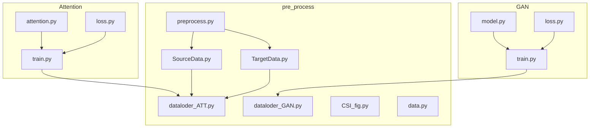
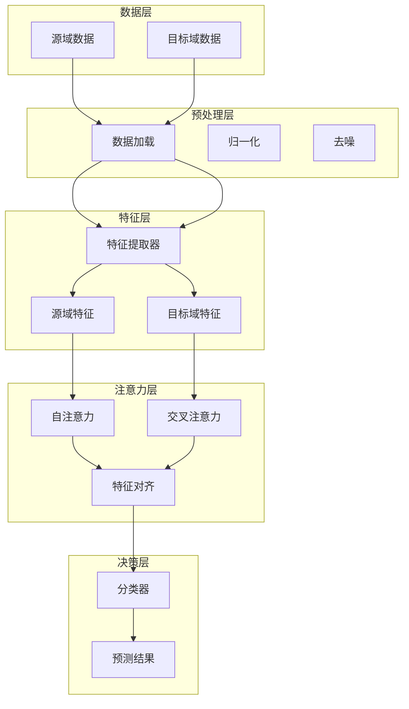
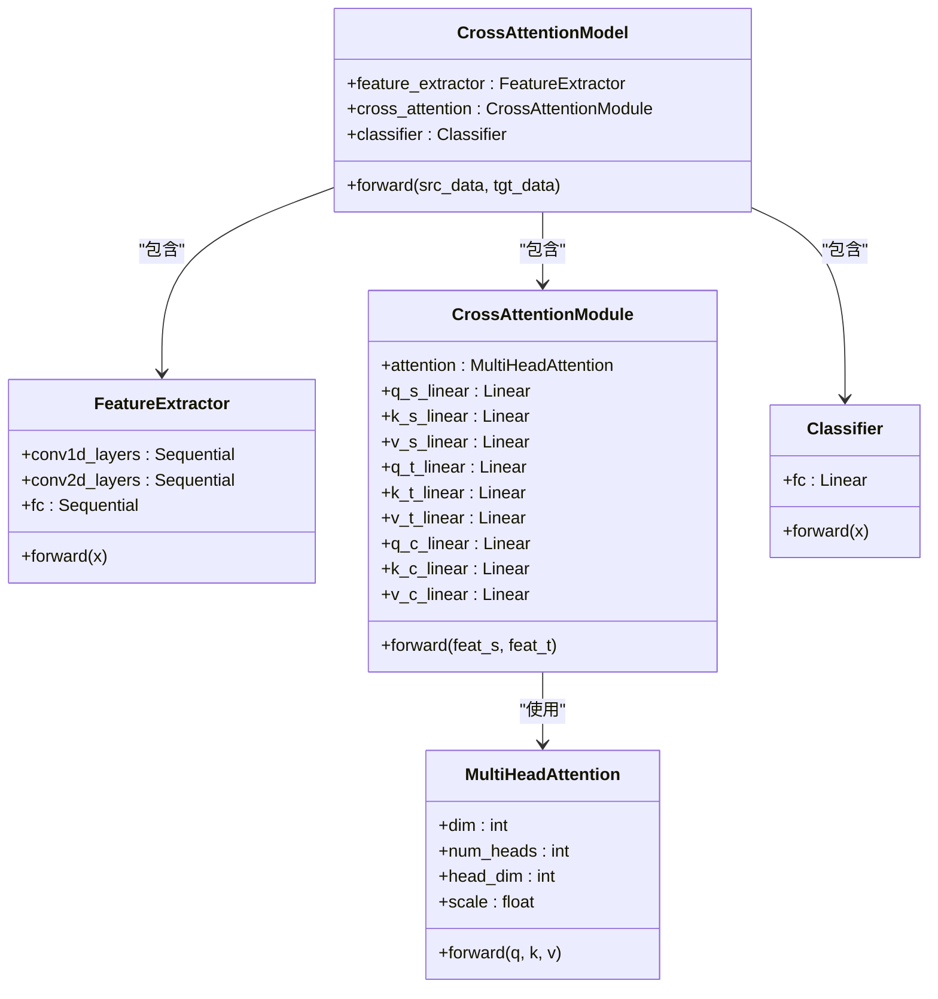
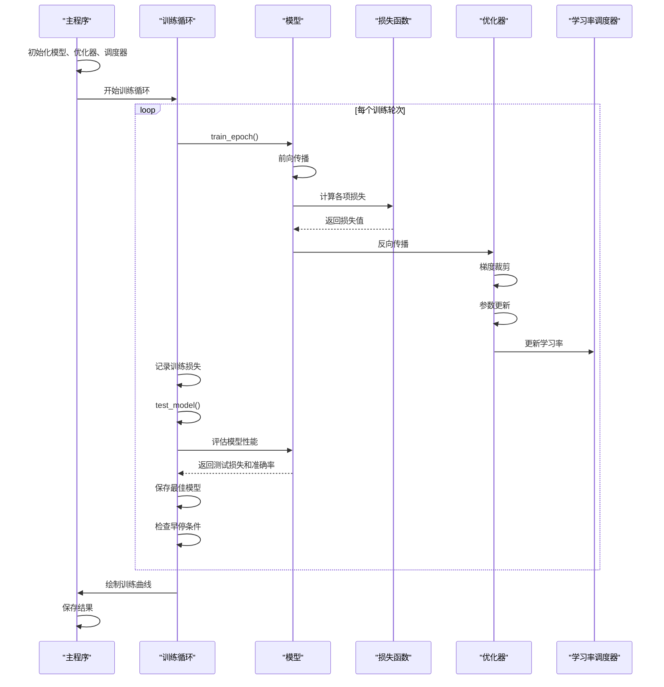

# 训练与评估

<cite>
**Referenced Files in This Document**   
- [train.py](file://Attention/train.py)
- [loss.py](file://Attention/loss.py)
- [attention.py](file://Attention/attention.py)
- [dataloder_ATT.py](file://pre_process/dataloder_ATT.py)
- [SourceData.py](file://pre_process/SourceData.py)
- [TargetData.py](file://pre_process/TargetData.py)
- [preprocess.py](file://pre_process/preprocess.py)
</cite>

## 目录
1. [训练与评估](#训练与评估)
2. [项目结构](#项目结构)
3. [核心组件](#核心组件)
4. [架构概述](#架构概述)
5. [详细组件分析](#详细组件分析)
6. [依赖分析](#依赖分析)
7. [性能考虑](#性能考虑)
8. [故障排除指南](#故障排除指南)
9. [结论](#结论)

## 项目结构

本项目采用模块化设计，主要分为三个功能模块：Attention、GAN和pre_process。Attention模块包含基于注意力机制的模型训练脚本和损失函数定义；GAN模块实现生成对抗网络的训练流程；pre_process模块负责数据预处理和加载。各模块通过清晰的目录结构组织，便于维护和扩展。



**Diagram sources**
- [Attention/train.py](file://Attention/train.py)
- [pre_process/dataloder_ATT.py](file://pre_process/dataloder_ATT.py)

**Section sources**
- [Attention/train.py](file://Attention/train.py)
- [pre_process/dataloder_ATT.py](file://pre_process/dataloder_ATT.py)

## 核心组件

Attention模块的核心组件包括CrossAttentionModel模型、LossFunction损失函数和训练流程控制。模型采用特征提取-交叉注意力-分类的三段式架构，通过多头注意力机制实现源域和目标域特征的交互学习。损失函数综合考虑源域分类、目标域分类、跨域特征一致性和特征一致性四个方面的损失，并通过可调节的权重参数进行平衡。训练流程实现了完整的机器学习周期，包括模型初始化、训练循环、测试评估和结果可视化。

**Section sources**
- [Attention/train.py](file://Attention/train.py#L0-L290)
- [Attention/attention.py](file://Attention/attention.py#L203-L224)
- [Attention/loss.py](file://Attention/loss.py#L4-L77)

## 架构概述

系统采用领域自适应学习架构，通过注意力机制实现跨域特征对齐。整体架构分为数据预处理、特征提取、注意力交互和分类决策四个层次。数据预处理模块负责加载和准备源域与目标域数据；特征提取模块使用卷积神经网络从原始CSI数据中提取高层次特征；注意力交互模块通过自注意力和交叉注意力机制实现域内和跨域特征关系建模；分类决策模块基于注意力增强的特征进行最终分类。



**Diagram sources**
- [Attention/train.py](file://Attention/train.py#L0-L290)
- [Attention/attention.py](file://Attention/attention.py#L203-L224)

## 详细组件分析

### 模型架构分析

#### 类图


**Diagram sources**
- [Attention/attention.py](file://Attention/attention.py#L203-L224)

**Section sources**
- [Attention/attention.py](file://Attention/attention.py#L203-L224)

### 训练流程分析

#### 序列图


**Diagram sources**
- [Attention/train.py](file://Attention/train.py#L0-L290)

**Section sources**
- [Attention/train.py](file://Attention/train.py#L0-L290)

### 损失函数分析

#### 流程图
```mermaid
flowchart TD
    Start([开始]) --> SourceLoss["计算源域分类损失"]
    SourceLoss --> TargetLoss["计算目标域分类损失"]
    TargetLoss --> CrossFeatureLoss["计算跨域特征一致性损失"]
    CrossFeatureLoss --> ConsistencyLoss["计算特征一致性损失"]
    ConsistencyLoss --> WeightedSum["加权求和总损失"]
    WeightedSum --> Gradient["反向传播梯度"]
    Gradient --> Clip["梯度裁剪"]
    Clip --> Update["更新模型参数"]
    Update -->