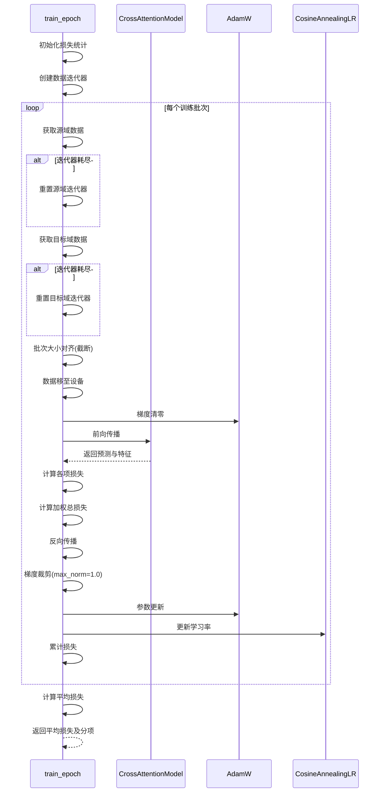
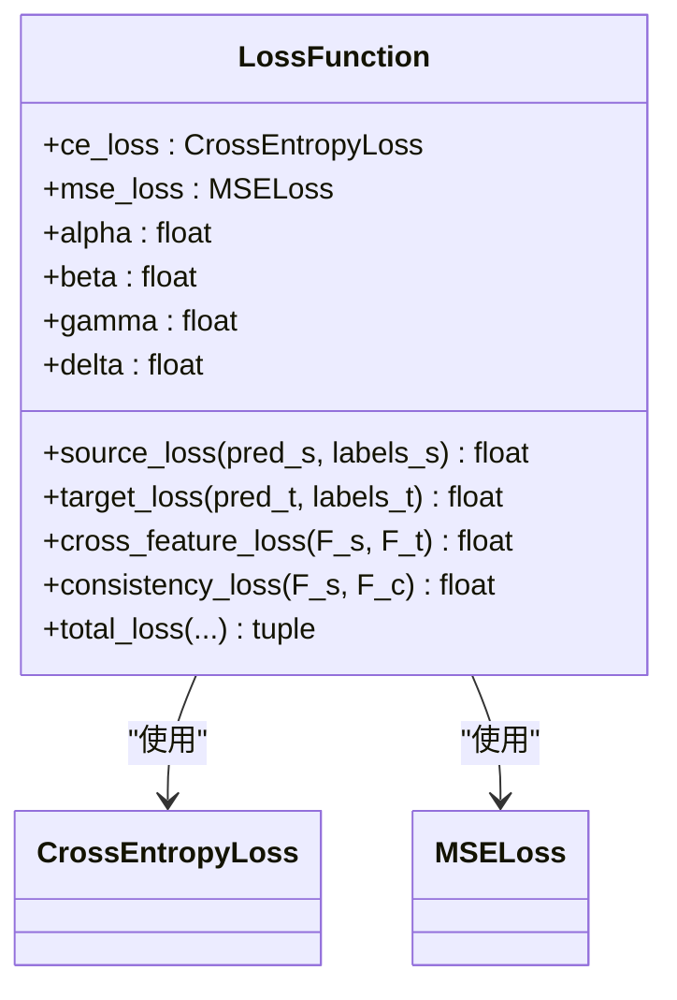
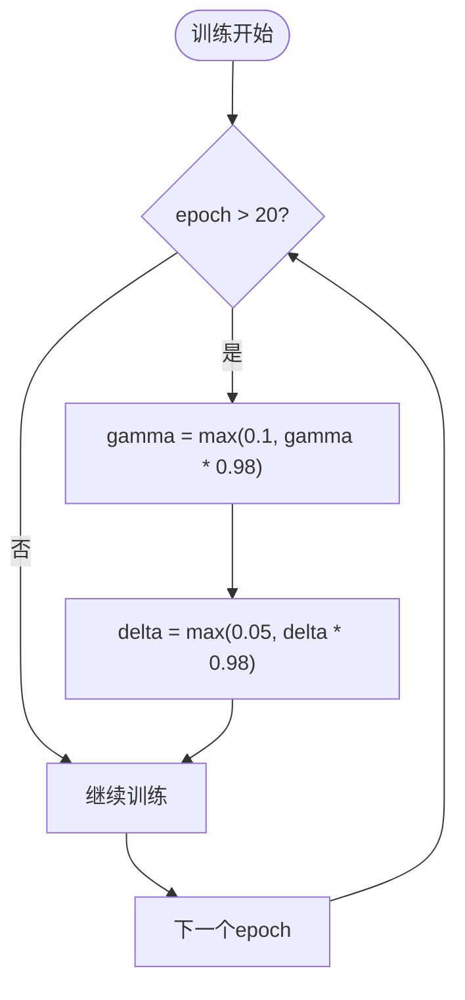

# 注意力机制模型训练流程

<cite>
**Referenced Files in This Document**   
- [train.py](file://Attention/train.py)
- [loss.py](file://Attention/loss.py)
- [attention.py](file://Attention/attention.py)
- [dataloder_ATT.py](file://pre_process/dataloder_ATT.py)
</cite>

## 目录
1. [训练流程概述](#训练流程概述)
2. [核心训练函数解析](#核心训练函数解析)
3. [多任务损失函数详解](#多任务损失函数详解)
4. [优化器与学习率调度](#优化器与学习率调度)
5. [关键训练实践](#关键训练实践)
6. [模型评估与保存](#模型评估与保存)
7. [异常处理建议](#异常处理建议)

## 训练流程概述

基于CSI数据的跨域步态识别系统采用注意力机制模型进行训练，其核心目标是通过多任务学习框架实现源域与目标域之间的知识迁移。整个训练流程由`train.py`文件中的`main()`函数驱动，协调数据加载、模型训练、测试评估和结果可视化等环节。系统首先初始化交叉注意力模型和多任务损失函数，然后使用AdamW优化器进行参数更新，并通过余弦退火学习率调度策略动态调整学习率。训练过程中，系统会监控目标域上的准确率，利用早停机制防止过拟合，并保存性能最佳的模型。

**Section sources**
- [train.py](file://Attention/train.py#L149-L290)

## 核心训练函数解析

`train_epoch`函数是整个训练过程的核心，负责协调源域与目标域数据的迭代处理。该函数首先将模型设置为训练模式，然后创建两个数据迭代器分别处理源域和目标域的数据加载器。由于两个域的数据集大小可能不同，函数采用较大的数据集作为基准轮数，通过`StopIteration`异常捕获机制实现数据迭代器的循环重置，确保每个epoch都能充分利用所有可用数据。

在每个训练批次中，函数会处理源域和目标域批次大小不一致的问题。具体策略是计算两个批次的最小批量大小，并对两个数据张量进行切片截断，使它们具有相同的批量维度。这种截断策略保证了后续前向传播操作的兼容性，避免了因维度不匹配导致的错误。

前向传播过程中，模型接收对齐后的源域和目标域数据，输出源域预测、目标域预测以及三种特征表示。反向传播阶段，系统计算加权总损失并执行梯度更新。为防止梯度爆炸，系统应用了梯度裁剪技术，将参数梯度的L2范数限制在1.0以内。



**Diagram sources**
- [train.py](file://Attention/train.py#L17-L102)

**Section sources**
- [train.py](file://Attention/train.py#L17-L102)

## 多任务损失函数详解

多任务损失函数由四个组成部分构成，每个部分都有特定的语义目标和数学实现。这些损失项通过可调节的权重参数（alpha, beta, gamma, delta）进行加权组合，形成最终的优化目标。

### 损失函数组成

| 损失类型 | 符号 | 作用 | 实现方式 |
|---------|------|------|---------|
| 源域分类损失 | L_S | 确保模型在标注数据上表现良好 | 交叉熵损失 |
| 目标域分类损失 | L_T | 提升模型在目标域的分类性能 | 交叉熵损失 |
| 跨域特征损失 | L_SF | 促进源域与目标域特征对齐 | 余弦相似性损失 |
| 一致性损失 | L_C | 维持特征变换过程中的信息一致性 | L1损失 |

这四个损失项通过以下公式进行加权组合：
```
总损失 = alpha × L_S + beta × L_T + gamma × L_SF + delta × L_C
```

其中，`alpha`和`beta`控制分类任务的重要性，而`gamma`和`delta`调节域适应和特征一致性的强度。初始权重设置为`alpha=1.0`, `beta=1.0`, `gamma=0.3`, `delta=0.2`，这种配置强调分类性能的同时，适度鼓励跨域特征对齐。



**Diagram sources**
- [loss.py](file://Attention/loss.py#L4-L77)

**Section sources**
- [loss.py](file://Attention/loss.py#L4-L77)

## 优化器与学习率调度

系统采用AdamW优化器进行参数更新，这是一种改进的Adam优化算法，能够更好地处理权重衰减。优化器配置包括基础学习率3e-4和权重衰减系数1e-4，这些超参数经过实验验证，能够在收敛速度和泛化性能之间取得良好平衡。

学习率调度策略采用余弦退火（CosineAnnealingLR），在50个周期内将学习率从初始值平滑降低到1e-6。这种调度方式有助于模型在训练初期快速收敛，在后期精细调整参数，避免陷入局部最优。

早停机制设置为`patience=15`，即当验证准确率连续15个epoch没有提升时，训练过程将提前终止。这一机制有效防止了模型过拟合，同时节省了不必要的计算资源。

**Section sources**
- [train.py](file://Attention/train.py#L149-L290)

## 关键训练实践

### 模型结构测试

在正式训练前，系统执行模型结构测试，使用随机生成的测试数据验证模型的输入输出维度是否正确。测试数据的形状模拟真实CSI数据（`[2, 56, 3, 6000]`），通过前向传播检查模型能否产生预期的输出形状。这一实践有助于在训练开始前发现潜在的维度错误。

### 数据加载器验证

系统在训练前对数据加载器进行验证，检查前几个批次的数据形状和标签范围。这确保了数据预处理流程的正确性，避免因数据问题导致训练失败。数据加载器使用`batch_size=32`和随机打乱（shuffle=True）策略，以提高训练的稳定性和收敛性。

### 动态损失权重调整

随着训练进程的推进，系统动态调整跨域适应相关的损失权重。从第20个epoch开始，`gamma`和`delta`参数以0.98的衰减因子逐epoch递减，但保持不低于0.1和0.05的下限。这种策略允许模型在训练初期专注于域适应，在后期更关注分类性能的精细优化。



**Diagram sources**
- [train.py](file://Attention/train.py#L149-L290)

**Section sources**
- [train.py](file://Attention/train.py#L149-L290)

## 模型评估与保存

`test_model`函数负责评估模型在目标域上的性能。该函数将模型设置为评估模式，禁用dropout等随机操作。在测试过程中，系统使用`torch.no_grad()`上下文管理器禁用梯度计算，以提高推理效率并减少内存占用。

评估过程遍历目标域数据加载器，计算目标域分类损失和准确率。准确率通过比较预测类别和真实标签计算得出。测试结果用于判断是否需要更新最佳模型。

`save_best_model`函数实现了最佳模型的持久化存储。当当前epoch的准确率超过历史最佳值时，系统调用此函数将模型状态字典、当前准确率和epoch编号保存到指定路径。保存的检查点包含完整的信息，便于后续的模型恢复和分析。

**Section sources**
- [train.py](file://Attention/train.py#L105-L146)

## 异常处理建议

系统内置了针对模型前向传播错误的异常处理机制。当`train_epoch`函数捕获到前向传播异常时，它会打印详细的调试信息，包括当前批次的源域和目标域数据形状以及具体的错误信息。这些信息对于排查维度不匹配、内存溢出等问题至关重要。

建议的排查步骤包括：首先检查输入数据的预处理流程，确保数据形状符合模型期望；其次验证模型结构的各个组件，特别是卷积层和全连接层的维度变换；最后考虑降低批次大小以缓解内存压力。通过这些系统化的调试