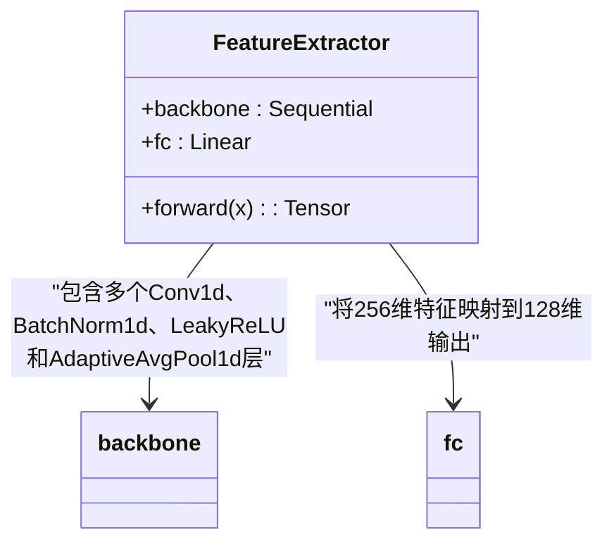
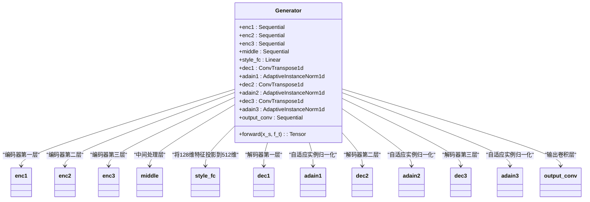
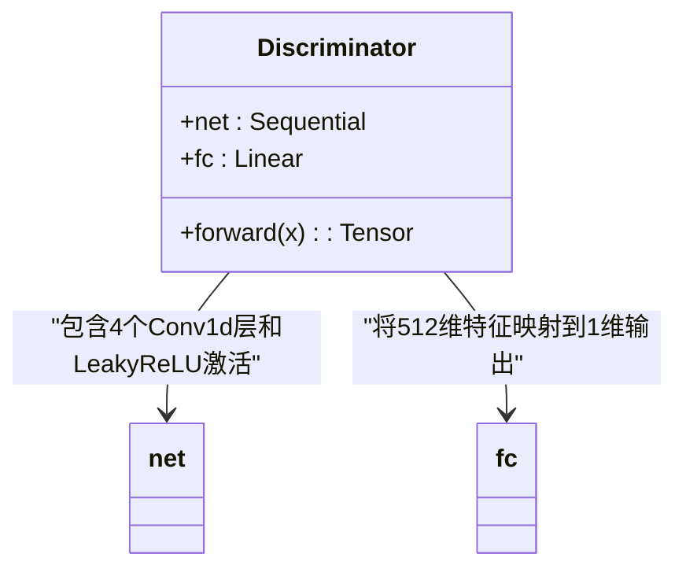
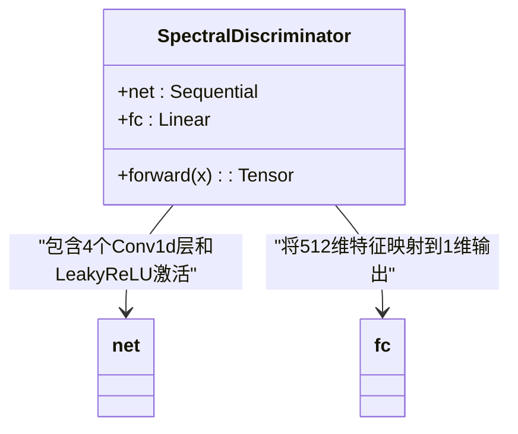
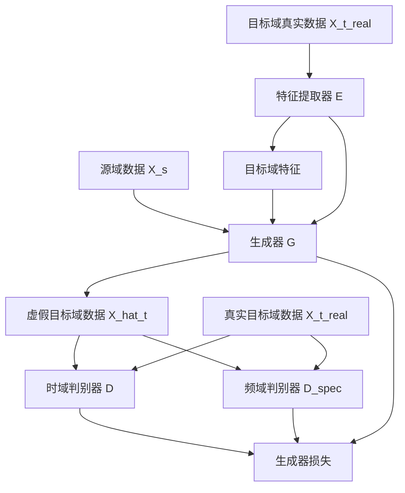
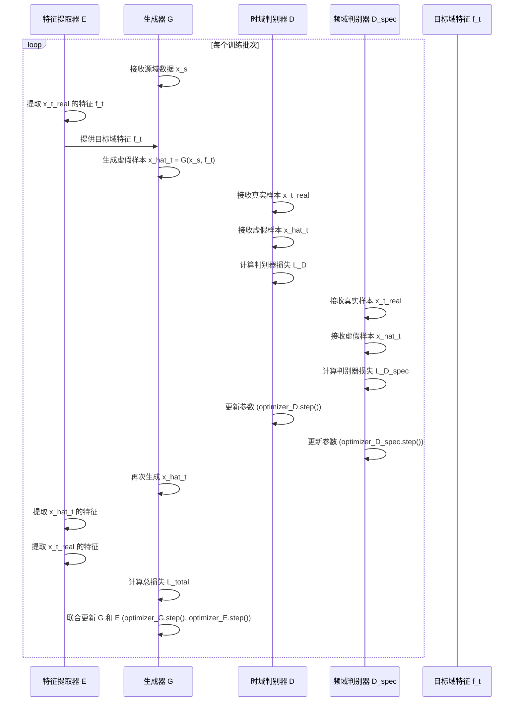
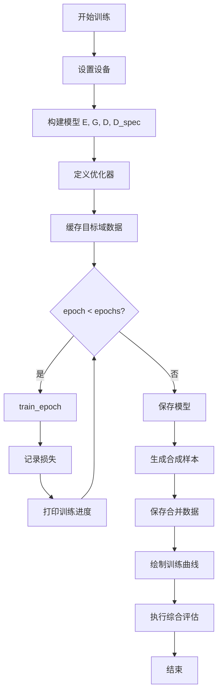

# 生成对抗网络（GAN）模型训练流程

<cite>
**参考本文档的文件**   
- [train_GAN.py](file://Research1/train_GAN.py)
- [model_GAN.py](file://Research1/model_GAN.py)
- [loss_GAN.py](file://Research1/loss_GAN.py)
- [dataloder_GAN.py](file://Research1/Process/dataloder_GAN.py)
</cite>

## 更新摘要
**已做更改**   
- 更新了训练流程以支持WGAN-GP训练
- 实现了动态目标特征提取机制
- 优化了优化器参数配置
- 更新了损失函数和训练循环的详细说明

## 目录
1. [引言](#引言)
2. [核心组件](#核心组件)
3. [模型架构](#模型架构)
4. [训练流程](#训练流程)
5. [损失函数](#损失函数)
6. [数据增强与保存](#数据增强与保存)
7. [优化器与训练策略](#优化器与训练策略)
8. [实践建议](#实践建议)

## 引言

本文档详细说明了基于CSI（信道状态信息）数据的跨域步态识别系统中生成对抗网络（GAN）模型的完整训练流程。该系统旨在通过对抗学习机制，将源域的步态特征迁移到目标域，从而解决跨域识别中的数据分布差异问题。文档重点解析了判别器D和生成器G/特征提取器E的交替训练机制、特征提取、损失函数设计、数据增强以及模型保存等关键环节。

**Section sources**
- [train_GAN.py](file://Research1/train_GAN.py#L24-L424)
- [model_GAN.py](file://Research1/model_GAN.py#L1-L235)

## 核心组件

本系统由四个核心神经网络组件构成：特征提取器E、生成器G、时域判别器D和频域判别器D_spec。这些组件协同工作，实现跨域特征迁移和数据增强。

### 特征提取器（Feature Extractor）

特征提取器E负责从目标域的CSI数据中提取高层环境特征。其输入为四维张量(B, C, S, T)，分别代表批次大小、天线对数量、子载波数量和时间步长，输出为128维的特征向量。该模型采用类似ResNet的1D卷积架构，通过多层卷积和池化操作逐步提取抽象特征。



**Diagram sources**
- [model_GAN.py](file://Research1/model_GAN.py#L23-L51)

### 生成器（Generator）

生成器G是一个U-Net风格的编码器-解码器结构，其任务是融合源域的身份特征和目标域的环境特征，生成符合目标域分布的虚假CSI样本。它接收源域数据X_s和目标域特征F_t作为输入，输出虚假的目标域数据X_hat_t。编码器部分对源域数据进行压缩，解码器部分则结合目标域特征进行重构，并使用自适应实例归一化（AdaIN）层进行特征融合。



**Diagram sources**
- [model_GAN.py](file://Research1/model_GAN.py#L54-L154)

### 判别器（Discriminator）

系统采用双判别器架构，包括时域判别器D和频域判别器D_spec，以更全面地评估生成样本的质量。

#### 时域判别器（Discriminator）

时域判别器D的作用是区分真实的目标域样本和生成器生成的虚假样本。它采用多层1D卷积网络，输入为展平后的CSI数据(B, C*S, T)，输出为一个标量，表示输入样本为真实样本的得分。该判别器使用谱归一化（Spectral Normalization）来稳定训练过程。



**Diagram sources**
- [model_GAN.py](file://Research1/model_GAN.py#L162-L190)

#### 频域判别器（SpectralDiscriminator）

频域判别器D_spec在频域对样本进行判别。它首先对输入的CSI数据进行快速傅里叶变换（FFT），然后在频域幅度谱上进行判别。这种设计使得判别器能够捕捉到时域判别器可能忽略的频率特性差异。



**Diagram sources**
- [model_GAN.py](file://Research1/model_GAN.py#L193-L226)

**Section sources**
- [model_GAN.py](file://Research1/model_GAN.py#L23-L234)

## 模型架构

整个GAN模型的架构遵循WGAN-GP（Wasserstein GAN with Gradient Penalty）框架，但针对CSI数据的特性进行了专门设计。模型的构建通过`build_model()`函数完成，该函数实例化特征提取器E、生成器G、时域判别器D和频域判别器D_spec，并将它们返回以供训练使用。



**Diagram sources**
- [model_GAN.py](file://Research1/model_GAN.py#L229-L234)
- [train_GAN.py](file://Research1/train_GAN.py#L35-L39)

**Section sources**
- [model_GAN.py](file://Research1/model_GAN.py#L229-L234)

## 训练流程

GAN模型的训练流程在`train_epoch`函数中实现，采用交替训练策略，即先更新判别器，再联合更新生成器和特征提取器。

### 交替训练机制

训练过程分为两个主要步骤：

1.  **更新判别器D和D_spec**：首先，生成器G利用源域数据X_s和实时提取的目标域特征F_t生成虚假样本X_hat_t。然后，两个判别器D和D_spec分别对真实的目标域样本X_t_real和虚假样本X_hat_t进行判别。通过最小化WGAN-GP判别器损失，提升其区分真实与虚假样本的能力。判别器每轮训练`n_critic`次，以确保其能力足够强。

2.  **更新生成器G和特征提取器E**：在判别器更新后，固定判别器参数，联合更新生成器G和特征提取器E。目标是让生成器生成的样本能够“欺骗”判别器，同时通过MMD损失和频域一致性损失确保生成样本的特征与真实目标域样本的特征相匹配。



**Diagram sources**
- [train_GAN.py](file://Research1/train_GAN.py#L160-L286)

### 特征提取流程

与旧版本不同，新版本的训练流程实现了**动态目标特征提取**。在每个训练批次中，`train_epoch`函数会实时使用特征提取器E从当前批次的真实目标域数据中提取特征，而不是在训练前一次性提取并缓存所有特征。这使得特征提取器E能够随着训练的进行不断更新和优化，从而提取出更高质量的特征用于生成器的输入。

```python
# 在train_epoch函数中实时提取特征
with torch.no_grad():
    target_features = E(x_t_real)
```

**Section sources**
- [train_GAN.py](file://Research1/train_GAN.py#L207-L209)

## 损失函数

系统的损失函数由多个部分组成，共同指导模型的训练方向。

### WGAN-GP判别器损失

判别器损失采用Wasserstein GAN with Gradient Penalty (WGAN-GP) 框架，旨在解决传统GAN训练不稳定的问题。其计算公式为：
`L_D = (D(x_hat_t) - D(x_t_real)) + λ_GP * GP`
其中，GP是梯度惩罚项，用于强制判别器满足Lipschitz连续性约束。

```mermaid
flowchart TD
A[真实样本 x_t_real] --> B[判别器 D]
C[虚假样本 x_hat_t] --> B
B --> D[real_score = D(x_t_real).mean()]
B --> E[fake_score = D(x_hat_t).mean()]
D --> F[w_loss = fake_score - real_score]
C --> G[梯度惩罚 GP]
F --> H[d_loss = w_loss + lambda_gp * GP]
G --> H
```

**Diagram sources**
- [loss_GAN.py](file://Research1/loss_GAN.py#L38-L57)

### 生成器总损失

`train_epoch`函数计算生成器和特征提取器的总损失，该损失是多个子损失的加权和：
`L_total = g_adv + λ_mmd * mmd + λ_freq * freq`
其中：
- **对抗损失 (g_adv)**：来自WGAN生成器损失，鼓励生成器生成能欺骗判别器的样本。
- **MMD损失 (mmd)**：最大均值差异损失，用于对齐生成样本的特征分布和真实目标域样本的特征分布。
- **频域一致性损失 (freq)**：均方误差损失，确保生成样本的频域幅度谱与真实样本的频域幅度谱相匹配。

```mermaid
flowchart TD
A[输入 x_s, x_t_real] --> B[生成器 G]
B --> C[x_hat_t]
C --> D[特征提取器 E]
D --> E[gen_feat = E(x_hat_t)]
D --> F[target_features = E(x_t_real)]
E --> G[mmd = mmd_loss(target_features.detach(), gen_feat)]
F --> G
C --> H[判别器 D]
H --> I[g_adv = wasserstein_generator_loss(D, x_hat_t)]
C --> J[频域判别器 D_spec]
J --> K[g_adv += wasserstein_generator_loss(D_spec, x_hat_t)]
C --> L[frequency_consistency_loss(x_t_real, x_hat_t)]
L --> M[freq]
I --> N[L_total = g_adv + lambda_mmd*mmd + lambda_freq*freq]
K --> N
G --> N
M --> N
```

**Diagram sources**
- [train_GAN.py](file://Research1/train_GAN.py#L247-L257)
- [loss_GAN.py](file://Research1/loss_GAN.py#L66-L97)
- [loss_GAN.py](file://Research1/loss_GAN.py#L100-L124)

**Section sources**
- [train_GAN.py](file://Research1/train_GAN.py#L247-L257)
- [loss_GAN.py](file://Research1/loss_GAN.py#L38-L124)

## 数据增强与保存

为了扩充目标域数据集，系统实现了数据增强和保存功能。

### 生成合成样本

`generate_synthetic_samples`函数利用训练好的特征提取器E和生成器G，从源域数据中生成虚假的目标域样本。该函数在评估模式下运行，遍历源域数据加载器，使用源域数据和预先提取的目标域特征生成指定数量的虚假样本。

**Section sources**
- [train_GAN.py](file://Research1/train_GAN.py#L289-L334)

### 保存合并数据

`save_combined_target_data`函数将生成的虚假样本与原始的目标域数据合并，并保存为`.pt`文件。该函数首先提取原始目标域的所有数据，然后与合成数据在批次维度上进行拼接，最后将合并后的数据和标签分别保存。

**Section sources**
- [train_GAN.py](file://Research1/train_GAN.py#L337-L368)

## 优化器与训练策略

### 优化器配置

系统为四个核心模型分别配置了Adam优化器，但采用了更稳定的超参数。学习率设置为1e-4，动量参数`betas`设置为(0.0, 0.9)，这有助于提高训练的稳定性。

```python
optimizer_E = optim.Adam(E.parameters(), lr=lr_g, betas=(0.0, 0.9))
optimizer_G = optim.Adam(G.parameters(), lr=lr_g, betas=(0.0, 0.9))
optimizer_D = optim.Adam(D.parameters(), lr=lr_d, betas=(0.0, 0.9))
optimizer_D_spec = optim.Adam(D_spec.parameters(), lr=lr_d, betas=(0.0, 0.9))
```

### 训练循环与模型保存

主训练函数`train_and_test`实现了完整的训练循环。在每个epoch中，调用`train_epoch`进行训练，并记录训练损失。模型保存策略为在训练完成后一次性保存模型检查点，包括所有模型和优化器的状态字典，以便后续恢复训练或进行推理。

此外，训练完成后会调用`generate_synthetic_samples`生成合成数据，并通过`save_combined_target_data`将数据保存到指定目录。



**Section sources**
- [train_GAN.py](file://Research1/train_GAN.py#L24-L156)

## 实践建议

在实际训练过程中，以下建议有助于提升模型性能和训练稳定性：

1.  **学习率设置**：初始学习率1e-4是一个合理的起点。如果发现训练不稳定（损失剧烈波动），可尝试降低学习率至1e-5。反之，如果收敛过慢，可适当提高。

2.  **模型状态管理**：在训练阶段，务必使用`model.train()`启用Dropout和BatchNorm的训练模式；在推理或特征提取阶段（如`generate_synthetic_samples`），必须使用`model.eval()`切换到评估模式，以确保结果的稳定性和可复现性。

3.  **内存优化**：
    -   在`generate_synthetic_samples`和`save_combined_target_data`等函数中，使用`torch.no_grad()`上下文管理器，避免在不需要梯度计算时消耗内存。
    -   对于大型数据集，考虑使用更小的批次大小或在数据加载器中启用`pin_memory`和`num_workers`以提高数据加载效率。
    -   在`train_epoch`中，对小批次（<4）的数据进行跳过处理，以防止训练不稳定。