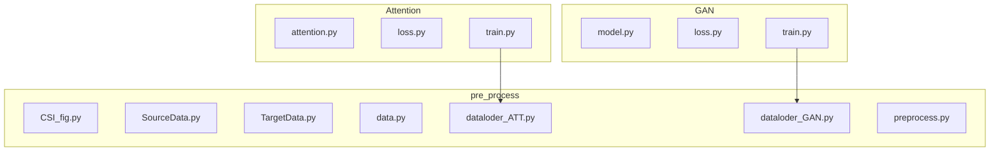
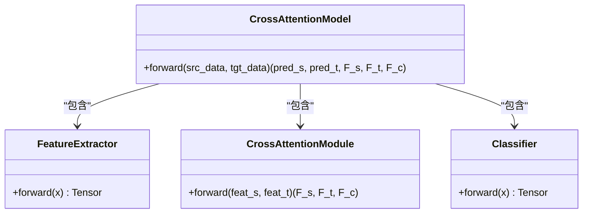
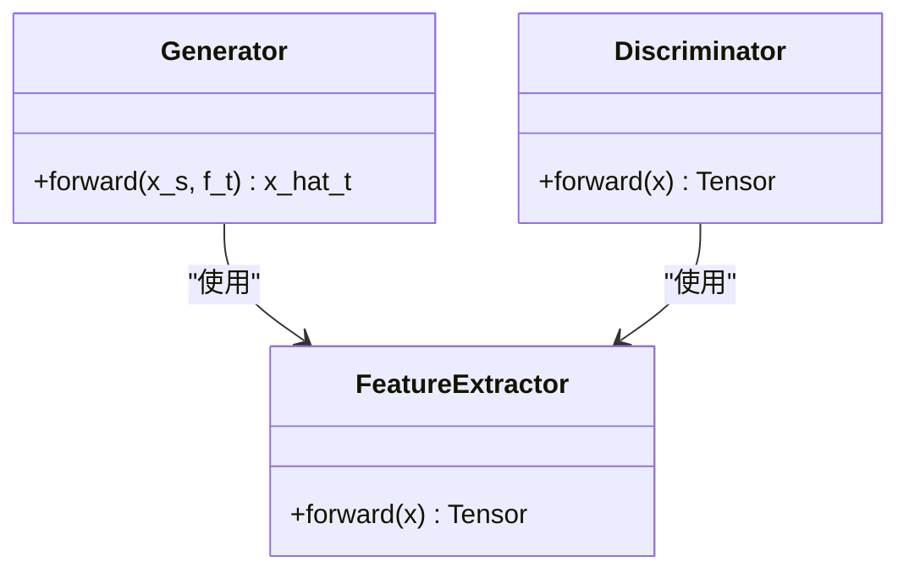
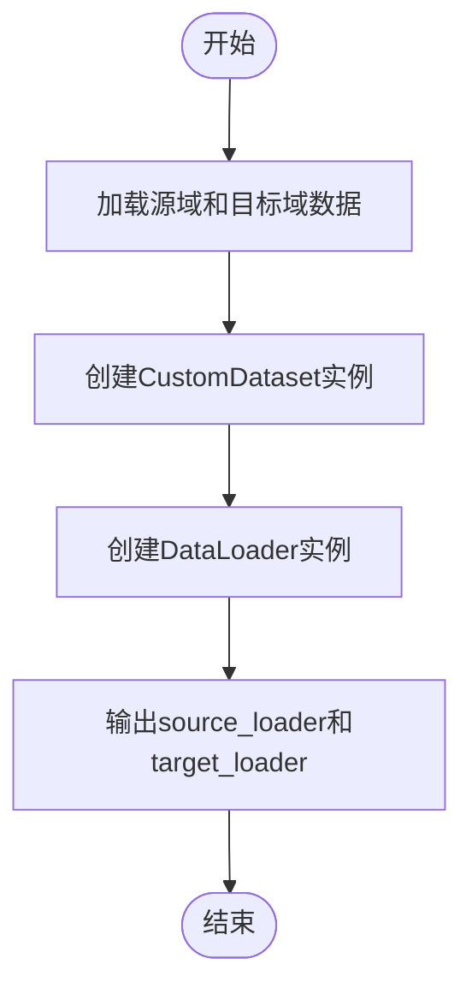
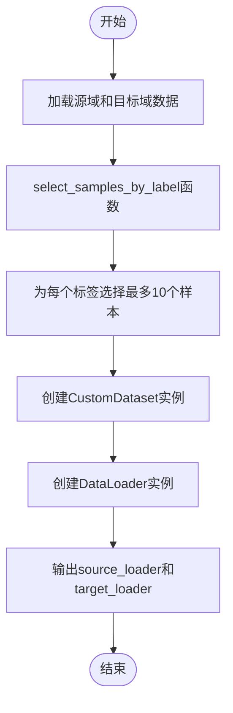
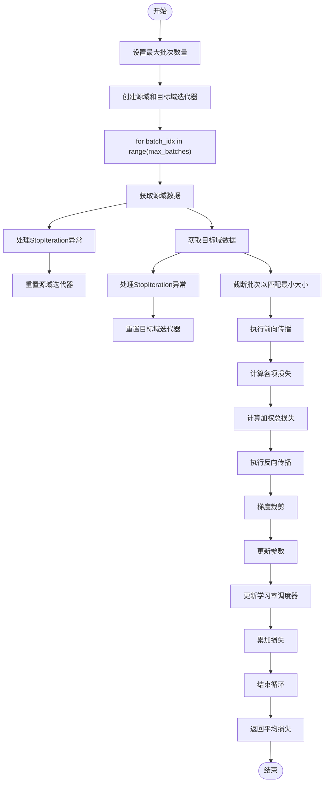
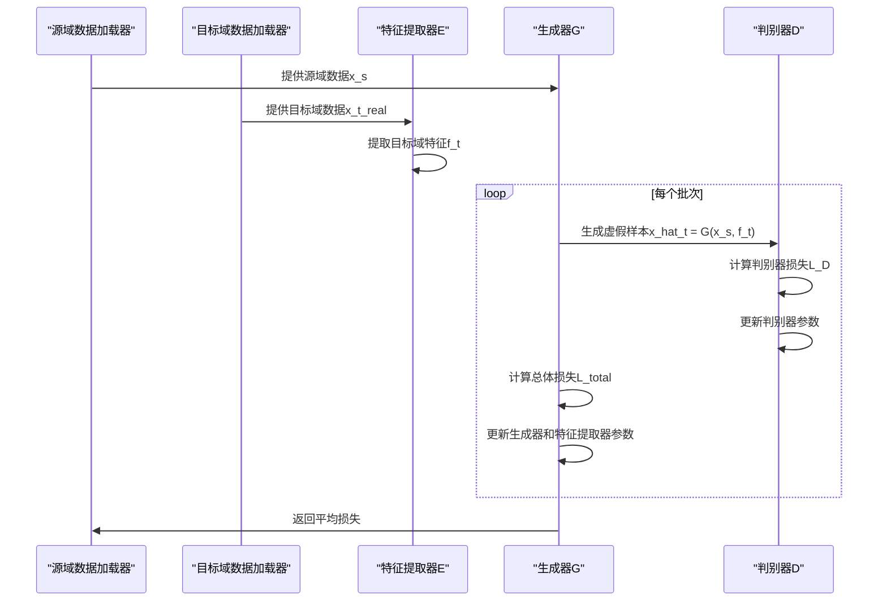

# 训练流程

<cite>
**Referenced Files in This Document**   
- [attention.py](file://Attention/attention.py)
- [loss.py](file://Attention/loss.py)
- [train.py](file://Attention/train.py)
- [model.py](file://GAN/model.py)
- [loss.py](file://GAN/loss.py)
- [train.py](file://GAN/train.py)
- [dataloder_ATT.py](file://pre_process/dataloder_ATT.py)
- [dataloder_GAN.py](file://pre_process/dataloder_GAN.py)
</cite>

## 目录
1. [引言](#引言)
2. [项目结构](#项目结构)
3. [核心组件](#核心组件)
4. [模型架构与训练机制](#模型架构与训练机制)
5. [数据加载与预处理](#数据加载与预处理)
6. [训练脚本关键组件](#训练脚本关键组件)
7. [训练过程协调机制](#训练过程协调机制)
8. [异常处理与调试实践](#异常处理与调试实践)
9. [结论](#结论)

## 引言
本文档详细说明基于CSI数据的跨域步态识别系统的完整训练流程。针对Attention和GAN两种模型架构，分别描述其训练机制、关键组件和实现细节。文档涵盖从数据加载、模型初始化到前向传播、反向传播以及优化策略的全过程，并提供异常处理和调试建议。

## 项目结构
项目采用模块化设计，主要分为三个目录：`Attention`、`GAN`和`pre_process`。每个目录包含相应的模型定义、损失函数、训练脚本和数据处理工具。



**Diagram sources**
- [attention.py](file://Attention/attention.py)
- [model.py](file://GAN/model.py)
- [dataloder_ATT.py](file://pre_process/dataloder_ATT.py)
- [dataloder_GAN.py](file://pre_process/dataloder_GAN.py)

**Section sources**
- [attention.py](file://Attention/attention.py)
- [model.py](file://GAN/model.py)
- [dataloder_ATT.py](file://pre_process/dataloder_ATT.py)
- [dataloder_GAN.py](file://pre_process/dataloder_GAN.py)

## 核心组件
系统的核心组件包括两种不同的模型架构（Attention和GAN）、对应的损失函数实现、数据加载器以及训练控制逻辑。这些组件协同工作，实现跨域步态识别任务。

**Section sources**
- [attention.py](file://Attention/attention.py#L203-L224)
- [model.py](file://GAN/model.py#L51-L130)
- [loss.py](file://Attention/loss.py#L10-L70)
- [loss.py](file://GAN/loss.py#L40-L70)

## 模型架构与训练机制

### Attention模型架构
Attention模型通过交叉注意力模块实现源域与目标域特征对齐。模型由特征提取器、交叉注意力模块和分类器三部分组成。



**Diagram sources**
- [attention.py](file://Attention/attention.py#L203-L224)

**Section sources**
- [attention.py](file://Attention/attention.py#L203-L224)

### GAN模型架构
GAN模型通过生成器G和判别器D的对抗训练实现数据增强。生成器将源域数据映射到目标域特征空间，判别器负责区分真实与生成的目标域样本。



**Diagram sources**
- [model.py](file://GAN/model.py#L51-L165)

**Section sources**
- [model.py](file://GAN/model.py#L51-L165)

## 数据加载与预处理

### Attention数据加载器
`dataloder_ATT.py`文件定义了用于Attention模型的数据加载器，加载预处理后的源域和目标域数据。



**Diagram sources**
- [dataloder_ATT.py](file://pre_process/dataloder_ATT.py#L1-L36)

**Section sources**
- [dataloder_ATT.py](file://pre_process/dataloder_ATT.py#L1-L36)

### GAN数据加载器
`dataloder_GAN.py`文件定义了用于GAN模型的数据加载器，特别实现了按标签选择样本的功能。



**Diagram sources**
- [dataloder_GAN.py](file://pre_process/dataloder_GAN.py#L1-L94)

**Section sources**
- [dataloder_GAN.py](file://pre_process/dataloder_GAN.py#L1-L94)

## 训练脚本关键组件

### 优化器配置
- **Attention模型**：使用AdamW优化器，学习率3e-4，权重衰减1e-4
- **GAN模型**：使用Adam优化器，学习率0.001

### 学习率调度策略
- **Attention模型**：采用余弦退火调度器（CosineAnnealingLR），周期T_max=50，最小学习率1e-6
- **GAN模型**：固定学习率

### 梯度裁剪
在Attention模型的训练过程中，使用`torch.nn.utils.clip_grad_norm_`对模型参数进行梯度裁剪，最大范数为1.0，以防止梯度爆炸。

### 早停机制
实现早停机制，耐心值（patience）设置为15。当验证准确率连续15个epoch没有提升时，停止训练。

**Section sources**
- [train.py](file://Attention/train.py#L17-L102)
- [train.py](file://GAN/train.py#L40-L108)

## 训练过程协调机制

### Attention模型训练流程
`train_epoch`函数协调双域数据迭代，处理批次大小不一致的情况，并动态调整损失权重。



**Diagram sources**
- [train.py](file://Attention/train.py#L17-L102)

**Section sources**
- [train.py](file://Attention/train.py#L17-L102)

### GAN模型训练流程
GAN模型采用交替训练策略，先更新判别器，再更新生成器和特征提取器。



**Diagram sources**
- [train.py](file://GAN/train.py#L40-L108)

**Section sources**
- [train.py](file://GAN/train.py#L40-L108)

## 异常处理与调试实践

### 批次大小不一致处理
当源域和目标域数据加载器的批次大小不一致时，采用截断策略：

```python
min_batch_size = min(src_data.size(0), tgt_data.size(0))
src_data, src_labels = src_data[:min_batch_size], src_labels[:min_batch_size]
tgt_data, tgt_labels = tgt_data[:min_batch_size], tgt_labels[:min_batch_size]
```

### 模型结构测试
在训练开始前进行模型结构测试，确保维度正确：

```python
# 创建测试数据
test_src = torch.randn(2, 56, 3, 6000).to(device)
test_tgt = torch.randn(2, 56, 3, 6000).to(device)

# 测试前向传播
with torch.no_grad():
    pred_s, pred_t, F_s, F_t, F_c = model(test_src, test_tgt)
```

### 前向传播异常处理
在前向传播过程中添加异常捕获，便于调试：

```python
try:
    pred_s, pred_t, F_s, F_t, F_c = model(src_data, tgt_data)
except Exception as e:
    print(f"\n模型前向传播错误 (batch {batch_idx}):")
    print(f"  源域数据形状: {src_data.shape}")
    print(f"  目标域数据形状: {tgt_data.shape}")
    print(f"  错误信息: {e}")
    raise e
```

**Section sources**
- [train.py](file://Attention/train.py#L17-L102)
- [train.py](file://GAN/train.py#L40-L108)

## 结论
本文档详细说明了基于CSI数据的跨域步态识别系统的完整训练流程。Attention模型通过交叉注意力模块实现特征对齐，采用多任务损失函数进行联合优化；GAN模型通过对抗训练实现数据增强，生成器将源域数据映射到目标域特征空间。两种模型都实现了有效的跨域步态识别，为后续研究提供了坚实的基础。