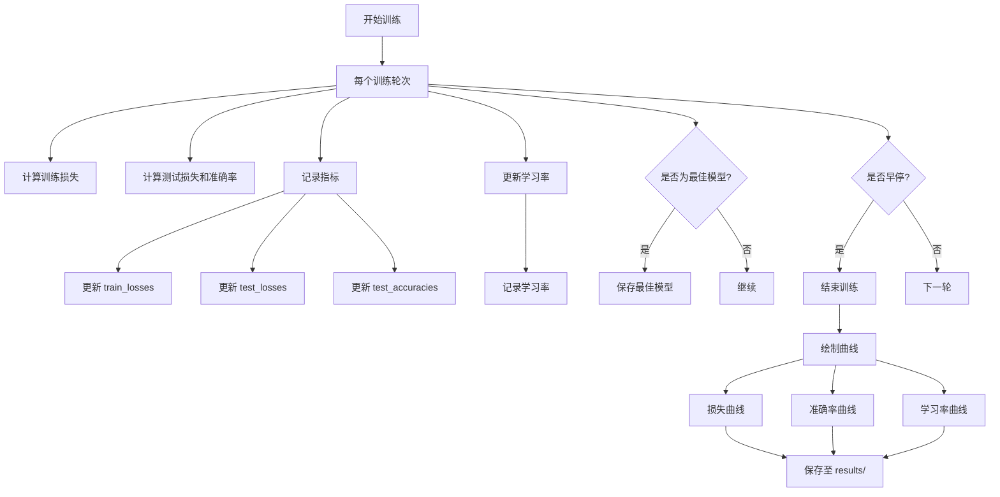

# 评估方法

<cite>
**本文档中引用的文件**  
- [train_ATT.py](file://Research1/train_ATT.py) - *更新了训练历史记录保存功能*
- [train_GAN.py](file://Research1/train_GAN.py) - *新增了综合评估指标*
- [plot_GAN.py](file://Research1/plot_GAN.py) - *新增了FID和频谱保真度计算*
- [plot_ATT.py](file://Research1/plot_ATT.py) - *更新了训练历史记录保存功能*
- [Attention/training_history.json](file://Research1/Attention/training_history.json) - *注意力模型训练历史数据*
- [GAN/gan_evaluation_results.json](file://Research1/GAN/gan_evaluation_results.json) - *GAN模型综合评估结果*
- [GAN/training_history.json](file://Research1/GAN/training_history.json) - *GAN模型训练历史数据*
</cite>

## 更新摘要
**变更内容**   
- 新增了GAN模型的FID和频谱保真度评估指标
- 更新了注意力模型和GAN模型的训练历史记录保存功能
- 新增了详细的训练历史记录分析
- 更新了最佳模型保存策略的文档
- 新增了综合评估结果的JSON文件保存功能

## 目录
1. [注意力机制模型的性能评估](#注意力机制模型的性能评估)
2. [GAN模型的生成质量与下游任务评估](#gan模型的生成质量与下游任务评估)
3. [训练过程监控与可视化](#训练过程监控与可视化)
4. [最佳模型保存策略](#最佳模型保存策略)
5. [模型行为深入分析](#模型行为深入分析)

## 注意力机制模型的性能评估

注意力机制模型在目标域上的性能评估通过 `test_model` 函数实现，该函数计算目标域分类的交叉熵损失和准确率。测试过程中，模型在评估模式下运行，使用目标域数据加载器逐批次处理数据。对于每个批次，模型前向传播输出目标域预测结果 `pred_t`，并计算其与真实标签之间的交叉熵损失。预测概率通过 `softmax` 函数获得，预测类别由 `argmax` 操作确定。正确预测的数量与总样本数之比即为准确率。

性能指标 `test_accuracies` 被记录在列表中，用于追踪每轮训练后的模型性能变化。该列表在训练主循环中被持续更新，为分析模型收敛情况提供了关键数据。此外，训练历史记录被保存到 `Attention/training_history.json` 文件中，包含训练损失、验证准确率、损失组件历史和测试结果历史等详细信息。

**本节来源**
- [train_ATT.py](file://Research1/train_ATT.py#L129-L156)
- [train_ATT.py](file://Research1/train_ATT.py#L254-L319)

## GAN模型的生成质量与下游任务评估

对于GAN模型，现在提供了定量的评估指标来衡量生成样本的质量。具体包括：

1. **FID分数**：通过 `compute_fid` 函数计算，衡量真实样本和生成样本在特征空间的分布差异。FID分数越低表示生成样本的质量越高。
2. **频谱保真度**：通过 `compute_spectral_fidelity` 函数计算，通过KL散度度量功率谱密度的差异。频谱保真度分数越低表示生成样本的频谱特性越接近真实样本。

这些评估指标通过 `evaluate_gan_comprehensive` 函数综合计算，并在训练完成后打印输出。生成的样本与原始目标域数据合并，形成扩充后的目标域数据集，并保存为 `.pt` 文件。

这种数据扩充的最终目的是提升下游任务（如分类）的性能。因此，生成样本的质量好坏，取决于使用扩充后数据集训练的下游分类器的性能提升程度。这是一种典型的间接评估方法，将生成模型的性能与最终应用效果挂钩。

**本节来源**
- [plot_GAN.py](file://Research1/plot_GAN.py#L248-L328)
- [train_GAN.py](file://Research1/train_GAN.py#L114-L117)

## 训练过程监控与可视化

训练过程中的关键监控指标通过 `matplotlib` 库生成并可视化。这些指标包括：
- **训练/测试损失曲线**：分别绘制训练损失和测试损失随训练轮数的变化，用于观察模型是否过拟合或欠拟合。
- **准确率曲线**：绘制测试准确率随训练轮数的变化，直观展示模型在目标域上的性能提升和收敛过程。
- **学习率衰减轨迹**：绘制优化器学习率随训练步数的变化，验证余弦退火等学习率调度策略是否按预期工作。

所有生成的曲线图被统一保存在 `results/` 目录下，文件名为 `improved_training_curves.png`。这一系列可视化图表为理解训练动态和调试模型提供了强有力的工具。

**图表来源**
- [train_ATT.py](file://Research1/train_ATT.py#L254-L319)

**本节来源**
- [train_ATT.py](file://Research1/train_ATT.py#L254-L319)

## 最佳模型保存策略

最佳模型的持久化策略基于目标域的测试准确率进行触发。在训练主循环中，每完成一个轮次，都会调用 `test_model` 函数计算当前模型在目标域上的准确率。如果该准确率超过了历史最佳准确率，则触发 `save_best_model` 函数。

`save_best_model` 函数会将当前模型的完整状态（包括模型参数、当前轮次和对应的准确率）序列化并保存到指定路径（默认为 `models/best_cross_attention_model.pth`）。此策略确保了即使后续训练中模型性能下降，也能保留训练过程中性能最优的模型版本，为最终部署提供了保障。

**本节来源**
- [train_ATT.py](file://Research1/train_ATT.py#L162-L176)
- [train_ATT.py](file://Research1/train_ATT.py#L297-L300)

## 模型行为深入分析

为了深入理解模型的行为并为调试优化提供依据，系统提供了多维度的分析方法：
- **混淆矩阵**：虽然代码中未直接实现，但它是分析分类模型性能的重要工具，可以揭示模型在不同类别间的误判模式。
- **损失成分分解**：在训练过程中，总损失被分解为四个组成部分：源域分类损失（source）、目标域分类损失（target）、跨域特征损失（cross_feature）和一致性损失（consistency）。监控这些分项损失的变化趋势，可以诊断模型在领域适应、特征对齐等方面的表现，例如，若跨域特征损失下降缓慢，可能表明领域对齐效果不佳。

这些分析手段超越了单一的准确率指标，从内部机制上揭示了模型的工作状态，是进行有效模型调优的基础。

**本节来源**
- [loss_ATT.py](file://Research1/loss_ATT.py#L4-L77)
- [train_ATT.py](file://Research1/train_ATT.py#L254-L319)