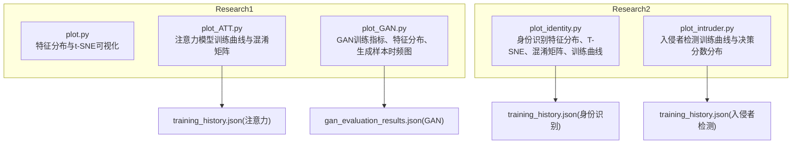
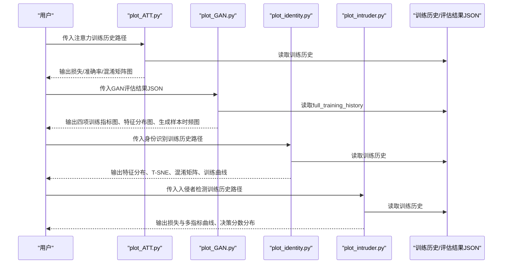
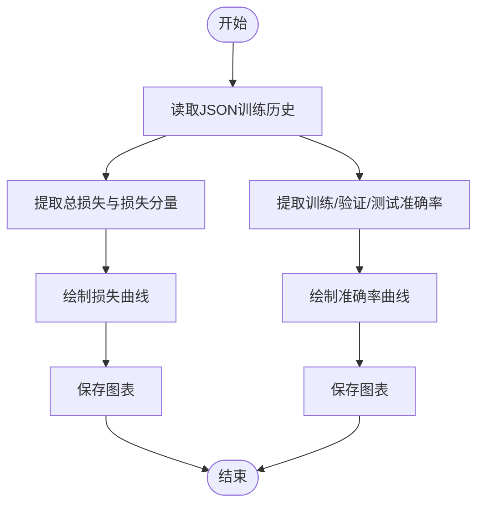
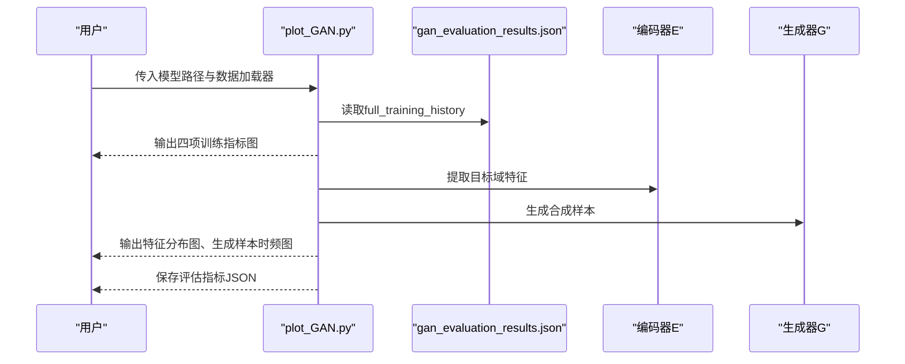
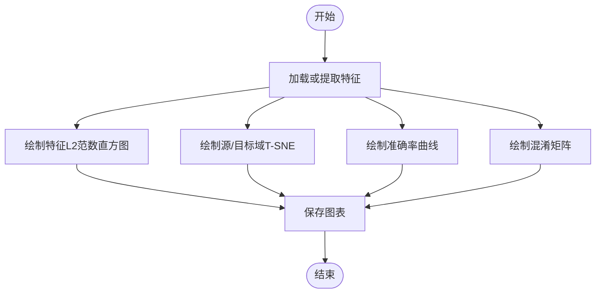
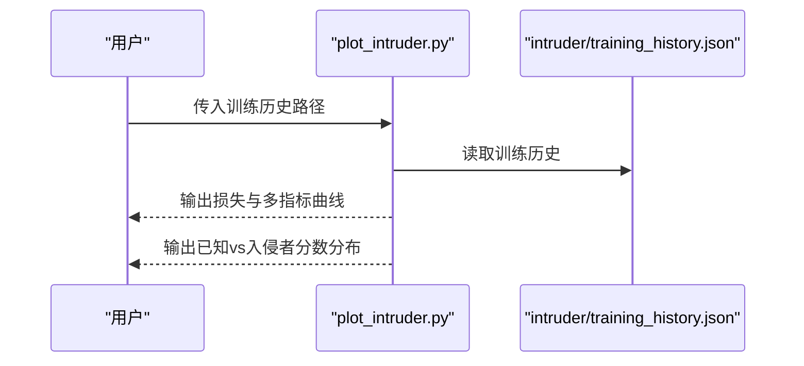
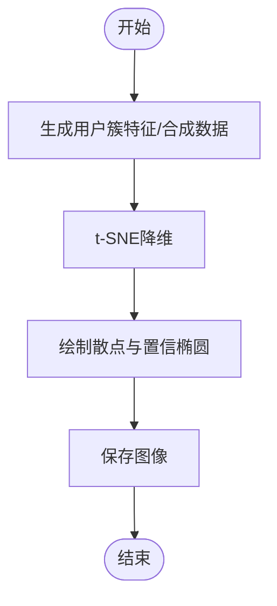
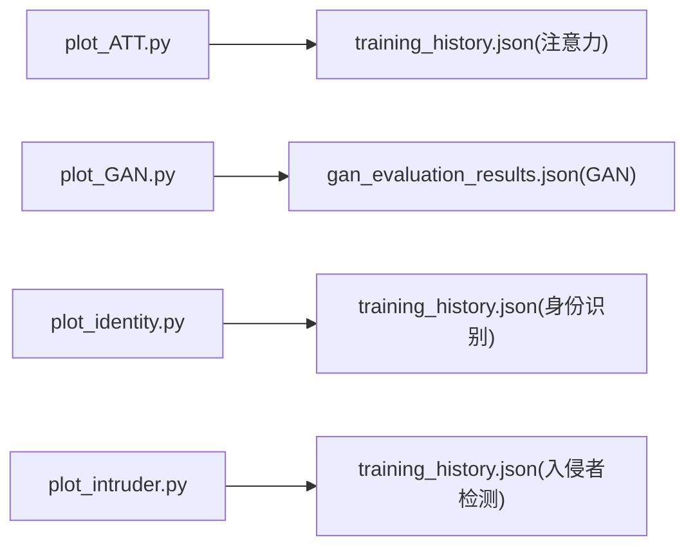

# 通用绘图模块

<cite>
**本文引用的文件**
- [plot.py](file://Research1/plot.py)
- [plot_ATT.py](file://Research1/plot_ATT.py)
- [plot_GAN.py](file://Research1/plot_GAN.py)
- [plot_identity.py](file://Research2/plot_identity.py)
- [plot_intruder.py](file://Research2/plot_intruder.py)
- [training_history.json（注意力）](file://Research1/Attention/training_history.json)
- [gan_evaluation_results.json（GAN）](file://Research1/GAN/gan_evaluation_results.json)
- [training_history.json（身份识别）](file://Research2/identify/training_history.json)
- [training_history.json（入侵者检测）](file://Research2/intruder/training_history.json)
</cite>

## 目录
1. [简介](#简介)
2. [项目结构](#项目结构)
3. [核心组件](#核心组件)
4. [架构总览](#架构总览)
5. [详细组件分析](#详细组件分析)
6. [依赖关系分析](#依赖关系分析)
7. [性能考量](#性能考量)
8. [故障排查指南](#故障排查指南)
9. [结论](#结论)
10. [附录](#附录)

## 简介
本文件面向“通用绘图模块”的使用者与维护者，系统梳理了仓库中与可视化相关的绘图脚本与配套数据，覆盖注意力模型、GAN、身份识别与入侵者检测四类任务的训练曲线、特征分布、混淆矩阵与生成样本可视化。文档提供从高层架构到代码级细节的逐层解析，并辅以图示帮助快速定位实现要点与使用方式。

## 项目结构
通用绘图模块主要分布在两个研究方向：
- Research1：包含注意力模型与GAN相关绘图脚本及数据
- Research2：包含身份识别与入侵者检测的可视化脚本及数据

图表来源
- [plot_ATT.py](file://Research1/plot_ATT.py#L1-L293)
- [plot_GAN.py](file://Research1/plot_GAN.py#L1-L724)
- [plot_identity.py](file://Research2/plot_identity.py#L1-L592)
- [plot_intruder.py](file://Research2/plot_intruder.py#L1-L388)
- [training_history.json（注意力）](file://Research1/Attention/training_history.json#L1-L200)
- [gan_evaluation_results.json（GAN）](file://Research1/GAN/gan_evaluation_results.json#L1-L200)
- [training_history.json（身份识别）](file://Research2/identify/training_history.json#L1-L200)
- [training_history.json（入侵者检测）](file://Research2/intruder/training_history.json#L1-L200)

章节来源
- [plot_ATT.py](file://Research1/plot_ATT.py#L1-L293)
- [plot_GAN.py](file://Research1/plot_GAN.py#L1-L724)
- [plot_identity.py](file://Research2/plot_identity.py#L1-L592)
- [plot_intruder.py](file://Research2/plot_intruder.py#L1-L388)

## 核心组件
- 统一中文字体与样式配置：各模块均设置matplotlib中文字体与网格、边框等美化参数，保证图表可读性与一致性。
- 训练曲线绘制：注意力与身份识别模块提供损失与准确率曲线；入侵者检测模块提供损失与多指标曲线；GAN模块提供四项训练指标的组合图。
- 特征分布可视化：注意力与GAN模块提供t-SNE降维与置信椭圆；身份识别模块提供特征L2范数直方图与T-SNE双域分布；入侵者检测模块提供决策分数直方图。
- 生成样本与时频分析：GAN模块提供生成样本时域幅度与频谱图，支持STFT时频分析。
- 混淆矩阵：注意力与身份识别模块提供混淆矩阵热力图。
- 评估指标：GAN模块提供FID、Inception Score、时域MSE、频谱相关性等指标计算与保存。

章节来源
- [plot_ATT.py](file://Research1/plot_ATT.py#L1-L293)
- [plot_GAN.py](file://Research1/plot_GAN.py#L1-L724)
- [plot_identity.py](file://Research2/plot_identity.py#L1-L592)
- [plot_intruder.py](file://Research2/plot_intruder.py#L1-L388)

## 架构总览
通用绘图模块遵循“数据驱动 + 函数式封装”的设计：输入为训练历史JSON或模型输出特征/样本，输出为标准化的可视化图表。模块间通过共享的数据格式（JSON字段约定）解耦，便于扩展与复用。

图表来源
- [plot_ATT.py](file://Research1/plot_ATT.py#L1-L293)
- [plot_GAN.py](file://Research1/plot_GAN.py#L1-L724)
- [plot_identity.py](file://Research2/plot_identity.py#L1-L592)
- [plot_intruder.py](file://Research2/plot_intruder.py#L1-L388)
- [training_history.json（注意力）](file://Research1/Attention/training_history.json#L1-L200)
- [gan_evaluation_results.json（GAN）](file://Research1/GAN/gan_evaluation_results.json#L1-L200)
- [training_history.json（身份识别）](file://Research2/identify/training_history.json#L1-L200)
- [training_history.json（入侵者检测）](file://Research2/intruder/training_history.json#L1-L200)

## 详细组件分析

### 组件A：注意力模型绘图（plot_ATT.py）
- 功能要点
  - 从JSON加载训练历史，绘制总损失与损失分量曲线（兼容新旧格式）。
  - 绘制训练/验证/测试准确率曲线。
  - 绘制混淆矩阵热力图。
  - 一键生成全部训练结果图表。
- 关键流程
  - 加载历史 -> 提取字段 -> 绘制曲线/热力图 -> 保存图像。
- 使用建议
  - 确保JSON包含train_losses、loss_components_history、train_accuracies、val_accuracies、test_results_history等字段。
  - 若使用旧格式，需保证loss_components_history包含source、target键，或兼容mmd键。

图表来源
- [plot_ATT.py](file://Research1/plot_ATT.py#L1-L293)
- [training_history.json（注意力）](file://Research1/Attention/training_history.json#L1-L200)

章节来源
- [plot_ATT.py](file://Research1/plot_ATT.py#L1-L293)
- [training_history.json（注意力）](file://Research1/Attention/training_history.json#L1-L200)

### 组件B：GAN绘图（plot_GAN.py）
- 功能要点
  - 从JSON读取full_training_history，绘制四项训练指标（判别器损失、对抗损失、MMD损失、频域一致性损失）。
  - 保存评估指标与训练摘要到JSON。
  - 绘制生成样本时域幅度与频谱图（STFT），支持移动平均平滑。
  - 绘制特征分布（t-SNE），支持按用户标签着色与置信椭圆。
  - 计算FID、Inception Score、时域MSE、频谱相关性等指标。
  - 生成合成样本并批量可视化。
- 关键流程
  - 读取JSON -> 绘制四项指标 -> 生成样本 -> 绘制时频图与特征分布 -> 计算指标 -> 保存结果。

图表来源
- [plot_GAN.py](file://Research1/plot_GAN.py#L1-L724)
- [gan_evaluation_results.json（GAN）](file://Research1/GAN/gan_evaluation_results.json#L1-L200)

章节来源
- [plot_GAN.py](file://Research1/plot_GAN.py#L1-L724)
- [gan_evaluation_results.json（GAN）](file://Research1/GAN/gan_evaluation_results.json#L1-L200)

### 组件C：身份识别绘图（plot_identity.py）
- 功能要点
  - 从JSON绘制损失、训练/验证/测试准确率曲线。
  - 绘制特征L2范数直方图，对比源域与目标域分布。
  - 分别绘制源域与目标域T-SNE图，按用户标签上色。
  - 绘制混淆矩阵热力图。
  - 支持直接从原始数据加载并提取特征，再进行可视化。
- 关键流程
  - 加载/提取特征 -> 绘制分布与T-SNE -> 绘制准确率曲线 -> 绘制混淆矩阵。

图表来源
- [plot_identity.py](file://Research2/plot_identity.py#L1-L592)

章节来源
- [plot_identity.py](file://Research2/plot_identity.py#L1-L592)
- [training_history.json（身份识别）](file://Research2/identify/training_history.json#L1-L200)

### 组件D：入侵者检测绘图（plot_intruder.py）
- 功能要点
  - 从JSON绘制训练损失与验证/测试多指标曲线（准确率、F1、精确率、召回率）。
  - 绘制已知用户与入侵者决策分数直方图与均值对比。
  - 支持直接从测试数据抽取模型输出，生成决策分数分布。
- 关键流程
  - 加载JSON -> 绘制损失与多指标曲线 -> 抽取分数 -> 绘制分布图。

图表来源
- [plot_intruder.py](file://Research2/plot_intruder.py#L1-L388)
- [training_history.json（入侵者检测）](file://Research2/intruder/training_history.json#L1-L200)

章节来源
- [plot_intruder.py](file://Research2/plot_intruder.py#L1-L388)
- [training_history.json（入侵者检测）](file://Research2/intruder/training_history.json#L1-L200)

### 组件E：通用特征分布与t-SNE（plot.py）
- 功能要点
  - 生成用户簇特征与合成数据，支持按用户标签绘制置信椭圆。
  - 改进版t-SNE特征分布图，支持真实与生成数据叠加展示。
- 关键流程
  - 生成/加载特征 -> t-SNE降维 -> 绘制散点与椭圆 -> 保存图像。

图表来源
- [plot.py](file://Research1/plot.py#L1-L336)

章节来源
- [plot.py](file://Research1/plot.py#L1-L336)

## 依赖关系分析
- 模块内聚与耦合
  - 各模块内部高度内聚，围绕单一任务的可视化需求组织函数。
  - 模块间通过JSON数据格式解耦，无需直接依赖彼此实现。
- 外部依赖
  - matplotlib、numpy、scikit-learn（TSNE）、seaborn（热力图）、json、os等。
- 数据契约
  - JSON字段命名约定：如train_losses、loss_components_history、val_accuracies、test_results_history、full_training_history、evaluation_metrics等，确保跨模块兼容。

图表来源
- [plot_ATT.py](file://Research1/plot_ATT.py#L1-L293)
- [plot_GAN.py](file://Research1/plot_GAN.py#L1-L724)
- [plot_identity.py](file://Research2/plot_identity.py#L1-L592)
- [plot_intruder.py](file://Research2/plot_intruder.py#L1-L388)
- [training_history.json（注意力）](file://Research1/Attention/training_history.json#L1-L200)
- [gan_evaluation_results.json（GAN）](file://Research1/GAN/gan_evaluation_results.json#L1-L200)
- [training_history.json（身份识别）](file://Research2/identify/training_history.json#L1-L200)
- [training_history.json（入侵者检测）](file://Research2/intruder/training_history.json#L1-L200)

章节来源
- [plot_ATT.py](file://Research1/plot_ATT.py#L1-L293)
- [plot_GAN.py](file://Research1/plot_GAN.py#L1-L724)
- [plot_identity.py](file://Research2/plot_identity.py#L1-L592)
- [plot_intruder.py](file://Research2/plot_intruder.py#L1-L388)

## 性能考量
- t-SNE降维
  - 样本量较大时，合理设置perplexity与n_iter，使用PCA初始化提升稳定性。
  - 可根据样本规模动态调整alpha与点大小，避免图形过密。
- STFT时频分析
  - 合理选择nperseg与noverlap，平衡时频分辨率与计算开销。
- 图像保存
  - 使用高DPI与bbox_inches='tight'保证清晰度；按需关闭边框以减小文件体积。
- 指标计算
  - FID、IS等指标计算涉及矩阵运算，注意张量设备与内存占用，必要时分批处理。

[本节为通用指导，不直接分析具体文件]

## 故障排查指南
- JSON文件缺失或字段不完整
  - 现象：绘图函数返回空或报错。
  - 排查：确认JSON包含所需字段；检查路径是否正确。
- 中文字体显示异常
  - 现象：中文乱码或方块。
  - 排查：检查create_zh_font函数与系统字体可用性；回退到默认字体。
- t-SNE参数不当导致图形重叠
  - 现象：点密度过高，难以分辨类别。
  - 排查：降低alpha、增大点大小或减少样本数；调整perplexity与n_iter。
- 生成样本可视化失败
  - 现象：生成样本时频图空白或报错。
  - 排查：确认输入张量维度与设备；检查STFT参数与频谱归一化。

章节来源
- [plot_ATT.py](file://Research1/plot_ATT.py#L1-L293)
- [plot_GAN.py](file://Research1/plot_GAN.py#L1-L724)
- [plot_identity.py](file://Research2/plot_identity.py#L1-L592)
- [plot_intruder.py](file://Research2/plot_intruder.py#L1-L388)

## 结论
通用绘图模块以标准化的数据契约与模块化的函数设计，实现了多任务场景下的统一可视化能力。通过JSON驱动与函数封装，用户可快速生成训练曲线、特征分布、混淆矩阵与生成样本分析图，满足研究与演示的多样化需求。建议在团队内统一JSON字段命名与绘图样式，进一步提升可维护性与一致性。

[本节为总结性内容，不直接分析具体文件]

## 附录
- 常用命令示例（基于脚本入口）
  - 注意力模型：python Research1/plot_ATT.py Attention/training_history.json
  - GAN：python Research1/plot_GAN.py（脚本内含主函数示例）
  - 身份识别：python Research2/plot_identity.py
  - 入侵者检测：python Research2/plot_intruder.py
- 数据准备
  - 确保训练历史JSON与GAN评估结果JSON存在于指定路径。
  - 如需从原始数据提取特征，请确认数据文件路径与模型接口一致。

[本节为使用指引，不直接分析具体文件]