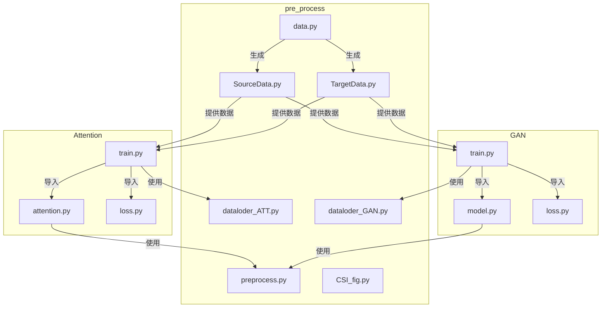
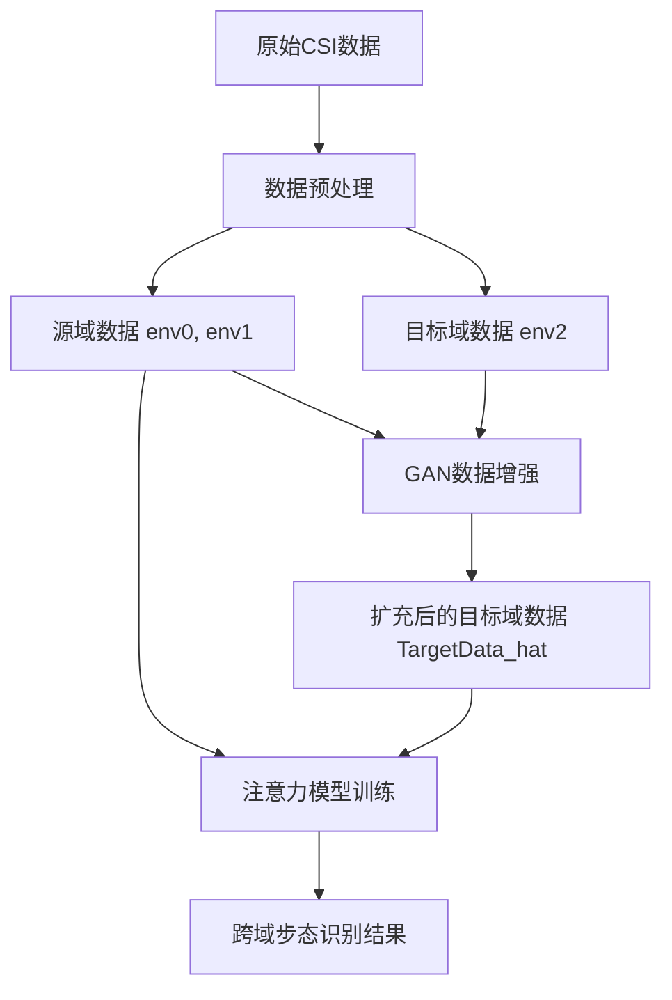
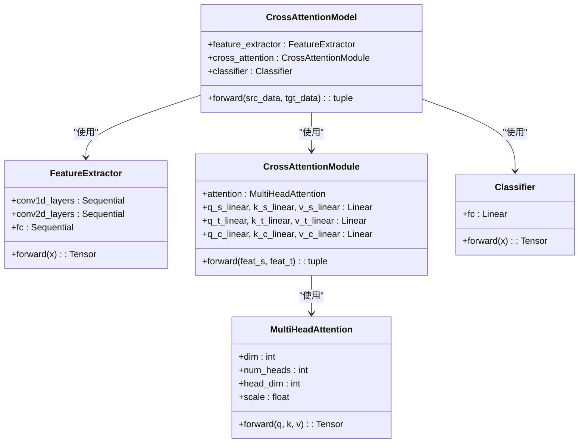

# 项目概述

<cite>
**本文档引用的文件**   
- [attention.py](file://Attention/attention.py)
- [loss.py](file://Attention/loss.py)
- [train.py](file://Attention/train.py)
- [model.py](file://GAN/model.py)
- [loss.py](file://GAN/loss.py)
- [train.py](file://GAN/train.py)
- [preprocess.py](file://pre_process/preprocess.py)
- [data.py](file://pre_process/data.py)
- [SourceData.py](file://pre_process/SourceData.py)
- [TargetData.py](file://pre_process/TargetData.py)
- [dataloder_ATT.py](file://pre_process/dataloder_ATT.py)
- [dataloder_GAN.py](file://pre_process/dataloder_GAN.py)
- [CSI_fig.py](file://pre_process/CSI_fig.py)
</cite>

## 目录
1. [引言](#引言)
2. [项目结构](#项目结构)
3. [核心组件](#核心组件)
4. [整体架构设计](#整体架构设计)
5. [详细组件分析](#详细组件分析)
6. [数据预处理流程](#数据预处理流程)
7. [注意力模型分析](#注意力模型分析)
8. [生成对抗网络模型分析](#生成对抗网络模型分析)
9. [训练流程与损失函数](#训练流程与损失函数)
10. [系统上下文与数据流](#系统上下文与数据流)
11. [技术决策动机](#技术决策动机)
12. [结论](#结论)

## 引言
本文档全面介绍了一个基于信道状态信息（CSI）的跨域步态识别系统。该系统旨在解决源域与目标域之间由于环境差异导致的数据分布不一致问题，从而提升在未知环境下的步态识别准确率。系统采用两种互补的深度学习模型：注意力机制模型和生成对抗网络（GAN）模型。注意力模型通过交叉注意力机制对齐源域和目标域的特征表示，减少域间差异；而GAN模型则通过生成符合目标域分布的虚假样本，对源域数据进行增强，以弥合域间差距。整个系统从原始CSI数据加载开始，经过预处理、特征提取、域适应，最终实现身份分类。本文档将为初学者提供高层次的概念理解，并为高级开发者深入剖析技术实现细节和设计动机。

## 项目结构
项目采用模块化设计，主要分为三个功能目录：`Attention`、`GAN` 和 `pre_process`。这种结构清晰地分离了注意力模型、生成对抗网络模型和数据预处理逻辑，便于维护和扩展。

**图示来源**
- [attention.py](file://Attention/attention.py)
- [model.py](file://GAN/model.py)
- [preprocess.py](file://pre_process/preprocess.py)
- [data.py](file://pre_process/data.py)
- [SourceData.py](file://pre_process/SourceData.py)
- [TargetData.py](file://pre_process/TargetData.py)
- [dataloder_ATT.py](file://pre_process/dataloder_ATT.py)
- [dataloder_GAN.py](file://pre_process/dataloder_GAN.py)

**本节来源**
- [Attention](file://Attention)
- [GAN](file://GAN)
- [pre_process](file://pre_process)

## 核心组件
本系统的核心由两个独立但协同工作的模型构成：注意力模型和生成对抗网络（GAN）模型。注意力模型的核心是`CrossAttentionModel`，它通过`FeatureExtractor`提取CSI数据的深层特征，并利用`CrossAttentionModule`中的多头注意力机制来计算源域和目标域特征之间的自注意力和交叉注意力，从而实现特征对齐。该模型的训练依赖于`LossFunction`，其总损失函数综合了源域分类损失、目标域分类损失、跨域特征一致性损失和特征一致性损失。

另一方面，GAN模型由三个关键组件组成：特征提取器（E）、生成器（G）和判别器（D）。特征提取器E负责从目标域数据中提取环境特征。生成器G则是一个U-Net风格的编码器-解码器结构，它将源域的步态数据与目标域的环境特征融合，生成外观上类似于目标域的虚假CSI样本。判别器D的任务是区分真实的和生成的虚假目标域样本，通过与生成器的对抗博弈，促使生成器产生更逼真的数据。

**本节来源**
- [attention.py](file://Attention/attention.py#L1-L225)
- [model.py](file://GAN/model.py#L1-L174)
- [loss.py](file://Attention/loss.py#L1-L78)
- [loss.py](file://GAN/loss.py#L1-L79)

## 整体架构设计
系统的整体架构是一个两阶段的跨域识别流程。第一阶段是数据预处理和数据增强，第二阶段是基于注意力机制的域适应分类。

在第一阶段，原始CSI数据首先通过`preprocess.py`中的`preprocess_csi_data`函数进行处理，包括归一化、DWT去噪和步态分割。随后，`SourceData.py`和`TargetData.py`分别加载源域（env0和env1）和目标域（env2）的数据。关键的一步是使用GAN模型进行数据增强。`train.py` (GAN) 会加载源域和目标域数据，训练一个GAN模型，该模型利用目标域的环境特征来“翻译”源域数据，生成大量符合目标域分布的虚假样本。这些虚假样本与原始目标域数据合并，形成一个扩充后的目标域数据集（`TargetData_hat`）。

在第二阶段，扩充后的目标域数据集与源域数据集一起，被`dataloder_ATT.py`构建成数据加载器。然后，`CrossAttentionModel`被训练，它同时接收源域和目标域的批数据。模型通过特征提取器提取特征，再通过交叉注意力模块进行特征对齐，最后由分类器输出预测结果。训练过程通过最小化一个综合损失函数来优化，该函数既保证了分类准确性，又促进了域间的特征一致性。

**图示来源**
- [preprocess.py](file://pre_process/preprocess.py#L1-L231)
- [SourceData.py](file://pre_process/SourceData.py#L1-L112)
- [TargetData.py](file://pre_process/TargetData.py#L1-L95)
- [train.py](file://GAN/train.py#L1-L295)
- [dataloder_ATT.py](file://pre_process/dataloder_ATT.py#L1-L36)
- [attention.py](file://Attention/attention.py#L1-L225)
- [train.py](file://Attention/train.py#L1-L290)

## 详细组件分析
### 注意力模型分析
注意力模型是实现跨域识别的核心。其设计灵感来源于Transformer架构，旨在通过注意力机制自动学习源域和目标域特征之间的对应关系。

#### 特征提取器
`FeatureExtractor`专为CSI数据的四维结构（[batch, subcarriers, antennas, time]）设计。它采用分阶段处理策略：首先，通过1D卷积层沿时间轴处理每个子载波的天线数据，捕捉时间动态；然后，将处理后的特征重塑为2D形式，通过2D卷积层沿子载波维度进行处理，捕捉频率响应模式。这种设计有效地融合了CSI数据的时域和频域信息。

#### 交叉注意力模块
`CrossAttentionModule`是模型的创新点。它包含三个并行的注意力计算路径：
1.  **源域自注意力**：计算源域特征内部的依赖关系，强化其身份特征。
2.  **目标域自注意力**：计算目标域特征内部的依赖关系，强化其环境特征。
3.  **跨域交叉注意力**：以源域特征为Query，以目标域特征为Key和Value，计算源域特征如何“关注”目标域的环境信息。这使得源域特征能够主动适应目标域的分布，生成一个与目标域环境对齐的“翻译后”特征`F_c`。

**图示来源**
- [attention.py](file://Attention/attention.py#L1-L225)

**本节来源**
- [attention.py](file://Attention/attention.py#L1-L225)

### 生成对抗网络模型分析
GAN模型扮演着数据增强器的角色，其目标是解决源域和目标域之间固有的分布差异。

#### 模型架构
-   **特征提取器 (E)**: 一个轻量级的1D卷积网络，用于从目标域的真实样本中提取高层环境特征`f_t`。这些特征代表了目标域的“风格”或“环境指纹”。
-   **生成器 (G)**: 一个U-Net结构的编码器-解码器网络。编码器将源域的CSI数据`x_s`压缩为一个低维表示。然后，目标域的环境特征`f_t`被投影并扩展，与编码器的输出在瓶颈层进行拼接。解码器负责将这个融合了身份和环境信息的表示重构为一个虚假的CSI样本`x_hat_t`。
-   **判